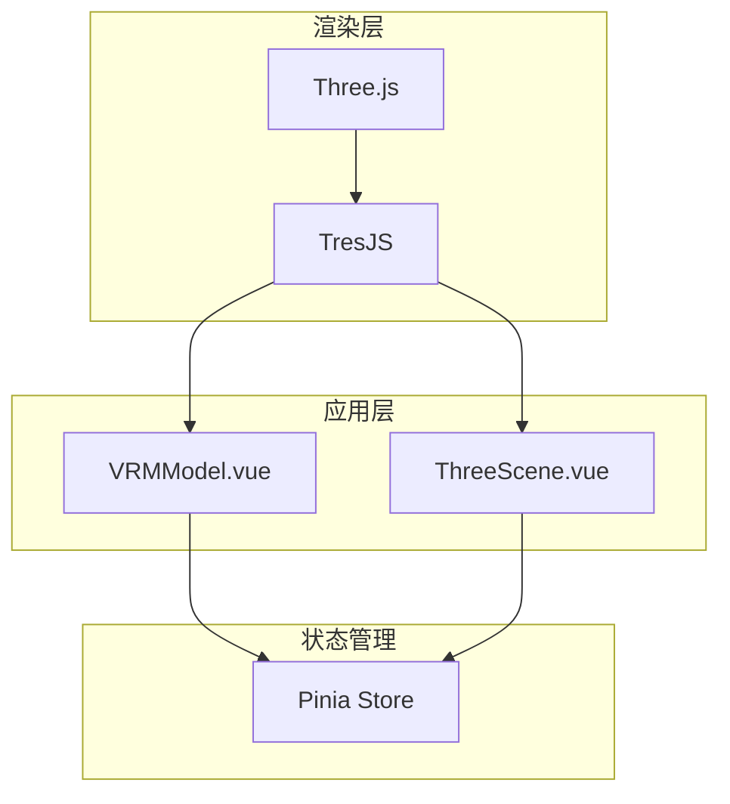
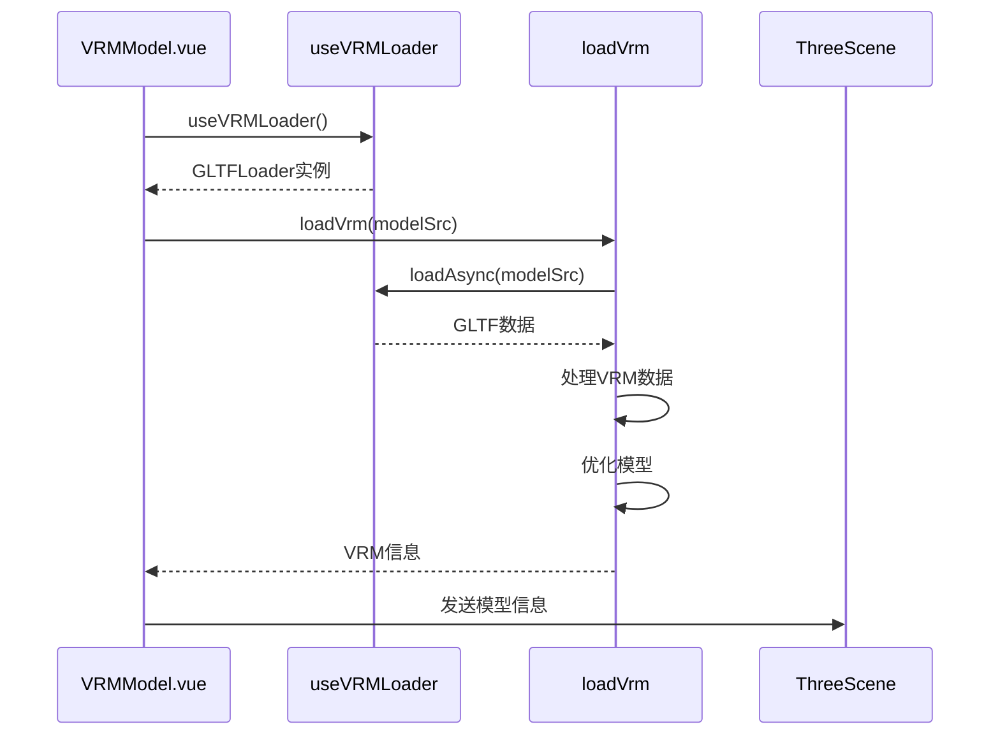
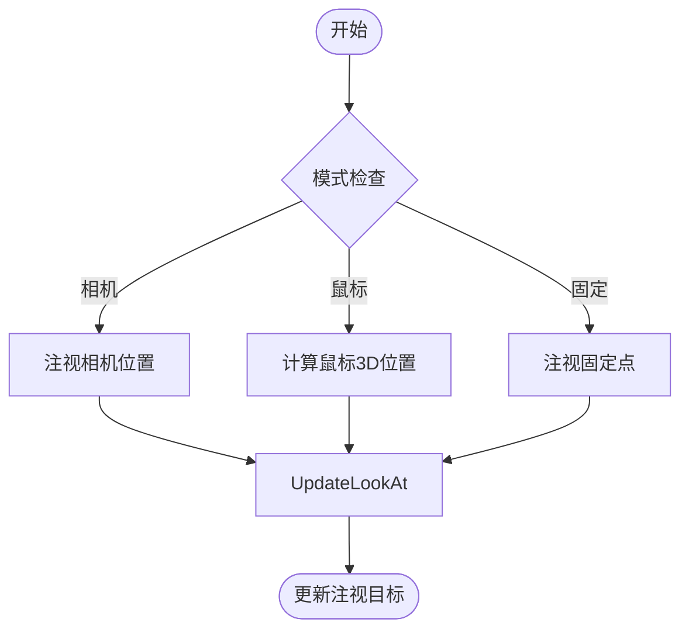
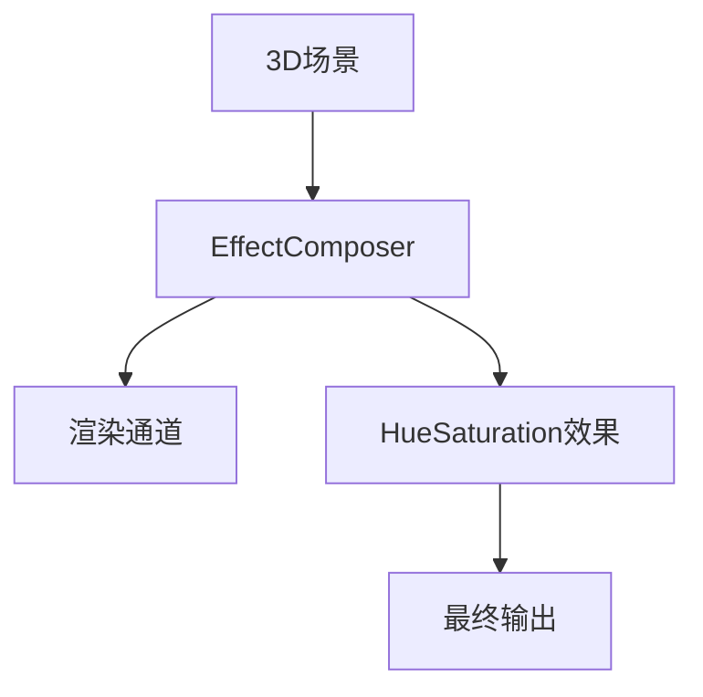

# 3D模型支持

<cite>
**本文档中引用的文件**  
- [ThreeScene.vue](file://packages/stage-ui-three/src/components/ThreeScene.vue)
- [VRMModel.vue](file://packages/stage-ui-three/src/components/Model/VRMModel.vue)
- [loader.ts](file://packages/stage-ui-three/src/composables/vrm/loader.ts)
- [core.ts](file://packages/stage-ui-three/src/composables/vrm/core.ts)
- [animation.ts](file://packages/stage-ui-three/src/composables/vrm/animation.ts)
- [expression.ts](file://packages/stage-ui-three/src/composables/vrm/expression.ts)
- [lip-sync.ts](file://packages/stage-ui-three/src/composables/vrm/lip-sync.ts)
- [model-store.ts](file://packages/stage-ui-three/src/stores/model-store.ts)
- [tresjs](file://packages/tresjs/package.json)
- [animation.ts](file://packages/stage-ui/src/composables/live2d/animation.ts)
</cite>

## 目录
1. [介绍](#介绍)
2. [模型格式对比：Live2D与VRM](#模型格式对比live2d与vrm)
3. [3D场景渲染技术栈](#3d场景渲染技术栈)
4. [模型加载与初始化](#模型加载与初始化)
5. [动画与表情控制](#动画与表情控制)
6. [眼动与注视控制](#眼动与注视控制)
7. [材质处理与渲染优化](#材质处理与渲染优化)
8. [性能优化策略](#性能优化策略)
9. [集成与调试指南](#集成与调试指南)
10. [结论](#结论)

## 介绍
本项目实现了基于Web的3D角色渲染系统，支持VRM和Live2D两种主流模型格式。系统采用Three.js作为核心3D引擎，通过TresJS（Vue 3D框架）进行组件化封装，实现了高性能的3D场景渲染。项目架构分为多个模块：`stage-ui-three`负责3D场景和VRM模型渲染，`stage-ui`处理Live2D模型，`tresjs`提供共享的后处理效果和组合式API。系统支持完整的模型控制功能，包括动画播放、表情切换、眼动追踪和口型同步，为虚拟角色的交互提供了全面的技术支持。

## 模型格式对比：Live2D与VRM

### Live2D模型特点
Live2D是一种2D角色表现技术，通过将2D插画分割成多个可独立移动的部件，实现类似3D的动态效果。在本项目中，Live2D模型通过`pixi-live2d-display`库进行渲染，集成在`stage-ui`包中。Live2D的优势在于其轻量级和高性能，特别适合移动端和低性能设备。模型文件体积小，渲染开销低，能够实现流畅的实时交互。然而，Live2D本质上仍是2D技术，视角变化有限，无法实现真正的3D空间交互。

**Section sources**
- [animation.ts](file://packages/stage-ui/src/composables/live2d/animation.ts)

### VRM模型特点
VRM是一种基于glTF 2.0的3D角色模型格式，专为虚拟角色设计。在本项目中，VRM模型通过`@pixiv/three-vrm`库进行加载和渲染，集成在`stage-ui-three`包中。VRM支持完整的3D空间交互，包括多角度视角、骨骼动画和物理模拟。模型包含丰富的元数据，如表情定义、骨骼结构和物理约束，支持复杂的动画和交互逻辑。VRM模型能够实现更真实的虚拟角色表现，但相应的文件体积较大，渲染开销较高。

**Section sources**
- [VRMModel.vue](file://packages/stage-ui-three/src/components/Model/VRMModel.vue)
- [core.ts](file://packages/stage-ui-three/src/composables/vrm/core.ts)

### 适用场景对比
Live2D适合需要高性能和低资源消耗的场景，如移动应用、网页小部件和实时聊天界面。其2D特性使得艺术创作相对简单，适合2D插画风格的角色设计。VRM则适合需要沉浸式3D体验的场景，如虚拟直播、游戏和虚拟会议。VRM的3D特性支持更复杂的交互和更真实的视觉效果，但需要更高的硬件性能和更复杂的艺术创作流程。项目通过同时支持两种格式，为不同需求提供了灵活的选择。

## 3D场景渲染技术栈

### Three.js与TresJS架构
系统采用Three.js作为底层3D渲染引擎，提供了完整的WebGL封装和3D图形功能。在此基础上，使用TresJS作为Vue 3的3D框架，实现了声明式的3D组件开发。TresJS将Three.js的命令式API转换为响应式的Vue组件，使得3D场景的构建和管理更加直观和高效。`tresjs`包作为共享模块，提供了后处理效果（如色调映射、饱和度调整）和组合式API，确保了不同场景间视觉效果的一致性。



**Diagram sources**
- [ThreeScene.vue](file://packages/stage-ui-three/src/components/ThreeScene.vue)
- [tresjs](file://packages/tresjs/package.json)

**Section sources**
- [ThreeScene.vue](file://packages/stage-ui-three/src/components/ThreeScene.vue)
- [tresjs](file://packages/tresjs/package.json)

### 组件化架构设计
系统采用组件化架构，将3D场景分解为可复用的组件。`ThreeScene.vue`作为根组件，负责场景的初始化和全局设置，包括相机、灯光和环境。`VRMModel.vue`作为模型组件，负责模型的加载、动画和交互。`OrbitControls.vue`提供相机控制，`SkyBox.vue`处理环境贴图。这种组件化设计提高了代码的可维护性和可复用性，使得不同场景可以灵活组合和配置。

## 模型加载与初始化

### VRM模型加载流程
VRM模型的加载通过`useVRMLoader`组合式函数实现，该函数封装了`GLTFLoader`并注册了VRM专用的加载插件。加载过程包括：创建GLTF加载器、设置跨域策略、注册VRM和VRM动画插件。`loadVrm`函数负责实际的模型加载，返回包含VRM实例、模型组、尺寸信息和相机偏移的完整数据。加载完成后，系统会自动优化模型，包括移除不必要的顶点、合并骨骼和禁用视锥体裁剪，以提高渲染性能。



**Diagram sources**
- [VRMModel.vue](file://packages/stage-ui-three/src/components/Model/VRMModel.vue)
- [loader.ts](file://packages/stage-ui-three/src/composables/vrm/loader.ts)
- [core.ts](file://packages/stage-ui-three/src/composables/vrm/core.ts)

**Section sources**
- [VRMModel.vue](file://packages/stage-ui-three/src/components/Model/VRMModel.vue)
- [loader.ts](file://packages/stage-ui-three/src/composables/vrm/loader.ts)
- [core.ts](file://packages/stage-ui-three/src/composables/vrm/core.ts)

### 模型初始化与定位
模型初始化包括计算模型的边界框、中心点和尺寸，这些信息用于自动设置相机位置和场景布局。系统通过遍历模型的网格对象，计算包含所有可见网格的包围盒。基于包围盒的尺寸，系统计算出合适的相机初始位置，确保模型在视口中居中显示。模型的Y轴中心点会进行微调，使其胸部与原点对齐，符合常见的角色定位习惯。这些自动化计算减少了手动配置的工作量，提高了模型集成的效率。

## 动画与表情控制

### 表情管理系统
表情控制通过`useVRMEmote`组合式函数实现，该函数管理VRM模型的表情状态和过渡动画。系统预定义了多种情绪状态（如快乐、悲伤、愤怒、惊讶和中性），每种状态对应一组表情权重。当切换表情时，系统会平滑地在当前表情和目标表情之间进行插值，使用缓入缓出曲线实现自然的过渡效果。表情切换支持定时重置功能，可以在指定时间后自动恢复到中性表情，适用于短暂的情绪表达。

```mermaid
classDiagram
class useVRMEmote {
+currentEmotion : Ref<string>
+isTransitioning : Ref<boolean>
+setEmotion(emotionName : string)
+setEmotionWithResetAfter(emotionName : string, ms : number)
+update(deltaTime : number)
-emotionStates : Map<string, EmotionState>
}
class EmotionState {
+expression : Array<{name : string, value : number}>
+blendDuration : number
}
useVRMEmote --> EmotionState : "包含"
```

**Diagram sources**
- [expression.ts](file://packages/stage-ui-three/src/composables/vrm/expression.ts)

**Section sources**
- [expression.ts](file://packages/stage-ui-three/src/composables/vrm/expression.ts)
- [VRMModel.vue](file://packages/stage-ui-three/src/components/Model/VRMModel.vue)

### 动画播放机制
动画播放基于Three.js的`AnimationMixer`系统，支持VRM动画文件（.vrma）的加载和播放。系统首先加载VRM动画文件，然后使用`createVRMAnimationClip`将其转换为Three.js的动画片段。动画片段被添加到`AnimationMixer`中并开始播放。系统还实现了根位置轨道的重新锚定功能，确保动画的移动不会导致模型在场景中漂移。动画播放支持暂停和恢复，通过Pinia状态进行全局控制。

## 眼动与注视控制

### 眼球运动实现
眼球运动通过`useBlink`和`useIdleEyeSaccades`组合式函数实现。`useBlink`管理眨眼动画，使用正弦曲线实现平滑的睁闭眼效果。眨眼频率随机化，模拟自然的眨眼行为。`useIdleEyeSaccades`管理空闲时的眼球微动（扫视），通过随机生成注视点并使用线性插值实现平滑的眼球移动。这些组合式函数在每帧更新中调用，确保眼球运动的连续性和自然性。

**Section sources**
- [animation.ts](file://packages/stage-ui-three/src/composables/vrm/animation.ts)

### 注视控制模式
系统支持多种注视控制模式，包括相机跟随、鼠标跟随和固定目标。相机跟随模式使模型注视相机位置，适合第一人称视角。鼠标跟随模式通过射线投射计算鼠标在3D空间中的位置，使模型注视鼠标位置，增强交互感。固定目标模式使模型注视预设的固定点，适合特定场景布局。这些模式通过Pinia状态进行管理，可以在运行时动态切换。



**Diagram sources**
- [VRMModel.vue](file://packages/stage-ui-three/src/components/Model/VRMModel.vue)

## 材质处理与渲染优化

### MToon材质处理
VRM模型通常使用MToon材质，这是一种专为卡通渲染设计的PBR材质。系统对MToon材质进行了特殊处理，包括关闭色调映射、设置环境光强度和注入IBL（基于图像的照明）。这些处理确保了卡通风格的视觉效果，同时保持了材质的物理正确性。系统还支持材质的动态更新，当环境贴图变化时，自动更新材质的照明参数。

**Section sources**
- [VRMModel.vue](file://packages/stage-ui-three/src/components/Model/VRMModel.vue)

### 后处理效果
系统使用`EffectComposerPmndrs`组件实现后处理效果，包括色调映射和饱和度调整。色调映射采用ACESFilmic算法，提供电影级的色彩表现。饱和度调整用于控制场景的整体色彩强度，增强视觉效果。这些后处理效果通过TresJS的依赖注入系统提供给整个场景，确保了视觉效果的一致性。



**Diagram sources**
- [ThreeScene.vue](file://packages/stage-ui-three/src/components/ThreeScene.vue)

## 性能优化策略

### 模型优化
系统在加载模型后自动执行多项优化操作。`VRMUtils.removeUnnecessaryVertices`移除不必要的顶点，减少几何复杂度。`VRMUtils.combineSkeletons`合并骨骼，提高动画性能。禁用视锥体裁剪避免了复杂的可见性计算，提高了渲染效率。这些优化操作显著降低了渲染开销，特别是在处理复杂模型时。

**Section sources**
- [core.ts](file://packages/stage-ui-three/src/composables/vrm/core.ts)

### 内存管理
系统实现了完整的内存管理机制，包括模型卸载和资源释放。当切换模型时，系统会调用`componentCleanUp`函数，清除动画混合器、从场景中移除模型组、深度释放VRM资源并清理IBL探针。这些操作确保了内存的及时回收，防止内存泄漏。系统还支持HMR（热模块替换）时的清理，确保开发环境下的稳定性。

## 集成与调试指南

### 模型集成流程
集成新模型时，首先确保模型符合VRM 1.0或1.1规范。将模型文件放置在静态资源目录中，并通过`modelSrc`属性引用。检查模型的表情定义是否与系统预设的表情名称匹配。调整模型的初始位置和旋转，确保其在场景中正确显示。测试不同光照条件下的视觉效果，必要时调整材质参数。

**Section sources**
- [VRMModel.vue](file://packages/stage-ui-three/src/components/Model/VRMModel.vue)
- [model-store.ts](file://packages/stage-ui-three/src/stores/model-store.ts)

### 调试技巧
使用浏览器的开发者工具检查Three.js场景图，验证模型是否正确加载。通过Pinia DevTools监控模型状态，包括位置、旋转和表情。启用Three.js的性能监控，观察帧率和内存使用情况。对于材质问题，检查控制台是否有着色器编译错误。对于动画问题，验证动画文件是否正确加载，检查动画混合器的状态。

## 结论
本项目实现了功能完整的3D角色渲染系统，支持VRM和Live2D两种主流模型格式。通过Three.js和TresJS的技术栈，实现了高性能的3D场景渲染和流畅的动画效果。系统的组件化架构和组合式API设计，提高了代码的可维护性和可扩展性。完善的性能优化和内存管理机制，确保了系统的稳定运行。为艺术家和开发者提供了清晰的集成和调试指南，降低了使用门槛。未来可以进一步扩展支持更多模型格式和动画类型，增强系统的通用性和适用性。