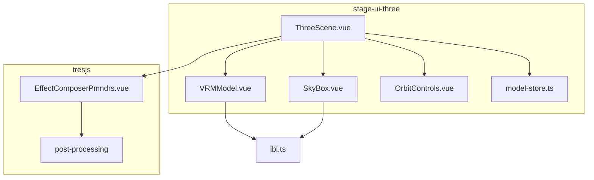
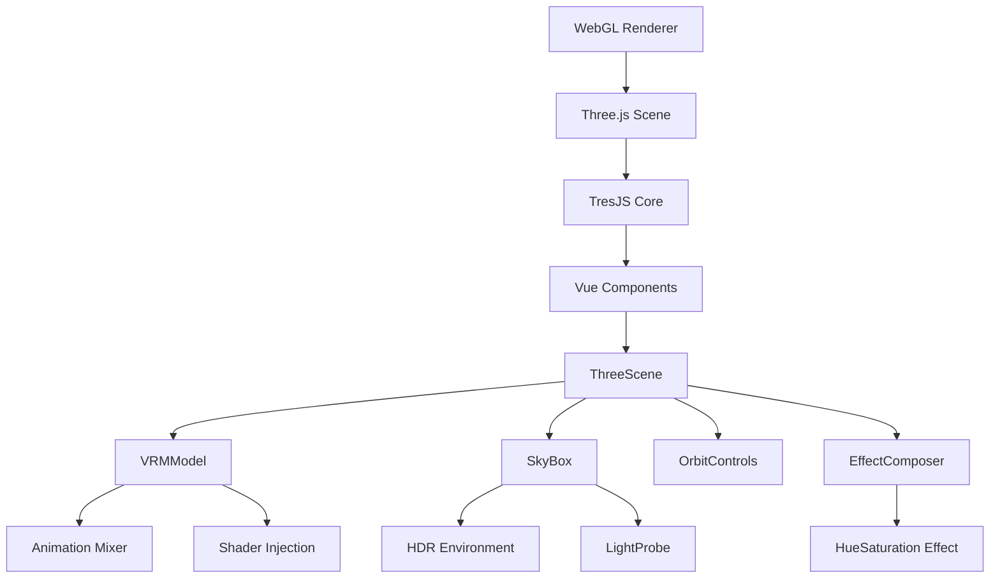
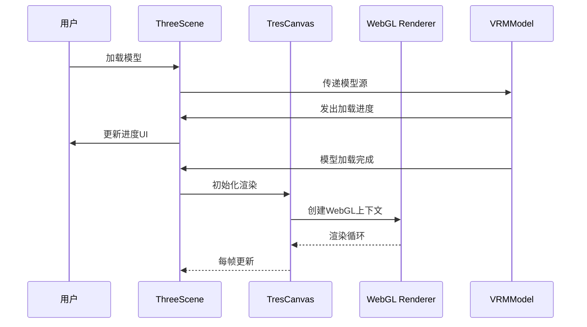
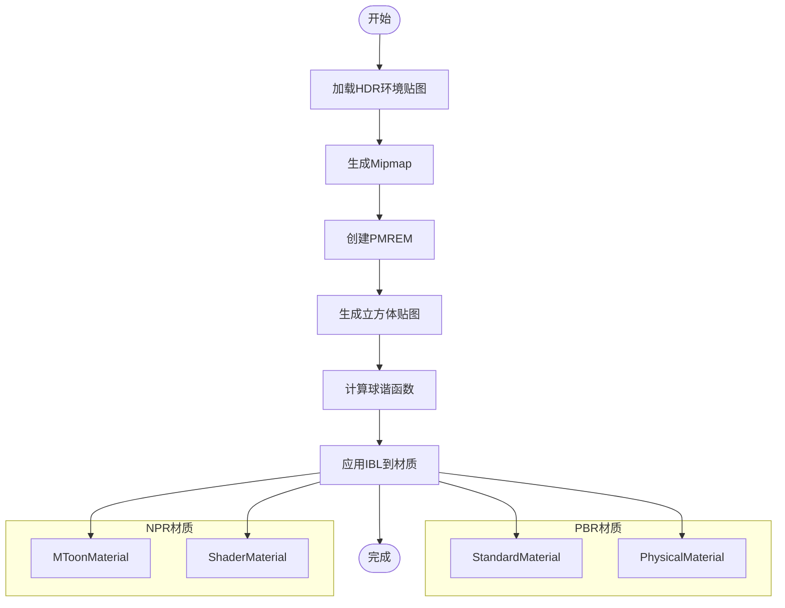
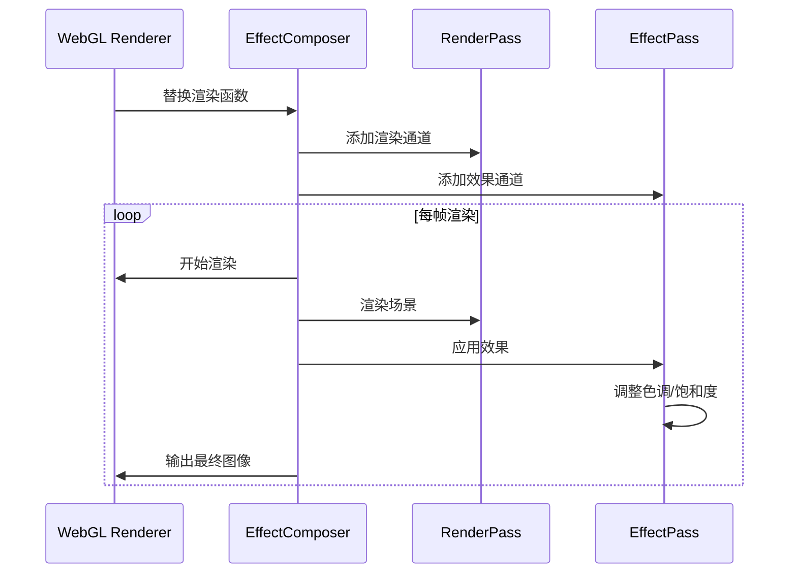
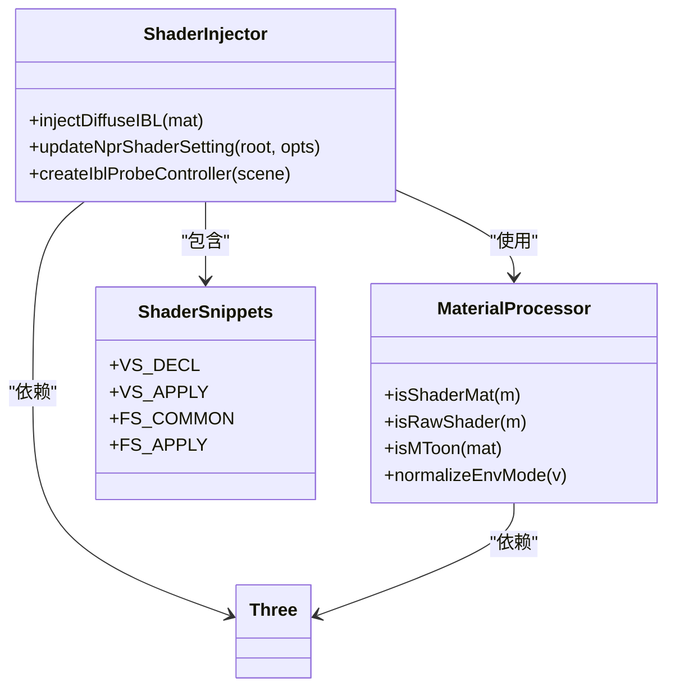

# 3D渲染引擎

<cite>
**本文档引用的文件**  
- [ThreeScene.vue](file://packages/stage-ui-three/src/components/ThreeScene.vue)
- [VRMModel.vue](file://packages/stage-ui-three/src/components/Model/VRMModel.vue)
- [SkyBox.vue](file://packages/stage-ui-three/src/components/Environment/SkyBox.vue)
- [ibl.ts](file://packages/stage-ui-three/src/composables/shader/ibl.ts)
- [EffectComposerPmndrs.vue](file://packages/tresjs/src/post-processing/components/EffectComposerPmndrs.vue)
- [model-store.ts](file://packages/stage-ui-three/src/stores/model-store.ts)
</cite>

## 目录
1. [简介](#简介)
2. [项目结构](#项目结构)
3. [核心组件](#核心组件)
4. [架构概述](#架构概述)
5. [详细组件分析](#详细组件分析)
6. [依赖分析](#依赖分析)
7. [性能考虑](#性能考虑)
8. [故障排除指南](#故障排除指南)
9. [结论](#结论)

## 简介
本文档详细阐述了基于Three.js和TresJS构建的3D渲染引擎的技术架构。该系统专为高质量VRM模型渲染而设计，集成了基于图像的光照（IBL）、环境光遮蔽、后期处理效果和自定义着色器技术。文档涵盖了从场景构建、相机控制到光照系统和后期处理的完整渲染管线，重点介绍了如何通过Shader实现高质量材质渲染和环境交互。

## 项目结构
3D渲染引擎采用模块化架构，主要由`stage-ui-three`和`tresjs`两个核心包组成。`stage-ui-three`包负责3D场景的构建和管理，包含场景、模型、环境和控制等组件；`tresjs`包提供基于TresJS的后期处理功能。系统通过Pinia状态管理存储模型、相机和光照等配置，并利用Vue 3的组合式API实现响应式更新。



**图示来源**  
- [ThreeScene.vue](file://packages/stage-ui-three/src/components/ThreeScene.vue#L1-L371)
- [EffectComposerPmndrs.vue](file://packages/tresjs/src/post-processing/components/EffectComposerPmndrs.vue#L1-L163)

**本节来源**  
- [ThreeScene.vue](file://packages/stage-ui-three/src/components/ThreeScene.vue#L1-L371)
- [index.ts](file://packages/stage-ui-three/src/index.ts#L1-L3)

## 核心组件
系统的核心组件包括3D场景容器、VRM模型加载器、环境光照系统和后期处理管线。`ThreeScene`作为根组件协调所有子组件，通过TresJS的`TresCanvas`创建WebGL渲染上下文。`VRMModel`组件负责加载和渲染VRM格式的3D模型，支持动画、表情和口型同步。`SkyBox`组件处理基于HDR图像的环境光照，为场景提供真实的光照环境。`EffectComposerPmndrs`实现了后期处理效果管线，支持色调调整等视觉增强功能。

**本节来源**  
- [ThreeScene.vue](file://packages/stage-ui-three/src/components/ThreeScene.vue#L1-L371)
- [VRMModel.vue](file://packages/stage-ui-three/src/components/Model/VRMModel.vue#L1-L574)

## 架构概述
渲染引擎采用分层架构设计，从下到上分为WebGL渲染层、Three.js场景层、TresJS抽象层和Vue组件层。系统通过`TresCanvas`组件初始化渲染上下文，设置ACES电影级色调映射以获得高质量的视觉效果。场景中包含多种光源，包括方向光、环境光和半球光，支持根据场景需求动态切换。后期处理管线通过`EffectComposer`实现，允许在渲染结果上应用各种视觉效果。



**图示来源**  
- [ThreeScene.vue](file://packages/stage-ui-three/src/components/ThreeScene.vue#L1-L371)
- [EffectComposerPmndrs.vue](file://packages/tresjs/src/post-processing/components/EffectComposerPmndrs.vue#L1-L163)

## 详细组件分析

### 场景与相机系统分析
`ThreeScene`组件作为3D渲染的根容器，负责协调所有渲染元素。它通过`TresCanvas`创建WebGL渲染上下文，并集成`OrbitControls`实现用户交互。相机系统采用透视投影，支持通过Pinia状态存储和恢复相机位置和视角。组件监听各种事件，如模型加载进度、错误和完成，实现完整的生命周期管理。



**图示来源**  
- [ThreeScene.vue](file://packages/stage-ui-three/src/components/ThreeScene.vue#L1-L371)
- [VRMModel.vue](file://packages/stage-ui-three/src/components/Model/VRMModel.vue#L1-L574)

**本节来源**  
- [ThreeScene.vue](file://packages/stage-ui-three/src/components/ThreeScene.vue#L1-L371)
- [OrbitControls.vue](file://packages/stage-ui-three/src/components/Controls/OrbitControls.vue#L1-L30)

### 光照系统分析
光照系统支持多种光照模式，包括基于HDR图像的IBL和半球光。`SkyBox`组件负责加载HDR环境贴图，通过PMREM（Pre-filtered Mipmapped Radiance Environment Map）技术生成预过滤的环境贴图，用于物理正确的基于图像的光照。系统还实现了自定义的IBL着色器注入，为非PBR材质提供高质量的环境光照效果。



**图示来源**  
- [SkyBox.vue](file://packages/stage-ui-three/src/components/Environment/SkyBox.vue#L1-L175)
- [ibl.ts](file://packages/stage-ui-three/src/composables/shader/ibl.ts#L1-L173)

**本节来源**  
- [SkyBox.vue](file://packages/stage-ui-three/src/components/Environment/SkyBox.vue#L1-L175)
- [ibl.ts](file://packages/stage-ui-three/src/composables/shader/ibl.ts#L1-L173)

### 后期处理系统分析
后期处理系统基于`postprocessing`库构建，通过`EffectComposerPmndrs`组件实现。系统在主渲染通道后应用各种后期处理效果，当前实现了色调和饱和度调整。`EffectComposer`被配置为使用半浮点帧缓冲区类型，确保高动态范围渲染质量。渲染函数被替换，确保在启用时执行后期处理管线。



**图示来源**  
- [EffectComposerPmndrs.vue](file://packages/tresjs/src/post-processing/components/EffectComposerPmndrs.vue#L1-L163)
- [ThreeScene.vue](file://packages/stage-ui-three/src/components/ThreeScene.vue#L1-L371)

**本节来源**  
- [EffectComposerPmndrs.vue](file://packages/tresjs/src/post-processing/components/EffectComposerPmndrs.vue#L1-L163)
- [HueSaturationPmndrs.vue](file://packages/tresjs/src/post-processing/components/effects/HueSaturationPmndrs.vue#L1-L30)

### 自定义着色器分析
自定义着色器系统通过动态注入GLSL代码实现，为不同类型的材质提供统一的IBL支持。系统识别MToon、ShaderMaterial等材质类型，并应用相应的光照模型。对于ShaderMaterial，系统在顶点着色器中计算世界法线，在片元着色器中评估球谐光照，实现高质量的非真实感渲染效果。



**图示来源**  
- [ibl.ts](file://packages/stage-ui-three/src/composables/shader/ibl.ts#L1-L173)
- [VRMModel.vue](file://packages/stage-ui-three/src/components/Model/VRMModel.vue#L1-L574)

**本节来源**  
- [ibl.ts](file://packages/stage-ui-three/src/composables/shader/ibl.ts#L1-L173)
- [VRMModel.vue](file://packages/stage-ui-three/src/components/Model/VRMModel.vue#L1-L574)

## 依赖分析
系统依赖关系清晰，`stage-ui-three`包依赖`tresjs`包的后期处理功能，两者共同依赖Three.js和TresJS核心库。`VRMModel`组件依赖`@pixiv/three-vrm`库进行VRM模型解析和渲染。状态管理通过Pinia实现，`model-store.ts`存储所有可持久化的渲染配置。环境变量通过`@proj-airi/stage-shared`包统一管理。

```mermaid
graph TD
A[stage-ui-three] --> B[tresjs]
A --> C[Three.js]
A --> D[TresJS Core]
A --> E[@pixiv/three-vrm]
A --> F[Pinia]
B --> C
B --> D
A --> G[stage-shared]
H[Application] --> A
```

**图示来源**  
- [package.json](file://packages/tresjs/package.json#L1-L33)
- [model-store.ts](file://packages/stage-ui-three/src/stores/model-store.ts#L1-L150)

**本节来源**  
- [package.json](file://packages/tresjs/package.json#L1-L33)
- [model-store.ts](file://packages/stage-ui-three/src/stores/model-store.ts#L1-L150)

## 性能考虑
渲染引擎在设计时充分考虑了性能优化。系统通过`useLoop`钩子管理动画循环，支持暂停和恢复以节省资源。模型加载采用渐进式加载，通过进度事件提供用户反馈。后期处理管线仅在启用时执行，避免不必要的计算开销。内存管理方面，系统在组件卸载时清理所有WebGL资源，防止内存泄漏。对于复杂的VRM模型，系统实现了骨骼动画的优化更新，确保流畅的渲染性能。

## 故障排除指南
常见问题包括模型加载失败、光照效果异常和性能下降。模型加载问题通常由资源路径错误或网络问题引起，可通过检查`modelSrc`属性和网络请求解决。光照异常可能源于HDR贴图加载失败或着色器注入错误，应检查控制台错误日志。性能问题可通过简化场景、降低后期处理质量或优化动画更新频率来解决。调试时可启用Three.js的性能监控工具，分析渲染性能瓶颈。

**本节来源**  
- [VRMModel.vue](file://packages/stage-ui-three/src/components/Model/VRMModel.vue#L1-L574)
- [ThreeScene.vue](file://packages/stage-ui-three/src/components/ThreeScene.vue#L1-L371)

## 结论
本文档详细介绍了基于Three.js和TresJS的3D渲染引擎架构。系统通过模块化设计实现了高质量的VRM模型渲染，集成了先进的光照系统和后期处理效果。自定义着色器注入机制为非PBR材质提供了高质量的环境光照支持。通过合理的状态管理和资源清理策略，系统在保证视觉质量的同时实现了良好的性能表现。未来可扩展更多后期处理效果和光照模型，进一步提升渲染质量。