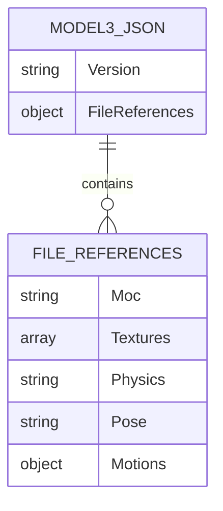
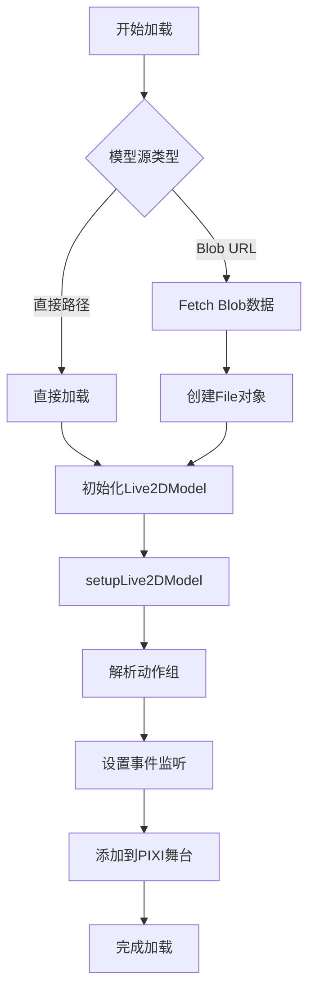
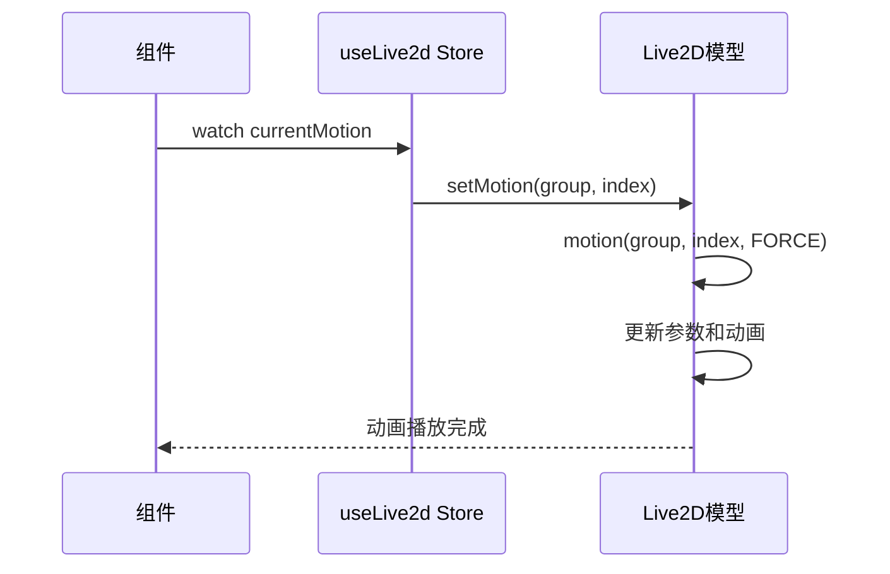
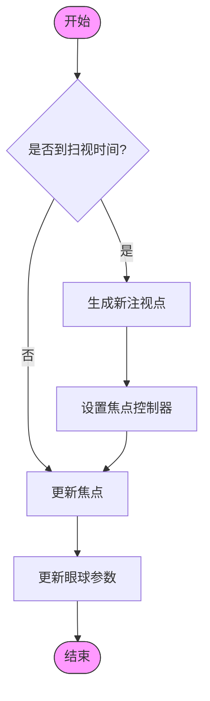
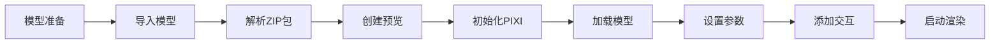
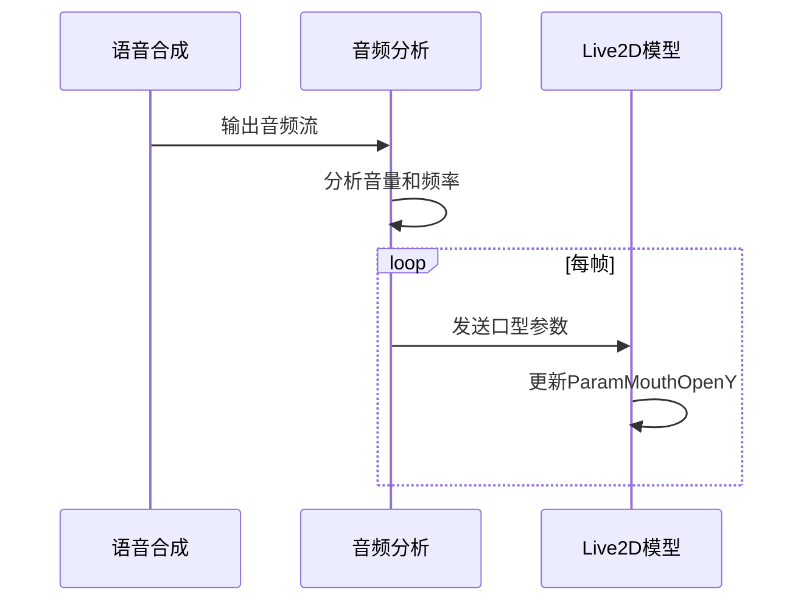
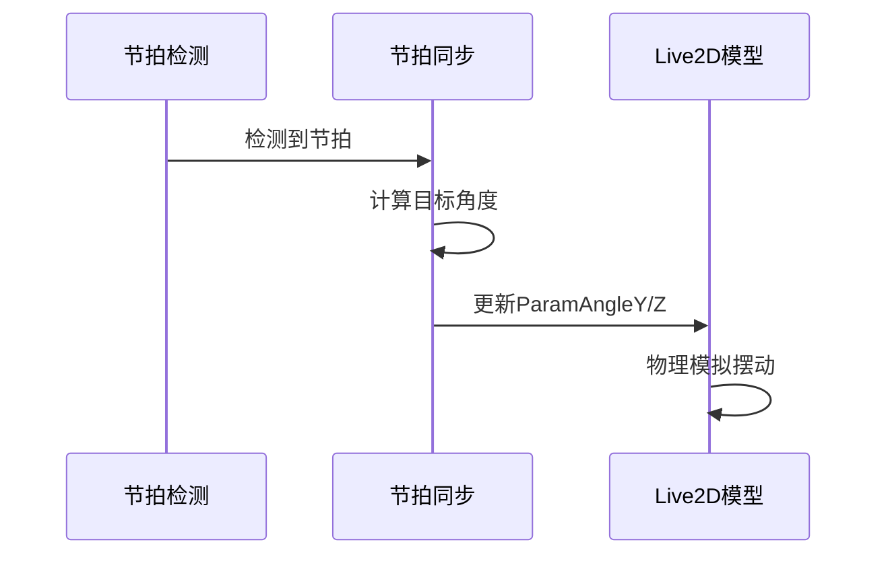

# Live2D集成

<cite>
**本文档引用文件**  
- [Live2D.vue](file://packages/stage-ui/src/components/scenes/Live2D.vue)
- [Model.vue](file://packages/stage-ui/src/components/scenes/live2d/Model.vue)
- [animation.ts](file://packages/stage-ui/src/composables/live2d/animation.ts)
- [live2d.ts](file://packages/stage-ui/src/stores/live2d.ts)
- [live2d-zip-loader.ts](file://packages/stage-ui/src/utils/live2d-zip-loader.ts)
</cite>

## 目录
1. [简介](#简介)
2. [Live2D模型工作原理](#live2d模型工作原理)
3. [文件结构分析](#文件结构分析)
4. [Vue应用中的加载流程](#vue应用中的加载流程)
5. [useLive2D Composable API详解](#uselive2d-composable-api详解)
6. [动画控制与表情切换](#动画控制与表情切换)
7. [参数调整机制](#参数调整机制)
8. [完整工作流](#完整工作流)
9. [错误处理与性能优化](#错误处理与性能优化)
10. [系统集成示例](#系统集成示例)
11. [调试技巧与常见问题](#调试技巧与常见问题)

## 简介
本文档详细介绍了Live2D在Vue应用中的集成方案，涵盖模型工作原理、文件结构、加载流程、API使用、动画控制、参数调整、工作流、错误处理、性能优化及系统集成等方面，为开发者提供全面的技术指导。

## Live2D模型工作原理
Live2D模型基于Cubism SDK实现，通过将2D角色分解为多个可独立运动的部件，实现类似3D的动态效果。模型的核心是.moc3文件，包含骨骼结构、变形参数和动画数据。渲染时，引擎根据参数值实时计算顶点位置，实现面部表情、身体动作等动态效果。

**Section sources**
- [Model.vue](file://packages/stage-ui/src/components/scenes/live2d/Model.vue#L0-L423)

## 文件结构分析
### .model3.json文件结构
.model3.json是Live2D模型的配置文件，包含以下关键部分：
- **Version**: 模型版本号
- **FileReferences**: 文件引用，包括：
  - Moc: .moc3模型文件
  - Textures: 纹理图片文件
  - Physics: 物理模拟文件
  - Pose: 姿势定义文件
  - Motions: 动作定义文件

### ZIP包结构
Live2D模型通常打包为ZIP文件，包含.model3.json和相关资源文件。系统通过JSZip解析ZIP包，自动识别和加载模型文件。



**Diagram sources**
- [live2d-zip-loader.ts](file://packages/stage-ui/src/utils/live2d-zip-loader.ts#L0-L107)

**Section sources**
- [live2d-zip-loader.ts](file://packages/stage-ui/src/utils/live2d-zip-loader.ts#L0-L107)

## Vue应用中的加载流程
### 加载组件结构
系统采用分层组件架构：
- **Live2DCanvas**: PIXI.js渲染画布容器
- **Live2DModel**: Live2D模型渲染组件
- **Live2D**: 组合组件，集成画布和模型

### 加载流程
1. 创建离屏Canvas用于预览渲染
2. 初始化PIXI.js应用和渲染上下文
3. 使用Live2DFactory.setupLive2DModel加载模型
4. 解析动作组和表情映射
5. 设置模型初始状态和事件监听



**Diagram sources**
- [Model.vue](file://packages/stage-ui/src/components/scenes/live2d/Model.vue#L0-L423)
- [Live2D.vue](file://packages/stage-ui/src/components/scenes/Live2D.vue#L0-L74)

**Section sources**
- [Model.vue](file://packages/stage-ui/src/components/scenes/live2d/Model.vue#L0-L423)
- [Live2D.vue](file://packages/stage-ui/src/components/scenes/Live2D.vue#L0-L74)

## useLive2D Composable API详解
### 状态管理
useLive2d是基于Pinia的状态管理store，负责管理Live2D相关的全局状态：

```mermaid
classDiagram
class useLive2d {
+position : {x : number, y : number}
+positionInPercentageString : {x : string, y : string}
+currentMotion : {group : string, index? : number}
+availableMotions : Array<{motionName : string, motionIndex : number, fileName : string}>
+motionMap : Record<string, string>
+scale : number
+onShouldUpdateView(hook : () => void) : void
+shouldUpdateView() : void
}
```

**Diagram sources**
- [live2d.ts](file://packages/stage-ui/src/stores/live2d.ts#L11-L51)

**Section sources**
- [live2d.ts](file://packages/stage-ui/src/stores/live2d.ts#L11-L51)

### 核心属性
- **position**: 模型在屏幕上的位置（相对于中心的百分比）
- **scale**: 模型缩放比例
- **currentMotion**: 当前播放的动作组
- **availableMotions**: 可用动作列表
- **motionMap**: 动作文件到表情的映射

### 核心方法
- **onShouldUpdateView**: 注册视图更新钩子
- **shouldUpdateView**: 触发视图更新广播

## 动画控制与表情切换
### 动作组管理
系统通过motionManager管理动作组，支持以下操作：
- 列出所有可用动作组
- 切换到指定动作组
- 监听动作开始事件

### 表情映射
表情通过motionMap实现映射，将动作文件名映射到预定义的表情类型：
- Emotion.Happy: 开心表情
- Emotion.Sad: 悲伤表情
- Emotion.Angry: 生气表情
- Emotion.Neutral: 中性表情



**Diagram sources**
- [Model.vue](file://packages/stage-ui/src/components/scenes/live2d/Model.vue#L0-L423)

**Section sources**
- [Model.vue](file://packages/stage-ui/src/components/scenes/live2d/Model.vue#L0-L423)

## 参数调整机制
### 眼动控制
系统实现了一套模拟人眼运动的机制：
- **随机扫视**: 定期生成新的注视点
- **平滑过渡**: 使用线性插值实现平滑移动
- **焦点控制**: 通过focusController管理头部跟随



**Diagram sources**
- [animation.ts](file://packages/stage-ui/src/composables/live2d/animation.ts#L11-L33)

**Section sources**
- [animation.ts](file://packages/stage-ui/src/composables/live2d/animation.ts#L11-L33)

### 口型同步
通过ParamMouthOpenY参数实现口型同步：
- 参数值范围：0-100
- 值越大，嘴巴张开程度越大
- 实时响应音频输入或文本转语音的发音状态

### 头部摆动
结合节拍同步(Beat Sync)实现头部摆动：
- **ParamAngleY**: Y轴旋转（左右摆动）
- **ParamAngleZ**: Z轴旋转（前后点头）
- 使用半隐式欧拉法实现物理模拟效果

## 完整工作流
### 模型准备
1. 获取Live2D模型文件（.zip或单独文件）
2. 确保包含.model3.json配置文件
3. 验证纹理、动作等资源完整性

### 导入流程
1. 通过文件选择器或拖拽上传模型
2. 使用JSZip解析ZIP包
3. 自动识别.model3.json文件
4. 创建模型预览图

### 渲染流程
1. 初始化PIXI.js应用
2. 创建Live2DModel实例
3. 加载模型数据
4. 设置模型位置和缩放
5. 添加交互事件监听
6. 启动动画循环



**Section sources**
- [Model.vue](file://packages/stage-ui/src/components/scenes/live2d/Model.vue#L0-L423)
- [live2d-zip-loader.ts](file://packages/stage-ui/src/utils/live2d-zip-loader.ts#L0-L107)

## 错误处理与性能优化
### 错误处理
#### 常见错误类型
- **模型文件缺失**: 检查ZIP包完整性
- **格式不支持**: 确认使用Cubism 4格式
- **资源加载失败**: 检查网络和文件路径
- **参数不匹配**: 验证模型参数定义

#### 错误处理策略
- 使用try-catch包裹模型加载过程
- 提供详细的错误日志
- 实现优雅降级机制
- 支持模型重新加载

### 性能优化
#### 渲染优化
- **分辨率控制**: 限制画布分辨率
- **帧率管理**: 根据设备性能调整
- **资源缓存**: 缓存已加载的模型
- **懒加载**: 按需加载动作资源

#### 内存管理
- 及时销毁不再使用的模型实例
- 释放PIXI.js应用资源
- 清理事件监听器
- 使用WeakMap管理引用

#### 移动端优化
- 根据设备类型调整缩放因子
- 降低动画复杂度
- 优化触摸交互响应
- 节省电池消耗

**Section sources**
- [Model.vue](file://packages/stage-ui/src/components/scenes/live2d/Model.vue#L0-L423)

## 系统集成示例
### 语音合成集成
将Live2D与语音合成系统集成，实现口型同步：



**Section sources**
- [Model.vue](file://packages/stage-ui/src/components/scenes/live2d/Model.vue#L0-L423)

### 节拍同步集成
与音乐节拍同步，实现舞蹈效果：



**Section sources**
- [Model.vue](file://packages/stage-ui/src/components/scenes/live2d/Model.vue#L0-L423)

## 调试技巧与常见问题
### 调试工具
- **PIXI.js调试器**: 检查渲染状态
- **参数监视器**: 实时查看模型参数
- **性能分析器**: 监控帧率和内存
- **网络面板**: 检查资源加载

### 常见问题解决方案
#### 模型不显示
- 检查模型文件路径是否正确
- 验证ZIP包完整性
- 确认PIXI.js应用已正确初始化
- 检查浏览器控制台错误

#### 动画不播放
- 确认动作组名称正确
- 检查模型是否包含指定动作
- 验证MotionPriority设置
- 检查模型是否处于暂停状态

#### 眼球不跟随
- 确认ParamEyeBallX/Y参数存在
- 检查焦点控制器是否启用
- 验证坐标系转换
- 检查更新频率

#### 性能问题
- 降低画布分辨率
- 减少同时渲染的模型数量
- 优化动作复杂度
- 使用更简单的物理模拟

**Section sources**
- [Model.vue](file://packages/stage-ui/src/components/scenes/live2d/Model.vue#L0-L423)
- [animation.ts](file://packages/stage-ui/src/composables/live2d/animation.ts#L11-L33)