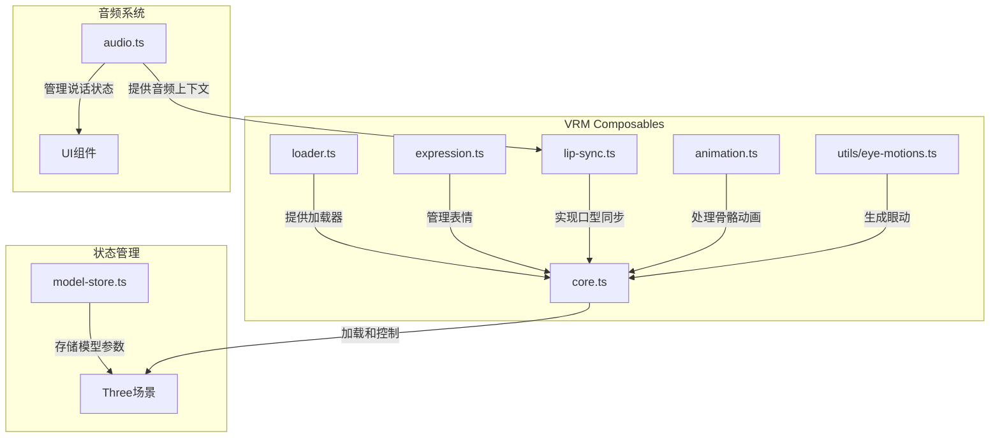
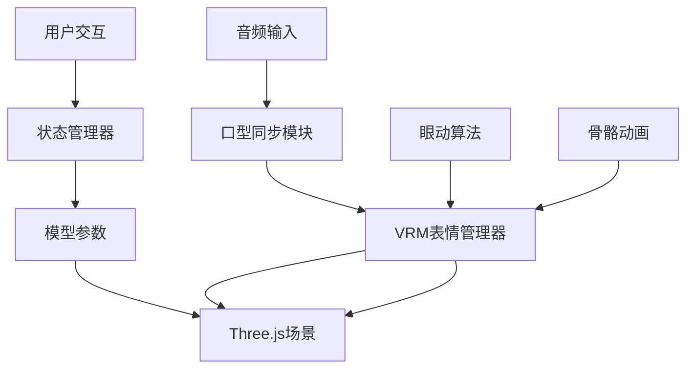
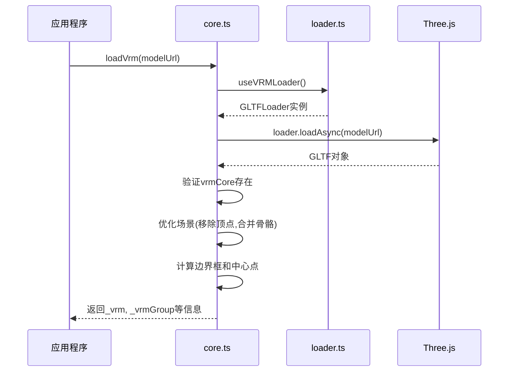
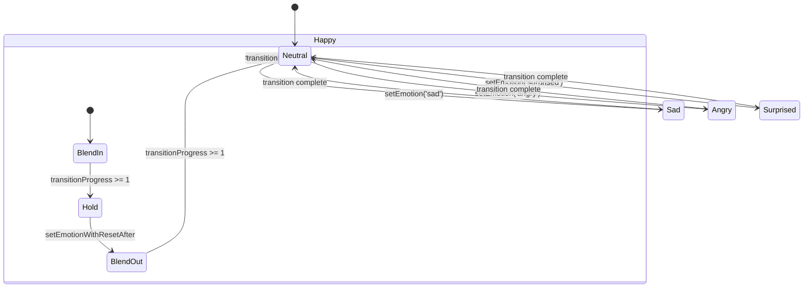
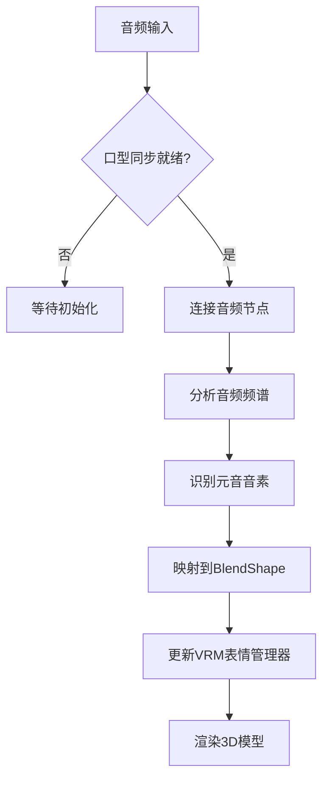
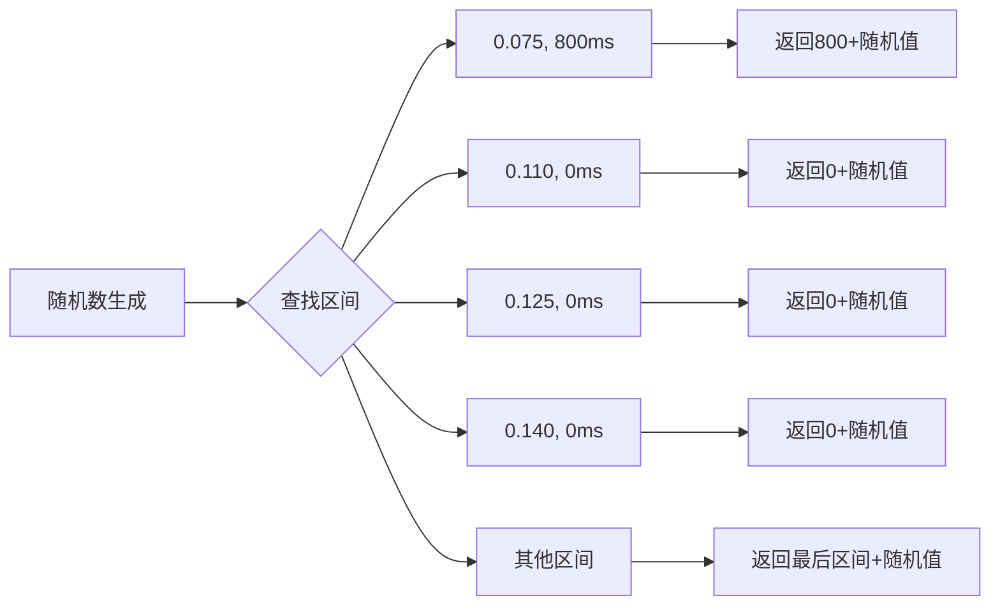

# VRM模型驱动

<cite>
**Referenced Files in This Document**   
- [model-store.ts](file://packages/stage-ui-three/src/stores/model-store.ts)
- [loader.ts](file://packages/stage-ui-three/src/composables/vrm/loader.ts)
- [core.ts](file://packages/stage-ui-three/src/composables/vrm/core.ts)
- [expression.ts](file://packages/stage-ui-three/src/composables/vrm/expression.ts)
- [lip-sync.ts](file://packages/stage-ui-three/src/composables/vrm/lip-sync.ts)
- [eye-motions.ts](file://packages/stage-ui-three/src/composables/vrm/utils/eye-motions.ts)
- [audio.ts](file://packages/stage-ui/src/stores/audio.ts)
- [index.ts](file://packages/stage-ui-three/src/composables/vrm/index.ts)
</cite>

## 目录
1. [简介](#简介)
2. [项目结构](#项目结构)
3. [核心组件](#核心组件)
4. [架构概述](#架构概述)
5. [详细组件分析](#详细组件分析)
6. [依赖分析](#依赖分析)
7. [性能考虑](#性能考虑)
8. [故障排除指南](#故障排除指南)
9. [结论](#结论)

## 简介
本文档全面介绍了基于VRM格式的3D模型驱动系统，重点阐述了在Three.js环境中实现VRM模型加载、动画控制和实时驱动的完整解决方案。文档涵盖了从模型规范到实际实现的各个方面，包括骨骼动画、面部表情（BlendShape）、眼动控制和口型同步（lip-sync）等关键技术。系统采用组合式架构设计，通过状态管理(store)协调模型状态与音频系统的联动，实现了语音驱动的口型动画功能。同时，文档还提供了性能优化建议，帮助开发者构建高效、流畅的虚拟角色交互体验。

## 项目结构
系统采用模块化架构，主要功能分散在`packages/stage-ui-three`包中，该包专门负责3D场景和VRM模型的处理。核心的VRM相关功能集中在`composables/vrm`目录下，通过组合式API提供可复用的功能模块。状态管理通过Pinia store实现，确保模型状态的集中管理和跨组件共享。



**Diagram sources**
- [loader.ts](file://packages/stage-ui-three/src/composables/vrm/loader.ts#L6-L19)
- [core.ts](file://packages/stage-ui-three/src/composables/vrm/core.ts#L20-L133)
- [expression.ts](file://packages/stage-ui-three/src/composables/vrm/expression.ts#L14-L169)
- [lip-sync.ts](file://packages/stage-ui-three/src/composables/vrm/lip-sync.ts#L12-L45)
- [model-store.ts](file://packages/stage-ui-three/src/stores/model-store.ts#L0-L182)
- [audio.ts](file://packages/stage-ui/src/stores/audio.ts#L0-L140)

**Section sources**
- [model-store.ts](file://packages/stage-ui-three/src/stores/model-store.ts#L0-L182)
- [loader.ts](file://packages/stage-ui-three/src/composables/vrm/loader.ts#L6-L19)

## 核心组件
系统的核心组件包括VRM模型加载器、表情管理系统、口型同步模块和状态管理器。这些组件协同工作，实现了虚拟角色的完整驱动功能。模型加载器负责解析和加载VRM格式的3D模型，表情管理系统通过BlendShape控制面部表情变化，口型同步模块将音频信号转换为相应的口型动作，而状态管理器则确保所有组件的状态保持一致和可预测。

**Section sources**
- [core.ts](file://packages/stage-ui-three/src/composables/vrm/core.ts#L20-L133)
- [expression.ts](file://packages/stage-ui-three/src/composables/vrm/expression.ts#L14-L169)
- [lip-sync.ts](file://packages/stage-ui-three/src/composables/vrm/lip-sync.ts#L12-L45)

## 架构概述
系统采用分层架构设计，上层为UI组件，中层为组合式功能模块，底层为Three.js和VRM库。这种设计实现了关注点分离，提高了代码的可维护性和可复用性。数据流从音频输入开始，经过口型同步算法处理，更新到VRM模型的表情管理器，最终反映在3D场景中。状态管理器作为中央枢纽，协调各个组件之间的状态同步。



**Diagram sources**
- [lip-sync.ts](file://packages/stage-ui-three/src/composables/vrm/lip-sync.ts#L12-L45)
- [expression.ts](file://packages/stage-ui-three/src/composables/vrm/expression.ts#L14-L169)
- [model-store.ts](file://packages/stage-ui-three/src/stores/model-store.ts#L0-L182)

## 详细组件分析
本节深入分析各个关键组件的实现细节和工作原理。

### VRM加载与核心功能
`core.ts`文件提供了加载VRM模型的核心功能。`loadVrm`函数使用GLTFLoader加载模型，并通过VRMLoaderPlugin支持VRM特有的功能。加载过程中会进行性能优化，如移除不必要的顶点和合并骨骼。函数还计算模型的边界框，确定模型的中心点和尺寸，为后续的相机定位和场景布局提供依据。



**Diagram sources**
- [core.ts](file://packages/stage-ui-three/src/composables/vrm/core.ts#L20-L133)
- [loader.ts](file://packages/stage-ui-three/src/composables/vrm/loader.ts#L6-L19)

**Section sources**
- [core.ts](file://packages/stage-ui-three/src/composables/vrm/core.ts#L20-L133)

### 表情与动画管理
`expression.ts`文件实现了基于情绪的状态机，支持多种预定义表情（如快乐、悲伤、愤怒等）的平滑过渡。系统通过插值算法实现表情的渐变效果，确保动画的自然流畅。`useVRMEmote`函数返回一个包含当前情绪、过渡状态和控制方法的对象，开发者可以通过`setEmotion`方法切换表情，并通过`update`方法在每一帧更新动画状态。



**Diagram sources**
- [expression.ts](file://packages/stage-ui-three/src/composables/vrm/expression.ts#L14-L169)

**Section sources**
- [expression.ts](file://packages/stage-ui-three/src/composables/vrm/expression.ts#L14-L169)

### 口型同步实现
`lip-sync.ts`文件实现了基于音频的口型同步功能。系统使用`wLipSync`库分析音频流，识别出不同的元音音素（A, E, I, O, U），并将其映射到相应的BlendShape权重。`useVRMLipSync`函数接收一个音频节点引用，自动建立音频处理链，并在每一帧更新VRM模型的口型参数，实现语音与口型的精确同步。



**Diagram sources**
- [lip-sync.ts](file://packages/stage-ui-three/src/composables/vrm/lip-sync.ts#L12-L45)
- [audio.ts](file://packages/stage-ui/src/stores/audio.ts#L0-L140)

**Section sources**
- [lip-sync.ts](file://packages/stage-ui-three/src/composables/vrm/lip-sync.ts#L12-L45)

### 眼动控制
`eye-motions.ts`文件提供了生成自然眼动的算法。系统通过`randomSaccadeInterval`函数生成符合生理规律的眼球跳动间隔，模拟人类眼球的随机运动。这种微小的动态变化使虚拟角色看起来更加生动和真实，避免了静态模型带来的"恐怖谷"效应。



**Diagram sources**
- [eye-motions.ts](file://packages/stage-ui-three/src/composables/vrm/utils/eye-motions.ts#L1-L32)

**Section sources**
- [eye-motions.ts](file://packages/stage-ui-three/src/composables/vrm/utils/eye-motions.ts#L1-L32)

## 依赖分析
系统依赖于多个第三方库来实现核心功能。Three.js作为基础3D引擎，提供了场景、相机、灯光等基本功能。`@pixiv/three-vrm`系列库专门用于处理VRM格式的模型，支持骨骼动画、表情控制等特性。`wLipSync`库负责音频分析和口型同步。这些依赖通过组合式API封装，为上层应用提供了简洁的接口。

```mermaid
graph TD
A[应用程序] --> B[stage-ui-three]
B --> C[Three.js]
B --> D[@pixiv/three-vrm]
B --> E[wLipSync]
D --> F[GLTFLoader]
D --> G[VRMLoaderPlugin]
D --> H[VRMAnimationLoaderPlugin]
E --> I[AudioContext]
I --> J[音频分析节点]
```

**Diagram sources**
- [loader.ts](file://packages/stage-ui-three/src/composables/vrm/loader.ts#L6-L19)
- [index.ts](file://packages/stage-ui-three/src/composables/vrm/index.ts#L1-L5)

**Section sources**
- [loader.ts](file://packages/stage-ui-three/src/composables/vrm/loader.ts#L6-L19)

## 性能考虑
为了确保流畅的用户体验，系统在多个层面进行了性能优化。在模型加载阶段，通过`VRMUtils.removeUnnecessaryVertices`和`VRMUtils.combineSkeletons`减少渲染开销。在运行时，通过禁用视锥体裁剪(`frustumCulled = false`)确保所有模型部分都能正确渲染。状态管理采用Pinia的响应式系统，最小化不必要的重新渲染。对于复杂的口型同步计算，系统利用Web Audio API的音频处理节点在独立线程中运行，避免阻塞主线程。

## 故障排除指南
当遇到VRM模型加载失败时，首先检查模型文件路径是否正确，以及服务器是否支持跨域请求（设置`crossOrigin = 'anonymous'`）。如果表情动画不生效，确认模型是否包含相应的BlendShape定义，并检查表情管理器是否正确初始化。对于口型同步不同步的问题，检查音频节点是否正确连接，并验证`wLipSync`库是否成功初始化。眼动效果不自然时，可以调整`saccade`间隔的概率分布，使其更符合目标角色的特征。

**Section sources**
- [loader.ts](file://packages/stage-ui-three/src/composables/vrm/loader.ts#L6-L19)
- [core.ts](file://packages/stage-ui-three/src/composables/vrm/core.ts#L20-L133)
- [lip-sync.ts](file://packages/stage-ui-three/src/composables/vrm/lip-sync.ts#L12-L45)

## 结论
本文档详细介绍了基于VRM格式的3D模型驱动系统的实现方案。通过组合式API的设计，系统实现了高度的模块化和可复用性，使开发者能够轻松集成和定制虚拟角色功能。从模型加载到实时驱动，系统提供了一套完整的解决方案，涵盖了表情、口型、眼动等关键交互要素。结合状态管理和性能优化策略，该系统能够为各种应用场景提供流畅、自然的虚拟角色体验。