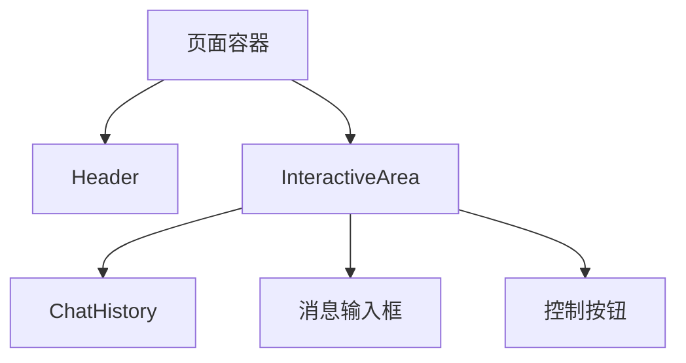
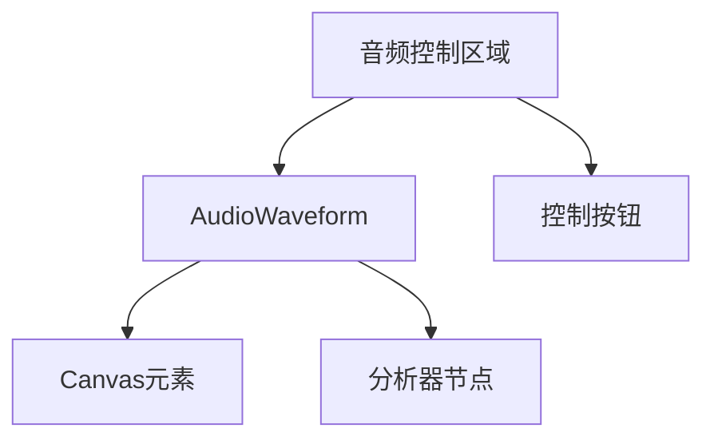
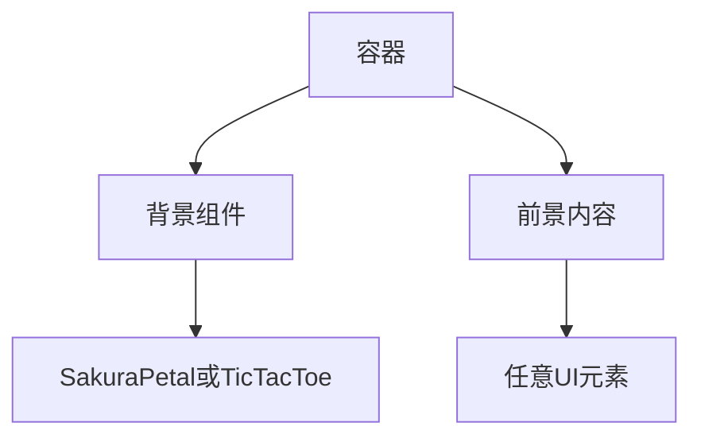

# UI组件

<cite>
**本文档中引用的文件**  
- [SakuraPetal.vue](file://apps/stage-web/src/components/Backgrounds/SakuraPetal.vue)
- [TicTacToe.vue](file://apps/stage-web/src/components/Backgrounds/TicTacToe.vue)
- [Header.vue](file://apps/stage-web/src/components/Layouts/Header.vue)
- [InteractiveArea.vue](file://apps/stage-web/src/components/Layouts/InteractiveArea.vue)
- [ChatHistory.vue](file://apps/stage-web/src/components/Widgets/ChatHistory.vue)
- [AnimatedWave.vue](file://apps/stage-web/src/components/Widgets/AnimatedWave.vue)
- [AudioWaveform.vue](file://apps/stage-web/src/components/AudioWaveform.vue)
</cite>

## 目录
1. [简介](#简介)
2. [背景组件](#背景组件)
   - [SakuraPetal](#sakurapetal)
   - [TicTacToe](#tictactoe)
3. [交互区域组件](#交互区域组件)
   - [InteractiveArea](#interactivearea)
   - [Header](#header)
4. [功能小部件](#功能小部件)
   - [ChatHistory](#chathistory)
   - [AnimatedWave](#animatedwave)
   - [AudioWaveform](#audiowaveform)
5. [组件组合使用最佳实践](#组件组合使用最佳实践)
6. [性能优化建议](#性能优化建议)
7. [结论](#结论)

## 简介
本项目为一个VTuber风格的Web界面组件库，旨在提供丰富的视觉效果与交互体验。组件库分为三大类：背景组件、交互区域组件和功能小部件。每个组件均采用Vue 3组合式API编写，支持响应式设计与国际化。组件设计注重可复用性与可配置性，通过props、事件和插槽实现灵活定制。

## 背景组件

### SakuraPetal
SakuraPetal组件用于创建樱花飘落的动画背景，适用于营造浪漫或日式氛围的界面。

**Props接口**
- `petalCount`: 樱花数量，默认20
- `refreshInterval`: 动画刷新间隔（毫秒），默认30000
- `baseColor`: 樱花基础颜色，默认`#FFB6C1`

**事件回调**
- 无自定义事件

**插槽使用**
- 默认插槽：用于放置前景内容，樱花动画位于背景层

**动画机制**
组件通过JavaScript动态生成樱花元素，并利用CSS动画实现飘落与旋转效果。动画包含两个关键帧序列：`fall`控制垂直下落与水平偏移，`drift`控制旋转摆动。背景叠加了半透明SVG图案，增强层次感。

**Section sources**
- [SakuraPetal.vue](file://apps/stage-web/src/components/Backgrounds/SakuraPetal.vue#L1-L167)

### TicTacToe
TicTacToe组件提供井字棋图案的SVG背景，具有悬停动画效果。

**Props接口**
- 无自定义props

**事件回调**
- 无自定义事件

**插槽使用**
- 默认插槽：用于放置前景内容

**交互特性**
当用户悬停时，背景会轻微放大并触发动画，使背景图案产生平滑的滑动效果。动画通过`@keyframes slideBackground`实现，背景位置从(0,0)移动到(64px,-64px)，与SVG尺寸匹配以实现无缝循环。

**Section sources**
- [TicTacToe.vue](file://apps/stage-web/src/components/Backgrounds/TicTacToe.vue#L1-L35)

## 交互区域组件

### InteractiveArea
InteractiveArea是核心交互区域，包含聊天历史和消息输入框，构成主要的用户交互界面。

**Props接口**
- 无直接props，通过Pinia状态管理共享数据

**事件回调**
- 无直接emit事件，通过store的`send`方法处理消息发送

**插槽使用**
- 无默认插槽，但内部包含可替换的`BasicTextarea`组件

**核心功能**
- 集成`ChatHistory`组件显示消息记录
- 支持语音激活检测（VAD），通过`useMicVAD`监听语音输入
- 集成Whisper语音识别，将语音转换为文本
- 提供消息清除和主题切换按钮
- 自动滚动到底部，确保最新消息可见

**状态管理**
组件依赖多个Pinia store：
- `useChatStore`：管理聊天消息
- `useSettingsAudioDevice`：管理音频设备设置
- `useConsciousnessStore`：管理当前AI代理和模型
- `useProvidersStore`：管理服务提供商

**Section sources**
- [InteractiveArea.vue](file://apps/stage-web/src/components/Layouts/InteractiveArea.vue#L1-L200)

### Header
Header组件提供页面顶部导航栏，包含导航链接和设置入口。

**Props接口**
- 无自定义props

**事件回调**
- 无自定义事件

**插槽使用**
- 无默认插槽

**布局结构**
- 左侧区域：包含`HeaderLink`组件，用于页面导航
- 右侧区域：设置图标链接，跳转至设置页面

**UI设计**
采用简洁的现代设计风格，使用UnoCSS进行样式定义。设置图标使用Solar图标集，提供清晰的视觉反馈。

**Section sources**
- [Header.vue](file://apps/stage-web/src/components/Layouts/Header.vue#L1-L20)

## 功能小部件

### ChatHistory
ChatHistory组件负责渲染聊天消息历史，支持多种消息类型和Markdown格式。

**Props接口**
- 无直接props，通过`useChatStore`获取消息数据

**事件回调**
- 无直接emit事件

**插槽使用**
- 无默认插槽

**消息类型支持**
- `user`：用户消息，右对齐，蓝色主题
- `assistant`：AI助手消息，左对齐，紫色主题
- `error`：错误消息，左对齐，红色主题
- `sending`：发送中状态，显示加载动画

**核心特性**
- 使用`MarkdownRenderer`组件渲染Markdown内容
- 支持工具调用（tool-call）的特殊显示
- 自动滚动：消息更新后自动滚动到底部
- 响应式设计：在小屏幕上调整布局和字体大小

**Section sources**
- [ChatHistory.vue](file://apps/stage-web/src/components/Widgets/ChatHistory.vue#L1-L141)

### AnimatedWave
AnimatedWave组件创建可配置的动画波浪效果，常用于装饰性分隔或背景。

**Props接口**
- `height`: 波浪高度（像素），默认40
- `amplitude`: 波浪振幅（像素），默认14
- `waveLength`: 波长（像素），默认250
- `fillColor`: 填充颜色，默认为基于主题色的OKLCH颜色
- `direction`: 波浪方向（'up'或'down'），默认'down'
- `movementDirection`: 移动方向（'left'或'right'），默认'left'
- `animationSpeed`: 动画速度（像素/秒），默认50

**事件回调**
- 无自定义事件

**插槽使用**
- 默认插槽：波浪效果叠加在插槽内容之上

**技术实现**
组件通过JavaScript动态生成SVG路径数据，使用`generateSineWavePath`函数创建正弦波路径。利用CSS `mask-image`特性将SVG作为遮罩应用，通过`@keyframes wave-animation`实现水平移动动画。使用`will-change: transform`优化动画性能。

**Section sources**
- [AnimatedWave.vue](file://apps/stage-web/src/components/Widgets/AnimatedWave.vue#L1-L139)

### AudioWaveform
AudioWaveform组件实时可视化音频输入的波形，用于音频反馈。

**Props接口**
- 无自定义props

**事件回调**
- 通过`defineExpose`暴露`analyser`方法，供父组件访问分析器节点

**插槽使用**
- 无默认插槽

**音频处理**
- 使用Web Audio API的`AnalyserNode`获取时域数据
- 通过`getByteTimeDomainData`获取音频缓冲区
- 在`requestAnimationFrame`循环中持续更新画布

**可视化实现**
- 使用Canvas API绘制波形
- 根据暗色模式切换画布背景和线条颜色
- 动态调整画布尺寸以匹配容器

**性能优化**
- 使用`will-change`提示浏览器优化变换
- 限制数据缓冲区大小以减少内存使用

**Section sources**
- [AudioWaveform.vue](file://apps/stage-web/src/components/AudioWaveform.vue#L1-L97)

## 组件组合使用最佳实践

### 聊天界面布局


**最佳实践**
1. **层级结构**：将`Header`置于顶部，`InteractiveArea`作为主要内容区域
2. **响应式适配**：在移动设备上使用`MobileHeader`和`MobileChatHistory`替代组件
3. **主题一致性**：确保所有组件共享相同的主题颜色系统

### 音频波形嵌入


**最佳实践**
1. **性能考虑**：避免在低性能设备上同时运行多个`AudioWaveform`实例
2. **尺寸适配**：使用`useElementBounding`确保波形图正确填充容器
3. **暗色模式**：根据`useDark`状态自动切换颜色方案

### 背景与内容叠加


**最佳实践**
1. **Z-index管理**：确保背景组件的z-index低于内容层
2. **性能平衡**：复杂动画背景可能影响滚动性能，建议在移动设备上禁用
3. **可访问性**：确保背景动画不会干扰内容阅读

## 性能优化建议

### 虚拟滚动
对于长消息历史，建议实现虚拟滚动以提升性能：
- 仅渲染可视区域内的消息
- 使用`IntersectionObserver`检测元素可见性
- 动态计算消息高度并维护位置映射

### 懒加载策略
1. **组件懒加载**：
```javascript
const ChatHistory = defineAsyncComponent(() => import('./ChatHistory.vue'))
```
2. **资源懒加载**：
- 延迟加载非关键背景动画
- 按需加载大型依赖（如Web Audio API相关模块）

### 动画优化
1. **CSS动画优先**：使用CSS动画而非JavaScript动画以利用硬件加速
2. **`will-change`提示**：对频繁变换的元素使用`will-change: transform`
3. **节流与防抖**：对频繁触发的事件（如窗口大小调整）进行节流处理

### 内存管理
1. **事件清理**：在`onBeforeUnmount`中清理定时器和事件监听器
2. **资源释放**：及时释放Web Audio API资源
3. **缓存策略**：合理缓存计算结果，避免重复计算

## 结论
stage-web UI组件库提供了一套完整的VTuber界面解决方案，涵盖视觉、交互和功能各个方面。组件设计注重可复用性、可配置性和性能表现。通过合理的组合使用和性能优化，可以构建出流畅、美观的AI交互界面。未来可进一步完善文档，增加更多示例和主题定制选项。