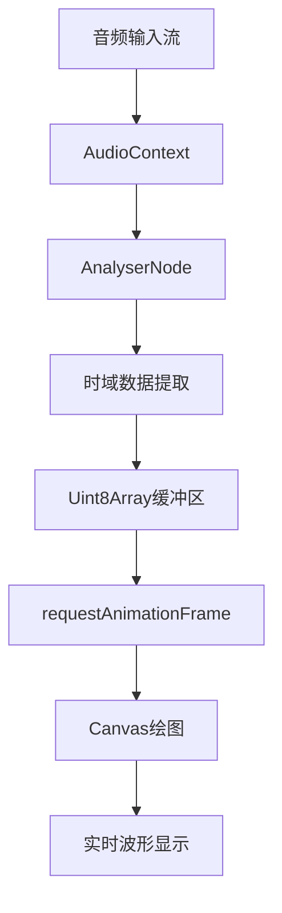
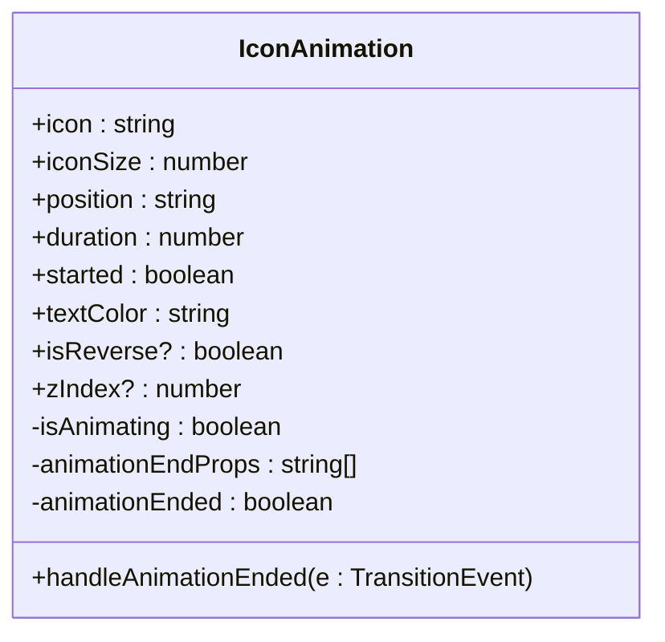
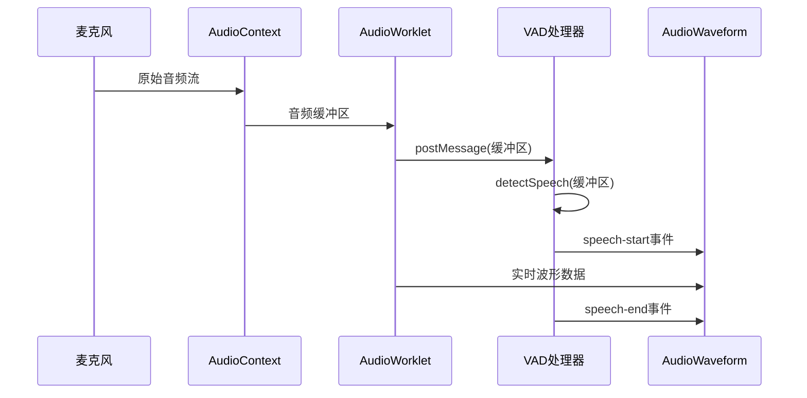
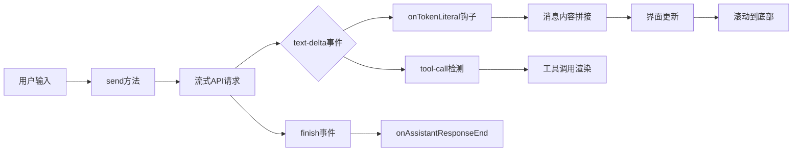

# 功能小部件

<cite>
**本文档中引用的文件**  
- [AudioWaveform.vue](file://apps/stage-web/src/components/AudioWaveform.vue)
- [IconAnimation.vue](file://apps/stage-web/src/components/IconAnimation.vue)
- [ChatHistory.vue](file://apps/stage-web/src/components/Widgets/ChatHistory.vue)
- [audio-input.ts](file://apps/stage-web/src/composables/audio-input.ts)
- [icon-animation.ts](file://apps/stage-web/src/composables/icon-animation.ts)
- [vad.ts](file://apps/stage-web/src/workers/vad/vad.ts)
- [process.worklet.ts](file://apps/stage-web/src/workers/vad/process.worklet.ts)
- [manager.ts](file://apps/stage-web/src/workers/vad/manager.ts)
- [index.ts](file://apps/stage-web/src/workers/vad/index.ts)
</cite>

## 目录
1. [简介](#简介)
2. [核心组件](#核心组件)
   - [ChatHistory（聊天历史记录）](#chathistory聊天历史记录)
   - [AudioWaveform（音频波形可视化）](#audiowaveform音频波形可视化)
   - [IconAnimation（图标动画）](#iconanimation图标动画)
3. [组件集成示例](#组件集成示例)
   - [AudioWaveform与VAD系统集成](#audiowaveform与vad系统集成)
   - [ChatHistory与LLM流式响应集成](#chathistory与llm流式响应集成)
4. [性能优化策略](#性能优化策略)
5. [总结](#总结)

## 简介
本文档详细介绍了`stage-web`应用中的三个核心功能小部件：ChatHistory（聊天历史记录）、AudioWaveform（音频波形可视化）和IconAnimation（图标动画）。这些组件共同构建了现代化的交互式用户界面，支持实时语音检测、渐进式消息渲染和视觉过渡效果。文档将深入分析每个组件的输入属性、输出事件和插槽用法，并提供实际集成示例和性能优化建议。

## 核心组件

### ChatHistory（聊天历史记录）

ChatHistory组件负责渲染聊天界面中的消息历史，支持用户消息、助手响应和系统错误消息的差异化显示。该组件与聊天状态管理store深度集成，能够实时响应消息流的变化。

**输入属性与数据流**
- 通过`storeToRefs(useChatStore())`订阅`messages`、`sending`和`streamingMessage`状态
- 消息列表包含角色（role）属性，区分'user'、'assistant'和'error'三种类型
- 支持消息切片（slices）机制，用于处理工具调用（tool-call）等复杂内容

**输出事件与交互反馈**
- 组件内部通过`onBeforeMessageComposed`和`onTokenLiteral`钩子监听消息状态变化
- 当新消息被添加或流式响应更新时，自动触发滚动到底部的视觉反馈
- 使用`v-auto-animate`实现消息项的平滑添加动画

**插槽用法与内容渲染**
- 使用`MarkdownRenderer`组件渲染消息内容，支持富文本格式
- 为不同角色的消息提供独立的视觉容器和样式
- 错误消息显示包含危险三角图标和特殊背景色的警示框
- 助手消息支持工具调用结果的内联显示

**Section sources**
- [ChatHistory.vue](file://apps/stage-web/src/components/Widgets/ChatHistory.vue#L1-L141)

### AudioWaveform（音频波形可视化）

AudioWaveform组件利用Web Audio API实现实时音频波形可视化，将音频输入信号转换为动态的视觉波形图。

**输入属性与数据流**
- 通过`useAudioContext`组合式函数获取全局音频上下文
- 使用`AnalyserNode`从音频流中提取时域数据
- `analyserDataBuffer`存储当前分析的音频样本数据
- 组件响应暗色模式切换，动态调整波形颜色

**输出事件与交互反馈**
- 通过`defineExpose`暴露`analyser`方法，允许父组件访问分析器实例
- 在`onMounted`生命周期中初始化分析器并启动动画循环
- 使用`requestAnimationFrame`实现60fps的平滑波形更新

**渲染机制与性能优化**
- 使用Canvas 2D上下文进行高效绘图
- 根据容器尺寸动态调整画布分辨率
- 采用`getByteTimeDomainData`方法获取8位精度的波形数据
- 通过`sliceWidth`计算实现波形在画布上的均匀分布



**Diagram sources**
- [AudioWaveform.vue](file://apps/stage-web/src/components/AudioWaveform.vue#L1-L97)

**Section sources**
- [AudioWaveform.vue](file://apps/stage-web/src/components/AudioWaveform.vue#L1-L97)
- [audio-input.ts](file://apps/stage-web/src/composables/audio-input.ts#L1-L84)

### IconAnimation（图标动画）

IconAnimation组件提供全屏图标过渡动画，常用于页面切换或状态变化时的视觉反馈。

**输入属性与配置**
- `icon`: 要显示的图标类名（如`i-carbon-home`）
- `iconSize`: 图标初始尺寸（rem单位）
- `position`: 图标最终位置坐标
- `duration`: 动画持续时间（毫秒）
- `started`: 控制动画开始的布尔值
- `textColor`: 动画结束后的文本颜色
- `isReverse`: 是否为反向动画
- `zIndex`: 动画层的堆叠顺序

**输出事件与生命周期**
- 通过`defineEmits`定义`animationEnded`事件
- 在`handleAnimationEnded`方法中监听所有CSS过渡属性的结束
- 当颜色、宽高和变换属性的过渡全部完成后，触发`animationEnded`事件

**动画机制与状态管理**
- 使用`isAnimating`响应式变量控制动画状态
- 通过`computed`属性动态计算过渡过程中的样式值
- 利用`watch`监听`started`属性，触发动画开始
- 采用`transition-all`类实现多属性同步过渡



**Diagram sources**
- [IconAnimation.vue](file://apps/stage-web/src/components/IconAnimation.vue#L1-L77)
- [icon-animation.ts](file://apps/stage-web/src/composables/icon-animation.ts#L1-L30)

**Section sources**
- [IconAnimation.vue](file://apps/stage-web/src/components/IconAnimation.vue#L1-L77)
- [icon-animation.ts](file://apps/stage-web/src/composables/icon-animation.ts#L1-L30)

## 组件集成示例

### AudioWaveform与VAD系统集成

AudioWaveform组件可与VAD（语音活动检测）系统结合，实现从音频输入到语音检测的完整可视化流程。

**集成架构**
- **音频输入层**: `useAudioInput`组合式函数管理麦克风权限和设备选择
- **音频处理层**: `AudioWorkletProcessor`在独立线程中处理音频数据
- **VAD检测层**: `VAD`类使用Silero-VAD模型进行实时语音检测
- **可视化层**: `AudioWaveform`组件显示原始音频波形

**数据流与事件传递**


**关键实现细节**
- `process.worklet.ts`中的`VADProcessor`将音频数据分块发送到主线程
- `vad.ts`中的`detectSpeech`方法使用ONNX模型进行语音概率计算
- 当语音概率超过阈值时，触发`speech-start`事件并开始录制
- 静音持续时间超过阈值后，触发`speech-ready`事件并输出完整语音段

**Diagram sources**
- [vad.ts](file://apps/stage-web/src/workers/vad/vad.ts#L1-L278)
- [process.worklet.ts](file://apps/stage-web/src/workers/vad/process.worklet.ts#L1-L54)
- [AudioWaveform.vue](file://apps/stage-web/src/components/AudioWaveform.vue#L1-L97)

**Section sources**
- [vad.ts](file://apps/stage-web/src/workers/vad/vad.ts#L1-L278)
- [process.worklet.ts](file://apps/stage-web/src/workers/vad/process.worklet.ts#L1-L54)
- [manager.ts](file://apps/stage-web/src/workers/vad/manager.ts#L1-L2)
- [index.ts](file://apps/stage-web/src/workers/vad/index.ts#L1-L4)

### ChatHistory与LLM流式响应集成

ChatHistory组件与LLM流式响应系统深度集成，实现消息的渐进式渲染和实时反馈。

**流式响应处理流程**
1. 用户发送消息后，`send`方法启动流式请求
2. LLM逐字返回响应，触发`text-delta`事件
3. `onTokenLiteral`钩子捕获每个文本片段
4. 消息内容逐步拼接并实时更新到界面
5. 完整响应接收后，触发`onAssistantResponseEnd`钩子

**渐进式渲染机制**
- 使用`parser.consume(char)`逐字符处理流式数据
- 支持`tool-call`等特殊标记的识别和处理
- 消息切片（slices）机制允许混合文本和结构化内容
- `v-auto-animate`确保新消息平滑添加到历史记录中

**滚动同步策略**
- 在`onTokenLiteral`回调中，使用`nextTick`确保DOM更新完成
- 自动将聊天容器的滚动条定位到最底部
- 仅在消息实际更新后执行滚动，避免不必要的界面抖动



**Diagram sources**
- [ChatHistory.vue](file://apps/stage-web/src/components/Widgets/ChatHistory.vue#L1-L141)
- [chat.ts](file://packages/stage-ui/src/stores/chat.ts#L142-L252)

**Section sources**
- [ChatHistory.vue](file://apps/stage-web/src/components/Widgets/ChatHistory.vue#L1-L141)
- [chat.ts](file://packages/stage-ui/src/stores/chat.ts#L142-L252)

## 性能优化策略

### 虚拟滚动处理大量聊天记录

当聊天历史记录增长到数百条时，应实现虚拟滚动以维持界面流畅性。

**优化方案**
- 使用`vue-virtual-scroller`或类似库实现窗口化渲染
- 仅渲染视口内的消息项，减少DOM节点数量
- 预估每条消息的高度，实现准确的滚动位置计算
- 缓存已渲染消息的尺寸信息，避免重复计算

**实现要点**
- 将`chatHistoryRef`替换为虚拟滚动容器
- 使用`<RecycleScroller>`组件包装消息列表
- 为不同类型的消息提供准确的高度估算
- 处理动态内容（如图片、代码块）的高度变化

### Web Audio API与Canvas的高效集成

AudioWaveform组件的性能关键在于Web Audio API与Canvas渲染的高效协作。

**性能优化措施**
- **缓冲区复用**: 复用`analyserDataBuffer`避免频繁内存分配
- **分辨率适配**: 根据容器尺寸动态设置画布分辨率，避免过度绘制
- **离屏渲染**: 在`requestAnimationFrame`循环中批量处理绘图操作
- **样式缓存**: 缓存画布上下文的样式设置，减少重复赋值

**关键代码模式**
```typescript
// 复用缓冲区
analyserDataBuffer.value = new Uint8Array(analyser.value.frequencyBinCount)

// 动态分辨率
canvasElemRef.value.width = containerElementBounding.width.value
canvasElemRef.value.height = containerElementBounding.height.value

// 批量绘图
context.beginPath()
// ... 绘制路径
context.stroke()
```

**Section sources**
- [AudioWaveform.vue](file://apps/stage-web/src/components/AudioWaveform.vue#L1-L97)

## 总结

本文档全面介绍了`stage-web`应用中的三个核心功能小部件。ChatHistory组件通过与状态管理store的深度集成，实现了高效的聊天界面渲染；AudioWaveform组件利用Web Audio API和Canvas技术，提供了流畅的实时音频可视化；IconAnimation组件则通过CSS过渡和组合式API，创造了优雅的视觉过渡效果。这些组件的集成展示了现代Web应用在实时交互、流式数据处理和性能优化方面的最佳实践。