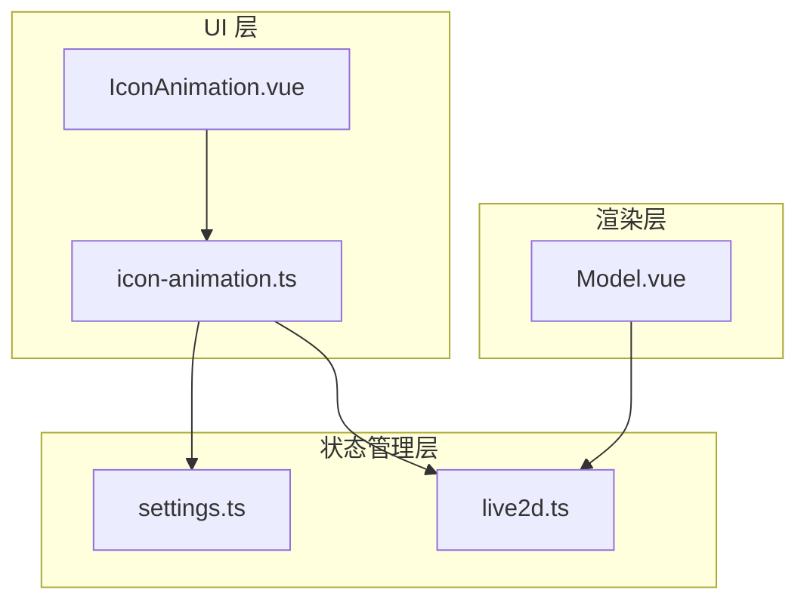
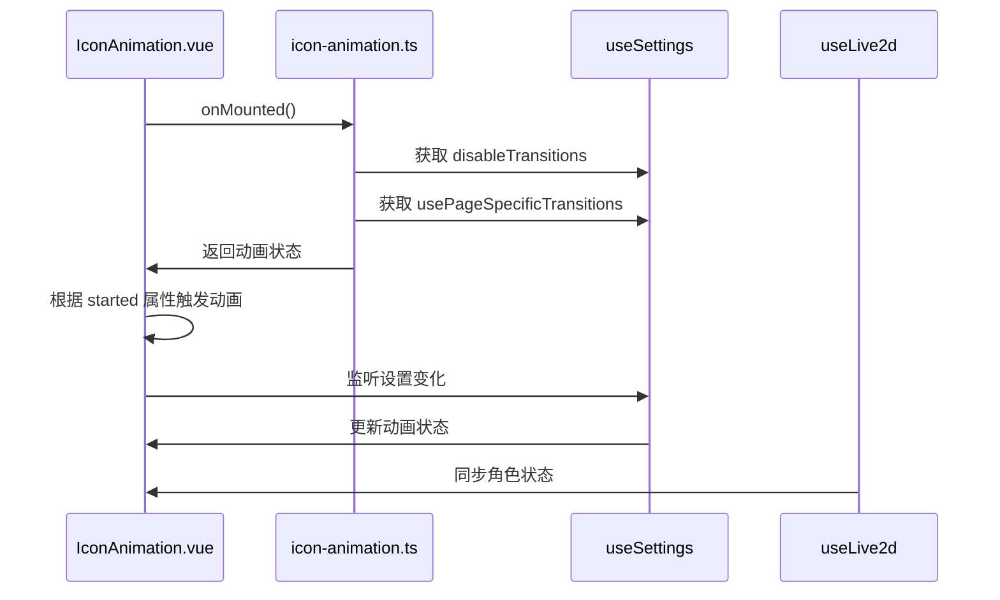
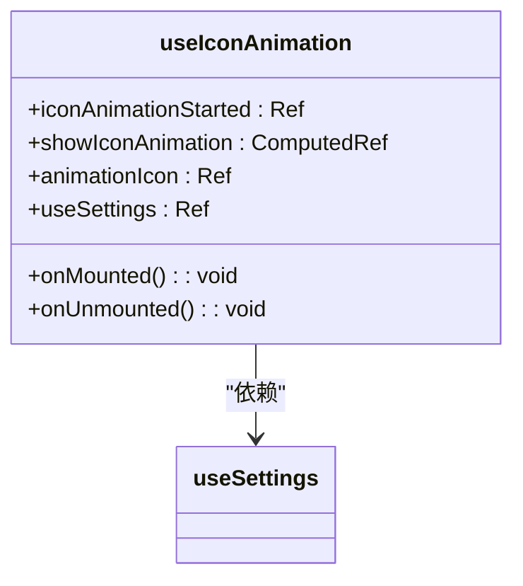
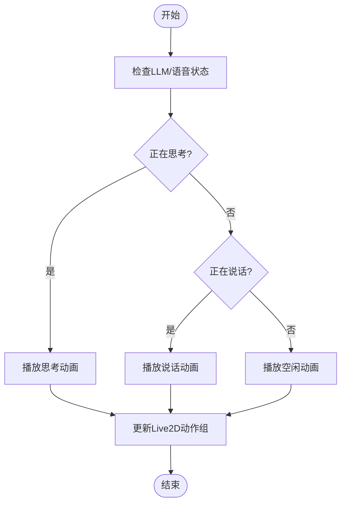
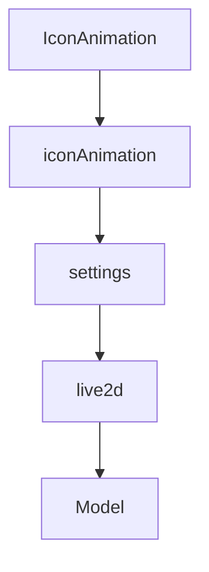

# 图标动画组件

<cite>
**本文档引用的文件**  
- [IconAnimation.vue](file://apps/stage-web/src/components/IconAnimation.vue)
- [icon-animation.ts](file://apps/stage-web/src/composables/icon-animation.ts)
- [settings.ts](file://packages/stage-ui/src/stores/settings.ts)
- [Model.vue](file://packages/stage-ui/src/components/scenes/live2d/Model.vue)
- [live2d.ts](file://packages/stage-ui/src/stores/live2d.ts)
</cite>

## 目录
1. [简介](#简介)
2. [项目结构](#项目结构)
3. [核心组件](#核心组件)
4. [架构概述](#架构概述)
5. [详细组件分析](#详细组件分析)
6. [依赖分析](#依赖分析)
7. [性能考虑](#性能考虑)
8. [故障排除指南](#故障排除指南)
9. [结论](#结论)

## 简介
图标动画组件（IconAnimation）是用于实现角色图标动态效果的核心模块，支持呼吸动画、状态指示（如思考、说话中）等视觉反馈。该组件通过与Live2D模型状态同步，实现动画的自动触发和控制。动画行为由核心状态管理系统驱动，能够根据LLM处理状态或语音合成状态动态调整。同时，组件考虑了可访问性需求，提供关闭动画的选项，并在非活动标签页中暂停动画以优化资源使用。

## 项目结构
图标动画功能分布在多个模块中，主要涉及UI组件和组合式API逻辑。核心实现位于`apps/stage-web/src/components`和`composables`目录下，而状态管理则由`packages/stage-ui`中的Pinia store统一处理。整体结构体现了关注点分离的设计原则，将动画逻辑、状态管理和UI渲染解耦。

**图表来源**  
- [IconAnimation.vue](file://apps/stage-web/src/components/IconAnimation.vue#L1-L77)
- [icon-animation.ts](file://apps/stage-web/src/composables/icon-animation.ts#L1-L30)
- [settings.ts](file://packages/stage-ui/src/stores/settings.ts#L1-L227)

**章节来源**  
- [IconAnimation.vue](file://apps/stage-web/src/components/IconAnimation.vue#L1-L77)
- [icon-animation.ts](file://apps/stage-web/src/composables/icon-animation.ts#L1-L30)

## 核心组件
图标动画组件由两个主要部分构成：`IconAnimation.vue`负责UI渲染和动画控制，`icon-animation.ts`提供组合式API封装。组件通过props接收动画配置参数，包括图标、尺寸、位置、持续时间、启动状态和颜色等。动画的开始和结束通过`started`属性和`animationEnded`事件进行通信。状态管理通过`useSettings` store实现，允许用户全局控制动画行为。

**章节来源**  
- [IconAnimation.vue](file://apps/stage-web/src/components/IconAnimation.vue#L1-L77)
- [icon-animation.ts](file://apps/stage-web/src/composables/icon-animation.ts#L1-L30)

## 架构概述
系统采用分层架构，上层为UI组件，中层为组合式逻辑，底层为状态管理。`IconAnimation`组件依赖`useIconAnimation` composable来管理动画状态，后者又依赖`useSettings` store获取用户偏好设置。当LLM处理或语音合成状态变化时，系统会更新相关状态，从而触发动画。Live2D模型的状态由`useLive2d` store管理，确保动画与角色行为同步。

**图表来源**  
- [icon-animation.ts](file://apps/stage-web/src/composables/icon-animation.ts#L1-L30)
- [settings.ts](file://packages/stage-ui/src/stores/settings.ts#L1-L227)
- [live2d.ts](file://packages/stage-ui/src/stores/live2d.ts#L1-L52)

## 详细组件分析

### 图标动画组件分析
`IconAnimation`组件使用Vue的过渡系统实现平滑动画效果。通过`watch`监听`started`属性的变化，在下一帧动画中启动动画。组件使用计算属性`clsAndProps`动态生成样式，包括透明度、尺寸、位置和颜色。动画结束通过监听`transitionend`事件判断，当所有相关CSS属性过渡完成后触发`animationEnded`事件。

#### 组件属性与配置
| 属性 | 类型 | 默认值 | 描述 |
|------|------|--------|------|
| icon | string | - | 图标类名 |
| iconSize | number | - | 图标尺寸（rem） |
| position | string | - | 初始位置（CSS transform） |
| duration | number | - | 动画持续时间（ms） |
| started | boolean | - | 是否开始动画 |
| textColor | string | - | 文本颜色类名 |
| isReverse | boolean | false | 是否反向动画 |
| zIndex | number | - | z-index值 |

**章节来源**  
- [IconAnimation.vue](file://apps/stage-web/src/components/IconAnimation.vue#L1-L77)

#### 组合式逻辑分析
`useIconAnimation` composable封装了动画的生命周期管理。在组件挂载时自动启动动画，并在卸载时清理状态。它依赖`useSettings` store中的`disableTransitions`和`usePageSpecificTransitions`设置来决定是否显示动画。这种设计使得动画行为可配置，同时保持了组件的复用性。

**图表来源**  
- [icon-animation.ts](file://apps/stage-web/src/composables/icon-animation.ts#L1-L30)
- [settings.ts](file://packages/stage-ui/src/stores/settings.ts#L1-L227)

**章节来源**  
- [icon-animation.ts](file://apps/stage-web/src/composables/icon-animation.ts#L1-L30)

### Live2D模型状态同步
图标动画与Live2D模型的状态保持同步，通过`useLive2d` store中的`currentMotion`状态反映角色当前行为。当角色进入"思考"或"说话中"状态时，Live2D模型会播放相应的动作组，同时图标动画组件可以响应这些状态变化。

**图表来源**  
- [live2d.ts](file://packages/stage-ui/src/stores/live2d.ts#L1-L52)
- [Model.vue](file://packages/stage-ui/src/components/scenes/live2d/Model.vue#L1-L423)

**章节来源**  
- [live2d.ts](file://packages/stage-ui/src/stores/live2d.ts#L1-L52)

## 依赖分析
组件依赖关系清晰，形成了稳定的数据流。`IconAnimation`直接依赖`icon-animation` composable，后者依赖`settings` store。`settings` store作为全局状态中心，被多个组件共享。这种依赖结构确保了状态的一致性，同时避免了组件间的直接耦合。

**图表来源**  
- [IconAnimation.vue](file://apps/stage-web/src/components/IconAnimation.vue#L1-L77)
- [icon-animation.ts](file://apps/stage-web/src/composables/icon-animation.ts#L1-L30)
- [settings.ts](file://packages/stage-ui/src/stores/settings.ts#L1-L227)
- [live2d.ts](file://packages/stage-ui/src/stores/live2d.ts#L1-L52)

**章节来源**  
- [IconAnimation.vue](file://apps/stage-web/src/components/IconAnimation.vue#L1-L77)
- [icon-animation.ts](file://apps/stage-web/src/composables/icon-animation.ts#L1-L30)

## 性能考虑
组件在性能方面做了多项优化。首先，通过`disableTransitions`设置允许用户完全关闭过渡动画，提升低端设备的性能。其次，动画使用CSS过渡而非JavaScript动画循环，利用浏览器的硬件加速。最后，组件在非活动状态时会自动停止不必要的计算，减少CPU占用。

## 故障排除指南
常见问题包括动画不触发、位置错误或与Live2D模型不同步。检查`started`属性是否正确更新，确认`duration`值是否合理，以及确保`useSettings` store中的相关设置未禁用动画。对于同步问题，验证`currentMotion`状态是否正确反映了角色行为。

**章节来源**  
- [IconAnimation.vue](file://apps/stage-web/src/components/IconAnimation.vue#L1-L77)
- [icon-animation.ts](file://apps/stage-web/src/composables/icon-animation.ts#L1-L30)

## 结论
图标动画组件通过合理的架构设计和状态管理，实现了角色图标的动态效果。组件具有良好的可配置性和可访问性，能够根据系统状态自动调整行为。与Live2D模型的同步机制确保了视觉反馈的一致性。未来可进一步优化动画性能，并增加更多状态指示类型。