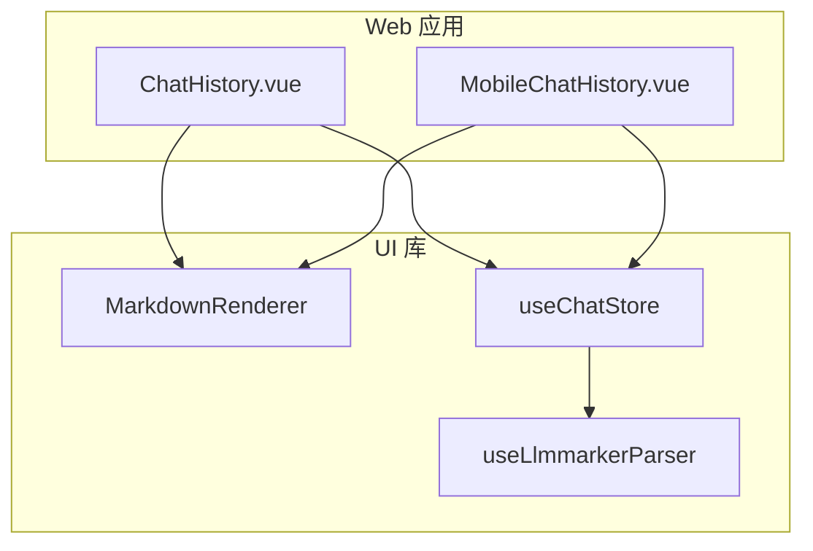
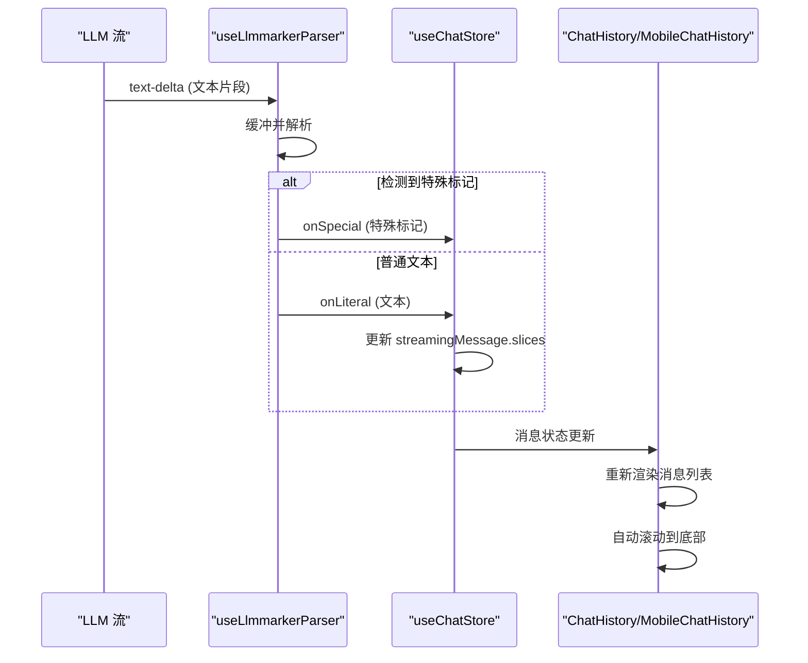
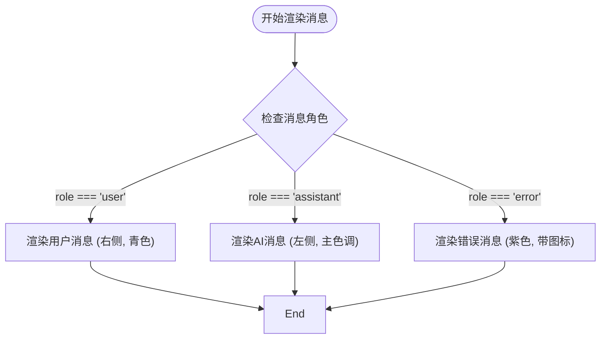
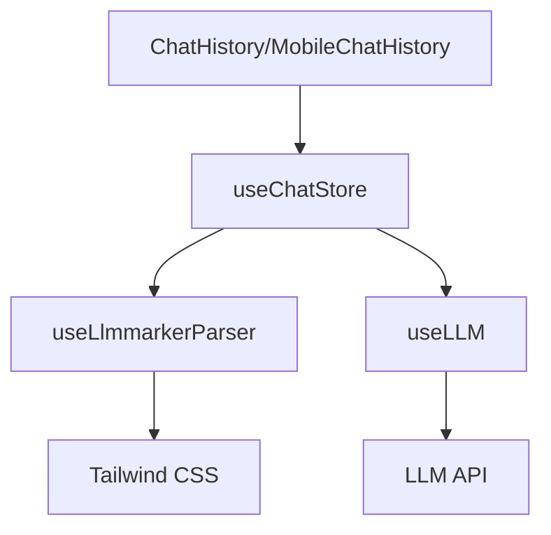

# 聊天历史记录组件

<cite>
**本文档中引用的文件**  
- [ChatHistory.vue](file://apps/stage-web/src/components/Widgets/ChatHistory.vue)
- [MobileChatHistory.vue](file://apps/stage-web/src/components/Widgets/MobileChatHistory.vue)
- [chat.ts](file://packages/stage-ui/src/stores/chat.ts)
- [llmmarkerParser.ts](file://packages/stage-ui/src/composables/llmmarkerParser.ts)
- [chat.ts](file://packages/stage-ui/src/types/chat.ts)
</cite>

## 目录
1. [介绍](#介绍)
2. [项目结构](#项目结构)
3. [核心组件](#核心组件)
4. [架构概述](#架构概述)
5. [详细组件分析](#详细组件分析)
6. [依赖分析](#依赖分析)
7. [性能考虑](#性能考虑)
8. [故障排除指南](#故障排除指南)
9. [结论](#结论)

## 介绍
本文件详细介绍了 `ChatHistory` 和 `MobileChatHistory` 组件的实现，这两个组件用于在 Web 和移动端应用中呈现响应式聊天界面。文档涵盖了消息列表渲染、用户与 AI 消息的样式区分、移动端适配策略、组件属性传递机制、事件处理、与 LLM 流式响应集成、渐进式文本渲染、Markdown 内容解析以及性能优化实践。

## 项目结构
`ChatHistory` 和 `MobileChatHistory` 组件位于 `apps/stage-web/src/components/Widgets/` 目录下，是 Web 应用的核心 UI 组件。它们依赖于 `packages/stage-ui` 包中的通用组件、存储和可组合函数，实现了跨平台的一致性。

**图示来源**
- [ChatHistory.vue](file://apps/stage-web/src/components/Widgets/ChatHistory.vue)
- [MobileChatHistory.vue](file://apps/stage-web/src/components/Widgets/MobileChatHistory.vue)
- [chat.ts](file://packages/stage-ui/src/stores/chat.ts)
- [llmmarkerParser.ts](file://packages/stage-ui/src/composables/llmmarkerParser.ts)

**章节来源**
- [ChatHistory.vue](file://apps/stage-web/src/components/Widgets/ChatHistory.vue)
- [MobileChatHistory.vue](file://apps/stage-web/src/components/Widgets/MobileChatHistory.vue)

## 核心组件
`ChatHistory` 和 `MobileChatHistory` 组件通过监听 `useChatStore` 中的消息状态变化，实现动态渲染聊天消息列表。它们利用 `v-for` 指令遍历 `messages` 数组，并根据消息的 `role` 属性（如 'user', 'assistant', 'error'）应用不同的样式和布局。

**章节来源**
- [ChatHistory.vue](file://apps/stage-web/src/components/Widgets/ChatHistory.vue#L43-L139)
- [MobileChatHistory.vue](file://apps/stage-web/src/components/Widgets/MobileChatHistory.vue#L43-L128)

## 架构概述
组件采用基于 Vue 3 的组合式 API 架构，通过 Pinia 管理全局聊天状态。`useChatStore` 提供了消息列表、发送状态和流式响应消息。`useLlmmarkerParser` 可组合函数负责解析来自 LLM 的流式文本，区分普通文本和特殊标记（如工具调用）。

**图示来源**
- [chat.ts](file://packages/stage-ui/src/stores/chat.ts#L142-L252)
- [llmmarkerParser.ts](file://packages/stage-ui/src/composables/llmmarkerParser.ts#L38-L87)
- [ChatHistory.vue](file://apps/stage-web/src/components/Widgets/ChatHistory.vue#L20-L35)

## 详细组件分析

### 组件分析
`ChatHistory` 和 `MobileChatHistory` 组件在功能上高度相似，主要区别在于样式和布局以适应不同设备。

#### 消息渲染与样式区分
组件通过 `v-if` 指令根据 `message.role` 渲染不同类型的消息。用户消息 (`role === 'user'`) 通常显示在右侧，使用青色背景；AI 助手消息 (`role === 'assistant'`) 显示在左侧，使用主色调背景；错误消息 (`role === 'error'`) 使用紫色背景并显示警告图标。消息气泡的阴影、圆角和内边距通过 Tailwind CSS 类进行精细控制。

**图示来源**
- [ChatHistory.vue](file://apps/stage-web/src/components/Widgets/ChatHistory.vue#L60-L120)
- [MobileChatHistory.vue](file://apps/stage-web/src/components/Widgets/MobileChatHistory.vue#L50-L110)

#### 移动端适配策略
`MobileChatHistory` 组件针对移动端进行了优化。它使用 `max-h="35dvh"` 限制最大高度，确保聊天历史不会占据整个屏幕。其父组件 `MobileInteractiveArea` 使用 `fixed bottom-0` 将其固定在屏幕底部。此外，它应用了 `-webkit-mask-image` 创建了一个从底部开始的渐变遮罩，当内容滚动时，底部的消息会逐渐模糊，提供视觉上的滚动提示。

**章节来源**
- [MobileChatHistory.vue](file://apps/stage-web/src/components/Widgets/MobileChatHistory.vue#L43-L128)
- [MobileInteractiveArea.vue](file://apps/stage-web/src/components/Layouts/MobileInteractiveArea.vue#L103-L110)

#### 组件 Props 与事件处理
组件本身不直接接收复杂的 props，而是通过 `useChatStore` 从 Pinia store 中获取 `messages` 数据源。加载状态由 `sending` 和 `streamingMessage` 状态控制。当 `sending` 为 `true` 且当前消息是最后一条时，会显示加载动画（`i-eos-icons:three-dots-loading`）。组件通过 `onBeforeMessageComposed` 和 `onTokenLiteral` 钩子处理事件，这些钩子在消息发送前和接收到流式文本时被触发，用于自动滚动到最新消息。

**章节来源**
- [ChatHistory.vue](file://apps/stage-web/src/components/Widgets/ChatHistory.vue#L18-L35)
- [chat.ts](file://packages/stage-ui/src/stores/chat.ts#L142-L185)

#### 与 LLM 流式响应集成
`useChatStore` 中的 `send` 方法是集成的核心。它调用 LLM 的 `stream` 方法，并在 `onStreamEvent` 回调中处理事件。当收到 `text-delta` 事件时，它将文本片段传递给 `useLlmmarkerParser`。该解析器会缓冲文本，并在检测到 `<|...|>` 标记时，将特殊内容（如工具调用）与普通文本分开处理。普通文本通过 `onLiteral` 钩子更新 `streamingMessage.slices`，实现渐进式渲染。

**章节来源**
- [chat.ts](file://packages/stage-ui/src/stores/chat.ts#L142-L252)
- [llmmarkerParser.ts](file://packages/stage-ui/src/composables/llmmarkerParser.ts)

#### Markdown 内容解析
对于渲染消息内容，两个组件都使用了 `MarkdownRenderer` 组件。该组件接收 `slice.text` 或 `message.content` 作为 `content` prop，并负责将 Markdown 语法（如粗体、斜体、代码块、链接）转换为相应的 HTML 元素，确保消息中的格式化文本能正确显示。

**章节来源**
- [ChatHistory.vue](file://apps/stage-web/src/components/Widgets/ChatHistory.vue#L78-L87)
- [MobileChatHistory.vue](file://apps/stage-web/src/components/Widgets/MobileChatHistory.vue#L65-L72)

#### 性能优化实践
- **自动滚动**: 利用 `nextTick` 在 DOM 更新后，将 `chatHistoryRef` 的 `scrollTop` 设置为 `scrollHeight`，确保新消息出现时视图自动滚动到底部。
- **虚拟滚动**: 虽然当前代码未直接实现虚拟滚动，但通过限制 `MobileChatHistory` 的最大高度和使用 `overflow-scroll`，可以有效管理大量消息的渲染性能。
- **懒加载**: 组件本身不直接处理图片或媒体内容的懒加载，但 `MarkdownRenderer` 组件可能在其内部实现中处理图片的懒加载。
- **触摸交互**: `MobileChatHistory` 的固定定位和适当的内边距（`px-3`, `pb-3`）确保了在触摸屏上的良好交互体验，避免了与系统控件的冲突。

**章节来源**
- [ChatHistory.vue](file://apps/stage-web/src/components/Widgets/ChatHistory.vue#L20-L35)
- [MobileChatHistory.vue](file://apps/stage-web/src/components/Widgets/MobileChatHistory.vue#L43-L128)

## 依赖分析
组件依赖关系清晰，形成了一个分层架构。UI 组件依赖于状态管理（Pinia store），而状态管理又依赖于业务逻辑（LLM 服务）和工具函数（解析器）。这种解耦设计使得组件易于维护和测试。

**图示来源**
- [ChatHistory.vue](file://apps/stage-web/src/components/Widgets/ChatHistory.vue)
- [MobileChatHistory.vue](file://apps/stage-web/src/components/Widgets/MobileChatHistory.vue)
- [chat.ts](file://packages/stage-ui/src/stores/chat.ts)

## 性能考虑
除了上述提到的自动滚动和布局优化，`useLlmmarkerParser` 中的 `minLiteralEmitLength` 选项（默认为24）是一个重要的性能优化。它避免了过于频繁地触发 `onLiteral` 钩子，减少了不必要的 DOM 更新，从而提升了流式响应期间的渲染性能。

## 故障排除指南
- **消息未自动滚动**: 检查 `chatHistoryRef` 是否正确绑定到 DOM 元素，并确认 `onTokenLiteral` 和 `onBeforeMessageComposed` 钩子是否被正确注册。
- **Markdown 未正确渲染**: 确认 `MarkdownRenderer` 组件已正确导入，并且传入的 `content` 是有效的 Markdown 字符串。
- **流式响应卡顿**: 检查 `minLiteralEmitLength` 的值是否过小，导致更新过于频繁。可以尝试增大该值。
- **移动端布局错乱**: 检查 `MobileChatHistory` 的父容器是否设置了正确的定位（如 `fixed`），并确认 `max-h` 和 `backdrop-blur` 等类名是否被正确应用。

**章节来源**
- [ChatHistory.vue](file://apps/stage-web/src/components/Widgets/ChatHistory.vue#L20-L35)
- [MobileChatHistory.vue](file://apps/stage-web/src/components/Widgets/MobileChatHistory.vue)

## 结论
`ChatHistory` 和 `MobileChatHistory` 组件通过巧妙地结合 Vue 3 的响应式系统、Pinia 状态管理、流式解析技术和 Tailwind CSS 的原子化样式，成功构建了一个功能完整、性能优良且用户体验良好的响应式聊天界面。其模块化的设计和清晰的依赖关系为未来的功能扩展和维护奠定了坚实的基础。