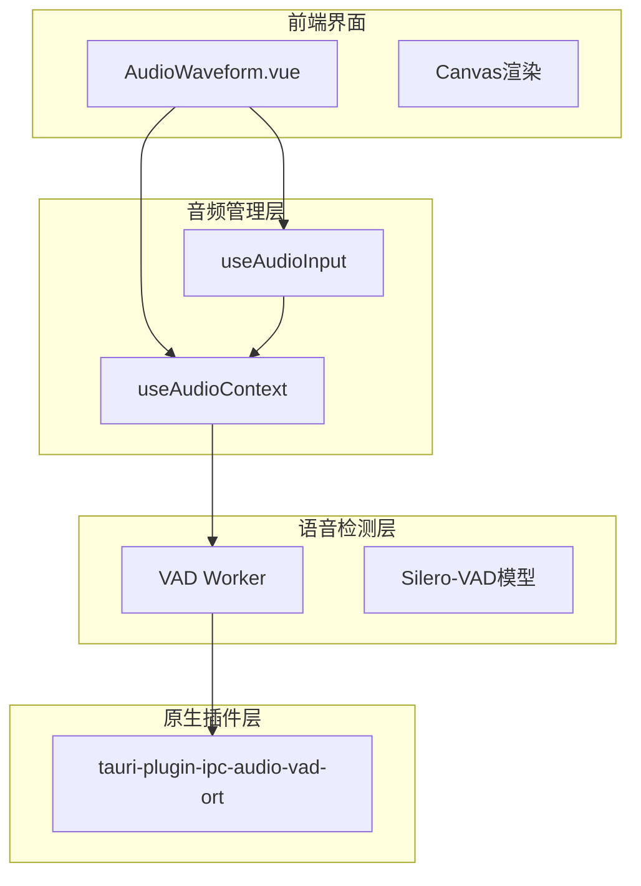
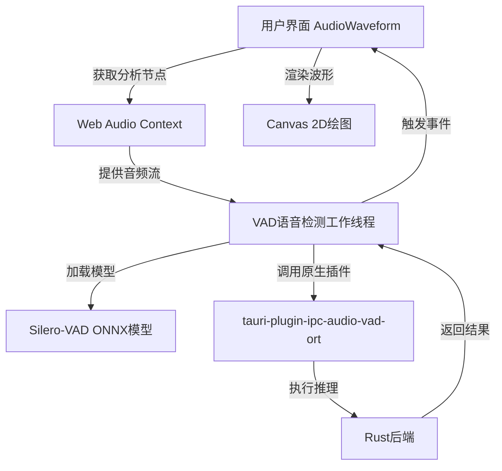
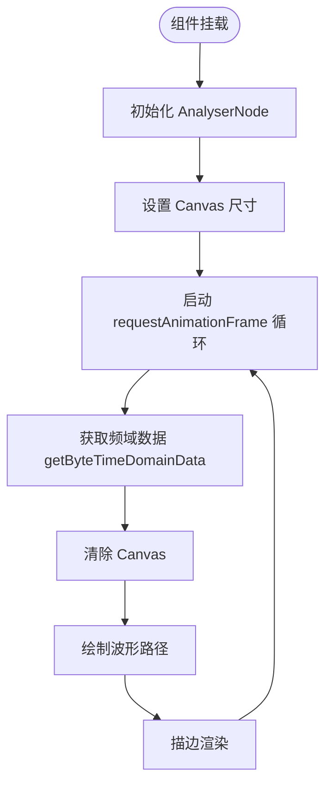
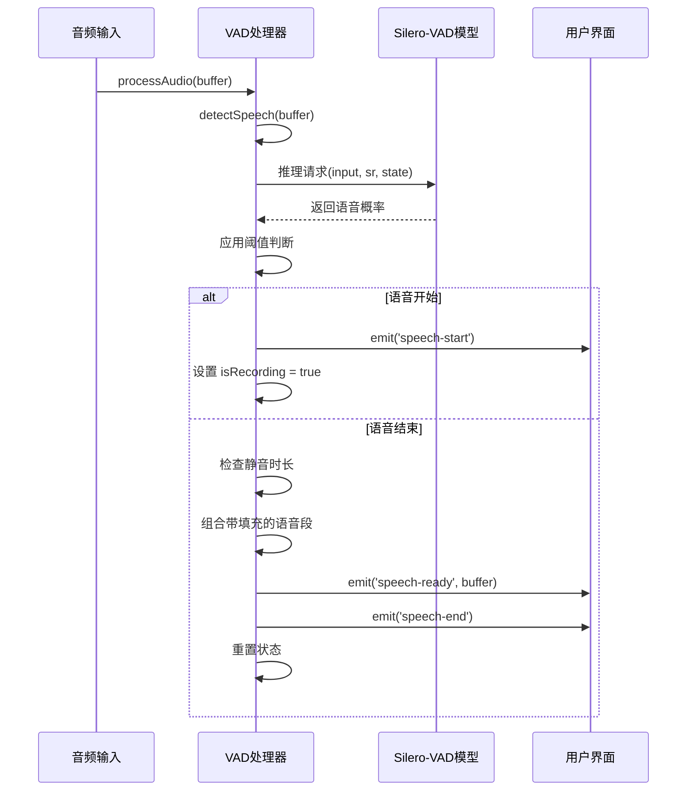
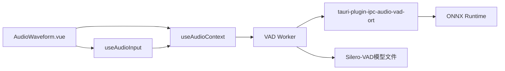

# 音频波形可视化组件

<cite>
**本文档引用文件**  
- [AudioWaveform.vue](file://apps/stage-web/src/components/AudioWaveform.vue)
- [audio.ts](file://packages/stage-ui/src/stores/audio.ts)
- [audio-input.ts](file://apps/stage-web/src/composables/audio-input.ts)
- [vad.ts](file://apps/stage-web/src/workers/vad/vad.ts)
- [manager.ts](file://apps/stage-web/src/workers/vad/manager.ts)
- [vad.ts](file://packages/stage-ui/src/workers/vad/vad.ts)
- [vad.ts](file://crates/tauri-plugin-ipc-audio-vad-ort/src/lib.rs)
</cite>

## 目录
1. [简介](#简介)
2. [项目结构](#项目结构)
3. [核心组件](#核心组件)
4. [架构概述](#架构概述)
5. [详细组件分析](#详细组件分析)
6. [依赖分析](#依赖分析)
7. [性能考量](#性能考量)
8. [故障排除指南](#故障排除指南)
9. [结论](#结论)

## 简介
本技术文档深入解析AudioWaveform组件的设计与实现机制。该组件利用Web Audio API的AnalyserNode实时分析音频频谱数据，并通过Canvas高效渲染动态波形。文档详细阐述其与VAD（语音活动检测）系统的集成方式，展示如何将音频流传递给tauri-plugin-ipc-audio-vad-ort插件进行实时语音检测，并将检测结果可视化为波形强度变化。同时涵盖配置选项、性能优化策略及低性能设备的降级处理方案。

## 项目结构
AudioWaveform组件位于前端应用`stage-web`中，作为独立的Vue组件实现。其功能依赖于全局音频上下文管理、音频输入采集以及独立的VAD语音检测工作线程。整体结构呈现分层设计，前端可视化与后端音频处理分离。



**图示来源**  
- [AudioWaveform.vue](file://apps/stage-web/src/components/AudioWaveform.vue)
- [audio.ts](file://packages/stage-ui/src/stores/audio.ts)
- [audio-input.ts](file://apps/stage-web/src/composables/audio-input.ts)
- [vad.ts](file://apps/stage-web/src/workers/vad/vad.ts)

**本节来源**  
- [apps/stage-web/src/components](file://apps/stage-web/src/components)
- [packages/stage-ui/src/stores](file://packages/stage-ui/src/stores)
- [apps/stage-web/src/workers/vad](file://apps/stage-web/src/workers/vad)

## 核心组件
AudioWaveform组件是系统中负责音频可视化的核心UI元素。它通过Web Audio API的AnalyserNode获取实时音频数据，并使用Canvas进行高效绘制。组件与全局音频上下文（useAudioContext）紧密集成，确保音频分析的实时性。同时，它通过VAD系统接收语音活动状态，动态调整波形的视觉表现，实现语音检测的可视化反馈。

**本节来源**  
- [AudioWaveform.vue](file://apps/stage-web/src/components/AudioWaveform.vue)
- [audio.ts](file://packages/stage-ui/src/stores/audio.ts)

## 架构概述
系统采用分层架构，从用户界面到原生插件，各层职责分明。前端组件负责数据可视化，中间层处理音频流和语音检测逻辑，底层原生插件提供高性能的机器学习推理能力。



**图示来源**  
- [AudioWaveform.vue](file://apps/stage-web/src/components/AudioWaveform.vue)
- [vad.ts](file://apps/stage-web/src/workers/vad/vad.ts)
- [lib.rs](file://crates/tauri-plugin-ipc-audio-vad-ort/src/lib.rs)

## 详细组件分析

### AudioWaveform 组件分析
该组件是音频可视化的核心，利用Canvas实时绘制音频波形。

#### 组件工作流程


**图示来源**  
- [AudioWaveform.vue](file://apps/stage-web/src/components/AudioWaveform.vue#L50-L90)

**本节来源**  
- [AudioWaveform.vue](file://apps/stage-web/src/components/AudioWaveform.vue)

### VAD 语音检测系统分析
VAD（Voice Activity Detection）系统负责实时检测音频流中的语音活动，是实现智能音频交互的关键。

#### VAD 类结构
```mermaid
classDiagram
class VAD {
-config : BaseVADConfig
-model : PreTrainedModel
-state : Tensor
-sampleRateTensor : Tensor
-buffer : Float32Array
-bufferPointer : number
-isRecording : boolean
-prevBuffers : Float32Array[]
+initialize() : Promise~void~
+processAudio(inputBuffer : Float32Array) : Promise~void~
+on(event, callback) : void
+off(event, callback) : void
+updateConfig(newConfig) : void
}
class BaseVADConfig {
+sampleRate : number
+speechThreshold : number
+exitThreshold : number
+minSilenceDurationMs : number
+speechPadMs : number
+minSpeechDurationMs : number
+maxBufferDuration : number
+newBufferSize : number
}
class VADEvents {
+speech-start : void
+speech-end : void
+speech-ready : {buffer : Float32Array, duration : number}
+status : {type : string, message : string}
+debug : {message : string, data? : any}
}
VAD --> BaseVADConfig : "使用"
VAD --> VADEvents : "触发"
```

**图示来源**  
- [vad.ts](file://apps/stage-web/src/workers/vad/vad.ts#L8-L267)
- [vad.ts](file://packages/stage-ui/src/libs/audio/vad.ts#L0-L30)

#### 语音检测流程


**图示来源**  
- [vad.ts](file://apps/stage-web/src/workers/vad/vad.ts#L100-L250)

**本节来源**  
- [vad.ts](file://apps/stage-web/src/workers/vad/vad.ts)
- [vad.ts](file://packages/stage-ui/src/workers/vad/vad.ts)

## 依赖分析
系统依赖关系清晰，从前端到后端形成完整链条。



**图示来源**  
- [AudioWaveform.vue](file://apps/stage-web/src/components/AudioWaveform.vue)
- [vad.ts](file://apps/stage-web/src/workers/vad/vad.ts)
- [lib.rs](file://crates/tauri-plugin-ipc-audio-vad-ort/src/lib.rs)

**本节来源**  
- [go.mod](file://Cargo.toml)
- [package.json](file://apps/stage-web/package.json)

## 性能考量
AudioWaveform组件在设计时充分考虑了性能关键点，确保在各种设备上都能流畅运行。

- **音频采样率优化**：VAD系统默认使用16kHz采样率，在保证语音识别精度的同时，降低了计算负载。
- **内存管理**：VAD类中使用`Float32Array`作为缓冲区，并通过`reset()`方法及时清理，避免内存泄漏。`inferenceChain`的链式调用确保了推理请求的串行化，防止并发导致的资源竞争。
- **低性能设备降级**：可通过配置`maxBufferDuration`和`newBufferSize`参数，减小缓冲区大小，降低内存占用和计算压力。在极端情况下，可选择关闭VAD功能，仅保留基础波形显示。
- **渲染效率**：使用`requestAnimationFrame`进行动画循环，确保渲染与屏幕刷新率同步，避免不必要的重绘。Canvas 2D绘图针对波形显示进行了优化，使用`beginPath`、`moveTo`、`lineTo`等低开销操作。

**本节来源**  
- [vad.ts](file://apps/stage-web/src/workers/vad/vad.ts)
- [AudioWaveform.vue](file://apps/stage-web/src/components/AudioWaveform.vue)

## 故障排除指南
当遇到音频波形不显示或VAD无响应时，请按以下步骤排查：

1.  **检查权限**：确保浏览器已授予麦克风访问权限。`useAudioInput`组件负责处理权限请求。
2.  **验证音频上下文**：确认`useAudioContext`已正确初始化，`AudioContext`处于运行状态（非`suspended`）。
3.  **检查VAD模型加载**：查看浏览器控制台，确认`onnx-community/silero-vad`模型是否成功从网络加载。失败可能由网络问题或CORS策略引起。
4.  **调试VAD事件**：监听VAD实例的`'debug'`事件，检查`VAD score`的输出，确认语音概率值是否随声音变化。
5.  **验证插件连接**：如果使用原生插件，检查`tauri-plugin-ipc-audio-vad-ort`是否正确安装并能在Rust后端接收到消息。

**本节来源**  
- [vad.ts](file://apps/stage-web/src/workers/vad/vad.ts#L50-L60)
- [audio-input.ts](file://apps/stage-web/src/composables/audio-input.ts)

## 结论
AudioWaveform组件通过精巧的架构设计，实现了高性能的音频波形可视化与实时语音活动检测。它利用Web Audio API进行音频分析，结合ONNX.js在浏览器中运行Silero-VAD模型，并通过清晰的事件系统与UI层通信。该组件不仅提供了直观的视觉反馈，还为后续的语音识别、交互控制等高级功能奠定了坚实基础。其模块化的设计和丰富的配置选项，使其能够灵活适应不同的应用场景和性能需求。