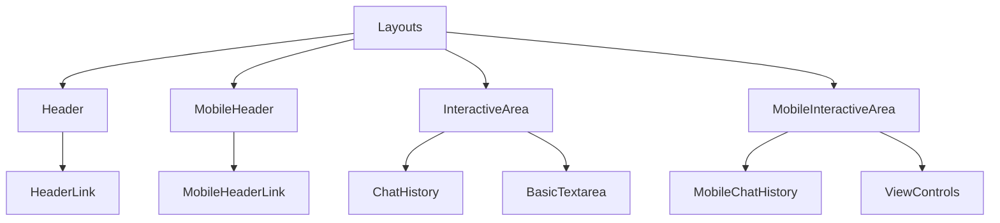
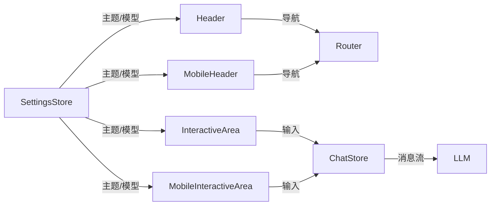
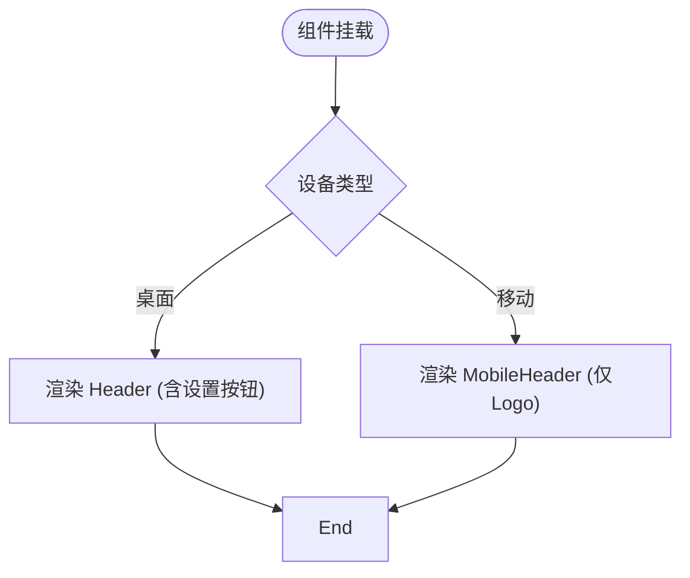
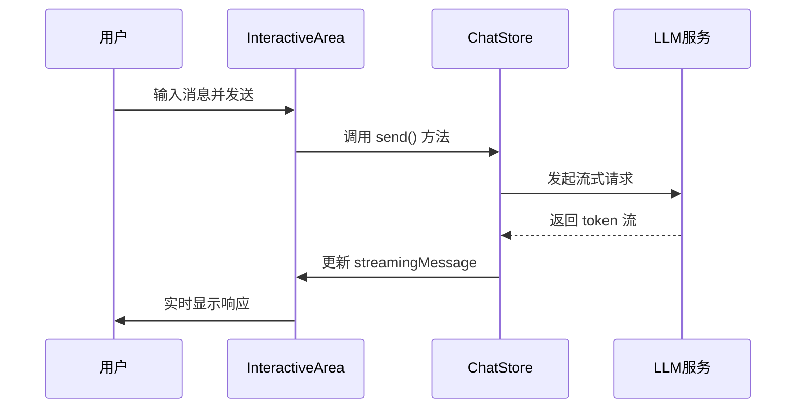
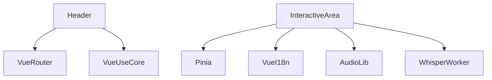

# 布局组件

<cite>
**本文档引用文件**  
- [Header.vue](file://apps/stage-web/src/components/Layouts/Header.vue)
- [MobileHeader.vue](file://apps/stage-web/src/components/Layouts/MobileHeader.vue)
- [InteractiveArea.vue](file://apps/stage-web/src/components/Layouts/InteractiveArea.vue)
- [MobileInteractiveArea.vue](file://apps/stage-web/src/components/Layouts/MobileInteractiveArea.vue)
- [HeaderLink.vue](file://apps/stage-web/src/components/Layouts/HeaderLink.vue)
- [MobileHeaderLink.vue](file://apps/stage-web/src/components/Layouts/MobileHeaderLink.vue)
- [settings.ts](file://packages/stage-ui/src/stores/settings.ts)
- [chat.ts](file://packages/stage-ui/src/stores/chat.ts)
- [micvad.ts](file://packages/stage-ui/src/composables/micvad.ts)
- [whisper.ts](file://packages/stage-ui/src/composables/whisper.ts)
</cite>

## 目录
1. [简介](#简介)
2. [项目结构](#项目结构)
3. [核心组件](#核心组件)
4. [架构概览](#架构概览)
5. [详细组件分析](#详细组件分析)
6. [依赖关系分析](#依赖关系分析)
7. [性能考量](#性能考量)
8. [故障排查指南](#故障排查指南)
9. [结论](#结论)

## 简介
本文档深入解析 `stage-web` 应用中的布局组件，重点分析 `Header`、`InteractiveArea` 及其移动端对应组件 `MobileHeader` 和 `MobileInteractiveArea` 的结构与行为。文档涵盖响应式适配机制、插槽集成、全局状态管理（Pinia）交互、组件通信模式、自定义布局方法、可复用模板及无障碍访问最佳实践。

## 项目结构
`stage-web` 的布局组件位于 `src/components/Layouts` 目录下，采用模块化设计，区分桌面端与移动端的UI逻辑。核心布局组件包括头部导航与交互区域，通过插槽机制集成子组件，并利用Pinia进行状态管理。

**Diagram sources**
- [Header.vue](file://apps/stage-web/src/components/Layouts/Header.vue)
- [MobileHeader.vue](file://apps/stage-web/src/components/Layouts/MobileHeader.vue)
- [InteractiveArea.vue](file://apps/stage-web/src/components/Layouts/InteractiveArea.vue)
- [MobileInteractiveArea.vue](file://apps/stage-web/src/components/Layouts/MobileInteractiveArea.vue)

**Section sources**
- [Header.vue](file://apps/stage-web/src/components/Layouts/Header.vue)
- [MobileHeader.vue](file://apps/stage-web/src/components/Layouts/MobileHeader.vue)
- [InteractiveArea.vue](file://apps/stage-web/src/components/Layouts/InteractiveArea.vue)
- [MobileInteractiveArea.vue](file://apps/stage-web/src/components/Layouts/MobileInteractiveArea.vue)

## 核心组件
`Header` 和 `InteractiveArea` 是桌面端核心布局组件，分别负责导航与用户交互。`MobileHeader` 和 `MobileInteractiveArea` 为移动端优化版本，适配触摸操作与小屏幕布局。所有组件通过Pinia共享状态，并响应设备尺寸变化。

**Section sources**
- [Header.vue](file://apps/stage-web/src/components/Layouts/Header.vue)
- [InteractiveArea.vue](file://apps/stage-web/src/components/Layouts/InteractiveArea.vue)
- [MobileHeader.vue](file://apps/stage-web/src/components/Layouts/MobileHeader.vue)
- [MobileInteractiveArea.vue](file://apps/stage-web/src/components/Layouts/MobileInteractiveArea.vue)

## 架构概览
布局组件采用响应式设计，通过CSS断点和Vue的条件渲染区分桌面与移动端UI。组件间通过Pinia存储共享状态（如主题、语言、模型设置），并通过事件触发交互逻辑（如发送消息、清理对话）。

**Diagram sources**
- [Header.vue](file://apps/stage-web/src/components/Layouts/Header.vue)
- [InteractiveArea.vue](file://apps/stage-web/src/components/Layouts/InteractiveArea.vue)
- [MobileHeader.vue](file://apps/stage-web/src/components/Layouts/MobileHeader.vue)
- [MobileInteractiveArea.vue](file://apps/stage-web/src/components/Layouts/MobileInteractiveArea.vue)
- [settings.ts](file://packages/stage-ui/src/stores/settings.ts)
- [chat.ts](file://packages/stage-ui/src/stores/chat.ts)

## 详细组件分析

### Header 与 MobileHeader 分析
`Header` 组件包含品牌Logo和设置链接，使用 `useDark` 实现主题切换。`MobileHeader` 简化了布局，仅保留Logo，将设置等操作移至 `InteractiveArea`。

#### 响应式适配
组件通过CSS类 `w-full` 和 `gap-2` 实现弹性布局，`<md:` 断点控制移动端隐藏部分元素。

**Diagram sources**
- [Header.vue](file://apps/stage-web/src/components/Layouts/Header.vue)
- [MobileHeader.vue](file://apps/stage-web/src/components/Layouts/MobileHeader.vue)

**Section sources**
- [Header.vue](file://apps/stage-web/src/components/Layouts/Header.vue)
- [MobileHeader.vue](file://apps/stage-web/src/components/Layouts/MobileHeader.vue)

### InteractiveArea 与 MobileInteractiveArea 分析
`InteractiveArea` 提供完整的聊天界面，包含聊天历史、文本输入框和控制按钮。`MobileInteractiveArea` 针对移动端优化，采用固定底部布局，集成视图控制。

#### 插槽与子组件集成
通过 `<ChatHistory>` 和 `<BasicTextarea>` 等子组件实现功能模块化，利用插槽机制允许内容定制。

#### 全局状态管理交互
组件通过 `useChatStore` 和 `useSettings` 访问Pinia存储，实现消息发送、主题切换、模型设置等功能。

**Diagram sources**
- [InteractiveArea.vue](file://apps/stage-web/src/components/Layouts/InteractiveArea.vue)
- [MobileInteractiveArea.vue](file://apps/stage-web/src/components/Layouts/MobileInteractiveArea.vue)
- [chat.ts](file://packages/stage-ui/src/stores/chat.ts)

**Section sources**
- [InteractiveArea.vue](file://apps/stage-web/src/components/Layouts/InteractiveArea.vue)
- [MobileInteractiveArea.vue](file://apps/stage-web/src/components/Layouts/MobileInteractiveArea.vue)
- [chat.ts](file://packages/stage-ui/src/stores/chat.ts)

#### 组件通信模式
- **事件总线**: 使用 `onMounted` 和 `watch` 监听状态变化，触发相应逻辑。
- **provide/inject**: 通过Pinia的 `defineStore` 实现全局状态注入，组件直接访问存储实例。

## 依赖关系分析
布局组件依赖多个核心模块，包括Pinia状态管理、Vue Router、Vue I18n以及音视频处理库。依赖关系清晰，耦合度适中。

**Diagram sources**
- [Header.vue](file://apps/stage-web/src/components/Layouts/Header.vue)
- [InteractiveArea.vue](file://apps/stage-web/src/components/Layouts/InteractiveArea.vue)
- [package.json](file://apps/stage-web/package.json)

**Section sources**
- [Header.vue](file://apps/stage-web/src/components/Layouts/Header.vue)
- [InteractiveArea.vue](file://apps/stage-web/src/components/Layouts/InteractiveArea.vue)

## 性能考量
- **懒加载**: Web Worker (`WhisperWorker`) 按需加载，避免阻塞主线程。
- **状态持久化**: 使用 `useLocalStorage` 缓存设置，减少重复计算。
- **资源管理**: 在组件卸载时 (`onUnmounted`) 清理URL对象和Web Worker，防止内存泄漏。

## 故障排查指南
- **麦克风无法访问**: 检查 `useSettingsAudioDevice` 中的权限请求逻辑。
- **消息发送失败**: 查看 `chat.ts` 中的 `send` 方法错误处理。
- **主题不生效**: 确认 `themeColorsHueDynamic` 设置及CSS变量应用。

**Section sources**
- [settings.ts](file://packages/stage-ui/src/stores/settings.ts)
- [chat.ts](file://packages/stage-ui/src/stores/chat.ts)
- [micvad.ts](file://packages/stage-ui/src/composables/micvad.ts)

## 结论
`stage-web` 的布局组件设计合理，实现了桌面与移动端的优雅适配。通过Pinia实现高效的状态管理，结合响应式设计和模块化组件，提供了良好的可维护性和扩展性。未来可进一步优化移动端交互流畅度和无障碍访问支持。