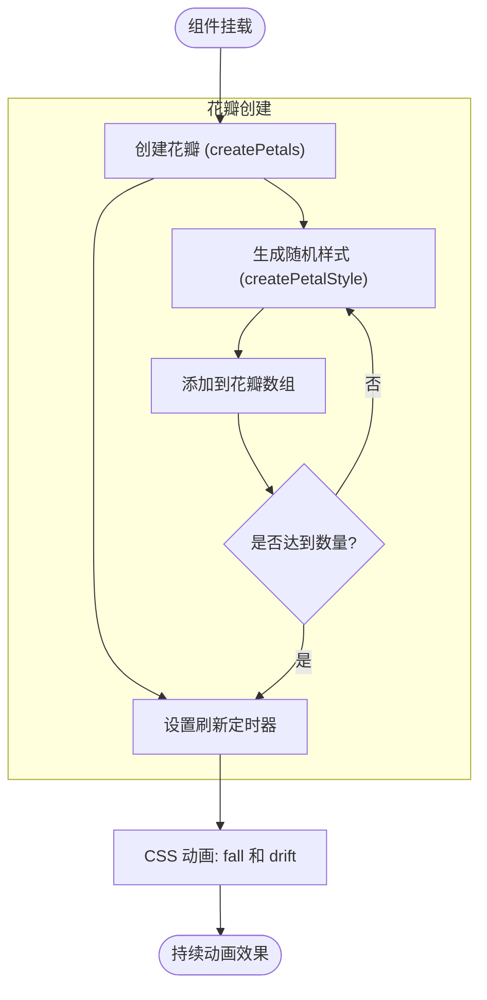
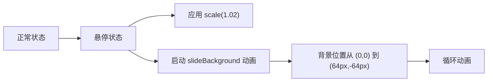
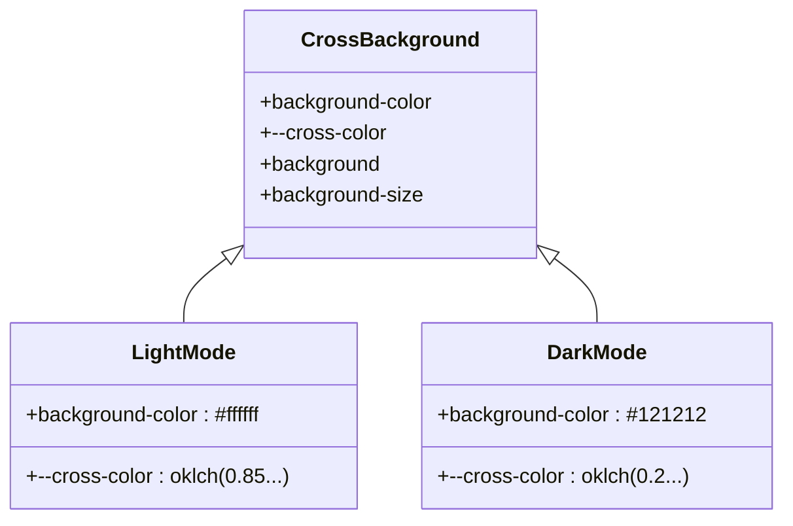
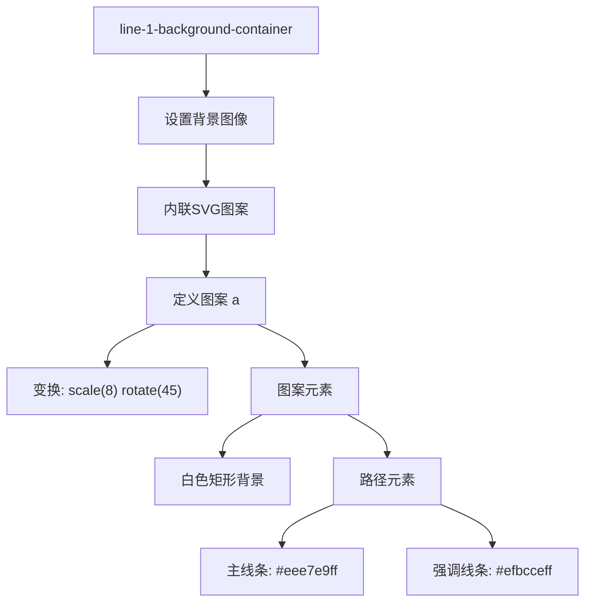

# 背景组件

<cite>
**Referenced Files in This Document**  
- [SakuraPetal.vue](file://apps/stage-web/src/components/Backgrounds/SakuraPetal.vue)
- [TicTacToe.vue](file://apps/stage-web/src/components/Backgrounds/TicTacToe.vue)
- [Cross.vue](file://apps/stage-web/src/components/Backgrounds/Cross.vue)
- [Line1.vue](file://apps/stage-web/src/components/Backgrounds/Line1.vue)
</cite>

## 目录
1. [简介](#简介)
2. [核心组件](#核心组件)
3. [详细组件分析](#详细组件分析)
   - [樱花飘落 (SakuraPetal)](#樱花飘落-sakurapetal)
   - [井字棋动画 (TicTacToe)](#井字棋动画-tictactoe)
   - [交叉线背景 (Cross)](#交叉线背景-cross)
   - [线条流动 (Line1)](#线条流动-line1)
4. [集成最佳实践](#集成最佳实践)
5. [性能优化建议](#性能优化建议)

## 简介
本文档详细介绍了 `stage-web` 项目中的视觉装饰性背景组件，包括樱花飘落、井字棋动画、交叉线背景和线条流动等组件。这些组件通过 CSS 和 Vue.js 实现，为应用界面提供了丰富的视觉效果和动态体验。

## 核心组件
`stage-web` 的背景组件位于 `apps/stage-web/src/components/Backgrounds` 目录下，主要包括四种视觉装饰性组件：樱花飘落（SakuraPetal）、井字棋动画（TicTacToe）、交叉线背景（Cross）和线条流动（Line1）。这些组件均采用 Vue 3 的 `<script setup>` 语法，通过 CSS 变量、SVG 背景和动画效果实现视觉效果。

**Section sources**
- [SakuraPetal.vue](file://apps/stage-web/src/components/Backgrounds/SakuraPetal.vue)
- [TicTacToe.vue](file://apps/stage-web/src/components/Backgrounds/TicTacToe.vue)
- [Cross.vue](file://apps/stage-web/src/components/Backgrounds/Cross.vue)
- [Line1.vue](file://apps/stage-web/src/components/Backgrounds/Line1.vue)

## 详细组件分析

### 樱花飘落 (SakuraPetal)

SakuraPetal 组件实现了樱花花瓣飘落的动画效果，通过 JavaScript 动态生成花瓣元素并结合 CSS 动画实现自然的飘落效果。

#### Props 配置项
- `petalCount`：花瓣数量，默认值 20
- `refreshInterval`：花瓣刷新间隔（毫秒），默认值 30000
- `baseColor`：花瓣基础颜色，默认值 `#FFB6C1`（浅粉色）

#### 功能机制
组件在挂载时创建指定数量的花瓣，每个花瓣具有随机的位置、大小、旋转角度和动画时长。通过 `setInterval` 定期刷新花瓣，保持动画的持续性。花瓣的飘落动画由两个关键帧动画组成：`fall` 控制垂直下落，`drift` 控制水平飘动。

#### 插槽使用
组件支持默认插槽，允许在背景之上放置其他内容。



**Diagram sources**
- [SakuraPetal.vue](file://apps/stage-web/src/components/Backgrounds/SakuraPetal.vue#L30-L60)

**Section sources**
- [SakuraPetal.vue](file://apps/stage-web/src/components/Backgrounds/SakuraPetal.vue#L1-L166)

### 井字棋动画 (TicTacToe)

TicTacToe 组件通过 SVG 背景图案实现井字棋风格的装饰性背景，支持悬停动画效果。

#### Props 配置
该组件目前未定义 props，完全通过 CSS 实现视觉效果。

#### 动画机制
组件使用 data URL 内联的 SVG 作为背景图像，图案包含井字棋的 X 和 O 符号。当用户悬停在组件上时，触发 `slideBackground` 关键帧动画，使背景图案平滑移动，创造动态视觉效果。

#### 交互特性
- 悬停时应用 `scale(1.02)` 变换，产生轻微放大效果
- 同时启动背景滑动动画，增强交互感



**Diagram sources**
- [TicTacToe.vue](file://apps/stage-web/src/components/Backgrounds/TicTacToe.vue#L25-L35)

**Section sources**
- [TicTacToe.vue](file://apps/stage-web/src/components/Backgrounds/TicTacToe.vue#L1-L34)

### 交叉线背景 (Cross)

Cross 组件使用 CSS 渐变和径向渐变创建复杂的交叉线图案背景，支持深色/浅色模式切换。

#### 样式机制
组件通过多个 CSS 背景层叠加实现交叉线效果：
1. 两个 `radial-gradient` 创建圆形网格基础
2. 两个 `linear-gradient` 创建水平和垂直的交叉线

#### 主题支持
组件通过 CSS 类选择器支持深色模式：
- 浅色模式：背景色 `#ffffff`，线条色使用 `oklch` 颜色模型
- 深色模式：背景色 `#121212`，线条色相应调整

#### CSS 变量
- `--cross-color`：交叉线颜色，基于 `--chromatic-chroma` 和 `--chromatic-hue` 变量计算



**Diagram sources**
- [Cross.vue](file://apps/stage-web/src/components/Backgrounds/Cross.vue#L10-L40)

**Section sources**
- [Cross.vue](file://apps/stage-web/src/components/Backgrounds/Cross.vue#L1-L41)

### 线条流动 (Line1)

Line1 组件使用 SVG 模式创建对角线流动的背景效果。

#### SVG 背景
组件通过 data URL 内联一个复杂的 SVG 图案：
- 图案单元大小：40×40 像素
- 使用 `patternTransform` 进行缩放（scale(8)）和旋转（rotate(45)）
- 包含多条不同颜色和粗细的线条

#### 视觉效果
- 主线条：浅灰色（`#eee7e9ff`），构成基础网格
- 强调线条：粉红色（`#efbcceff`），突出显示特定路径
- 45度对角线排列，创造流动感



**Diagram sources**
- [Line1.vue](file://apps/stage-web/src/components/Backgrounds/Line1.vue#L10-L15)

**Section sources**
- [Line1.vue](file://apps/stage-web/src/components/Backgrounds/Line1.vue#L1-L16)

## 集成最佳实践

### 布局集成
1. **全屏背景**：将背景组件作为页面最外层容器，确保覆盖整个视口
2. **区域装饰**：在特定区域（如页眉、侧边栏）使用背景组件增加视觉层次
3. **叠加使用**：可以组合多个背景组件，但需注意性能影响

### 动态控制
通过 CSS 变量或 JavaScript 可以动态控制动画参数：

```javascript
// 动态修改樱花颜色
const sakuraComponent = document.querySelector('.sakura-container');
sakuraComponent.style.setProperty('--base-color', '#FF69B4');
```

### 响应式设计
确保背景组件在不同屏幕尺寸下表现良好：
- 使用相对单位（百分比、vh、vw）
- 考虑移动设备的性能限制
- 在小屏幕上简化或禁用复杂动画

## 性能优化建议

### Canvas 渲染替代
对于复杂的动画效果（如樱花飘落），考虑使用 Canvas 替代 DOM 元素：
- 减少 DOM 节点数量
- 提高渲染性能
- 更好的动画控制

### Web Worker 处理
将复杂的计算任务（如粒子系统模拟）移至 Web Worker：
- 避免阻塞主线程
- 保持 UI 响应性
- 支持更复杂的动画逻辑

### 动画优化
1. **使用 transform 和 opacity**：这些属性由 GPU 加速，性能更好
2. **限制动画元素数量**：特别是在移动设备上
3. **按需启动动画**：仅在组件可见时运行动画
4. **使用 requestAnimationFrame**：替代 setInterval 以获得更流畅的动画

### 资源管理
1. **懒加载**：对于非关键路径的背景组件，延迟加载
2. **内存管理**：及时清理定时器和事件监听器
3. **缓存 SVG**：避免重复解析内联 SVG

通过合理使用这些背景组件并遵循性能优化建议，可以为应用创建既美观又高效的视觉体验。