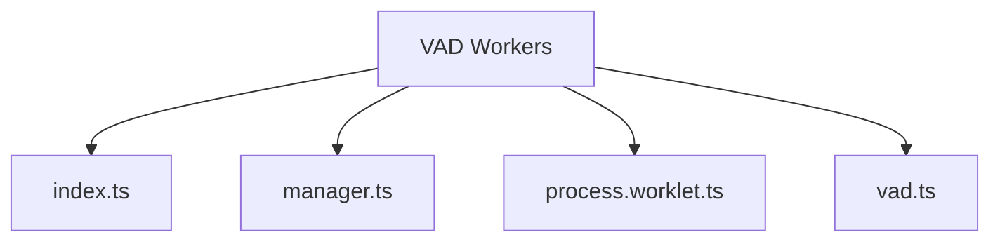
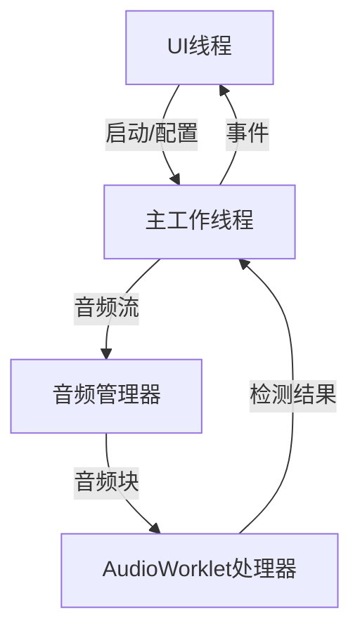
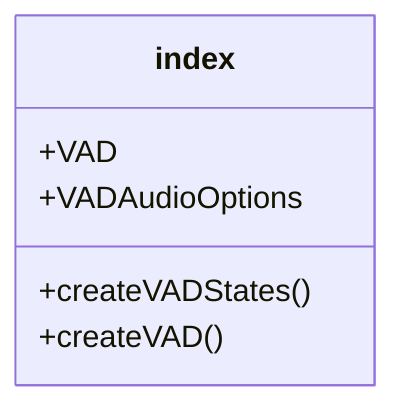
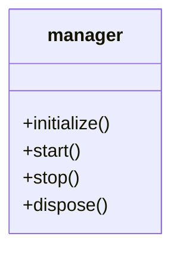
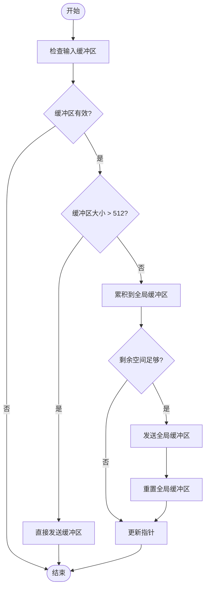
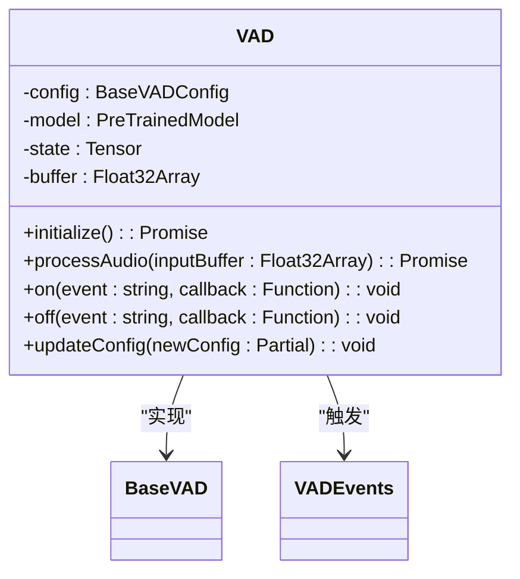
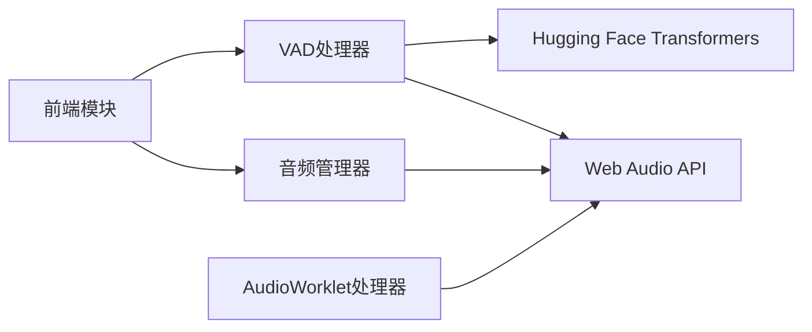

# Web Workers

<cite>
**Referenced Files in This Document**  
- [index.ts](file://apps/stage-web/src/workers/vad/index.ts)
- [manager.ts](file://apps/stage-web/src/workers/vad/manager.ts)
- [process.worklet.ts](file://apps/stage-web/src/workers/vad/process.worklet.ts)
- [vad.ts](file://apps/stage-web/src/workers/vad/vad.ts)
- [audio-input.ts](file://apps/stage-web/src/composables/audio-input.ts)
- [vad.ts](file://packages/stage-ui/src/workers/vad/vad.ts)
- [process.worklet.ts](file://packages/stage-ui/src/workers/vad/process.worklet.ts)
- [manager.ts](file://packages/stage-ui/src/workers/vad/manager.ts)
- [vad.ts](file://packages/stage-ui/src/libs/audio/vad.ts)
</cite>

## 目录
1. [简介](#简介)
2. [项目结构](#项目结构)
3. [核心组件](#核心组件)
4. [架构概述](#架构概述)
5. [详细组件分析](#详细组件分析)
6. [依赖分析](#依赖分析)
7. [性能考虑](#性能考虑)
8. [故障排除指南](#故障排除指南)
9. [结论](#结论)

## 简介
本文档详细介绍了stage-web项目中Web Workers的实现，重点说明了语音活动检测（VAD）工作线程的架构设计。文档涵盖了主工作线程、音频管理器和AudioWorklet处理器之间的协作机制，解释了如何在不影响UI线程的前提下实现实时音频分析。同时提供了工作线程通信接口、错误处理和性能监控的最佳实践，并描述了其与前端音频输入模块的集成方式。

## 项目结构
stage-web项目中的VAD工作线程位于`src/workers/vad`目录下，包含四个主要文件：`index.ts`、`manager.ts`、`process.worklet.ts`和`vad.ts`。这些文件共同构成了一个完整的语音活动检测系统，通过Web Workers和AudioWorklet技术实现高效的音频处理。

**Diagram sources**
- [index.ts](file://apps/stage-web/src/workers/vad/index.ts)
- [manager.ts](file://apps/stage-web/src/workers/vad/manager.ts)
- [process.worklet.ts](file://apps/stage-web/src/workers/vad/process.worklet.ts)
- [vad.ts](file://apps/stage-web/src/workers/vad/vad.ts)

**Section sources**
- [index.ts](file://apps/stage-web/src/workers/vad/index.ts)
- [manager.ts](file://apps/stage-web/src/workers/vad/manager.ts)
- [process.worklet.ts](file://apps/stage-web/src/workers/vad/process.worklet.ts)
- [vad.ts](file://apps/stage-web/src/workers/vad/vad.ts)

## 核心组件
VAD工作线程系统由三个核心组件构成：主工作线程（index.ts）、音频管理器（manager.ts）和AudioWorklet处理器（process.worklet.ts）。这些组件通过精心设计的接口进行通信，实现了高效的语音活动检测功能。

**Section sources**
- [index.ts](file://apps/stage-web/src/workers/vad/index.ts)
- [manager.ts](file://apps/stage-web/src/workers/vad/manager.ts)
- [process.worklet.ts](file://apps/stage-web/src/workers/vad/process.worklet.ts)

## 架构概述
VAD工作线程系统采用分层架构设计，将音频处理任务分解为多个独立的组件。主工作线程负责协调整个系统，音频管理器处理音频流的输入和输出，而AudioWorklet处理器则在音频渲染线程中执行实时音频分析。

**Diagram sources**
- [index.ts](file://apps/stage-web/src/workers/vad/index.ts)
- [manager.ts](file://apps/stage-web/src/workers/vad/manager.ts)
- [process.worklet.ts](file://apps/stage-web/src/workers/vad/process.worklet.ts)

## 详细组件分析

### 主工作线程分析
主工作线程（index.ts）是VAD系统的入口点，负责导出核心功能和类型定义。它通过组合其他组件来提供完整的VAD功能。

**Diagram sources**
- [index.ts](file://apps/stage-web/src/workers/vad/index.ts)

**Section sources**
- [index.ts](file://apps/stage-web/src/workers/vad/index.ts)

### 音频管理器分析
音频管理器（manager.ts）负责管理音频上下文和音频工作节点，协调音频流的输入和处理。它实现了`createVADStates`函数，用于初始化音频处理系统。

**Diagram sources**
- [manager.ts](file://packages/stage-ui/src/libs/audio/vad.ts#L58-L160)

**Section sources**
- [manager.ts](file://apps/stage-web/src/workers/vad/manager.ts)
- [manager.ts](file://packages/stage-ui/src/workers/vad/manager.ts)

### AudioWorklet处理器分析
AudioWorklet处理器（process.worklet.ts）在音频渲染线程中运行，负责实时处理音频块并检测语音活动。它通过全局缓冲区累积音频数据，确保处理的连续性。

**Diagram sources**
- [process.worklet.ts](file://apps/stage-web/src/workers/vad/process.worklet.ts)
- [process.worklet.ts](file://packages/stage-ui/src/workers/vad/process.worklet.ts)

**Section sources**
- [process.worklet.ts](file://apps/stage-web/src/workers/vad/process.worklet.ts)

### VAD处理器分析
VAD处理器（vad.ts）是语音活动检测的核心，实现了基于Silero VAD模型的语音检测算法。它通过事件系统通知状态变化，并支持动态配置更新。

**Diagram sources**
- [vad.ts](file://apps/stage-web/src/workers/vad/vad.ts)
- [vad.ts](file://packages/stage-ui/src/workers/vad/vad.ts)

**Section sources**
- [vad.ts](file://apps/stage-web/src/workers/vad/vad.ts)

## 依赖分析
VAD工作线程系统依赖于多个外部库和内部模块。核心依赖包括Hugging Face的Transformers库用于VAD模型推理，以及Web Audio API用于音频处理。

**Diagram sources**
- [vad.ts](file://packages/stage-ui/src/workers/vad/vad.ts#L1-L10)
- [manager.ts](file://packages/stage-ui/src/libs/audio/vad.ts#L1-L10)
- [process.worklet.ts](file://packages/stage-ui/src/workers/vad/process.worklet.ts#L1-L10)

**Section sources**
- [vad.ts](file://packages/stage-ui/src/workers/vad/vad.ts)
- [manager.ts](file://packages/stage-ui/src/libs/audio/vad.ts)
- [process.worklet.ts](file://packages/stage-ui/src/workers/vad/process.worklet.ts)

## 性能考虑
VAD工作线程系统通过多种技术优化性能，包括使用AudioWorklet在音频渲染线程中处理音频，避免阻塞UI线程；使用全局缓冲区累积音频数据，确保处理的连续性；以及通过事件系统异步通知状态变化。

**Section sources**
- [process.worklet.ts](file://apps/stage-web/src/workers/vad/process.worklet.ts)
- [vad.ts](file://apps/stage-web/src/workers/vad/vad.ts)

## 故障排除指南
当VAD工作线程系统出现问题时，可以检查以下常见问题：确保音频权限已授予，检查音频设备是否正常工作，验证VAD模型是否成功加载，以及确认AudioWorklet处理器是否正确注册。

**Section sources**
- [manager.ts](file://packages/stage-ui/src/libs/audio/vad.ts#L80-L119)
- [vad.ts](file://packages/stage-ui/src/workers/vad/vad.ts#L37-L79)

## 结论
stage-web项目中的VAD工作线程系统通过精心设计的架构实现了高效的语音活动检测功能。通过将音频处理任务分解到不同的线程中，系统能够在不影响UI响应性的情况下实现实时音频分析。这种设计模式为需要高性能音频处理的应用提供了有价值的参考。