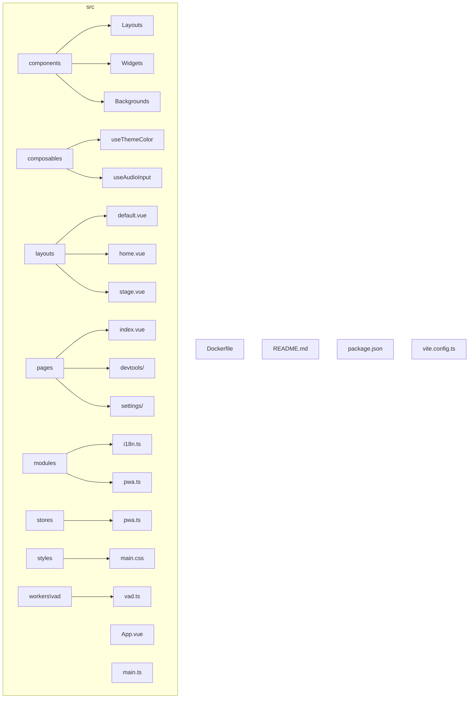
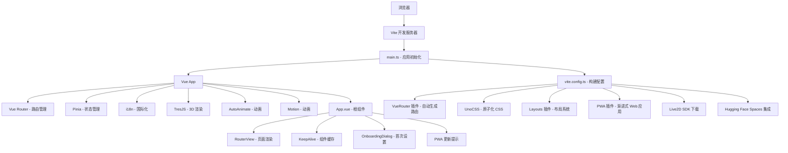
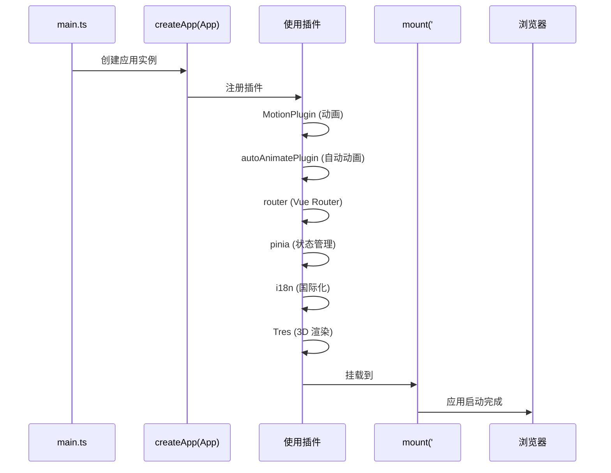
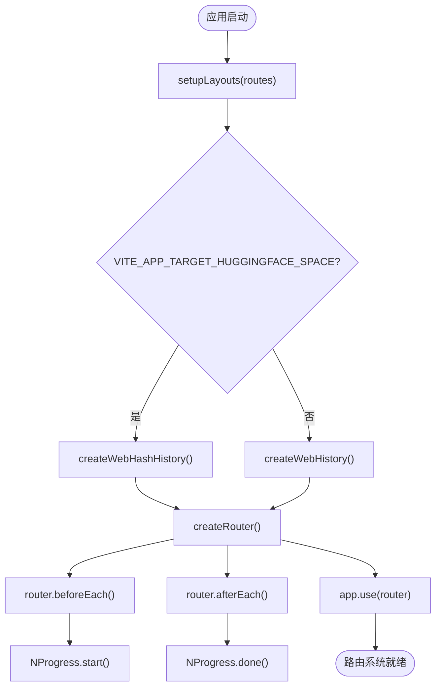

# Web应用

<cite>
**本文档中引用的文件**  
- [main.ts](file://apps/stage-web/src/main.ts)
- [App.vue](file://apps/stage-web/src/App.vue)
- [vite.config.ts](file://apps/stage-web/vite.config.ts)
- [i18n.ts](file://apps/stage-web/src/modules/i18n.ts)
- [pwa.ts](file://apps/stage-web/src/modules/pwa.ts)
- [default.vue](file://apps/stage-web/src/layouts/default.vue)
- [home.vue](file://apps/stage-web/src/layouts/home.vue)
- [index.vue](file://apps/stage-web/src/pages/index.vue)
- [README.md](file://apps/stage-web/README.md)
- [Dockerfile](file://apps/stage-web/Dockerfile)
- [package.json](file://apps/stage-web/package.json)
</cite>

## 目录

1. [介绍](#介绍)
2. [项目结构](#项目结构)
3. [核心组件](#核心组件)
4. [架构概述](#架构概述)
5. [详细组件分析](#详细组件分析)
6. [依赖分析](#依赖分析)
7. [性能考虑](#性能考虑)
8. [故障排除指南](#故障排除指南)
9. [结论](#结论)

## 介绍

`stage-web` 是一个现代化的 Vue.js 单页应用（SPA），旨在为虚拟角色 AIRI 提供交互式 Web 界面。该应用支持 Live2D 和 VRM 模型，灵感来源于 Neuro-sama 等 AI 驱动的 VTuber。它集成了国际化（i18n）、渐进式 Web 应用（PWA）、路由自动化、布局系统和 UnoCSS 原子化 CSS 引擎，提供流畅的用户体验和高度可定制的界面。

应用通过 Vite 构建，具备快速热重载和高效的生产构建能力。支持 Hugging Face Spaces 部署，并包含 Live2D SDK 自动下载、模型预加载和 PWA 更新提示等高级功能。

## 项目结构

`stage-web` 应用遵循模块化和分层设计原则，目录结构清晰，便于维护和扩展。



**Diagram sources**
- [main.ts](file://apps/stage-web/src/main.ts#L1-L52)
- [App.vue](file://apps/stage-web/src/App.vue#L1-L136)
- [vite.config.ts](file://apps/stage-web/vite.config.ts#L1-L180)

**Section sources**
- [main.ts](file://apps/stage-web/src/main.ts#L1-L52)
- [App.vue](file://apps/stage-web/src/App.vue#L1-L136)
- [vite.config.ts](file://apps/stage-web/vite.config.ts#L1-L180)

## 核心组件

`stage-web` 的核心功能由多个关键组件构成，包括应用入口、布局系统、路由配置、状态管理、国际化和 PWA 支持。

- **main.ts**：应用的入口点，负责初始化 Vue 应用实例，注册插件（如 Pinia、Vue Router、TresJS、i18n 等），并挂载到 DOM。
- **App.vue**：根组件，使用 `<RouterView>` 和 `<KeepAlive>` 实现页面切换和组件缓存，集成 PWA 更新提示和首次设置向导。
- **vite.config.ts**：Vite 构建配置，定义插件（如 Vue Router 自动生成、UnoCSS、PWA、i18n、Live2D SDK 下载等）、别名、依赖优化和 Hugging Face Spaces 集成。
- **layouts/**：提供多种页面布局模板（如 default、home、stage），通过 `vite-plugin-vue-layouts` 实现。
- **pages/**：页面组件目录，支持基于文件系统的自动路由（`vue-router/auto-routes`），包含主页面、开发工具页和设置页。

**Section sources**
- [main.ts](file://apps/stage-web/src/main.ts#L1-L52)
- [App.vue](file://apps/stage-web/src/App.vue#L1-L136)
- [vite.config.ts](file://apps/stage-web/vite.config.ts#L1-L180)
- [default.vue](file://apps/stage-web/src/layouts/default.vue#L1-L31)
- [home.vue](file://apps/stage-web/src/layouts/home.vue#L1-L21)

## 架构概述

`stage-web` 采用现代前端架构，结合 Vue 3 的组合式 API、Pinia 状态管理、Vue Router 自动路由和 UnoCSS 原子化样式系统。



**Diagram sources**
- [main.ts](file://apps/stage-web/src/main.ts#L1-L52)
- [vite.config.ts](file://apps/stage-web/vite.config.ts#L1-L180)
- [App.vue](file://apps/stage-web/src/App.vue#L1-L136)

## 详细组件分析

### 主应用初始化分析

`main.ts` 是应用的启动入口，负责创建 Vue 应用实例并集成所有核心服务。



**Diagram sources**
- [main.ts](file://apps/stage-web/src/main.ts#L1-L52)

**Section sources**
- [main.ts](file://apps/stage-web/src/main.ts#L1-L52)

### 路由与布局系统分析

应用使用 `unplugin-vue-router` 实现基于文件系统的自动路由，并通过 `vite-plugin-vue-layouts` 提供布局系统。



**Diagram sources**
- [main.ts](file://apps/stage-web/src/main.ts#L1-L52)
- [vite.config.ts](file://apps/stage-web/vite.config.ts#L1-L180)

**Section sources**
- [main.ts](file://apps/stage-web/src/main.ts#L1-L52)
- [vite.config.ts](file://apps/stage-web/vite.config.ts#L1-L180)

### 国际化（i18n）实现分析

`i18n.ts` 模块负责管理应用的多语言支持，从 `@proj-airi/i18n` 包中加载语言包，并根据浏览器或本地存储设置默认语言。

```mermaid
classDiagram
class i18n {
+locale : string
+fallbackLocale : string
+messages : Record<string, any>
}
class languageRemap {
+zh-CN → zh-Hans
+zh-TW → zh-Hant
+en-US → en
+es-ES → es
+vi-VN → vi
+ru-RU → ru
+fr-FR → fr
}
class getLocale() {
+localStorage.getItem('settings/language')
+navigator.language
+languageRemap lookup
+return valid locale
}
getLocale() --> i18n : 设置 locale
languageRemap --> getLocale() : 提供映射
```

**Diagram sources**
- [i18n.ts](file://apps/stage-web/src/modules/i18n.ts#L1-L50)

**Section sources**
- [i18n.ts](file://apps/stage-web/src/modules/i18n.ts#L1-L50)

## 依赖分析

`stage-web` 依赖多个内部和外部包，通过 Vite 别名和 pnpm 工作区进行管理。

```mermaid
erDiagram
PACKAGE ||--o{ ALIAS : "alias"
PACKAGE ||--o{ DEPENDENCY : "dependencies"
PACKAGE ||--o{ DEV_DEPENDENCY : "devDependencies"
ALIAS {
string "@proj-airi/stage-ui"
string "@proj-airi/i18n"
string "@proj-airi/server-sdk"
string "@proj-airi/stage-pages"
string "@proj-airi/stage-shared"
}
DEPENDENCY {
string vue
string pinia
string vue-router
string @tresjs/core
string @unocss/reset
}
DEV_DEPENDENCY {
string @vitejs/plugin-vue
string unplugin-vue-router
string vite-plugin-vue-layouts
string unocss/vite
string @intlify/unplugin-vue-i18n/vite
}
ALIAS ||--o{ PACKAGE : "resolve to"
DEPENDENCY ||--o{ PACKAGE : "used by"
DEV_DEPENDENCY ||--o{ PACKAGE : "used by"
```

**Diagram sources**
- [vite.config.ts](file://apps/stage-web/vite.config.ts#L1-L180)
- [package.json](file://apps/stage-web/package.json#L1-L100)

**Section sources**
- [vite.config.ts](file://apps/stage-web/vite.config.ts#L1-L180)
- [package.json](file://apps/stage-web/package.json#L1-L100)

## 性能考虑

`stage-web` 在性能方面进行了多项优化：

1. **依赖优化**：在 `vite.config.ts` 中通过 `optimizeDeps.exclude` 排除大型静态资源和内部包，避免不必要的预构建。
2. **组件缓存**：在 `App.vue` 中使用 `<KeepAlive>` 缓存关键页面组件（如 IndexScenePage、StageScenePage），减少重复渲染开销。
3. **懒加载**：通过异步路由导入（`importMode: 'async'`）实现页面级代码分割。
4. **PWA 缓存**：利用 `vite-plugin-pwa` 配置 Workbox，缓存静态资源，提升离线体验和加载速度。
5. **Hugging Face LFS**：通过 `hfup/vite` 插件管理大文件存储，优化部署和加载。

## 故障排除指南

### 应用无法启动

- 检查 Node.js 和 pnpm 版本是否符合要求。
- 确保已运行 `pnpm install` 安装所有依赖。
- 查看控制台错误信息，确认是否有模块解析失败。

### Live2D 模型未加载

- 确认 `DownloadLive2DSDK()` 插件是否正常执行。
- 检查网络连接，确认 SDK 下载 URL 可访问。
- 查看浏览器开发者工具的网络面板，确认模型文件是否成功下载。

### PWA 更新无提示

- 确认 `vite-plugin-pwa` 插件未被 `TARGET_HUGGINGFACE_SPACE` 环境变量禁用。
- 检查 `registerSW` 是否成功调用。
- 确保服务工作者已正确注册且有更新。

### 国际化语言未生效

- 检查 `localStorage` 中 `settings/language` 的值是否正确。
- 确认 `@proj-airi/i18n` 包已正确安装且语言包存在。
- 查看 `languageRemap` 映射是否覆盖了当前语言。

**Section sources**
- [pwa.ts](file://apps/stage-web/src/stores/pwa.ts#L1-L37)
- [i18n.ts](file://apps/stage-web/src/modules/i18n.ts#L1-L50)
- [vite.config.ts](file://apps/stage-web/vite.config.ts#L1-L180)

## 结论

`stage-web` 是一个功能丰富、架构清晰的现代 Web 应用，集成了 Vue 3 生态的多项先进技术。通过模块化设计、自动化工具链和高性能优化，为虚拟角色 AIRI 提供了稳定、可扩展的前端平台。其对 Hugging Face Spaces 的原生支持和 PWA 能力，使其适用于多种部署场景，具备良好的用户体验和维护性。