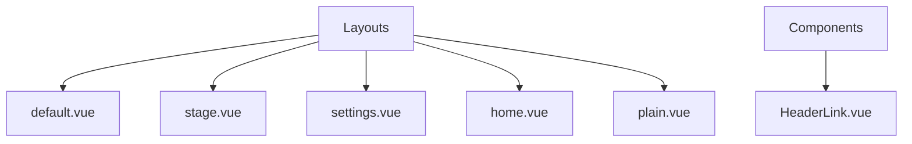
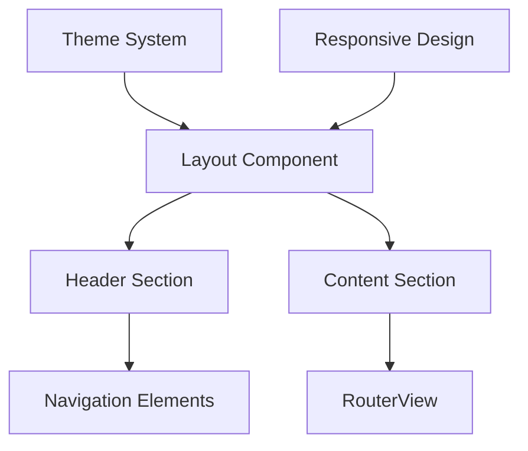
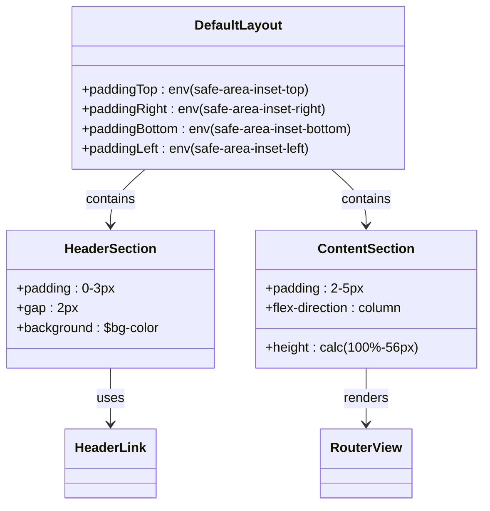
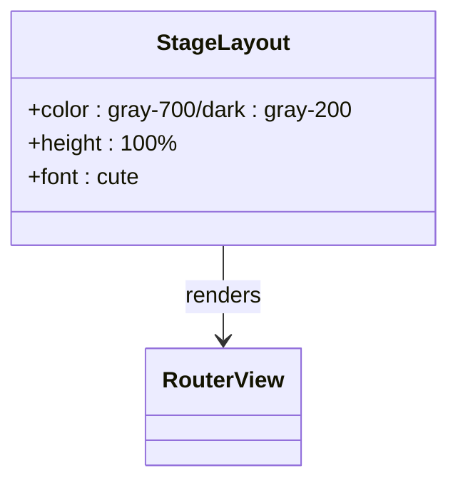
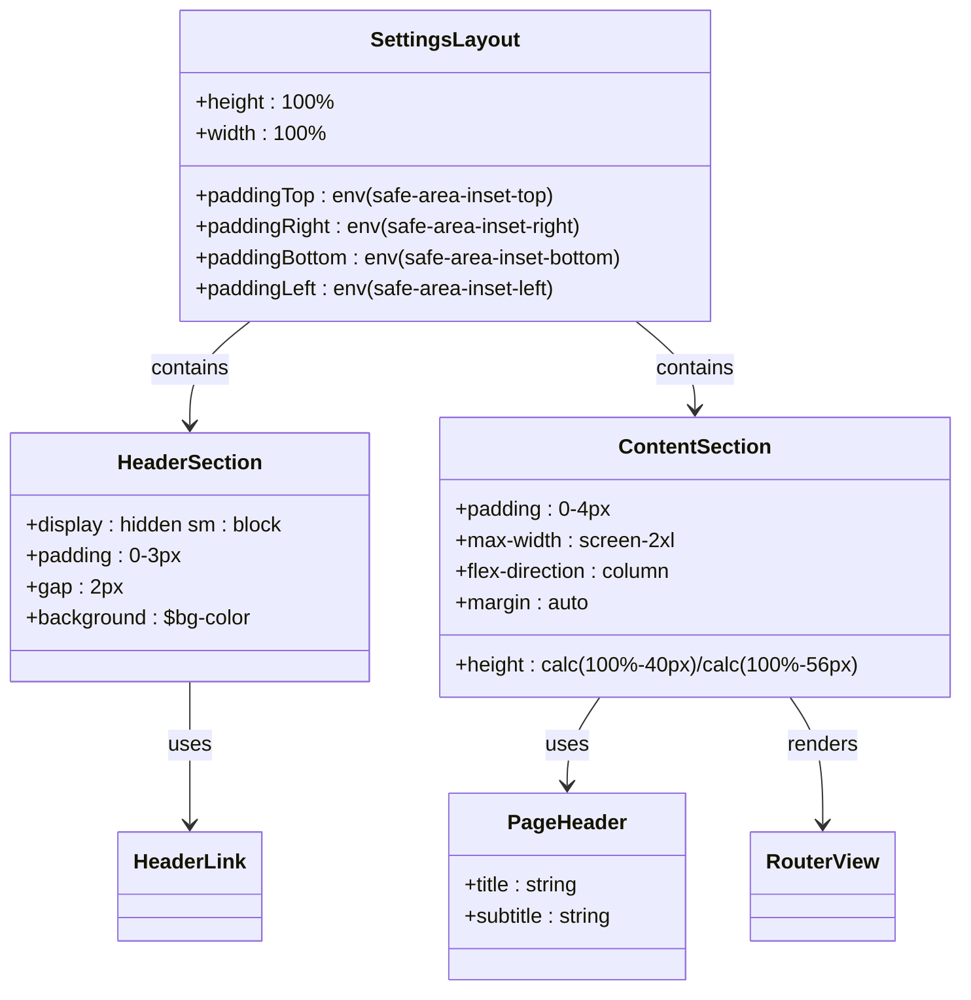
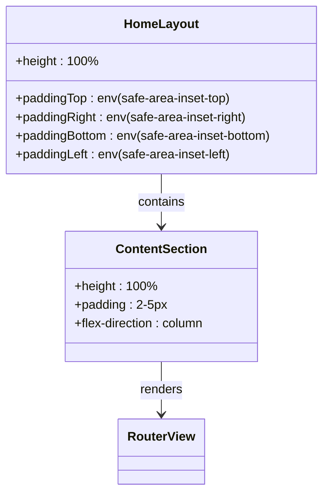
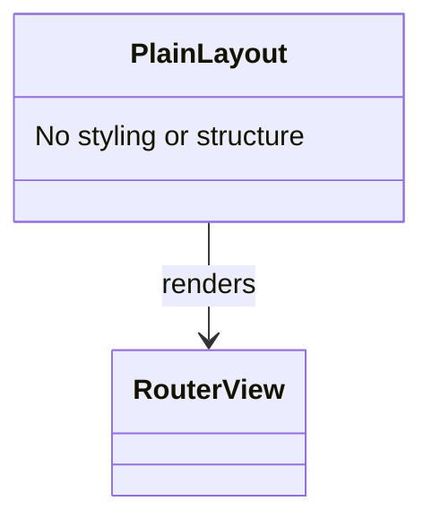
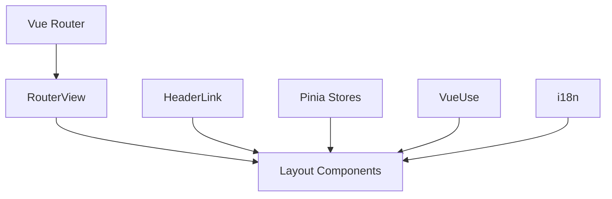

# 布局系统

<cite>
**Referenced Files in This Document**  
- [default.vue](file://apps/stage-web/src/layouts/default.vue)
- [stage.vue](file://apps/stage-web/src/layouts/stage.vue)
- [settings.vue](file://apps/stage-web/src/layouts/settings.vue)
- [home.vue](file://apps/stage-web/src/layouts/home.vue)
- [plain.vue](file://apps/stage-web/src/layouts/plain.vue)
- [HeaderLink.vue](file://apps/stage-web/src/components/Layouts/HeaderLink.vue)
</cite>

## 目录
1. [简介](#简介)
2. [项目结构](#项目结构)
3. [核心布局组件](#核心布局组件)
4. [架构概览](#架构概览)
5. [详细组件分析](#详细组件分析)
6. [依赖分析](#依赖分析)
7. [性能考虑](#性能考虑)
8. [故障排除指南](#故障排除指南)
9. [结论](#结论)

## 简介
本文档详细介绍了 stage-web 应用中的布局系统，涵盖不同布局组件的视觉结构、适用场景、响应式适配机制以及主题继承特性。文档将深入分析各布局的导航结构、交互区域划分，并提供在页面中使用特定布局的代码示例及自定义布局的扩展方法。

## 项目结构
stage-web 应用的布局系统主要位于 `src/layouts` 目录下，包含多个 Vue 组件文件，每个文件定义了一种特定的布局模式。这些布局通过插槽机制与页面内容组合，实现灵活的内容渲染。

**Diagram sources**  
- [default.vue](file://apps/stage-web/src/layouts/default.vue)
- [stage.vue](file://apps/stage-web/src/layouts/stage.vue)
- [settings.vue](file://apps/stage-web/src/layouts/settings.vue)
- [home.vue](file://apps/stage-web/src/layouts/home.vue)
- [plain.vue](file://apps/stage-web/src/layouts/plain.vue)
- [HeaderLink.vue](file://apps/stage-web/src/components/Layouts/HeaderLink.vue)

**Section sources**
- [default.vue](file://apps/stage-web/src/layouts/default.vue)
- [stage.vue](file://apps/stage-web/src/layouts/stage.vue)
- [settings.vue](file://apps/stage-web/src/layouts/settings.vue)
- [home.vue](file://apps/stage-web/src/layouts/home.vue)
- [plain.vue](file://apps/stage-web/src/layouts/plain.vue)

## 核心组件
stage-web 布局系统包含五种核心布局组件：default、stage、settings、home 和 plain。每种布局针对不同的使用场景设计，通过 `RouterView` 组件实现内容的动态加载。

**Section sources**
- [default.vue](file://apps/stage-web/src/layouts/default.vue)
- [stage.vue](file://apps/stage-web/src/layouts/stage.vue)
- [settings.vue](file://apps/stage-web/src/layouts/settings.vue)
- [home.vue](file://apps/stage-web/src/layouts/home.vue)
- [plain.vue](file://apps/stage-web/src/layouts/plain.vue)

## 架构概览
布局系统采用基于 Vue Router 的组件化架构，通过不同的布局组件封装通用的页面结构。所有布局都使用环境变量 `safe-area-inset` 来适配移动设备的安全区域，确保在各种设备上都能正确显示。

**Diagram sources**  
- [default.vue](file://apps/stage-web/src/layouts/default.vue)
- [settings.vue](file://apps/stage-web/src/layouts/settings.vue)
- [HeaderLink.vue](file://apps/stage-web/src/components/Layouts/HeaderLink.vue)

## 详细组件分析
### Default 布局分析
Default 布局是应用的基础布局，包含页眉和内容区域。页眉中包含 HeaderLink 组件，提供导航功能。内容区域使用 `RouterView` 组件动态加载页面内容。

#### 布局结构

**Diagram sources**  
- [default.vue](file://apps/stage-web/src/layouts/default.vue)
- [HeaderLink.vue](file://apps/stage-web/src/components/Layouts/HeaderLink.vue)

**Section sources**
- [default.vue](file://apps/stage-web/src/layouts/default.vue)
- [HeaderLink.vue](file://apps/stage-web/src/components/Layouts/HeaderLink.vue)

### Stage 布局分析
Stage 布局是最简化的布局，仅包含一个主元素和 `RouterView` 组件。这种布局适用于需要完全自定义页面样式的场景。

#### 布局结构

**Diagram sources**  
- [stage.vue](file://apps/stage-web/src/layouts/stage.vue)

**Section sources**
- [stage.vue](file://apps/stage-web/src/layouts/stage.vue)

### Settings 布局分析
Settings 布局专为设置页面设计，包含复杂的页眉逻辑，能够根据当前路由动态显示不同的标题和副标题。该布局还集成了主题颜色管理功能。

#### 布局结构

**Diagram sources**  
- [settings.vue](file://apps/stage-web/src/layouts/settings.vue)
- [HeaderLink.vue](file://apps/stage-web/src/components/Layouts/HeaderLink.vue)

**Section sources**
- [settings.vue](file://apps/stage-web/src/layouts/settings.vue)
- [HeaderLink.vue](file://apps/stage-web/src/components/Layouts/HeaderLink.vue)

### Home 布局分析
Home 布局与 Default 布局类似，但不包含页眉区域。这种布局适用于首页等不需要导航栏的页面。

#### 布局结构

**Diagram sources**  
- [home.vue](file://apps/stage-web/src/layouts/home.vue)

**Section sources**
- [home.vue](file://apps/stage-web/src/layouts/home.vue)

### Plain 布局分析
Plain 布局是最简单的布局，仅包含 `RouterView` 组件。这种布局适用于需要完全控制页面渲染的特殊场景。

#### 布局结构

**Diagram sources**  
- [plain.vue](file://apps/stage-web/src/layouts/plain.vue)

**Section sources**
- [plain.vue](file://apps/stage-web/src/layouts/plain.vue)

## 依赖分析
布局系统依赖于 Vue Router 的 `RouterView` 组件来实现内容的动态加载。此外，各布局组件还依赖于 `HeaderLink` 组件提供导航功能，以及各种状态管理工具来处理主题和路由信息。

**Diagram sources**  
- [default.vue](file://apps/stage-web/src/layouts/default.vue)
- [stage.vue](file://apps/stage-web/src/layouts/stage.vue)
- [settings.vue](file://apps/stage-web/src/layouts/settings.vue)
- [home.vue](file://apps/stage-web/src/layouts/home.vue)
- [plain.vue](file://apps/stage-web/src/layouts/plain.vue)
- [HeaderLink.vue](file://apps/stage-web/src/components/Layouts/HeaderLink.vue)

**Section sources**
- [default.vue](file://apps/stage-web/src/layouts/default.vue)
- [stage.vue](file://apps/stage-web/src/layouts/stage.vue)
- [settings.vue](file://apps/stage-web/src/layouts/settings.vue)
- [home.vue](file://apps/stage-web/src/layouts/home.vue)
- [plain.vue](file://apps/stage-web/src/layouts/plain.vue)
- [HeaderLink.vue](file://apps/stage-web/src/components/Layouts/HeaderLink.vue)

## 性能考虑
布局系统的设计考虑了性能因素。通过使用环境变量 `safe-area-inset` 而不是 JavaScript 计算来适配安全区域，减少了运行时的计算开销。此外，各布局组件都采用了简洁的结构，避免了不必要的 DOM 层级嵌套。

## 故障排除指南
当布局出现问题时，应首先检查 `RouterView` 组件是否正确配置，以及路由定义是否与布局组件匹配。对于主题相关的问题，应检查 `useDark` 和 `useThemeColor` 相关的代码是否正确执行。

**Section sources**
- [settings.vue](file://apps/stage-web/src/layouts/settings.vue)
- [default.vue](file://apps/stage-web/src/layouts/default.vue)

## 结论
stage-web 的布局系统通过多种预定义的布局组件提供了灵活的页面结构解决方案。这些布局组件既满足了不同页面类型的特定需求，又保持了代码的可维护性和一致性。通过合理使用这些布局组件，开发者可以快速构建出符合应用设计规范的用户界面。