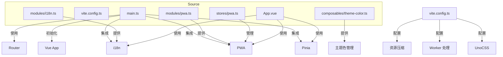
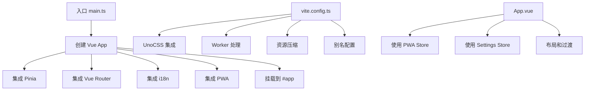
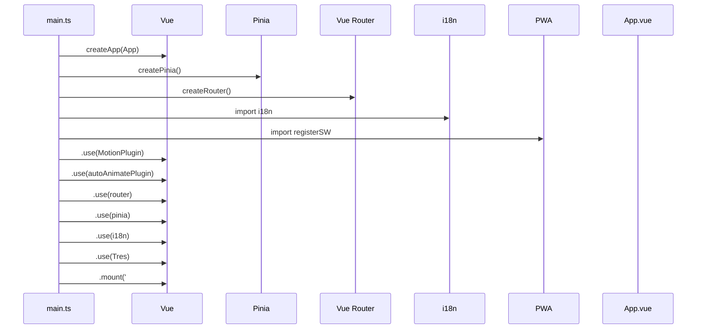
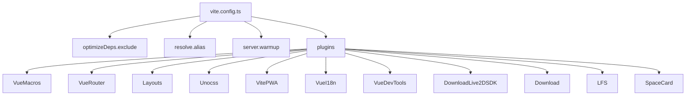
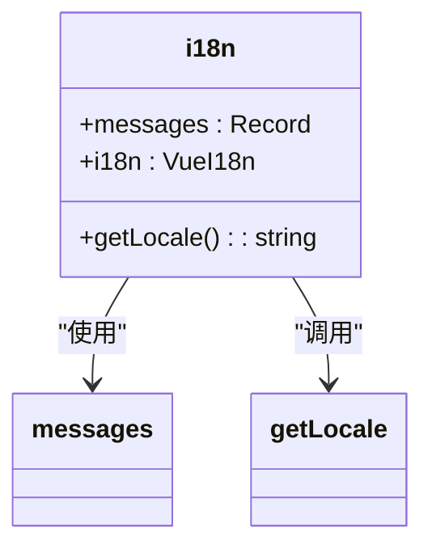
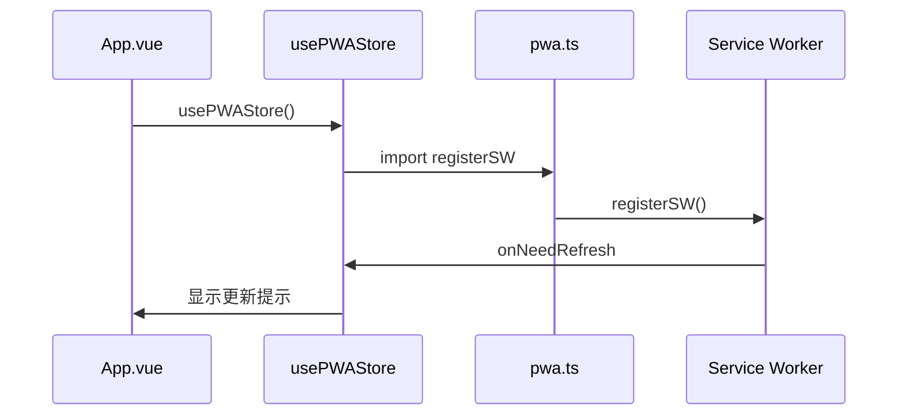

# 架构设计

<cite>
**本文档中引用的文件**  
- [main.ts](file://apps/stage-web/src/main.ts)
- [vite.config.ts](file://apps/stage-web/vite.config.ts)
- [i18n.ts](file://apps/stage-web/src/modules/i18n.ts)
- [pwa.ts](file://apps/stage-web/src/modules/pwa.ts)
- [pwa.ts](file://apps/stage-web/src/stores/pwa.ts)
- [App.vue](file://apps/stage-web/src/App.vue)
- [theme-color.ts](file://apps/stage-web/src/composables/theme-color.ts)
- [settings.ts](file://packages/stage-ui/src/stores/settings.ts)
</cite>

## 目录
1. [简介](#简介)
2. [项目结构](#项目结构)
3. [核心组件](#核心组件)
4. [架构概览](#架构概览)
5. [详细组件分析](#详细组件分析)
6. [依赖分析](#依赖分析)
7. [性能考量](#性能考量)
8. [故障排除指南](#故障排除指南)
9. [结论](#结论)

## 简介
本文件详细说明了 `stage-web` 应用的架构设计，重点介绍其分层架构、Vue 应用初始化流程、Pinia 状态管理、i18n 国际化支持、PWA 集成、Vite 构建优化以及整体生命周期管理。文档还涵盖了依赖注入机制和环境变量管理策略，并通过架构图展示核心组件之间的关系，分析设计决策背后的性能与可维护性考量。

## 项目结构
`stage-web` 应用采用模块化和分层设计，主要目录包括 `components`（组件）、`composables`（组合式函数）、`layouts`（布局）、`modules`（功能模块）、`pages`（页面）、`stores`（状态存储）、`styles`（样式）、`utils`（工具函数）和 `workers`（Web Workers）。入口文件为 `main.ts`，构建配置由 `vite.config.ts` 定义。



**图示来源**
- [main.ts](file://apps/stage-web/src/main.ts)
- [vite.config.ts](file://apps/stage-web/vite.config.ts)
- [i18n.ts](file://apps/stage-web/src/modules/i18n.ts)
- [pwa.ts](file://apps/stage-web/src/modules/pwa.ts)
- [pwa.ts](file://apps/stage-web/src/stores/pwa.ts)
- [App.vue](file://apps/stage-web/src/App.vue)
- [theme-color.ts](file://apps/stage-web/src/composables/theme-color.ts)

**本节来源**
- [apps/stage-web/src](file://apps/stage-web/src)

## 核心组件
`stage-web` 的核心组件包括 `main.ts` 中的 Vue 应用初始化逻辑、`vite.config.ts` 中的构建优化配置、`modules/i18n.ts` 中的国际化模块、`modules/pwa.ts` 中的 PWA 注册模块以及 `stores/pwa.ts` 中的 PWA 状态管理。这些组件共同构成了应用的基础架构。

**本节来源**
- [main.ts](file://apps/stage-web/src/main.ts)
- [vite.config.ts](file://apps/stage-web/vite.config.ts)
- [i18n.ts](file://apps/stage-web/src/modules/i18n.ts)
- [pwa.ts](file://apps/stage-web/src/modules/pwa.ts)
- [pwa.ts](file://apps/stage-web/src/stores/pwa.ts)

## 架构概览
`stage-web` 应用采用典型的 Vue 3 + Vite 架构，结合 Pinia 进行状态管理，Vue Router 进行路由管理，并通过自定义模块集成 i18n 和 PWA 功能。Vite 配置文件中集成了 UnoCSS、Worker 处理和资源压缩等优化措施，提升了应用的性能和可维护性。



**图示来源**
- [main.ts](file://apps/stage-web/src/main.ts)
- [vite.config.ts](file://apps/stage-web/vite.config.ts)
- [App.vue](file://apps/stage-web/src/App.vue)

## 详细组件分析

### 入口点 main.ts 分析
`main.ts` 是应用的入口文件，负责初始化 Vue 应用并集成各种插件和模块。



**图示来源**
- [main.ts](file://apps/stage-web/src/main.ts)

**本节来源**
- [main.ts](file://apps/stage-web/src/main.ts)

### Vite 配置分析
`vite.config.ts` 文件包含了应用的构建优化设置，包括 UnoCSS 集成、Worker 处理和资源压缩。



**图示来源**
- [vite.config.ts](file://apps/stage-web/vite.config.ts)

**本节来源**
- [vite.config.ts](file://apps/stage-web/vite.config.ts)

### 国际化模块分析
`i18n.ts` 模块负责应用的国际化支持，通过 `vue-i18n` 实现多语言切换。



**图示来源**
- [i18n.ts](file://apps/stage-web/src/modules/i18n.ts)

**本节来源**
- [i18n.ts](file://apps/stage-web/src/modules/i18n.ts)

### PWA 模块分析
`pwa.ts` 模块提供了 PWA 注册功能，`stores/pwa.ts` 则管理 PWA 的状态和更新逻辑。



**图示来源**
- [pwa.ts](file://apps/stage-web/src/modules/pwa.ts)
- [pwa.ts](file://apps/stage-web/src/stores/pwa.ts)
- [App.vue](file://apps/stage-web/src/App.vue)

**本节来源**
- [pwa.ts](file://apps/stage-web/src/modules/pwa.ts)
- [pwa.ts](file://apps/stage-web/src/stores/pwa.ts)
- [App.vue](file://apps/stage-web/src/App.vue)

## 依赖分析
`stage-web` 应用通过 `vite.config.ts` 中的 `resolve.alias` 配置了多个内部包的别名，实现了模块间的解耦和复用。同时，通过 `optimizeDeps.exclude` 配置排除了大型静态资源和 Live2D SDK，优化了依赖预构建过程。

```mermaid
graph LR
A[stage-web] --> B[@proj-airi/server-sdk]
A --> C[@proj-airi/i18n]
A --> D[@proj-airi/stage-ui]
A --> E[@proj-airi/stage-pages]
A --> F[@proj-airi/stage-shared]
B --> G[server-sdk]
C --> H[i18n]
D --> I[stage-ui]
E --> J[stage-pages]
F --> K[stage-shared]
```

**图示来源**
- [vite.config.ts](file://apps/stage-web/vite.config.ts)

**本节来源**
- [vite.config.ts](file://apps/stage-web/vite.config.ts)

## 性能考量
`stage-web` 应用在性能方面做了多项优化。Vite 配置中通过 `optimizeDeps.exclude` 排除了大型静态资源和 Live2D SDK，避免了不必要的预构建开销。`server.warmup` 配置预热了常用组件，提升了开发服务器的启动速度。生产构建中启用了 `VitePWA` 插件，通过 Service Worker 实现了资源缓存和离线访问，提升了应用的加载速度和用户体验。

**本节来源**
- [vite.config.ts](file://apps/stage-web/vite.config.ts)

## 故障排除指南
当遇到 PWA 更新不生效的问题时，请检查 `vite.config.ts` 中的 `VitePWA` 配置是否正确，特别是 `workbox.navigateFallbackDenylist` 是否排除了正确的路径。若国际化语言切换失败，请确认 `i18n.ts` 中的语言映射表 `languageRemap` 是否包含目标语言的映射关系。

**本节来源**
- [vite.config.ts](file://apps/stage-web/vite.config.ts#L120-L140)
- [i18n.ts](file://apps/stage-web/src/modules/i18n.ts#L3-L20)

## 结论
`stage-web` 应用通过合理的分层架构和模块化设计，实现了良好的可维护性和扩展性。Vite 构建配置中的多项优化措施显著提升了应用的性能。Pinia 状态管理、i18n 国际化支持和 PWA 集成等功能模块的引入，增强了应用的功能性和用户体验。整体设计充分考虑了性能与可维护性的平衡，为后续开发和维护奠定了坚实的基础。