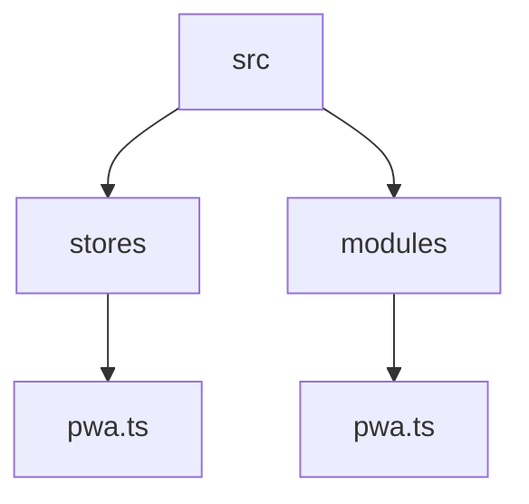
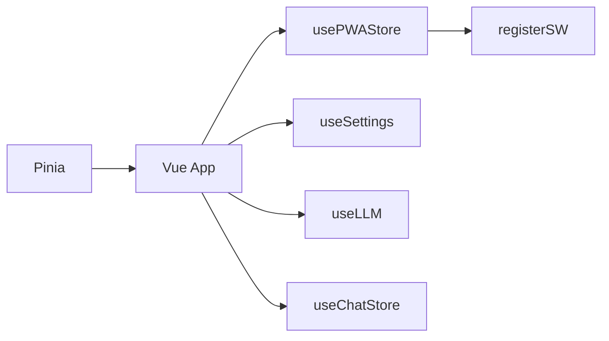
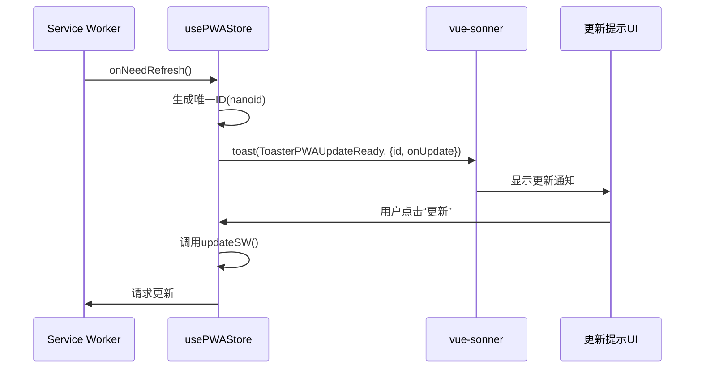
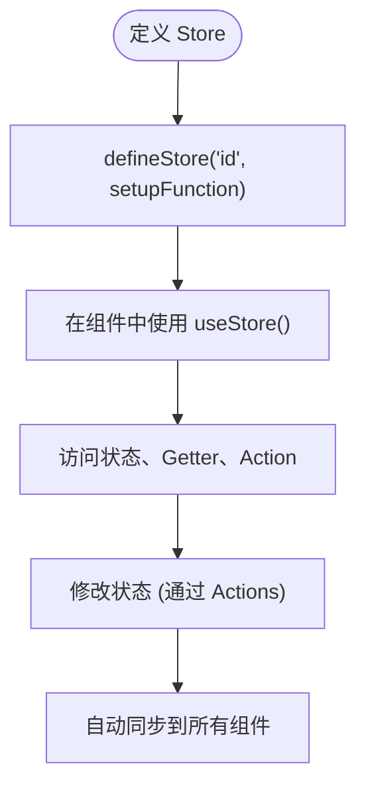
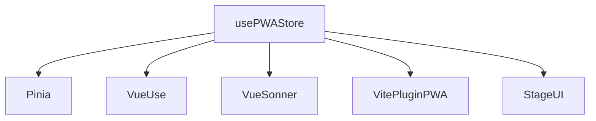

# 状态管理

<cite>
**本文档引用的文件**  
- [pwa.ts](file://apps/stage-web/src/stores/pwa.ts)
- [pwa.ts](file://apps/stage-web/src/modules/pwa.ts)
- [main.ts](file://apps/stage-web/src/main.ts)
- [settings.ts](file://packages/stage-ui/src/stores/settings.ts)
- [llm.ts](file://packages/stage-ui/src/stores/llm.ts)
- [chat.ts](file://packages/stage-ui/src/stores/chat.ts)
</cite>

## 目录
1. [简介](#简介)
2. [项目结构](#项目结构)
3. [核心组件](#核心组件)
4. [架构概述](#架构概述)
5. [详细组件分析](#详细组件分析)
6. [依赖分析](#依赖分析)
7. [性能考虑](#性能考虑)
8. [故障排除指南](#故障排除指南)
9. [结论](#结论)

## 简介
本文档详细阐述了 `stage-web` 应用中基于 Pinia 的全局状态管理机制，重点聚焦于 PWA（渐进式 Web 应用）相关状态的管理。文档将解释如何通过模块化的方式组织状态存储（store），如何在组件中安全地访问和修改状态，以及如何实现状态持久化、错误处理和调试。此外，还将说明其与核心 `character` 包的状态同步机制。

## 项目结构
`stage-web` 应用的状态管理主要集中在 `src/stores` 和 `src/modules` 目录下。`stores` 目录存放具体的 Pinia store 定义，而 `modules` 目录则包含与状态管理相关的功能模块，如 PWA 注册逻辑。



**图示来源**
- [pwa.ts](file://apps/stage-web/src/stores/pwa.ts)
- [pwa.ts](file://apps/stage-web/src/modules/pwa.ts)

**本节来源**
- [pwa.ts](file://apps/stage-web/src/stores/pwa.ts)
- [pwa.ts](file://apps/stage-web/src/modules/pwa.ts)

## 核心组件
核心组件包括 `usePWAStore`，它负责管理 PWA 的安装提示和更新检测状态。该 store 利用 Pinia 提供的响应式能力，确保 UI 能够实时反映 PWA 状态的变化。

**本节来源**
- [pwa.ts](file://apps/stage-web/src/stores/pwa.ts)

## 架构概述
整个应用的状态管理架构基于 Pinia，它在 `main.ts` 中被创建并安装到 Vue 应用实例上。各个功能模块（如 PWA、聊天、音频等）拥有独立的 store，实现了关注点分离。



**图示来源**
- [main.ts](file://apps/stage-web/src/main.ts)
- [pwa.ts](file://apps/stage-web/src/stores/pwa.ts)

## 详细组件分析

### PWA 状态管理分析
`usePWAStore` 是一个 Pinia store，它在组件挂载后异步导入 `../modules/pwa` 模块中的 `registerSW` 函数来注册 Service Worker。

#### PWA Store 类图
```mermaid
classDiagram
class usePWAStore {
+updateReadyHooks : Ref~Function[]~
+breakpoints : Object
+isMobile : ComputedRef~boolean~
+onMounted(callback) : void
}
usePWAStore --> "registerSW" : "使用"
usePWAStore --> "toast" : "显示通知"
```

**图示来源**
- [pwa.ts](file://apps/stage-web/src/stores/pwa.ts)

#### PWA 更新检测流程
当 Service Worker 检测到新版本时，会触发 `onNeedRefresh` 回调。此时，store 会生成一个唯一的 ID，并使用 `vue-sonner` 的 `toast` 函数显示一个包含 `ToasterPWAUpdateReady` 组件的通知。用户点击“更新”按钮时，会调用 `updateSW()` 函数来激活新版本。



**图示来源**
- [pwa.ts](file://apps/stage-web/src/stores/pwa.ts)

**本节来源**
- [pwa.ts](file://apps/stage-web/src/stores/pwa.ts)

### 概念概述
Pinia 作为 Vue 的官方状态管理库，提供了简洁的 API 来定义和使用 store。通过 `defineStore` 函数创建的 store 是响应式的，其状态变化会自动更新所有使用该状态的组件。



## 依赖分析
`usePWAStore` 依赖于多个外部库和内部模块：
- **`pinia`**: 提供状态管理的核心功能。
- **`vueuse/core`**: 提供 `useBreakpoints` 等组合式 API。
- **`vue-sonner`**: 用于显示更新提示的 Toast 通知。
- **`vite-plugin-pwa`**: 通过 `virtual:pwa-register` 提供 `registerSW` 函数。
- **`@proj-airi/stage-ui`**: 提供 `ToasterPWAUpdateReady` 组件。



**图示来源**
- [pwa.ts](file://apps/stage-web/src/stores/pwa.ts)
- [pwa.ts](file://apps/stage-web/src/modules/pwa.ts)

**本节来源**
- [pwa.ts](file://apps/stage-web/src/stores/pwa.ts)
- [pwa.ts](file://apps/stage-web/src/modules/pwa.ts)

## 性能考虑
- **异步导入**: `registerSW` 函数被异步导入，避免了在非浏览器环境（SSR）或特定目标（HuggingFace Space）下执行不必要的代码，优化了初始加载性能。
- **条件执行**: 通过 `import.meta.env` 检查，确保 PWA 功能仅在合适的环境下启用。
- **响应式优化**: 使用 `ref` 和 `computed` 确保状态的最小化更新，避免不必要的组件重渲染。

## 故障排除指南
- **更新提示不显示**: 检查 `import.meta.env.VITE_APP_TARGET_HUGGINGFACE_SPACE` 环境变量是否为 `true`，如果是，则 PWA 功能会被禁用。
- **Service Worker 未注册**: 确保 `vite-plugin-pwa` 已正确配置，并且 `virtual:pwa-register` 模块能够被成功解析。
- **通知位置错误**: `isMobile` 响应式引用依赖于 `useBreakpoints`，检查 `breakpointsTailwind` 配置是否正确。

**本节来源**
- [pwa.ts](file://apps/stage-web/src/stores/pwa.ts)

## 结论
`stage-web` 应用通过 Pinia 实现了高效、模块化的状态管理。`usePWAStore` 作为管理 PWA 状态的核心，展示了如何利用 Pinia 的响应式特性和组合式 API 来处理复杂的异步逻辑和 UI 交互。其与 `vite-plugin-pwa` 的集成，为用户提供了一个流畅的 PWA 更新体验。这种模块化的设计也为未来扩展其他状态管理功能（如与 `core-character` 包的同步）奠定了坚实的基础。