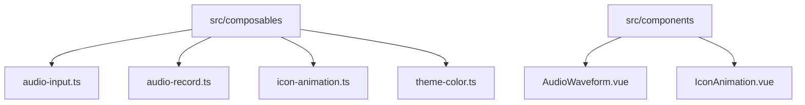
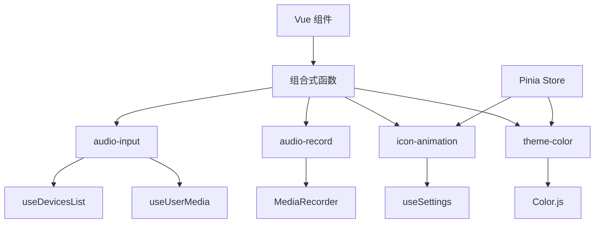
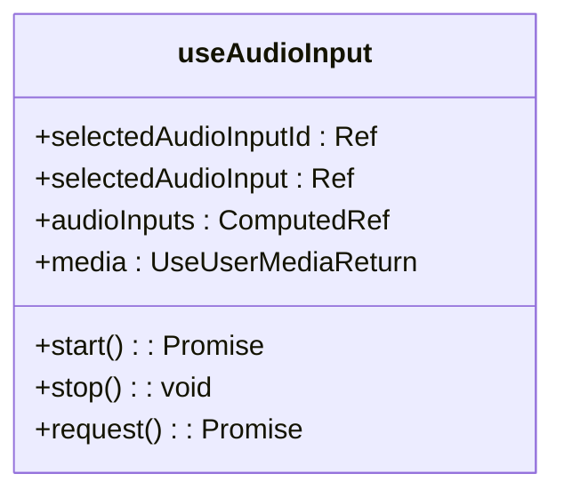
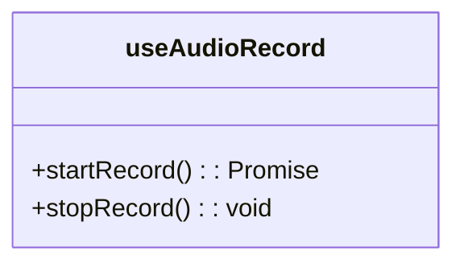
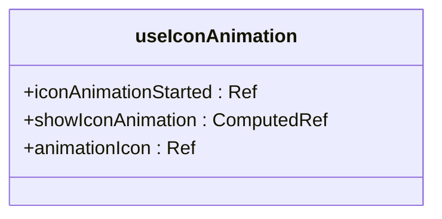
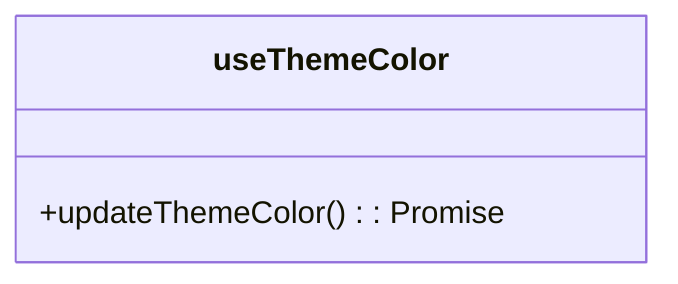

# 组合式函数

<cite>
**本文档中引用的文件**  
- [audio-input.ts](file://apps/stage-web/src/composables/audio-input.ts)
- [audio-record.ts](file://apps/stage-web/src/composables/audio-record.ts)
- [icon-animation.ts](file://apps/stage-web/src/composables/icon-animation.ts)
- [theme-color.ts](file://apps/stage-web/src/composables/theme-color.ts)
- [AudioWaveform.vue](file://apps/stage-web/src/components/AudioWaveform.vue)
- [IconAnimation.vue](file://apps/stage-web/src/components/IconAnimation.vue)
- [main.ts](file://apps/stage-web/src/main.ts)
- [index.vue](file://apps/stage-web/src/pages/index.vue)
</cite>

## 目录
1. [简介](#简介)
2. [项目结构](#项目结构)
3. [核心组件](#核心组件)
4. [架构概述](#架构概述)
5. [详细组件分析](#详细组件分析)
6. [依赖分析](#依赖分析)
7. [性能考虑](#性能考虑)
8. [故障排除指南](#故障排除指南)
9. [结论](#结论)

## 简介
本文档详细介绍了 `stage-web` 应用中的四个核心组合式函数：`audio-input`、`audio-record`、`icon-animation` 和 `theme-color`。这些函数封装了可复用的逻辑，分别用于处理麦克风输入流、实现录音控制、驱动图标动画以及管理主题色切换。文档将说明这些函数如何与 Vue 的响应式系统集成，并提供在 `setup` 脚本中导入和使用的完整示例。

## 项目结构
`stage-web` 应用的 `src/composables` 目录下包含了四个关键的组合式函数文件，它们分别负责不同的功能模块。这些函数通过 Vue 3 的 Composition API 实现逻辑的封装和复用，使得多个组件可以共享相同的功能而无需重复代码。



**图示来源**  
- [audio-input.ts](file://apps/stage-web/src/composables/audio-input.ts#L3-L82)
- [audio-record.ts](file://apps/stage-web/src/composables/audio-record.ts#L5-L41)
- [icon-animation.ts](file://apps/stage-web/src/composables/icon-animation.ts#L3-L28)
- [theme-color.ts](file://apps/stage-web/src/composables/theme-color.ts#L32-L45)

**本节来源**  
- [audio-input.ts](file://apps/stage-web/src/composables/audio-input.ts)
- [audio-record.ts](file://apps/stage-web/src/composables/audio-record.ts)
- [icon-animation.ts](file://apps/stage-web/src/composables/icon-animation.ts)
- [theme-color.ts](file://apps/stage-web/src/composables/theme-color.ts)

## 核心组件
`stage-web` 的组合式函数通过 Vue 的响应式 API（如 `ref`、`computed`、`watch`）实现了状态的自动追踪和更新。每个函数都返回一个包含响应式数据和方法的对象，供组件在 `setup` 中使用。

**本节来源**  
- [audio-input.ts](file://apps/stage-web/src/composables/audio-input.ts#L3-L82)
- [audio-record.ts](file://apps/stage-web/src/composables/audio-record.ts#L5-L41)
- [icon-animation.ts](file://apps/stage-web/src/composables/icon-animation.ts#L3-L28)
- [theme-color.ts](file://apps/stage-web/src/composables/theme-color.ts#L32-L45)

## 架构概述
整个 `stage-web` 应用基于 Vue 3 的 Composition API 构建，组合式函数作为独立的逻辑单元被多个组件复用。它们通过 Pinia 管理全局状态，并与 VueUse 提供的实用函数（如 `useDevicesList`、`useUserMedia`）集成，实现跨浏览器的设备访问和媒体流控制。



**图示来源**  
- [audio-input.ts](file://apps/stage-web/src/composables/audio-input.ts#L3-L82)
- [audio-record.ts](file://apps/stage-web/src/composables/audio-record.ts#L5-L41)
- [icon-animation.ts](file://apps/stage-web/src/composables/icon-animation.ts#L3-L28)
- [theme-color.ts](file://apps/stage-web/src/composables/theme-color.ts#L32-L45)
- [main.ts](file://apps/stage-web/src/main.ts#L1-L52)

**本节来源**  
- [main.ts](file://apps/stage-web/src/main.ts#L1-L52)

## 详细组件分析

### audio-input 分析
`useAudioInput` 函数用于管理麦克风设备的访问和音频流的获取。它利用 `useDevicesList` 获取可用的音频输入设备，并通过 `useUserMedia` 请求媒体流权限。



**图示来源**  
- [audio-input.ts](file://apps/stage-web/src/composables/audio-input.ts#L3-L82)

**本节来源**  
- [audio-input.ts](file://apps/stage-web/src/composables/audio-input.ts#L3-L82)

### audio-record 分析
`useAudioRecord` 函数封装了录音功能，接收一个媒体流作为输入，并提供开始和停止录音的方法。录音完成后，音频数据会被自动播放。



**图示来源**  
- [audio-record.ts](file://apps/stage-web/src/composables/audio-record.ts#L5-L41)

**本节来源**  
- [audio-record.ts](file://apps/stage-web/src/composables/audio-record.ts#L5-L41)

### icon-animation 分析
`useIconAnimation` 函数控制图标的动画播放，它依赖于全局的 `settingsStore` 来判断是否启用动画效果，并在组件挂载和卸载时管理动画状态。



**图示来源**  
- [icon-animation.ts](file://apps/stage-web/src/composables/icon-animation.ts#L3-L28)

**本节来源**  
- [icon-animation.ts](file://apps/stage-web/src/composables/icon-animation.ts#L3-L28)

### theme-color 分析
`useThemeColor` 函数动态更新网页的主题色，通过读取 DOM 元素的 CSS 属性或直接传入颜色值来设置 `<meta name="theme-color">` 的内容。



**图示来源**  
- [theme-color.ts](file://apps/stage-web/src/composables/theme-color.ts#L32-L45)

**本节来源**  
- [theme-color.ts](file://apps/stage-web/src/composables/theme-color.ts#L32-L45)

## 依赖分析
这些组合式函数依赖于多个外部库和 Vue 生态工具：
- `@vueuse/core`：提供 `useDevicesList`、`useUserMedia` 等实用函数
- `pinia`：用于全局状态管理
- `colorjs.io`：用于颜色转换和处理
- `vue`：核心响应式系统

```mermaid
graph LR
A[audio-input] --> B[@vueuse/core]
C[audio-record] --> D[MediaRecorder API]
E[icon-animation] --> F[Pinia]
G[theme-color] --> H[colorjs.io]
```

**图示来源**  
- [audio-input.ts](file://apps/stage-web/src/composables/audio-input.ts#L1)
- [audio-record.ts](file://apps/stage-web/src/composables/audio-record.ts#L1)
- [icon-animation.ts](file://apps/stage-web/src/composables/icon-animation.ts#L1)
- [theme-color.ts](file://apps/stage-web/src/composables/theme-color.ts#L1)

**本节来源**  
- [audio-input.ts](file://apps/stage-web/src/composables/audio-input.ts)
- [audio-record.ts](file://apps/stage-web/src/composables/audio-record.ts)
- [icon-animation.ts](file://apps/stage-web/src/composables/icon-animation.ts)
- [theme-color.ts](file://apps/stage-web/src/composables/theme-color.ts)

## 性能考虑
组合式函数通过 `watch` 和 `computed` 实现了高效的响应式更新，避免了不必要的重新渲染。`useAudioInput` 中的 `immediate: true` 确保了初始状态的正确设置，而 `useIconAnimation` 则通过 `onMounted` 和 `onUnmounted` 生命周期钩子优化了动画资源的管理。

## 故障排除指南
- **麦克风权限未授予**：确保在 `useAudioInput` 中调用 `request()` 方法以请求权限。
- **录音无输出**：检查 `media` 流是否已正确启动，并确认浏览器支持 `MediaRecorder` API。
- **动画未播放**：确认 `settingsStore.disableTransitions` 未被设置为 `true`。
- **主题色未更新**：确保 `meta[name="theme-color"]` 标签存在于 HTML 中。

**本节来源**  
- [audio-input.ts](file://apps/stage-web/src/composables/audio-input.ts#L39-L82)
- [icon-animation.ts](file://apps/stage-web/src/composables/icon-animation.ts#L10-L15)

## 结论
`stage-web` 的组合式函数通过 Vue 3 的 Composition API 实现了高度可复用的逻辑封装。它们不仅简化了组件的代码结构，还通过响应式系统实现了状态的自动同步。开发者可以在任何组件中轻松导入并使用这些函数，从而快速构建功能丰富的用户界面。