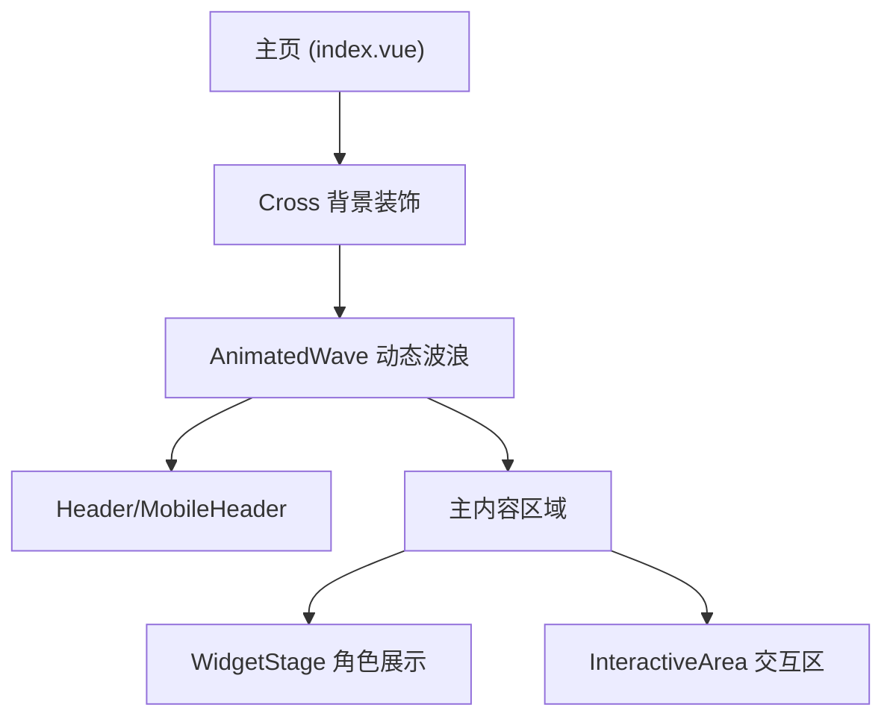
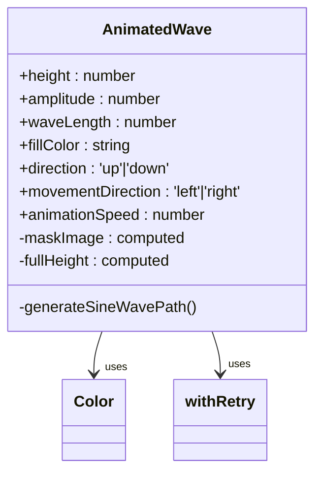
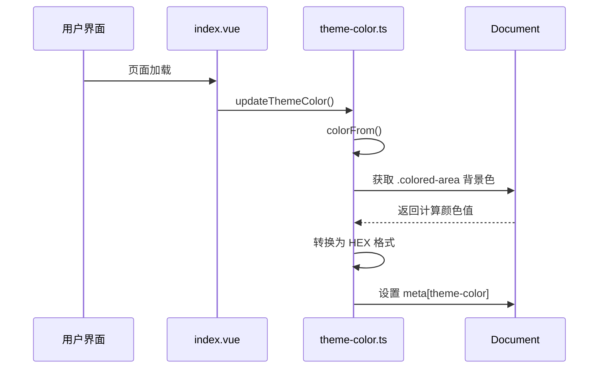
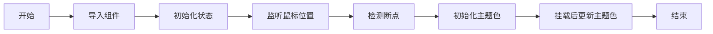

# 主页

<cite>
**本文档中引用的文件**  
- [index.vue](file://apps/stage-web/src/pages/index.vue)
- [InteractiveArea.vue](file://apps/stage-web/src/components/Layouts/InteractiveArea.vue)
- [AnimatedWave.vue](file://apps/stage-web/src/components/Widgets/AnimatedWave.vue)
- [theme-color.ts](file://apps/stage-web/src/composables/theme-color.ts)
- [stage.vue](file://apps/stage-web/src/layouts/stage.vue)
</cite>

## 目录
1. [简介](#简介)
2. [页面结构与布局](#页面结构与布局)
3. [核心组件集成](#核心组件集成)
4. [Pinia状态管理交互](#pinia状态管理交互)
5. [页面加载流程](#页面加载流程)
6. [响应式设计实现](#响应式设计实现)
7. [动态内容渲染机制](#动态内容渲染机制)
8. [主页内容修改指南](#主页内容修改指南)
9. [布局调整实践](#布局调整实践)
10. [功能模块绑定方法](#功能模块绑定方法)

## 简介
`index.vue` 是 stage-web 应用的根页面，作为用户进入应用时的默认视图。该页面采用 Vue 3 的 `<script setup>` 语法，结合 Pinia 状态管理、VueUse 工具库和响应式组件架构，构建了一个高度交互且视觉动态的主页。页面通过集成 `InteractiveArea` 和 `Widgets` 等核心组件，实现了聊天交互、音频输入、主题色动态更新等关键功能。

**Section sources**
- [index.vue](file://apps/stage-web/src/pages/index.vue#L1-L75)

## 页面结构与布局
主页采用分层布局结构，由背景装饰、顶部导航、主交互区域和底部控件组成。整体布局通过 `Cross` 组件包裹，内部使用 `AnimatedWave` 作为动态背景，增强视觉层次感。

页面主要分为两个区域：
- **Header 区域**：根据屏幕尺寸显示 `Header`（桌面端）或 `MobileHeader`（移动端）
- **主内容区域**：包含 `WidgetStage`（角色展示区）和 `InteractiveArea`（交互区），在移动端使用 `MobileInteractiveArea`

布局通过 `flex` 布局系统实现，结合 `breakpointsTailwind` 响应式断点，确保在不同设备上均有良好表现。



**Diagram sources**
- [index.vue](file://apps/stage-web/src/pages/index.vue#L1-L75)
- [stage.vue](file://apps/stage-web/src/layouts/stage.vue#L1-L10)

**Section sources**
- [index.vue](file://apps/stage-web/src/pages/index.vue#L1-L75)
- [stage.vue](file://apps/stage-web/src/layouts/stage.vue#L1-L10)

## 核心组件集成
### InteractiveArea 组件
`InteractiveArea` 是主页的核心交互组件，负责处理用户输入、语音识别和聊天消息展示。该组件集成了以下功能：
- 文本输入框（BasicTextarea）
- 聊天历史记录（ChatHistory）
- 麦克风输入控制
- 消息发送与清理功能

组件通过 Pinia store 管理聊天状态、音频设备设置和意识模块。

### Widgets 组件
`AnimatedWave` 是主要的 Widget 组件，用于创建动态波浪背景效果。该组件支持以下可配置属性：
- 波浪高度（height）
- 振幅（amplitude）
- 波长（waveLength）
- 填充颜色（fillColor）
- 动画方向（direction）
- 移动方向（movementDirection）
- 动画速度（animationSpeed）



**Diagram sources**
- [AnimatedWave.vue](file://apps/stage-web/src/components/Widgets/AnimatedWave.vue#L1-L138)
- [theme-color.ts](file://apps/stage-web/src/composables/theme-color.ts#L1-L46)

**Section sources**
- [InteractiveArea.vue](file://apps/stage-web/src/components/Layouts/InteractiveArea.vue#L1-L199)
- [AnimatedWave.vue](file://apps/stage-web/src/components/Widgets/AnimatedWave.vue#L1-L138)

## Pinia状态管理交互
主页通过多个 Pinia store 实现状态管理，主要交互包括：

### Live2D 状态管理
通过 `useLive2d()` store 管理角色的缩放、位置等状态，使用 `storeToRefs` 将状态绑定到组件响应式变量。

### 主题颜色管理
使用 `useThemeColor()` 和 `themeColorFromPropertyOf()` 实现动态主题色更新。系统从 `.widgets.top-widgets .colored-area` 元素的背景色中提取颜色值，并自动更新 `<meta name="theme-color">` 标签。

### 音频与聊天状态
`InteractiveArea` 组件通过以下 store 管理状态：
- `useAudioContext()`：音频上下文
- `useChatStore()`：聊天消息与发送逻辑
- `useSettingsAudioDevice()`：音频设备设置
- `useProvidersStore()`：服务提供商管理



**Diagram sources**
- [index.vue](file://apps/stage-web/src/pages/index.vue#L1-L75)
- [theme-color.ts](file://apps/stage-web/src/composables/theme-color.ts#L1-L46)

**Section sources**
- [index.vue](file://apps/stage-web/src/pages/index.vue#L1-L75)
- [theme-color.ts](file://apps/stage-web/src/composables/theme-color.ts#L1-L46)

## 页面加载流程
主页的加载流程遵循以下顺序：

1. **组件导入**：导入所需组件和 Composables
2. **状态初始化**：创建 `dark`（暗色模式）、`paused`（暂停状态）等响应式变量
3. **鼠标位置监听**：使用 `useMouse()` 监听光标位置
4. **断点检测**：通过 `useBreakpoints()` 检测设备类型
5. **主题色初始化**：调用 `updateThemeColor()` 设置初始主题色
6. **挂载后处理**：在 `onMounted` 钩子中再次更新主题色



**Section sources**
- [index.vue](file://apps/stage-web/src/pages/index.vue#L1-L75)

## 响应式设计实现
页面通过 `@vueuse/core` 的 `useBreakpoints` 和 Tailwind 断点系统实现响应式设计：

- **桌面端**：显示 `Header` 和 `InteractiveArea`
- **移动端**：显示 `MobileHeader` 和 `MobileInteractiveArea`
- **断点阈值**：使用 `md` 断点（默认 768px）

布局采用 `flex` 弹性布局，结合 `w-100dvh`、`h-100dvh` 等单位确保在移动设备上的正确显示。

**Section sources**
- [index.vue](file://apps/stage-web/src/pages/index.vue#L1-L75)

## 动态内容渲染机制
### 波浪动画渲染
`AnimatedWave` 组件通过 SVG 路径生成正弦波形，使用 CSS `mask-image` 实现波浪效果。动画通过 `@keyframes wave-animation` 实现，配合 `transform: translate()` 创建流动效果。

### 主题色动态更新
系统使用 `watch(dark, ...)` 监听暗色模式变化，自动重新计算并更新主题色。`withRetry` 函数确保在组件完全渲染后再获取颜色值。

**Section sources**
- [AnimatedWave.vue](file://apps/stage-web/src/components/Widgets/AnimatedWave.vue#L1-L138)
- [theme-color.ts](file://apps/stage-web/src/composables/theme-color.ts#L1-L46)

## 主页内容修改指南
要修改主页内容，请遵循以下步骤：

1. **修改标题或文本**：编辑 `Header.vue` 或 `MobileHeader.vue` 中的文本内容
2. **调整波浪样式**：在 `index.vue` 中修改 `AnimatedWave` 的 `fill-color` 属性
3. **更改背景图案**：替换 `Cross.vue` 组件的实现或样式
4. **更新路由元信息**：修改 `<route>` 标签中的 `meta` 字段

**Section sources**
- [index.vue](file://apps/stage-web/src/pages/index.vue#L1-L75)

## 布局调整实践
### 调整组件比例
修改 `WidgetStage` 和 `InteractiveArea` 的 `flex` 属性：
- 增加 `InteractiveArea` 宽度：将 `min-w="30%"` 改为 `min-w="40%"`
- 调整间距：修改 `gap-x-2` 和 `gap-y-0` 的数值

### 更改布局方向
将主内容区域从水平布局改为垂直布局：
```vue
<div relative flex="~ 1 col gap-2">
```

**Section sources**
- [index.vue](file://apps/stage-web/src/pages/index.vue#L1-L75)

## 功能模块绑定方法
要绑定新功能模块，请按以下步骤操作：

1. **创建新组件**：在 `components/` 目录下创建新组件
2. **导入组件**：在 `index.vue` 的 `<script setup>` 中导入
3. **注册组件**：在模板中添加新组件标签
4. **绑定状态**：使用 `useStore()` 连接 Pinia 状态
5. **处理事件**：通过 `@event` 语法绑定交互事件

示例：添加新工具按钮
```vue
<button @click="handleNewFeature">新功能</button>
```

```ts
function handleNewFeature() {
  // 实现新功能逻辑
}
```

**Section sources**
- [index.vue](file://apps/stage-web/src/pages/index.vue#L1-L75)
- [InteractiveArea.vue](file://apps/stage-web/src/components/Layouts/InteractiveArea.vue#L1-L199)