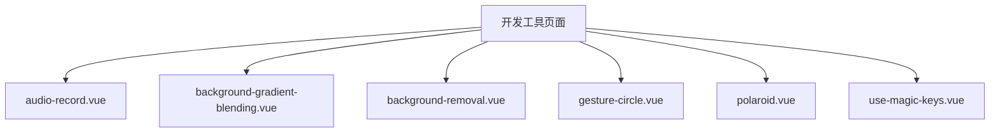
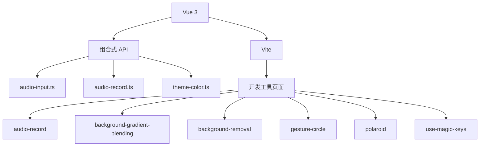
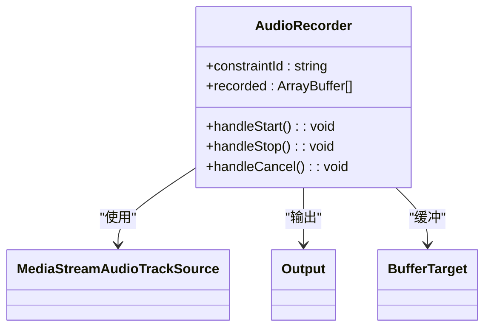
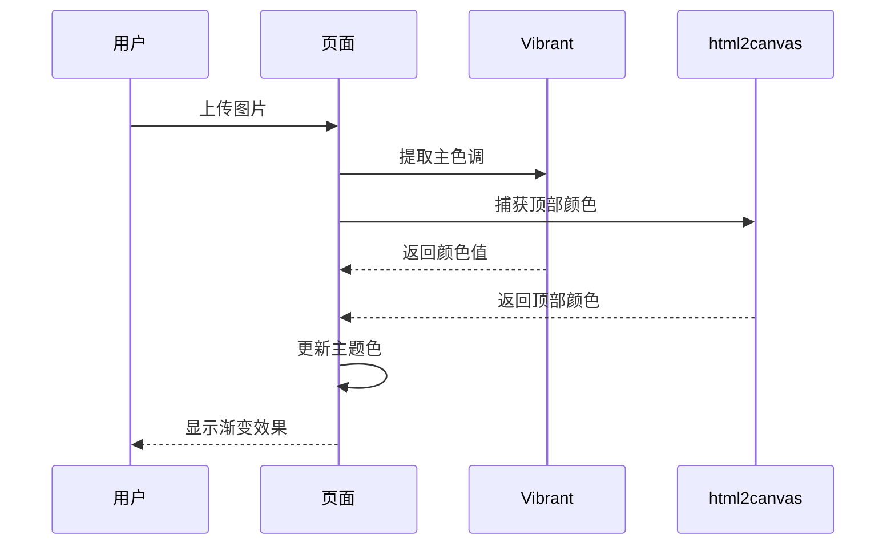
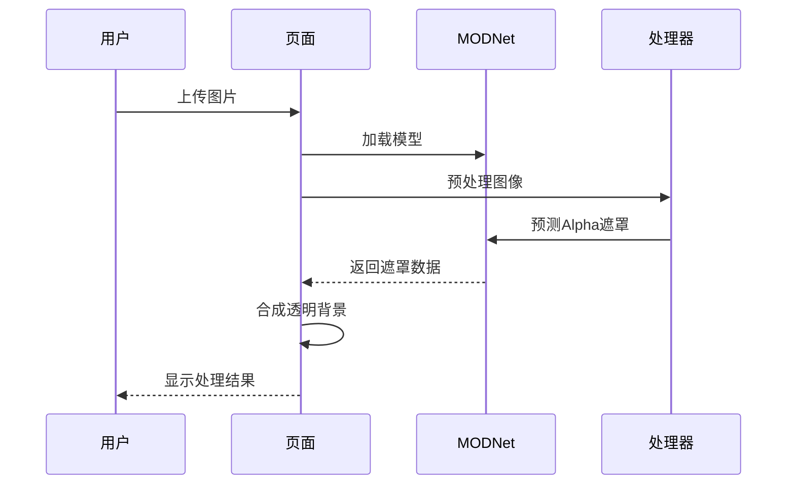
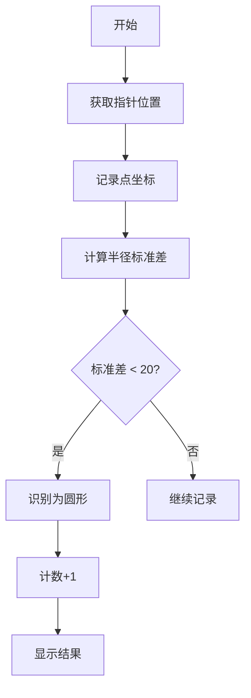
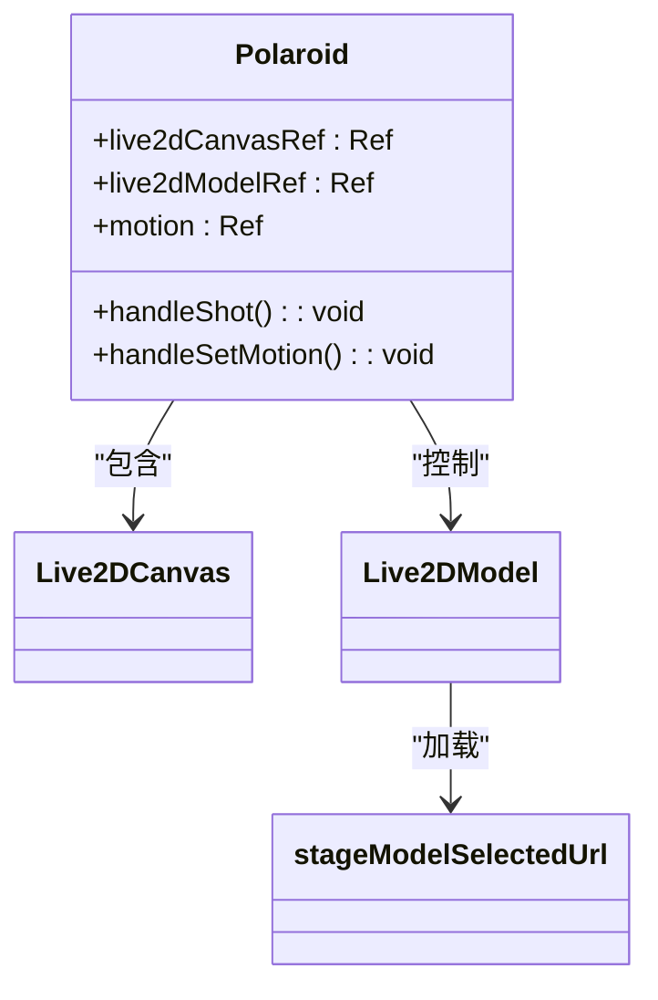
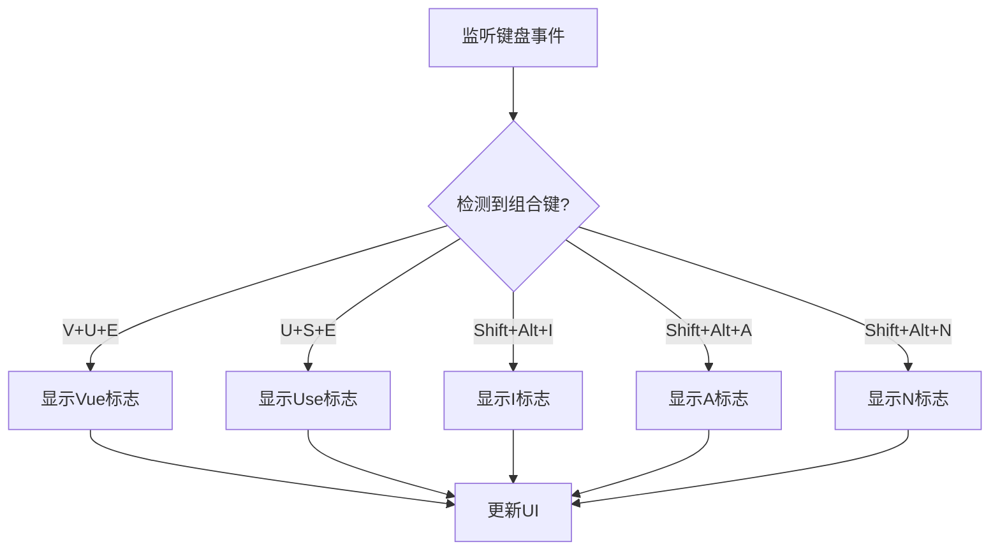

# 开发工具页面

<cite>
**本文档引用的文件**  
- [audio-record.vue](file://apps/stage-web/src/pages/devtools/audio-record.vue)
- [background-gradient-blending.vue](file://apps/stage-web/src/pages/devtools/background-gradient-blending.vue)
- [background-removal.vue](file://apps/stage-web/src/pages/devtools/background-removal.vue)
- [gesture-circle.vue](file://apps/stage-web/src/pages/devtools/gesture-circle.vue)
- [polaroid.vue](file://apps/stage-web/src/pages/devtools/polaroid.vue)
- [use-magic-keys.vue](file://apps/stage-web/src/pages/devtools/use-magic-keys.vue)
- [audio-input.ts](file://apps/stage-web/src/composables/audio-input.ts)
- [audio-record.ts](file://apps/stage-web/src/composables/audio-record.ts)
- [theme-color.ts](file://apps/stage-web/src/composables/theme-color.ts)
- [typed-router.d.ts](file://apps/stage-web/src/typed-router.d.ts)
</cite>

## 目录
1. [简介](#简介)
2. [项目结构](#项目结构)
3. [核心组件](#核心组件)
4. [架构概述](#架构概述)
5. [详细组件分析](#详细组件分析)
6. [依赖分析](#依赖分析)
7. [性能考虑](#性能考虑)
8. [故障排除指南](#故障排除指南)
9. [结论](#结论)

## 简介
本项目包含多个开发工具页面，用于调试和演示各种功能。这些页面包括音频录制、视觉效果处理、手势识别、图像渲染和键盘快捷键集成。每个页面都作为独立的调试工具，提供实时反馈和状态监控功能。

## 项目结构
开发工具页面位于 `apps/stage-web/src/pages/devtools` 目录下，每个页面对应一个独立的 Vue 组件文件。这些页面通过 Vue Router 进行路由管理，并使用组合式 API 实现功能逻辑。



**图示来源**
- [typed-router.d.ts](file://apps/stage-web/src/typed-router.d.ts#L28-L28)

**章节来源**
- [typed-router.d.ts](file://apps/stage-web/src/typed-router.d.ts#L118-L121)

## 核心组件
核心组件包括音频录制、背景渐变融合、背景移除、手势识别、宝丽来截图和魔法键集成。这些组件通过组合式 API 和第三方库实现特定功能。

**章节来源**
- [audio-record.vue](file://apps/stage-web/src/pages/devtools/audio-record.vue#L1-L73)
- [background-gradient-blending.vue](file://apps/stage-web/src/pages/devtools/background-gradient-blending.vue#L1-L301)

## 架构概述
系统架构基于 Vue 3 和组合式 API，使用 Vite 作为构建工具。各个开发工具页面通过独立的 Vue 组件实现，共享部分组合式函数（composables）以提高代码复用性。



**图示来源**
- [app.vue](file://apps/stage-web/src/App.vue#L1-L50)
- [main.ts](file://apps/stage-web/src/main.ts#L1-L20)

## 详细组件分析

### 音频录制页面分析
该页面用于测试音频录制流程，允许用户选择音频输入设备并录制音频。

#### 组件实现


**图示来源**
- [audio-record.vue](file://apps/stage-web/src/pages/devtools/audio-record.vue#L1-L73)
- [audio-input.ts](file://apps/stage-web/src/composables/audio-input.ts#L1-L83)

**章节来源**
- [audio-record.vue](file://apps/stage-web/src/pages/devtools/audio-record.vue#L1-L73)
- [audio-input.ts](file://apps/stage-web/src/composables/audio-input.ts#L1-L83)

### 视觉效果处理页面分析
包括背景渐变融合和背景移除两个页面，用于展示视觉效果处理能力。

#### 背景渐变融合


**图示来源**
- [background-gradient-blending.vue](file://apps/stage-web/src/pages/devtools/background-gradient-blending.vue#L1-L301)
- [theme-color.ts](file://apps/stage-web/src/composables/theme-color.ts#L1-L46)

#### 背景移除


**图示来源**
- [background-removal.vue](file://apps/stage-web/src/pages/devtools/background-removal.vue#L1-L183)

**章节来源**
- [background-removal.vue](file://apps/stage-web/src/pages/devtools/background-removal.vue#L1-L183)

### 手势识别页面分析
该页面用于测试圆形手势识别功能。



**图示来源**
- [gesture-circle.vue](file://apps/stage-web/src/pages/devtools/gesture-circle.vue#L1-L180)

**章节来源**
- [gesture-circle.vue](file://apps/stage-web/src/pages/devtools/gesture-circle.vue#L1-L180)

### 宝丽来截图页面分析
该页面用于演示 Live2D 模型渲染和截图功能。



**图示来源**
- [polaroid.vue](file://apps/stage-web/src/pages/devtools/polaroid.vue#L1-L94)

**章节来源**
- [polaroid.vue](file://apps/stage-web/src/pages/devtools/polaroid.vue#L1-L94)

### 魔法键集成页面分析
该页面用于测试键盘快捷键集成。



**图示来源**
- [use-magic-keys.vue](file://apps/stage-web/src/pages/devtools/use-magic-keys.vue#L1-L131)

**章节来源**
- [use-magic-keys.vue](file://apps/stage-web/src/pages/devtools/use-magic-keys.vue#L1-L131)

## 依赖分析
开发工具页面依赖多个第三方库和内部模块，形成清晰的依赖关系。

```mermaid
graph TD
A[audio-record] --> B[mediabunny]
A --> C[@vueuse/core]
D[background-gradient-blending] --> E[node-vibrant]
D --> F[html2canvas]
D --> G[culori]
H[background-removal] --> I[@huggingface/transformers]
H --> J[gpuu/webgpu]
K[gesture-circle] --> L[@vueuse/core]
M[polaroid] --> N[@proj-airi/stage-ui]
O[use-magic-keys] --> P[@vueuse/core]
```

**图示来源**
- [package.json](file://apps/stage-web/package.json#L1-L50)
- [vite.config.ts](file://apps/stage-web/vite.config.ts#L1-L20)

**章节来源**
- [package.json](file://apps/stage-web/package.json#L1-L50)

## 性能考虑
各开发工具页面在实现功能时考虑了性能优化：
- 音频录制使用 Web Audio API 进行高效处理
- 背景移除利用 WebGPU 加速模型推理
- 手势识别使用节流和防抖优化指针事件处理
- 图像处理采用合适的采样率和分辨率

## 故障排除指南
常见问题及解决方案：
- 音频设备无法访问：检查浏览器权限设置
- 模型加载失败：确保 WebGPU 支持
- 颜色提取不准确：检查图片跨域设置
- 手势识别不灵敏：调整标准差阈值

**章节来源**
- [audio-input.ts](file://apps/stage-web/src/composables/audio-input.ts#L1-L83)
- [background-removal.vue](file://apps/stage-web/src/pages/devtools/background-removal.vue#L1-L183)

## 结论
开发工具页面为调试和演示提供了完整的解决方案，涵盖了音频、视觉、交互等多个方面。通过模块化设计和组合式 API，实现了高复用性和可维护性。新增调试页面时，建议遵循现有模式，使用组合式函数封装通用逻辑。