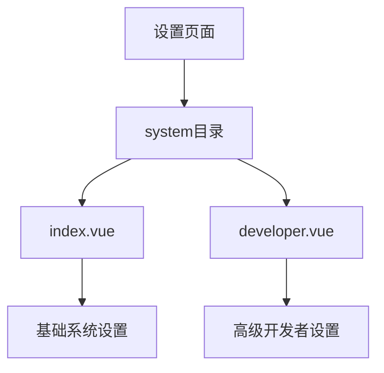
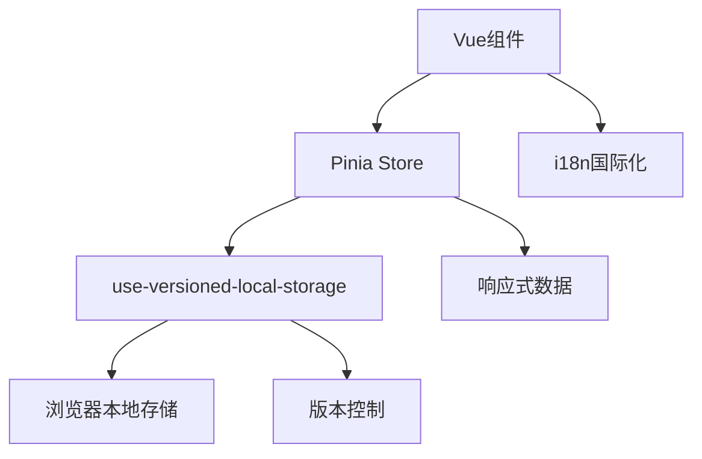
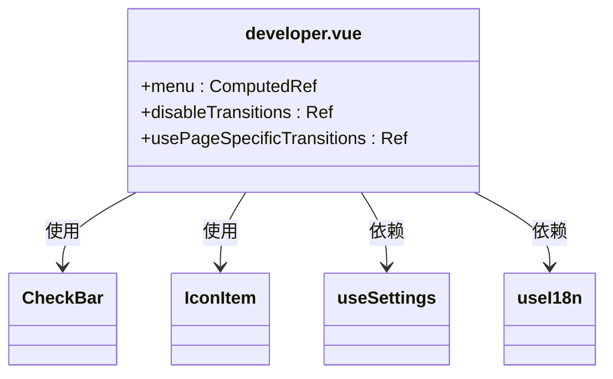
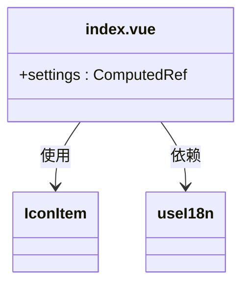
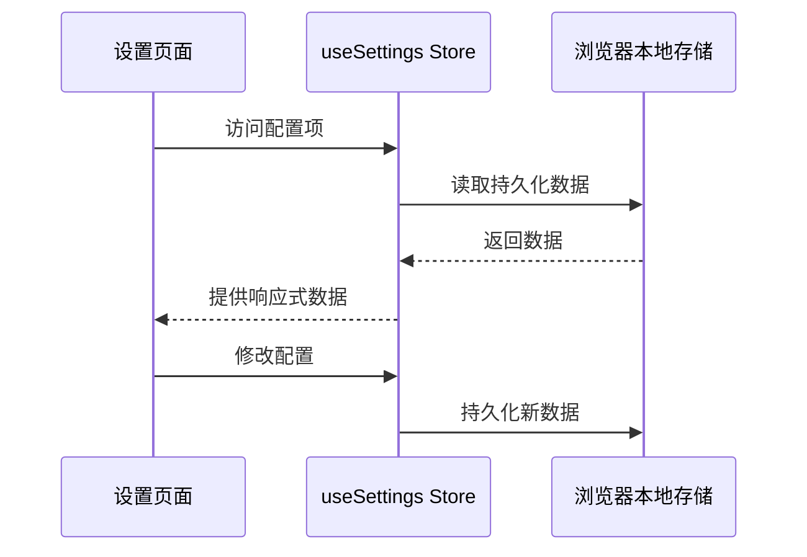
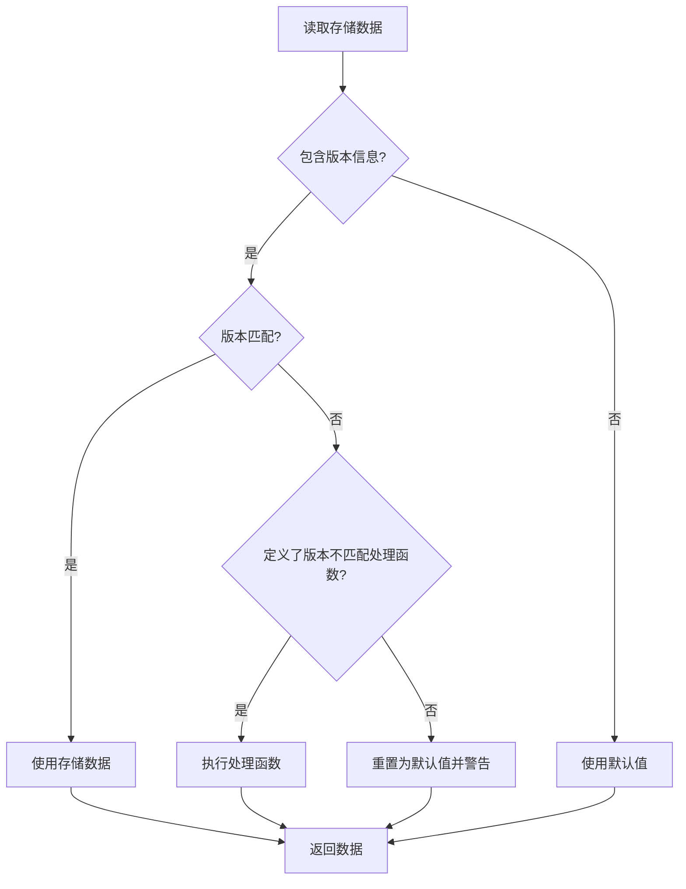
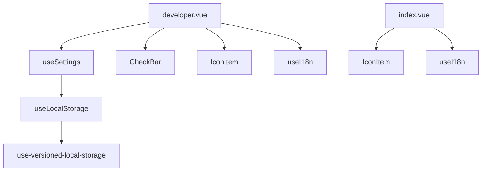

# 设置页面

<cite>
**Referenced Files in This Document**  
- [developer.vue](file://apps/stage-web/src/pages/settings/system/developer.vue)
- [index.vue](file://apps/stage-web/src/pages/settings/system/index.vue)
- [settings.ts](file://packages/stage-ui/src/stores/settings.ts)
- [use-versioned-local-storage/index.ts](file://apps/stage-tamagotchi/src/renderer/composables/vueuse/use-versioned-local-storage/index.ts)
</cite>

## 目录
1. [简介](#简介)
2. [项目结构](#项目结构)
3. [核心组件](#核心组件)
4. [架构概述](#架构概述)
5. [详细组件分析](#详细组件分析)
6. [依赖分析](#依赖分析)
7. [性能考虑](#性能考虑)
8. [故障排除指南](#故障排除指南)
9. [结论](#结论)

## 简介
本文档详细解析 stage-web 应用中的设置页面，重点关注 system 目录下的开发者设置功能。文档将深入分析 developer.vue 提供的高级配置选项（如性能监控、日志级别、插件调试）和 index.vue 的基础系统设置功能。同时，文档将阐述页面与全局 Pinia store 的联动机制、配置项的持久化策略（使用 use-versioned-local-storage）以及响应式更新界面的方法。最后，文档将提供自定义设置项的添加流程，包括表单组件绑定、验证规则和状态同步。

## 项目结构
设置页面的文件结构位于 `apps/stage-web/src/pages/settings/system` 目录下，包含两个主要的 Vue 组件文件：`developer.vue` 和 `index.vue`。这些文件负责呈现系统设置的不同方面，从基础配置到高级开发者选项。

**Diagram sources**
- [index.vue](file://apps/stage-web/src/pages/settings/system/index.vue)
- [developer.vue](file://apps/stage-web/src/pages/settings/system/developer.vue)

**Section sources**
- [index.vue](file://apps/stage-web/src/pages/settings/system/index.vue)
- [developer.vue](file://apps/stage-web/src/pages/settings/system/developer.vue)

## 核心组件
核心组件包括 `index.vue` 和 `developer.vue`，它们分别提供基础系统设置和高级开发者配置功能。这些组件通过 Pinia store 与全局状态进行交互，并使用本地存储来持久化用户配置。

**Section sources**
- [index.vue](file://apps/stage-web/src/pages/settings/system/index.vue)
- [developer.vue](file://apps/stage-web/src/pages/settings/system/developer.vue)

## 架构概述
设置页面的架构基于 Vue 3 的组合式 API，使用 Pinia 作为状态管理工具。组件通过 `useSettings` store 访问和修改全局配置，并使用 `use-versioned-local-storage` 来确保配置的持久化和版本兼容性。

**Diagram sources**
- [settings.ts](file://packages/stage-ui/src/stores/settings.ts)
- [use-versioned-local-storage/index.ts](file://apps/stage-tamagotchi/src/renderer/composables/vueuse/use-versioned-local-storage/index.ts)

## 详细组件分析

### developer.vue 分析
`developer.vue` 组件提供了高级开发者设置选项，包括性能监控、日志级别调整和插件调试功能。该组件使用 `CheckBar` 和 `IconItem` 组件来创建用户友好的界面，并通过 `useSettings` store 访问和修改配置。

**Diagram sources**
- [developer.vue](file://apps/stage-web/src/pages/settings/system/developer.vue)
- [settings.ts](file://packages/stage-ui/src/stores/settings.ts)

**Section sources**
- [developer.vue](file://apps/stage-web/src/pages/settings/system/developer.vue)

### index.vue 分析
`index.vue` 组件提供了基础系统设置功能，包括通用设置、颜色方案和开发者选项的入口。该组件使用 `computed` 属性来动态生成设置菜单，并通过 `useI18n` 实现国际化支持。

**Diagram sources**
- [index.vue](file://apps/stage-web/src/pages/settings/system/index.vue)

**Section sources**
- [index.vue](file://apps/stage-web/src/pages/settings/system/index.vue)

### Pinia Store 联动机制
设置页面通过 `useSettings` store 与全局状态进行联动。该 store 定义了各种配置项，如 `disableTransitions` 和 `usePageSpecificTransitions`，并使用 `useLocalStorage` 来持久化这些配置。

**Diagram sources**
- [settings.ts](file://packages/stage-ui/src/stores/settings.ts)

**Section sources**
- [settings.ts](file://packages/stage-ui/src/stores/settings.ts)

### 配置持久化策略
配置项的持久化通过 `use-versioned-local-storage` 实现，该工具在标准 `useLocalStorage` 的基础上增加了版本控制功能。当存储数据的版本与当前应用版本不匹配时，系统会根据配置自动处理版本不兼容的情况。

**Diagram sources**
- [use-versioned-local-storage/index.ts](file://apps/stage-tamagotchi/src/renderer/composables/vueuse/use-versioned-local-storage/index.ts)

**Section sources**
- [use-versioned-local-storage/index.ts](file://apps/stage-tamagotchi/src/renderer/composables/vueuse/use-versioned-local-storage/index.ts)

## 依赖分析
设置页面的组件依赖于多个核心模块，包括 Pinia store、VueUse 工具库和国际化支持。这些依赖关系确保了组件的功能完整性和用户体验的一致性。

**Diagram sources**
- [developer.vue](file://apps/stage-web/src/pages/settings/system/developer.vue)
- [index.vue](file://apps/stage-web/src/pages/settings/system/index.vue)
- [settings.ts](file://packages/stage-ui/src/stores/settings.ts)

**Section sources**
- [developer.vue](file://apps/stage-web/src/pages/settings/system/developer.vue)
- [index.vue](file://apps/stage-web/src/pages/settings/system/index.vue)
- [settings.ts](file://packages/stage-ui/src/stores/settings.ts)

## 性能考虑
设置页面的性能优化主要体现在以下几个方面：
- 使用 `computed` 属性来缓存计算结果，避免重复计算
- 通过 `v-motion` 指令实现流畅的动画效果，提升用户体验
- 使用 `use-versioned-local-storage` 的版本控制机制，避免不必要的数据迁移和处理

## 故障排除指南
当设置页面出现异常时，可以按照以下步骤进行排查：
1. 检查浏览器控制台是否有错误信息
2. 确认本地存储中的配置数据是否完整和正确
3. 验证 Pinia store 的状态是否正常
4. 检查 `use-versioned-local-storage` 的版本控制逻辑是否按预期工作

**Section sources**
- [use-versioned-local-storage/index.ts](file://apps/stage-tamagotchi/src/renderer/composables/vueuse/use-versioned-local-storage/index.ts)

## 结论
stage-web 的设置页面通过合理的架构设计和组件划分，提供了灵活且易于维护的配置管理功能。通过 Pinia store 和 `use-versioned-local-storage` 的结合使用，系统实现了配置的全局状态管理和持久化存储，同时保证了版本兼容性。开发者可以基于现有的模式轻松添加新的设置项，扩展系统的功能。