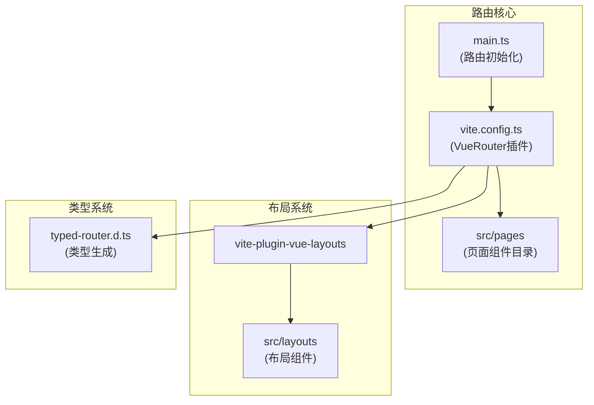
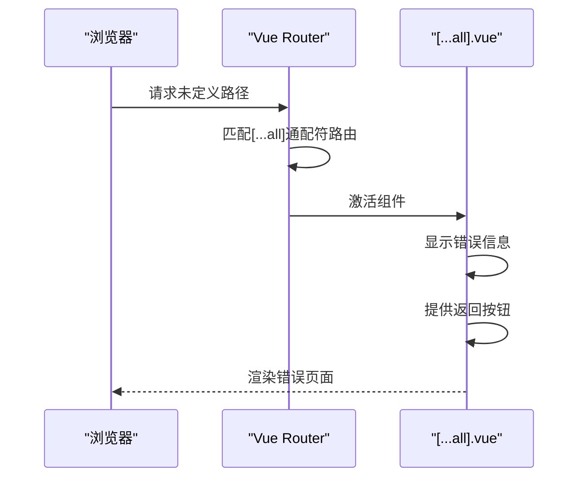
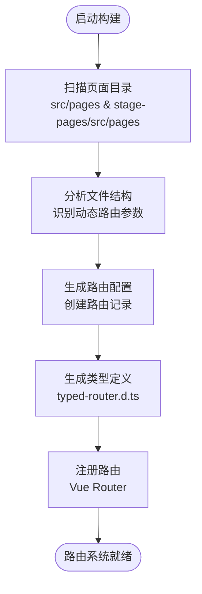
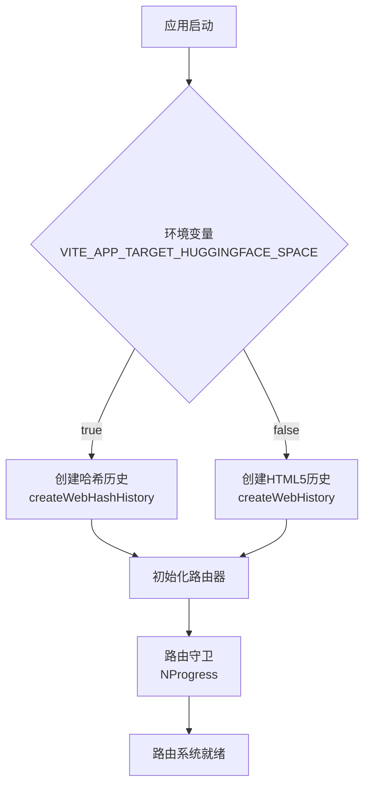
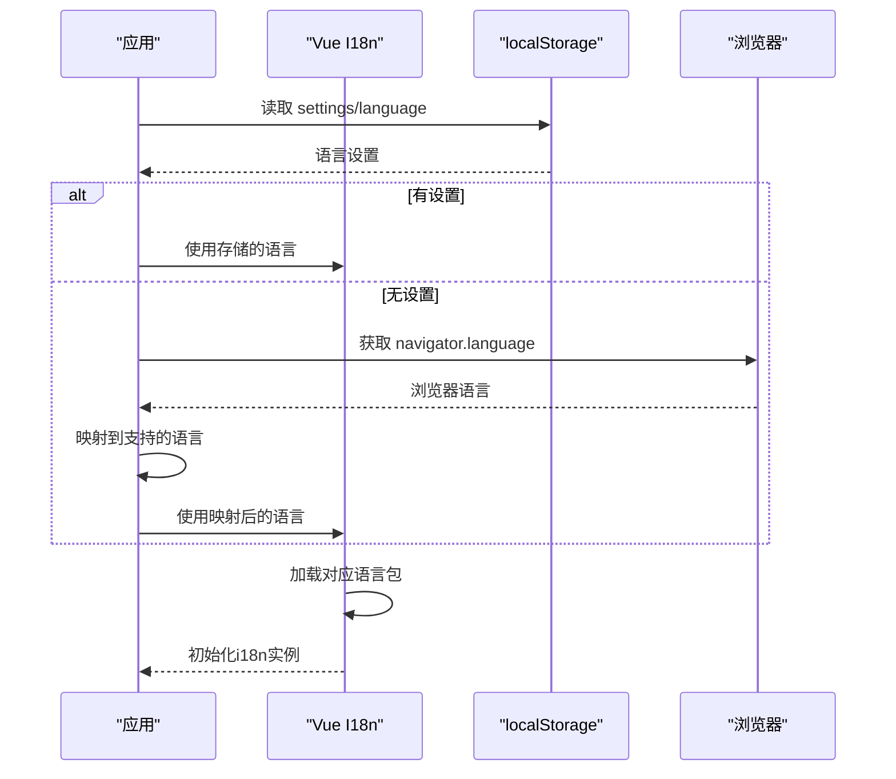
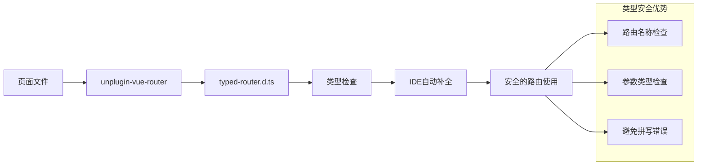

# 路由机制

<cite>
**Referenced Files in This Document**   
- [apps/stage-web/src/pages/[...all].vue](file://apps/stage-web/src/pages/[...all].vue)
- [apps/stage-web/vite.config.ts](file://apps/stage-web/vite.config.ts)
- [apps/stage-web/src/main.ts](file://apps/stage-web/src/main.ts)
- [apps/stage-web/src/layouts/default.vue](file://apps/stage-web/src/layouts/default.vue)
- [apps/stage-web/src/layouts/home.vue](file://apps/stage-web/src/layouts/home.vue)
- [apps/stage-web/src/layouts/stage.vue](file://apps/stage-web/src/layouts/stage.vue)
- [apps/stage-web/src/layouts/plain.vue](file://apps/stage-web/src/layouts/plain.vue)
- [apps/stage-web/src/modules/i18n.ts](file://apps/stage-web/src/modules/i18n.ts)
- [apps/stage-web/src/typed-router.d.ts](file://apps/stage-web/src/typed-router.d.ts)
</cite>

## 目录
1. [项目结构](#项目结构)
2. [通配符路由实现](#通配符路由实现)
3. [文件系统路由自动生成](#文件系统路由自动生成)
4. [路由历史模式配置](#路由历史模式配置)
5. [布局系统集成](#布局系统集成)
6. [国际化路由支持](#国际化路由支持)
7. [类型安全路由](#类型安全路由)

## 项目结构

stage-web应用的路由系统基于Vue Router的文件系统自动生成机制，通过Vite插件实现。项目中的`src/pages`目录包含了所有路由页面组件，包括通配符路由`[...all].vue`。



**Diagram sources**
- [vite.config.ts](file://apps/stage-web/vite.config.ts#L1-L180)
- [main.ts](file://apps/stage-web/src/main.ts#L1-L52)

**Section sources**
- [pages](file://apps/stage-web/src/pages)
- [layouts](file://apps/stage-web/src/layouts)

## 通配符路由实现

通配符路由`[...all].vue`用于处理所有未匹配的路径请求，实现错误页面的降级处理策略。该组件通过Vue Router的路由参数捕获所有路径段，并提供用户友好的回退界面。



**Diagram sources**
- [apps/stage-web/src/pages/[...all].vue](file://apps/stage-web/src/pages/[...all].vue#L1-L20)

**Section sources**
- [apps/stage-web/src/pages/[...all].vue](file://apps/stage-web/src/pages/[...all].vue#L1-L20)

## 文件系统路由自动生成

路由系统通过`unplugin-vue-router`插件实现基于文件系统的自动路由生成。插件扫描指定的页面目录，根据文件路径和命名约定自动生成路由配置，无需手动定义路由表。



**Diagram sources**
- [vite.config.ts](file://apps/stage-web/vite.config.ts#L1-L180)

**Section sources**
- [vite.config.ts](file://apps/stage-web/vite.config.ts#L1-L180)

## 路由历史模式配置

应用根据环境变量动态选择路由历史模式，支持哈希模式和HTML5历史模式。在Hugging Face Space部署时使用哈希模式，其他环境使用HTML5历史模式，确保在不同部署环境下的路由兼容性。



**Diagram sources**
- [main.ts](file://apps/stage-web/src/main.ts#L1-L52)

**Section sources**
- [main.ts](file://apps/stage-web/src/main.ts#L1-L52)

## 布局系统集成

路由系统与`vite-plugin-vue-layouts`插件集成，实现基于布局的页面结构管理。不同页面可以指定不同的布局组件，通过`setupLayouts`函数将路由记录与布局系统关联，实现灵活的页面布局配置。

```mermaid
classDiagram
class LayoutsPlugin {
+setupLayouts(routes)
+resolveLayout(route)
}
class LayoutComponent {
+<template>
+<RouterView/>
}
class RouteRecord {
+name
+path
+meta.layout
}
LayoutsPlugin --> RouteRecord : "处理"
LayoutComponent --> LayoutsPlugin : "提供"
RouteRecord --> LayoutComponent : "引用"
note right of LayoutsPlugin
根据路由元数据
自动应用对应布局
end
```

**Diagram sources**
- [vite.config.ts](file://apps/stage-web/vite.config.ts#L1-L180)
- [default.vue](file://apps/stage-web/src/layouts/default.vue#L1-L31)
- [home.vue](file://apps/stage-web/src/layouts/home.vue#L1-L21)
- [stage.vue](file://apps/stage-web/src/layouts/stage.vue#L1-L10)
- [plain.vue](file://apps/stage-web/src/layouts/plain.vue#L1-L4)

**Section sources**
- [vite.config.ts](file://apps/stage-web/vite.config.ts#L1-L180)
- [layouts](file://apps/stage-web/src/layouts)

## 国际化路由支持

路由系统与Vue I18n集成，支持多语言路由。通过`@intlify/unplugin-vue-i18n/vite`插件自动加载语言包，并根据浏览器语言设置和本地存储的用户偏好选择合适的语言环境，实现无缝的国际化体验。



**Diagram sources**
- [i18n.ts](file://apps/stage-web/src/modules/i18n.ts#L1-L50)

**Section sources**
- [i18n.ts](file://apps/stage-web/src/modules/i18n.ts#L1-L50)

## 类型安全路由

系统通过`unplugin-vue-router`插件生成类型安全的路由定义，确保路由使用时的类型检查。生成的`typed-router.d.ts`文件包含所有路由的类型信息，支持IDE的自动补全和编译时检查，减少路由相关的运行时错误。



**Diagram sources**
- [typed-router.d.ts](file://apps/stage-web/src/typed-router.d.ts#L7-L310)

**Section sources**
- [typed-router.d.ts](file://apps/stage-web/src/typed-router.d.ts#L7-L310)