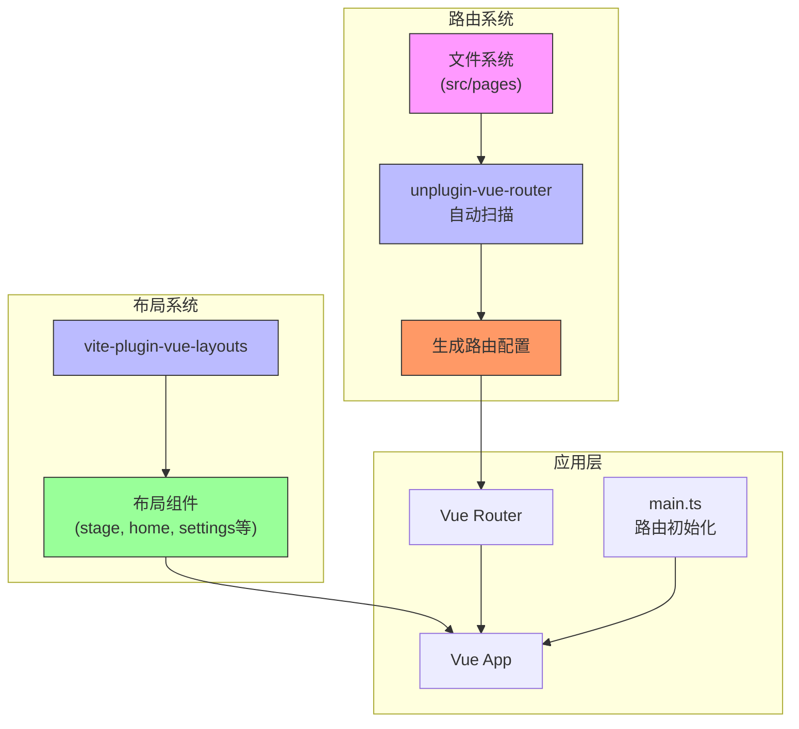
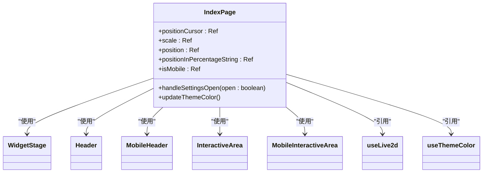
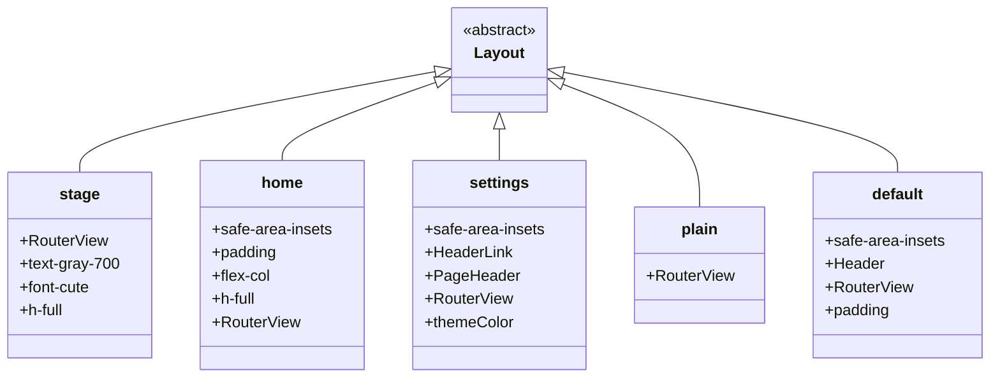
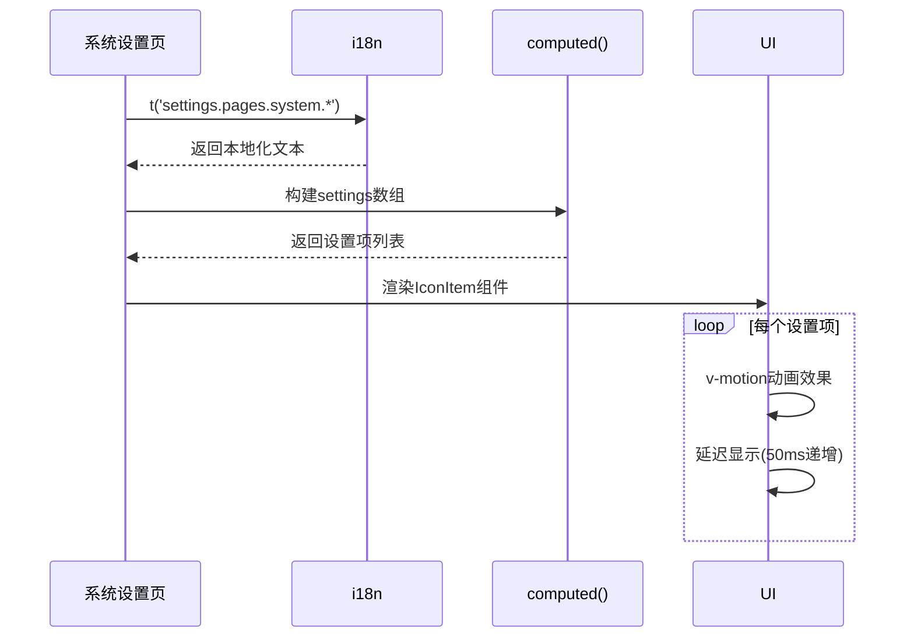
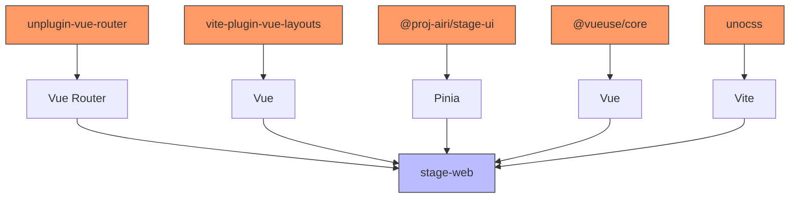

# 页面系统

<cite>
**本文档中引用的文件**  
- [index.vue](file://apps/stage-web/src/pages/index.vue)
- [...all].vue](file://apps/stage-web/src/pages/[...all].vue)
- [vite.config.ts](file://apps/stage-web/vite.config.ts)
- [main.ts](file://apps/stage-web/src/main.ts)
- [stage.vue](file://apps/stage-web/src/layouts/stage.vue)
- [home.vue](file://apps/stage-web/src/layouts/home.vue)
- [settings.vue](file://apps/stage-web/src/layouts/settings.vue)
- [plain.vue](file://apps/stage-web/src/layouts/plain.vue)
- [audio-record.vue](file://apps/stage-web/src/pages/devtools/audio-record.vue)
- [gesture-circle.vue](file://apps/stage-web/src/pages/devtools/gesture-circle.vue)
- [background-removal.vue](file://apps/stage-web/src/pages/devtools/background-removal.vue)
- [use-magic-keys.vue](file://apps/stage-web/src/pages/devtools/use-magic-keys.vue)
- [default.vue](file://apps/stage-web/src/layouts/default.vue)
- [index.vue](file://apps/stage-web/src/pages/settings/system/index.vue)
</cite>

## 目录
1. [简介](#简介)
2. [项目结构](#项目结构)
3. [核心组件](#核心组件)
4. [架构概述](#架构概述)
5. [详细组件分析](#详细组件分析)
6. [依赖分析](#依赖分析)
7. [性能考虑](#性能考虑)
8. [故障排除指南](#故障排除指南)
9. [结论](#结论)

## 简介
本文档详细说明了 `stage-web` 应用中的页面系统实现机制。重点介绍基于文件系统的路由自动映射、主页与通配符路由的功能、布局系统的设计，以及 `devtools` 调试页面的具体用途和测试方法。同时提供创建新页面的完整指南，涵盖命名规范、布局绑定和元信息配置。

## 项目结构
`stage-web` 应用采用基于 Vue 的模块化结构，页面系统主要由 `src/pages` 目录驱动，通过 Vite 插件实现自动路由生成。核心目录包括：
- `src/pages`：存放所有页面组件，支持嵌套和动态路由
- `src/layouts`：定义多种页面布局模板
- `src/components`：通用 UI 组件库
- `src/composables`：可复用的逻辑组合函数

页面路径与文件系统路径直接对应，通过 `unplugin-vue-router` 实现自动路由注册。

**Section sources**
- [vite.config.ts](file://apps/stage-web/vite.config.ts#L50-L58)
- [main.ts](file://apps/stage-web/src/main.ts#L25-L28)

## 核心组件
系统核心包括基于文件系统的路由机制、多种布局模板和专用调试工具页面。路由通过 `unplugin-vue-router` 插件扫描 `src/pages` 目录自动生成，支持 `.vue` 和 `.md` 文件。布局系统通过 `vite-plugin-vue-layouts` 实现，允许页面通过元信息指定不同布局。

**Section sources**
- [vite.config.ts](file://apps/stage-web/vite.config.ts#L50-L60)
- [main.ts](file://apps/stage-web/src/main.ts#L25-L28)
- [Layouts](file://apps/stage-web/vite.config.ts#L62-L64)

## 架构概述
系统采用基于 Vue Router 的文件系统路由架构，通过 Vite 插件链实现自动化路由生成和布局管理。页面组件与 URL 路径直接映射，配合多种布局模板实现灵活的界面展示。



**Diagram sources**
- [vite.config.ts](file://apps/stage-web/vite.config.ts#L50-L64)
- [main.ts](file://apps/stage-web/src/main.ts#L25-L28)

## 详细组件分析

### 主页实现分析
主页 `index.vue` 是应用的默认入口页面，采用 `stage` 布局，集成 Live2D 角色展示和交互区域。页面通过组合多个 UI 组件实现丰富的视觉效果和交互功能。



**Diagram sources**
- [index.vue](file://apps/stage-web/src/pages/index.vue#L1-L75)

**Section sources**
- [index.vue](file://apps/stage-web/src/pages/index.vue#L1-L75)
- [stage.vue](file://apps/stage-web/src/layouts/stage.vue#L1-L10)

### 通配符路由分析
`[...all].vue` 文件实现通配符路由，用于处理未匹配的 URL 请求。当用户访问不存在的页面时，系统会显示友好提示并提供返回按钮。

```mermaid
flowchart TD
Start([请求页面]) --> Match{路径匹配?}
Match --> |是| NormalPage[正常页面渲染]
Match --> |否| Wildcard[[...all].vue]
Wildcard --> ShowMessage["显示'Where are we?'"]
ShowMessage --> ShowButton["显示'Go Back'按钮"]
ShowButton --> HandleClick["点击返回上一页"]
HandleClick --> router.go(-1)
```

**Diagram sources**
- [...all].vue](file://apps/stage-web/src/pages/[...all].vue#L1-L20)

**Section sources**
- [...all].vue](file://apps/stage-web/src/pages/[...all].vue#L1-L20)

### 布局系统分析
系统提供多种布局模板，通过 `vite-plugin-vue-layouts` 实现。每个布局组件封装了不同的页面结构和样式。

#### 布局类型


**Diagram sources**
- [stage.vue](file://apps/stage-web/src/layouts/stage.vue#L1-L10)
- [home.vue](file://apps/stage-web/src/layouts/home.vue#L1-L21)
- [settings.vue](file://apps/stage-web/src/layouts/settings.vue#L1-L150)
- [plain.vue](file://apps/stage-web/src/layouts/plain.vue#L1-L4)
- [default.vue](file://apps/stage-web/src/layouts/default.vue#L1-L31)

**Section sources**
- [stage.vue](file://apps/stage-web/src/layouts/stage.vue#L1-L10)
- [home.vue](file://apps/stage-web/src/layouts/home.vue#L1-L21)
- [settings.vue](file://apps/stage-web/src/layouts/settings.vue#L1-L150)
- [plain.vue](file://apps/stage-web/src/layouts/plain.vue#L1-L4)
- [default.vue](file://apps/stage-web/src/layouts/default.vue#L1-L31)

### 系统设置页面分析
`settings/system/index.vue` 是系统设置的主入口页面，通过动态生成设置项列表实现模块化导航。



**Diagram sources**
- [index.vue](file://apps/stage-web/src/pages/settings/system/index.vue#L1-L71)

**Section sources**
- [index.vue](file://apps/stage-web/src/pages/settings/system/index.vue#L1-L71)

## 依赖分析
系统依赖关系清晰，主要依赖包括：



**Diagram sources**
- [vite.config.ts](file://apps/stage-web/vite.config.ts#L50-L64)
- [main.ts](file://apps/stage-web/src/main.ts#L1-L52)

**Section sources**
- [vite.config.ts](file://apps/stage-web/vite.config.ts#L50-L64)
- [main.ts](file://apps/stage-web/src/main.ts#L1-L52)

## 性能考虑
系统在性能方面做了多项优化：
- 使用 `refThrottled` 和 `refDebounced` 优化手势识别性能
- 通过 `warmup` 预加载关键组件提升首屏加载速度
- 合理使用 `v-motion` 动画避免过度渲染
- WebGPU 加速图像处理任务

## 故障排除指南
### 常见问题
1. **页面未自动注册**：检查 `vite.config.ts` 中 `routesFolder` 配置是否正确包含 `src/pages`
2. **布局不生效**：确认页面组件中 `meta.layout` 配置正确
3. **路由跳转失败**：检查 `main.ts` 中路由历史模式配置

### 调试工具使用
- `audio-record.vue`：测试音频输入设备和录音功能
- `gesture-circle.vue`：调试手势识别算法
- `background-removal.vue`：验证图像背景移除效果
- `use-magic-keys.vue`：测试键盘快捷键组合

**Section sources**
- [audio-record.vue](file://apps/stage-web/src/pages/devtools/audio-record.vue#L1-L74)
- [gesture-circle.vue](file://apps/stage-web/src/pages/devtools/gesture-circle.vue#L1-L181)
- [background-removal.vue](file://apps/stage-web/src/pages/devtools/background-removal.vue#L1-L184)
- [use-magic-keys.vue](file://apps/stage-web/src/pages/devtools/use-magic-keys.vue#L1-L132)

## 结论
`stage-web` 页面系统通过现代化的 Vite 插件生态实现了高效、灵活的路由和布局管理。基于文件系统的路由机制简化了页面创建流程，多种布局模板满足不同场景需求，专用调试工具页面为开发和测试提供了便利。系统架构清晰，性能优化到位，为后续功能扩展奠定了良好基础。