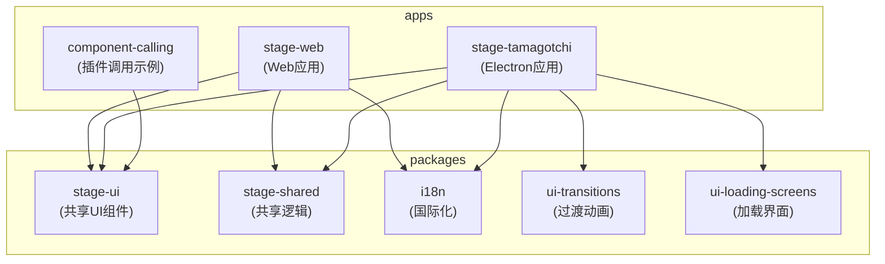
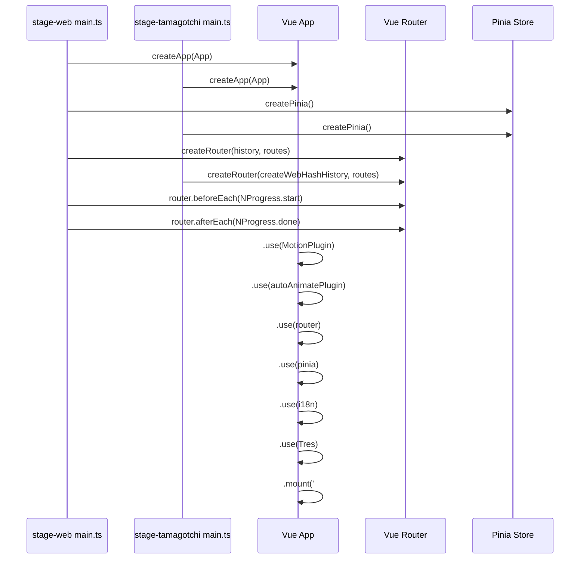
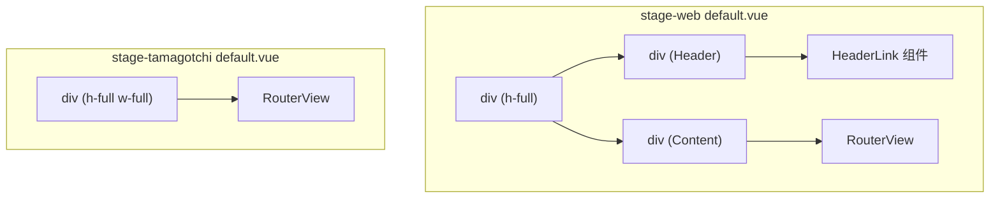
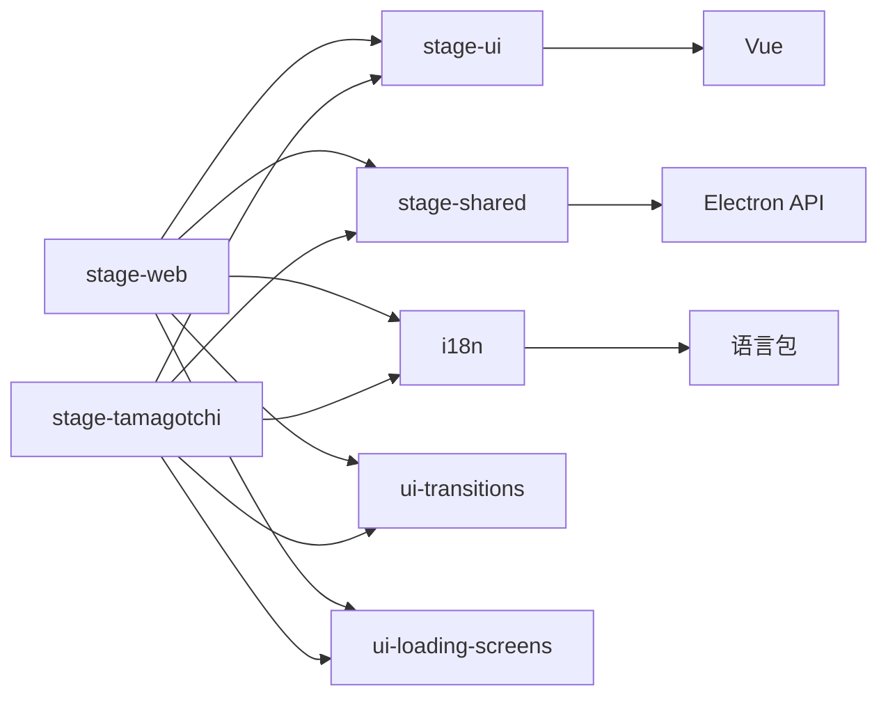

# 前端架构

<cite>
**本文档中引用的文件**  
- [main.ts](file://apps/stage-web/src/main.ts)
- [main.ts](file://apps/stage-tamagotchi/src/renderer/main.ts)
- [theme-color.ts](file://apps/stage-web/src/composables/theme-color.ts)
- [theme-color.ts](file://apps/stage-tamagotchi/src/renderer/composables/theme-color.ts)
- [default.vue](file://apps/stage-web/src/layouts/default.vue)
- [default.vue](file://apps/stage-tamagotchi/src/renderer/layouts/default.vue)
- [i18n.ts](file://apps/stage-web/src/modules/i18n.ts)
- [i18n.ts](file://apps/stage-tamagotchi/src/renderer/modules/i18n.ts)
- [pwa.ts](file://apps/stage-web/src/stores/pwa.ts)
- [window.ts](file://apps/stage-tamagotchi/src/renderer/stores/window.ts)
- [resources.ts](file://apps/stage-tamagotchi/src/renderer/stores/resources.ts)
</cite>

## 目录
1. [介绍](#介绍)
2. [项目结构](#项目结构)
3. [核心组件](#核心组件)
4. [架构概览](#架构概览)
5. [详细组件分析](#详细组件分析)
6. [依赖分析](#依赖分析)
7. [性能考虑](#性能考虑)
8. [故障排除指南](#故障排除指南)
9. [结论](#结论)

## 介绍
本文档旨在全面分析 `stage-web`（Web应用）与 `stage-tamagotchi`（Electron桌面应用）的前端架构。通过对比两者在初始化流程、状态管理、布局系统和插件集成方面的异同，揭示其设计共性与差异。重点阐述 Vue 3 Composition API 和 Pinia 状态管理在项目中的实际应用模式，并为开发者提供构建和扩展前端应用的最佳实践。

## 项目结构



**图示来源**  
- [stage-web](file://apps/stage-web)
- [stage-tamagotchi](file://apps/stage-tamagotchi)
- [stage-ui](file://packages/stage-ui)
- [stage-shared](file://packages/stage-shared)

**本节来源**  
- [project_structure](file://workspace_path)

## 核心组件

本文档分析的核心组件包括：
- **应用初始化**：`main.ts` 文件中的应用创建与插件集成逻辑。
- **状态管理**：使用 Pinia 实现的全局状态存储，如 PWA 更新状态和窗口资源加载状态。
- **国际化 (i18n)**：基于 `vue-i18n` 的多语言支持模块。
- **主题颜色管理**：动态更新主题颜色的可组合函数。
- **布局系统**：基于 Vue Router 自动生成布局的机制。
- **UI 组件库**：`stage-ui` 包提供的可复用组件。

**本节来源**  
- [main.ts](file://apps/stage-web/src/main.ts#L1-L51)
- [main.ts](file://apps/stage-tamagotchi/src/renderer/main.ts#L1-L49)
- [pwa.ts](file://apps/stage-web/src/stores/pwa.ts#L1-L36)
- [resources.ts](file://apps/stage-tamagotchi/src/renderer/stores/resources.ts#L1-L166)
- [i18n.ts](file://apps/stage-web/src/modules/i18n.ts#L1-L49)
- [theme-color.ts](file://apps/stage-web/src/composables/theme-color.ts#L1-L46)

## 架构概览

两个应用均采用基于 Vue 3 的现代化前端架构，核心依赖包括 Vue Router、Pinia、Vite 和 UnoCSS。它们共享了大量代码和设计模式，体现了高度的代码复用性。

```mermaid
graph TD
A[入口文件 main.ts] --> B[创建Vue应用]
B --> C[集成插件]
C --> D[Vue Router]
C --> E[Pinia]
C --> F[vue-i18n]
C --> G[AutoAnimate]
C --> H[VueUse Motion]
C --> I[TresJS]
B --> J[挂载到 #app]
D --> K[路由配置\nvue-router/auto-routes]
D --> L[布局系统\nvirtual:generated-layouts]
E --> M[状态存储\nPWA, 窗口, 资源]
F --> N[语言包\n@proj-airi/i18n/locales]
```

**图示来源**  
- [main.ts](file://apps/stage-web/src/main.ts#L1-L51)
- [main.ts](file://apps/stage-tamagotchi/src/renderer/main.ts#L1-L49)
- [i18n.ts](file://apps/stage-web/src/modules/i18n.ts#L1-L49)

## 详细组件分析

### 应用初始化与插件集成

两个应用的 `main.ts` 文件结构高度相似，均遵循以下初始化流程：
1.  **导入依赖**：导入 Vue、Vue Router、Pinia、i18n 等核心库和插件。
2.  **创建实例**：使用 `createApp` 创建 Vue 应用实例，`createPinia` 创建状态管理实例，`createRouter` 创建路由实例。
3.  **配置路由**：利用 `vue-router/auto-routes` 自动生成路由，并通过 `setupLayouts` 集成布局系统。
4.  **环境适配**：`stage-web` 根据环境变量 (`VITE_APP_TARGET_HUGGINGFACE_SPACE`) 动态选择 `createWebHashHistory` 或 `createWebHistory`。
5.  **路由守卫**：`stage-web` 使用 `router.beforeEach` 和 `router.afterEach` 集成了 NProgress，为页面跳转提供进度条反馈。
6.  **注册插件**：通过 `.use()` 方法依次注册 MotionPlugin、autoAnimatePlugin、router、pinia、i18n 和 TresJS。
7.  **挂载应用**：将应用挂载到 DOM 中的 `#app` 元素。



**图示来源**  
- [main.ts](file://apps/stage-web/src/main.ts#L1-L51)
- [main.ts](file://apps/stage-tamagotchi/src/renderer/main.ts#L1-L49)

**本节来源**  
- [main.ts](file://apps/stage-web/src/main.ts#L1-L51)
- [main.ts](file://apps/stage-tamagotchi/src/renderer/main.ts#L1-L49)

### 状态管理 (Pinia)

项目使用 Pinia 进行状态管理，定义了多个 store 来管理不同领域的状态。

#### Web应用状态 (PWA)
`stage-web` 定义了 `usePWAStore`，用于处理 PWA 应用的更新提示。它在 `onMounted` 生命周期中动态导入 `registerSW`，并在检测到新版本时，使用 `vue-sonner` 显示一个包含更新按钮的 Toast 通知。

#### 桌面应用状态 (窗口与资源)
`stage-tamagotchi` 定义了两个核心 store：
- **`useWindowStore`**：利用 `@vueuse/core` 的 `useWindowSize` 获取窗口尺寸，并结合自定义的 `useElectronRelativeMouse` 可组合函数，计算鼠标相对于窗口中心的坐标，用于实现 Live2D 模型的视线跟随效果。
- **`useResourcesStore`**：这是一个复杂的状态管理模块，用于跟踪应用启动时各个模块和组件的资源加载进度。它使用嵌套的 `Map` 结构来管理模块、组件和文件的加载状态，并提供了 `updateResourceProgress` 等方法来更新状态。此外，它还利用 `refDelayed` 工具函数创建了延迟更新的 `Ref`，用于在资源加载完成后延迟一段时间再更新状态，以提供更流畅的用户体验。

```mermaid
classDiagram
class usePWAStore {
+updateReadyHooks : Ref<Function[]>
+breakpoints : UseBreakpointsReturn
+isMobile : ComputedRef<boolean>
+onMounted() : void
}
class useWindowStore {
+width : Ref<number>
+height : Ref<number>
+centerPos : ComputedRef<{x, y}>
+live2dLookAtX : Ref<number>
+live2dLookAtY : Ref<number>
}
class useResourcesStore {
+resources : Ref<Map<string, Ref<Module>>>
+atLeastOneLoading : ComputedRef<boolean>
+atLeastOneLoadingDelay5s : Ref<boolean>
+atLeastOneLoadingDelay10s : Ref<boolean>
+pendingResources : ComputedRef<Resources>
+updateResourceProgress(module, component, progress) : void
+registerModule(module) : void
+setComponentLoading(module, component, loading, options?) : void
}
class Module {
+components : Map<string, Component>
+loading : boolean
+reason? : string
}
class Component {
+files : Map<string, ProgressInfoItem>
+loading : boolean
}
class ProgressInfoItem {
+filename : string
+progress : number
+currentSize? : number
+totalSize? : number
}
useResourcesStore --> Module
Module --> Component
Component --> ProgressInfoItem
```

**图示来源**  
- [pwa.ts](file://apps/stage-web/src/stores/pwa.ts#L1-L36)
- [window.ts](file://apps/stage-tamagotchi/src/renderer/stores/window.ts#L1-L22)
- [resources.ts](file://apps/stage-tamagotchi/src/renderer/stores/resources.ts#L1-L166)

**本节来源**  
- [pwa.ts](file://apps/stage-web/src/stores/pwa.ts#L1-L36)
- [window.ts](file://apps/stage-tamagotchi/src/renderer/stores/window.ts#L1-L22)
- [resources.ts](file://apps/stage-tamagotchi/src/renderer/stores/resources.ts#L1-L166)

### 国际化 (i18n) 与主题颜色

#### 国际化 (i18n)
两个应用均通过 `@proj-airi/i18n/locales` 导入语言包，并使用 `vue-i18n` 创建 `i18n` 实例。`getLocale()` 函数负责确定当前语言，它首先尝试从 `localStorage` 读取用户设置，若无则回退到浏览器语言。一个关键的共性是都包含一个 `languageRemap` 对象，将多种语言区域代码（如 `zh-CN`, `en-US`）映射到项目实际支持的语言代码（如 `zh-Hans`, `en`），确保了语言的正确匹配。

**本节来源**  
- [i18n.ts](file://apps/stage-web/src/modules/i18n.ts#L1-L49)
- [i18n.ts](file://apps/stage-tamagotchi/src/renderer/modules/i18n.ts#L1-L42)

#### 主题颜色管理
`theme-color.ts` 文件定义了一套可复用的可组合函数，用于动态更新页面的主题颜色（即浏览器标签页的颜色）。
- `themeColorFromPropertyOf`：通过查询指定 DOM 元素的 CSS 属性值来获取颜色。
- `themeColorFromValue`：直接使用传入的颜色值，或根据暗色模式 (`useDark`) 返回对应的亮/暗色值。
- `useThemeColor`：核心函数，接收一个颜色源函数，并提供 `updateThemeColor` 方法来更新 `<meta name="theme-color">` 标签的内容。

两个应用的此文件内容完全一致，体现了代码的高度复用。

**本节来源**  
- [theme-color.ts](file://apps/stage-web/src/composables/theme-color.ts#L1-L46)
- [theme-color.ts](file://apps/stage-tamagotchi/src/renderer/composables/theme-color.ts#L1-L46)

### 布局系统

两个应用都使用 `virtual:generated-layouts` 来实现基于文件约定的布局系统。然而，它们的默认布局 (`default.vue`) 存在显著差异，反映了不同的应用形态。

- **`stage-web` 布局**：布局更为复杂，包含一个固定的 `Header` 区域和一个可滚动的内容区域。它使用了 `env(safe-area-inset-*)` 函数来适配移动设备的刘海屏和安全区域，并通过 `bg="$bg-color"` 使用了 UnoCSS 的变量，体现了对 Web 环境的精细控制。
- **`stage-tamagotchi` 布局**：布局极其简洁，仅包含一个全屏的 `RouterView`。这符合 Electron 桌面应用通常需要最大化利用窗口空间的特点，UI 元素（如标题栏）可能由 Electron 本身或更底层的组件处理。



**图示来源**  
- [default.vue](file://apps/stage-web/src/layouts/default.vue#L1-L30)
- [default.vue](file://apps/stage-tamagotchi/src/renderer/layouts/default.vue#L1-L9)

**本节来源**  
- [default.vue](file://apps/stage-web/src/layouts/default.vue#L1-L30)
- [default.vue](file://apps/stage-tamagotchi/src/renderer/layouts/default.vue#L1-L9)

## 依赖分析



**图示来源**  
- [package.json](file://apps/stage-web/package.json)
- [package.json](file://apps/stage-tamagotchi/package.json)
- [tsconfig.json](file://apps/stage-web/tsconfig.json)
- [tsconfig.json](file://apps/stage-tamagotchi/tsconfig.json)

**本节来源**  
- [stage-web](file://apps/stage-web)
- [stage-tamagotchi](file://apps/stage-tamagotchi)

## 性能考虑

- **代码分割与懒加载**：Vue Router 的自动路由功能天然支持代码分割，每个页面组件会被打包成独立的 chunk，实现按需加载。
- **资源加载管理**：`stage-tamagotchi` 的 `useResourcesStore` 提供了精细的资源加载进度跟踪，有助于开发者优化启动性能和用户体验。
- **延迟更新**：`refDelayed` 函数的使用避免了状态的频繁抖动，提升了界面的流畅度。
- **动态导入**：PWA 相关代码在 `onMounted` 中动态导入，减少了主包的体积。

## 故障排除指南

- **PWA 更新不提示**：检查 `registerSW` 是否成功执行，确认 `onNeedRefresh` 回调是否被触发，以及 `vue-sonner` 是否正确显示 Toast。
- **主题颜色不更新**：确保 `updateThemeColor` 方法被正确调用，检查 `colorFrom` 函数返回的颜色值是否有效，以及 `meta[name="theme-color"]` 标签是否存在。
- **资源加载卡住**：检查 `useResourcesStore` 中 `updateResourceProgress` 的调用逻辑，确认 `progress` 值是否正确更新，以及 `loading` 状态是否在文件加载完成后被正确设置为 `false`。
- **国际化语言不匹配**：检查 `languageRemap` 对象是否覆盖了所有可能的浏览器语言代码，确认 `localStorage` 中的 `settings/language` 设置是否正确。

**本节来源**  
- [pwa.ts](file://apps/stage-web/src/stores/pwa.ts#L1-L36)
- [theme-color.ts](file://apps/stage-web/src/composables/theme-color.ts#L32-L45)
- [resources.ts](file://apps/stage-tamagotchi/src/renderer/stores/resources.ts#L1-L166)

## 结论

`stage-web` 和 `stage-tamagotchi` 展示了一个高度模块化和可复用的前端架构。它们共享了核心的初始化流程、状态管理、国际化和可组合函数，确保了业务逻辑的一致性。差异主要体现在应用形态相关的部分：`stage-web` 更注重 Web 环境的适配和用户体验细节（如 NProgress、复杂布局），而 `stage-tamagotchi` 则更关注桌面应用的特性（如窗口坐标、资源加载管理）。这种架构设计使得团队能够高效地同时维护 Web 和桌面两个版本的应用。