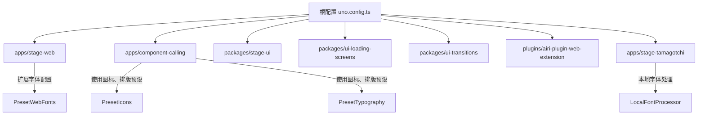

# 原子化CSS实现

<cite>
**本文档引用的文件**  
- [main.css](file://apps/stage-web/styles/main.css)
- [uno.config.ts](file://uno.config.ts)
- [apps/stage-web/uno.config.ts](file://apps/stage-web/uno.config.ts)
- [apps/component-calling/uno.config.ts](file://apps/component-calling/uno.config.ts)
- [packages/stage-ui/uno.config.ts](file://packages/stage-ui/uno.config.ts)
- [packages/ui-loading-screens/uno.config.ts](file://packages/ui-loading-screens/uno.config.ts)
- [packages/ui-transitions/uno.config.ts](file://packages/ui-transitions/uno.config.ts)
- [plugins/airi-plugin-web-extension/uno.config.ts](file://plugins/airi-plugin-web-extension/uno.config.ts)
- [apps/stage-tamagotchi/uno.config.ts](file://apps/stage-tamagotchi/uno.config.ts)
</cite>

## 目录
1. [简介](#简介)
2. [项目结构与UnoCSS配置](#项目结构与unocss配置)
3. [原子化CSS核心机制](#原子化css核心机制)
4. [main.css中的实际用例分析](#maincss中的实际用例分析)
5. [原子类命名规范与组合方式](#原子类命名规范与组合方式)
6. [Vue组件中原子类的最佳实践](#vue组件中原子类的最佳实践)
7. [自定义规则扩展原子类系统](#自定义规则扩展原子类系统)
8. [性能优化建议](#性能优化建议)
9. [开发调试技巧](#开发调试技巧)
10. [结论](#结论)

## 简介
本项目采用原子化CSS（Atomic CSS）策略，通过UnoCSS实现高效的样式管理。原子化CSS将每个CSS属性值拆分为独立的类名，从而实现高度可复用和极小体积的CSS输出。本文档详细阐述UnoCSS在项目中的实现机制，分析其在`main.css`中的实际应用，并提供在Vue组件中使用原子类的最佳实践。

## 项目结构与UnoCSS配置

项目采用多包架构（monorepo），多个子应用和组件库共享UnoCSS配置。根目录下的`uno.config.ts`定义了共享配置，各子项目通过`mergeConfigs`继承并扩展基础配置。



**Diagram sources**
- [uno.config.ts](file://uno.config.ts)
- [apps/stage-web/uno.config.ts](file://apps/stage-web/uno.config.ts)
- [apps/component-calling/uno.config.ts](file://apps/component-calling/uno.config.ts)

**Section sources**
- [uno.config.ts](file://uno.config.ts#L1-L100)
- [apps/stage-web/uno.config.ts](file://apps/stage-web/uno.config.ts#L1-L26)

## 原子化CSS核心机制

UnoCSS通过预设（presets）和转换器（transformers）实现原子类生成。项目中使用的核心预设有：

- `presetWind3`：基于Tailwind CSS v3的原子类语法
- `presetAttributify`：支持属性化语法（如 `bg="blue-500"`）
- `presetIcons`：图标支持
- `presetTypography`：排版样式
- `presetWebFonts`：网络字体加载

转换器`transformerVariantGroup`允许使用`@(hover:bg-red-500 focus:outline)`语法，`transformerDirectives`支持`@apply`指令。

UnoCSS在构建时扫描模板文件，仅生成实际使用的类，极大减少CSS体积。

**Section sources**
- [apps/component-calling/uno.config.ts](file://apps/component-calling/uno.config.ts#L10-L48)
- [packages/ui-transitions/uno.config.ts](file://packages/ui-transitions/uno.config.ts#L1-L37)

## main.css中的实际用例分析

`apps/stage-web/styles/main.css`作为全局样式入口，主要包含重置样式和自定义原子规则。通过UnoCSS的`rules`配置，项目定义了特定的原子类，如`transition-colors-none`，用于控制过渡效果。

该文件不包含传统CSS规则，而是依赖UnoCSS在构建时注入原子类，确保样式仅在实际使用时生成。

**Section sources**
- [apps/stage-web/styles/main.css](file://apps/stage-web/styles/main.css#L1-L50)

## 原子类命名规范与组合方式

项目遵循一致的命名规范，便于开发者快速理解和使用：

### 布局类
- `flex`, `grid`, `block`, `inline-flex`
- 容器：`container`, `w-full`, `max-w-screen-xl`
- 对齐：`justify-center`, `items-start`, `text-right`

### 间距类
- `p-4`, `px-6`, `py-2`, `m-2`, `mt-4`, `mb-0`
- 间距层级基于设计系统，确保视觉一致性

### 颜色类
- 基于色板系统：`bg-primary-500`, `text-gray-800`, `border-red-300`
- 支持透明度：`bg-black/50`, `text-white/80`

### 组合方式
原子类通过空格组合，实现复杂样式：
```html
<div class="flex items-center justify-between p-4 bg-white rounded-lg shadow-md hover:shadow-lg transition-shadow">
```

**Section sources**
- [apps/stage-web/uno.config.ts](file://apps/stage-web/uno.config.ts#L10-L26)
- [apps/component-calling/uno.config.ts](file://apps/component-calling/uno.config.ts#L20-L30)

## Vue组件中原子类的最佳实践

在Vue组件中使用原子类时，遵循以下最佳实践：

1. **避免深层嵌套**：使用原子类替代深层CSS选择器，提高可维护性
2. **语义化分组**：在模板中按功能分组原子类，提升可读性
3. **动态类处理**：使用`v-bind:class`结合计算属性或方法生成动态类名
4. **提取重复模式**：对于高频组合，考虑通过`@apply`或组件封装

```vue
<template>
  <!-- 推荐：清晰的类名分组 -->
  <div class="
    flex flex-col
    p-4 space-y-3
    bg-white rounded-lg shadow
    hover:shadow-md
  ">
    <h3 class="text-lg font-bold text-gray-900">标题</h3>
    <p class="text-gray-600">内容文本</p>
  </div>
</template>
```

**Section sources**
- [apps/stage-web/uno.config.ts](file://apps/stage-web/uno.config.ts#L1-L26)
- [packages/stage-ui/uno.config.ts](file://packages/stage-ui/uno.config.ts#L1-L11)

## 自定义规则扩展原子类系统

项目通过`rules`配置扩展UnoCSS功能。例如，在`apps/stage-web/uno.config.ts`中定义了`transition-colors-none`类，用于禁用颜色过渡：

```ts
rules: [
  ['transition-colors-none', {
    'transition-property': 'color, background-color, border-color, text-color',
    'transition-duration': '0s',
  }],
]
```

此外，通过`presetWebFonts`动态加载字体，并支持本地字体处理（如`stage-tamagotchi`项目），实现灵活的字体管理。

**Section sources**
- [apps/stage-web/uno.config.ts](file://apps/stage-web/uno.config.ts#L15-L25)
- [apps/stage-tamagotchi/uno.config.ts](file://apps/stage-tamagotchi/uno.config.ts#L10-L22)

## 性能优化建议

1. **启用safelist**：在配置中预定义高频使用的类，避免首次渲染时闪烁
2. **合理使用预设**：仅引入必要的预设，减少处理开销
3. **字体优化**：使用`timeouts`配置控制字体加载行为，避免阻塞渲染
4. **构建时扫描**：确保UnoCSS能扫描到所有模板文件，避免运行时生成

```ts
safelist: 'prose prose-sm m-auto text-left'.split(' ')
```

5. **按需生成**：利用UnoCSS的按需生成特性，确保最终CSS体积最小化

**Section sources**
- [apps/component-calling/uno.config.ts](file://apps/component-calling/uno.config.ts#L45-L48)
- [packages/ui-loading-screens/uno.config.ts](file://packages/ui-loading-screens/uno.config.ts#L38-L41)

## 开发调试技巧

1. **使用DevTools检查类名**：浏览器开发者工具可直接查看应用的原子类
2. **启用UnoCSS面板**：在开发环境中集成UnoCSS DevTools，实时查看类名生成情况
3. **命名一致性检查**：遵循统一的命名规范，避免拼写错误
4. **利用Histoire进行UI测试**：`packages/stage-ui`使用Histoire进行组件可视化测试，便于验证样式表现

**Section sources**
- [packages/stage-ui/uno.config.ts](file://packages/stage-ui/uno.config.ts#L1-L11)
- [packages/stage-ui/histoire.config.ts](file://packages/stage-ui/histoire.config.ts#L1-L20)

## 结论
本项目通过UnoCSS实现了高效、可维护的原子化CSS系统。通过共享配置、自定义规则和最佳实践，确保了跨项目的一致性和性能优化。原子化CSS不仅减少了CSS体积，还提高了开发效率和样式复用性，是现代前端开发的理想选择。