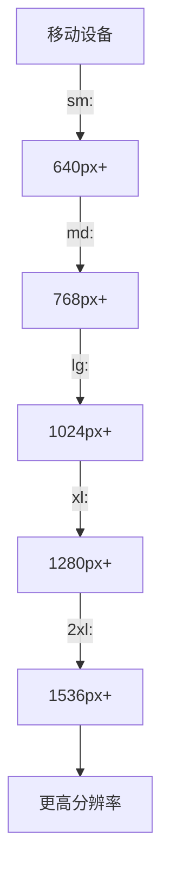
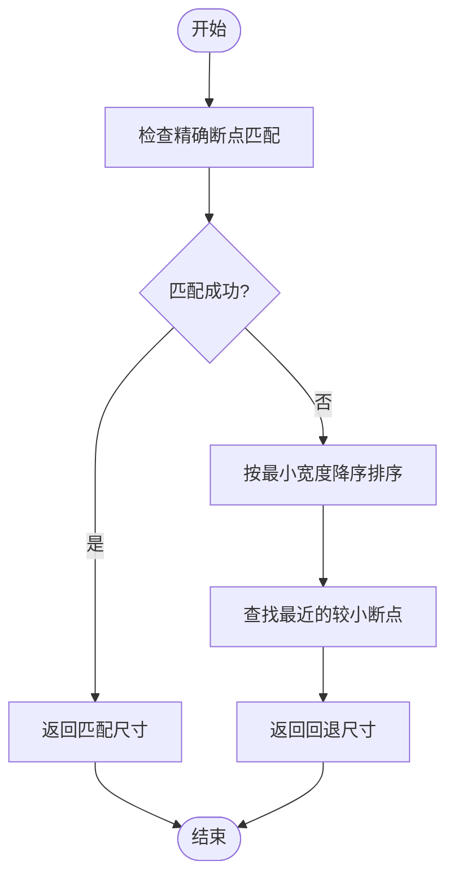
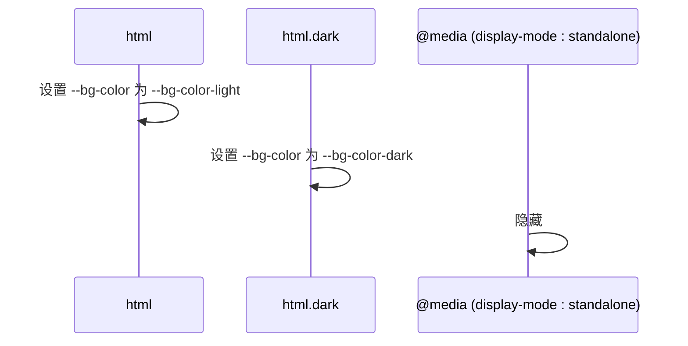
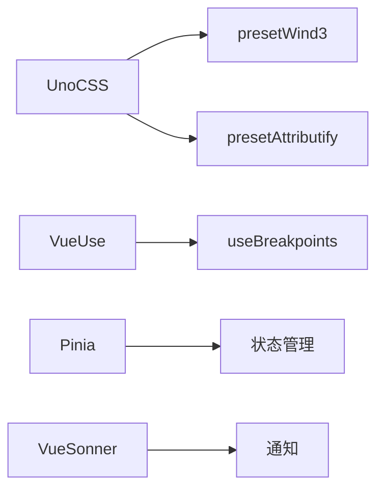

# 响应式设计方法

<cite>
**本文档中引用的文件**  
- [uno.config.ts](file://uno.config.ts)
- [apps/stage-web/uno.config.ts](file://apps/stage-web/uno.config.ts)
- [apps/stage-tamagotchi/src/main/windows/shared/display.ts](file://apps/stage-tamagotchi/src/main/windows/shared/display.ts)
- [apps/stage-web/src/styles/main.css](file://apps/stage-web/src/styles/main.css)
- [apps/stage-web/src/stores/pwa.ts](file://apps/stage-web/src/stores/pwa.ts)
- [packages/stage-ui/src/components/misc/Screen.vue](file://packages/stage-ui/src/components/misc/Screen.vue)
</cite>

## 目录
1. [简介](#简介)
2. [项目结构](#项目结构)
3. [核心组件](#核心组件)
4. [架构概述](#架构概述)
5. [详细组件分析](#详细组件分析)
6. [依赖分析](#依赖分析)
7. [性能考虑](#性能考虑)
8. [故障排除指南](#故障排除指南)
9. [结论](#结论)

## 简介
本文档详细阐述了基于 UnoCSS 的响应式设计实现方法。通过分析 `uno.config.ts` 中定义的断点配置和响应式变体，说明如何使用 UnoCSS 的响应式前缀（如 `sm:`、`md:`、`lg:`）构建自适应界面。文档还通过 `main.css` 中的实际样式规则展示响应式布局的实现方式，并提供移动优先设计原则、媒体查询优化和跨设备测试的最佳实践。

## 项目结构
项目采用模块化结构，多个应用共享核心配置。响应式设计的核心配置位于根目录的 `uno.config.ts` 文件中，而具体应用（如 `stage-web` 和 `stage-tamagotchi`）则继承并扩展这些配置。`main.css` 文件用于定义全局样式和响应式行为，而 `display.ts` 提供了基于断点的尺寸映射逻辑。

```mermaid
graph TB
subgraph "核心配置"
UnoConfig[uno.config.ts]
SharedConfig[sharedUnoConfig()]
end
subgraph "应用模块"
StageWeb[apps/stage-web]
StageTamagotchi[apps/stage-tamagotchi]
end
subgraph "样式与逻辑"
MainCSS[main.css]
DisplayTS[display.ts]
end
UnoConfig --> SharedConfig
SharedConfig --> StageWeb
SharedConfig --> StageTamagotchi
StageWeb --> MainCSS
StageTamagotchi --> DisplayTS
```

**图示来源**  
- [uno.config.ts](file://uno.config.ts#L0-L263)
- [apps/stage-web/uno.config.ts](file://apps/stage-web/uno.config.ts#L0-L26)

**本节来源**  
- [uno.config.ts](file://uno.config.ts#L0-L263)
- [apps/stage-web/uno.config.ts](file://apps/stage-web/uno.config.ts#L0-L26)

## 核心组件
核心响应式功能由 `uno.config.ts` 中的 `sharedUnoConfig()` 提供，它集成了 `presetWind3`、`presetAttributify` 和 `presetTypography` 等 UnoCSS 预设。`tailwindBreakpoints` 定义了从 `sm` 到 `10xl` 的完整断点系统，支持从移动设备到超高清显示器的适配。

**本节来源**  
- [uno.config.ts](file://uno.config.ts#L150-L263)
- [apps/stage-tamagotchi/src/main/windows/shared/display.ts](file://apps/stage-tamagotchi/src/main/windows/shared/display.ts#L61-L82)

## 架构概述
系统采用移动优先的响应式架构。UnoCSS 的响应式前缀（如 `sm:`、`md:`）在编译时生成对应的媒体查询。`mapForBreakpoints` 函数在 Electron 应用中动态计算基于屏幕宽度的尺寸，而 `useBreakpoints` 在 Web 应用中提供响应式状态检测。



**图示来源**  
- [apps/stage-tamagotchi/src/main/windows/shared/display.ts](file://apps/stage-tamagotchi/src/main/windows/shared/display.ts#L61-L82)

## 详细组件分析

### 断点配置分析
`uno.config.ts` 中的 `tailwindBreakpoints` 定义了标准的 Tailwind CSS 断点，并扩展至 `10xl`（3584px），以支持高分辨率显示器。`resolutionBreakpoints` 提供了基于常见屏幕分辨率（如 1080p、4K）的辅助断点。

```mermaid
classDiagram
class Breakpoints {
+sm : {min : 640, max : 767}
+md : {min : 768, max : 1023}
+lg : {min : 1024, max : 1279}
+xl : {min : 1280, max : 1535}
+2xl : {min : 1536, max : 1791}
+3xl : {min : 1792, max : 2047}
+4xl : {min : 2048, max : 2303}
+5xl : {min : 2304, max : 2559}
+6xl : {min : 2560, max : 2815}
+7xl : {min : 2816, max : 3071}
+8xl : {min : 3072, max : 3327}
+9xl : {min : 3328, max : 3583}
+10xl : {min : 3584, max : Infinity}
}
```

**图示来源**  
- [apps/stage-tamagotchi/src/main/windows/shared/display.ts](file://apps/stage-tamagotchi/src/main/windows/shared/display.ts#L61-L82)

**本节来源**  
- [uno.config.ts](file://uno.config.ts#L150-L263)
- [apps/stage-tamagotchi/src/main/windows/shared/display.ts](file://apps/stage-tamagotchi/src/main/windows/shared/display.ts#L61-L82)

### 响应式函数分析
`mapForBreakpoints` 函数根据输入的基准值和断点配置，返回匹配的尺寸。它首先查找精确匹配，若无匹配则回退到最近的较小断点，确保在任何屏幕尺寸下都能提供合适的布局。



**图示来源**  
- [apps/stage-tamagotchi/src/main/windows/shared/display.ts](file://apps/stage-tamagotchi/src/main/windows/shared/display.ts#L83-L118)

**本节来源**  
- [apps/stage-tamagotchi/src/main/windows/shared/display.ts](file://apps/stage-tamagotchi/src/main/windows/shared/display.ts#L83-L118)

### 样式实现分析
`main.css` 使用 CSS 变量定义了亮色和暗色主题的背景色，并通过 `html.dark` 类切换主题。媒体查询 `(display-mode: standalone)` 用于在 PWA 独立模式下隐藏进度条。



**图示来源**  
- [apps/stage-web/src/styles/main.css](file://apps/stage-web/src/styles/main.css#L0-L65)

**本节来源**  
- [apps/stage-web/src/styles/main.css](file://apps/stage-web/src/styles/main.css#L0-L65)

## 依赖分析
项目依赖 `@unocss/preset-wind3` 提供响应式前缀支持，`@vueuse/core` 提供 `useBreakpoints` 组合式函数。`pinia` 用于状态管理，`vue-sonner` 用于通知提示。



**图示来源**  
- [uno.config.ts](file://uno.config.ts#L150-L165)
- [apps/stage-web/src/stores/pwa.ts](file://apps/stage-web/src/stores/pwa.ts#L1-L36)

**本节来源**  
- [uno.config.ts](file://uno.config.ts#L150-L165)
- [apps/stage-web/src/stores/pwa.ts](file://apps/stage-web/src/stores/pwa.ts#L1-L36)

## 性能考虑
使用 UnoCSS 的原子化 CSS 可以显著减少 CSS 文件体积。`mapForBreakpoints` 的查找算法时间复杂度为 O(n)，在实际应用中性能良好。建议在生产环境中启用 UnoCSS 的 tree-shaking 以进一步优化。

## 故障排除指南
如果响应式设计未生效，请检查：
1. 确保 `uno.config.ts` 正确加载了 `presetWind3`。
2. 验证 HTML 元素是否正确应用了响应式类名（如 `sm:flex`）。
3. 检查浏览器开发者工具中的媒体查询是否被正确生成。

**本节来源**  
- [uno.config.ts](file://uno.config.ts#L150-L165)
- [apps/stage-web/src/styles/main.css](file://apps/stage-web/src/styles/main.css#L0-L65)

## 结论
本文档全面分析了基于 UnoCSS 的响应式设计实现。通过 `uno.config.ts` 中的断点配置和 `main.css` 中的样式规则，系统能够有效适配各种设备。推荐遵循移动优先原则，并利用 `useBreakpoints` 和 `mapForBreakpoints` 等工具实现复杂的响应式逻辑。