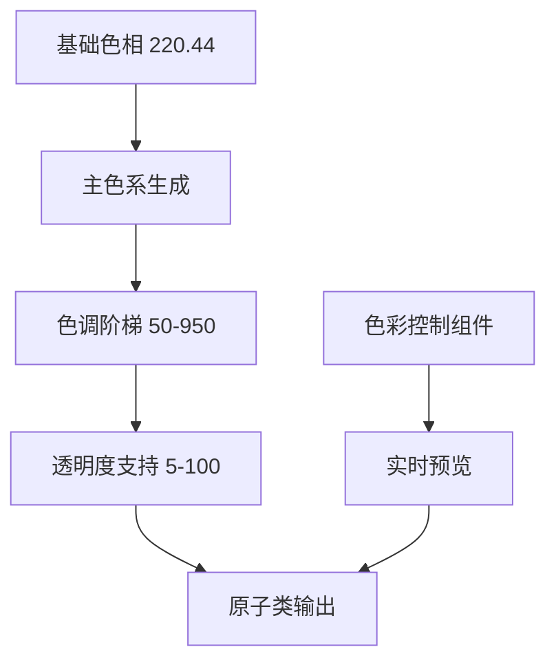
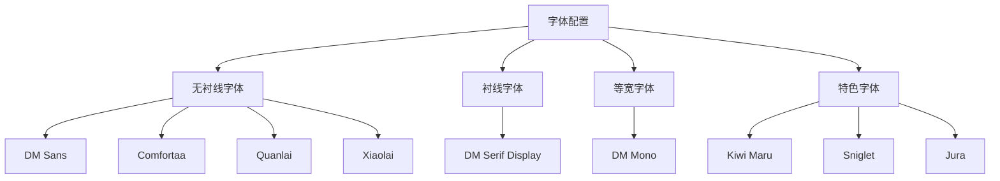

# 样式系统

<cite>
**本文档引用的文件**  
- [uno.config.ts](file://uno.config.ts)
- [apps/component-calling/uno.config.ts](file://apps/component-calling/uno.config.ts)
- [packages/stage-ui/uno.config.ts](file://packages/stage-ui/uno.config.ts)
- [packages/stage-ui/stories/components/Colors.story.vue](file://packages/stage-ui/stories/components/Colors.story.vue)
- [packages/stage-ui/stories/components/TypographySans.story.vue](file://packages/stage-ui/stories/components/TypographySans.story.vue)
- [packages/stage-ui/stories/components/TypographyMono.story.vue](file://packages/stage-ui/stories/components/TypographyMono.story.vue)
- [packages/stage-ui/src/constants/theme.ts](file://packages/stage-ui/src/constants/theme.ts)
</cite>

## 目录
1. [简介](#简介)
2. [原子化CSS设计理念](#原子化css设计理念)
3. [UnoCSS配置结构](#unocss配置结构)
4. [自定义主题与颜色系统](#自定义主题与颜色系统)
5. [字体系统配置](#字体系统配置)
6. [响应式设计实现](#响应式设计实现)
7. [扩展UnoCSS配置](#扩展unocss配置)
8. [样式开发最佳实践](#样式开发最佳实践)
9. [调试技巧](#调试技巧)
10. [总结](#总结)

## 简介
本项目采用UnoCSS作为核心样式系统，通过原子化CSS方法实现高效、可维护的UI开发。UnoCSS提供了一套灵活的配置体系，支持主题定制、字体管理和响应式设计，为跨平台应用提供一致的视觉体验。

## 原子化CSS设计理念
原子化CSS是一种将样式分解为最小功能单元的开发范式。每个CSS类只负责单一的样式属性，如`text-center`、`bg-primary-500`等。这种设计带来以下优势：
- **性能优化**：仅生成实际使用的样式，减少CSS文件体积
- **开发效率**：通过组合原子类快速构建界面
- **一致性**：基于设计系统约束，确保视觉统一性
- **可维护性**：样式与组件解耦，便于重构和更新

在本项目中，原子化CSS通过UnoCSS引擎实现，结合预设和自定义规则，构建完整的样式体系。

**Section sources**
- [uno.config.ts](file://uno.config.ts#L129-L249)

## UnoCSS配置结构
项目的UnoCSS配置采用模块化设计，通过`sharedUnoConfig`函数定义共享配置，支持多应用复用。核心配置包含以下预设：
- `presetWind3`：基于Tailwind语法的实用类系统
- `presetAttributify`：属性化语法支持
- `presetTypography`：排版优化
- `presetIcons`：图标集成
- `presetScrollbar`：滚动条样式定制
- `presetChromatic`：色彩系统管理

配置通过`mergeConfigs`方法进行合并，确保不同环境下的配置一致性。

**Section sources**
- [uno.config.ts](file://uno.config.ts#L129-L249)
- [packages/stage-ui/uno.config.ts](file://packages/stage-ui/uno.config.ts#L1-L11)

## 自定义主题与颜色系统
项目实现了基于色相的动态色彩系统，通过`presetChromatic`预设进行管理。核心配置参数包括：
- `baseHue`：基础色相值（220.44）
- `colors`：颜色映射关系，定义主色和互补色

颜色系统支持完整的色调阶梯（50-950）和透明度控制（5-100），可通过`bg-primary-500/50`等语法使用。安全列表（safelist）预生成所有主色背景类，确保运行时性能。

**Diagram sources**
- [uno.config.ts](file://uno.config.ts#L129-L249)
- [packages/stage-ui/src/constants/theme.ts](file://packages/stage-ui/src/constants/theme.ts#L1-L2)

**Section sources**
- [uno.config.ts](file://uno.config.ts#L129-L249)
- [packages/stage-ui/stories/components/Colors.story.vue](file://packages/stage-ui/stories/components/Colors.story.vue#L1-L87)

## 字体系统配置
项目集成了多字体系统，通过`presetWebFonts`实现动态加载。支持的字体族包括：
- **无衬线体**：DM Sans、Comfortaa、Quanlai、Xiaolai
- **衬线体**：DM Serif Display
- **等宽体**：DM Mono
- **特色字体**：Kiwi Maru、Sniglet、Jura等

字体配置支持变量字体（Variable Fonts）和静态字体两种模式，通过`provider`参数控制加载方式。字体族按语种优化，确保中日文显示效果。

**Diagram sources**
- [uno.config.ts](file://uno.config.ts#L70-L127)
- [packages/stage-ui/stories/components/TypographySans.story.vue](file://packages/stage-ui/stories/components/TypographySans.story.vue#L1-L159)
- [packages/stage-ui/stories/components/TypographyMono.story.vue](file://packages/stage-ui/stories/components/TypographyMono.story.vue#L1-L23)

**Section sources**
- [uno.config.ts](file://uno.config.ts#L70-L127)

## 响应式设计实现
UnoCSS通过内置的断点系统支持响应式设计。虽然具体断点配置未在分析文件中明确，但基于`presetWind3`预设，系统支持标准的移动优先断点策略。通过`sm:`、`md:`等前缀实现不同屏幕尺寸的样式控制。

## 扩展UnoCSS配置
项目通过自定义规则扩展UnoCSS功能，包括：
- **遮罩支持**：`mask-[]`语法解析
- **点状背景**：`bg-dotted-[]`生成点阵背景
- **拖拽区域**：`drag-region`创建可拖拽区域

这些扩展通过`rules`配置项实现，支持正则表达式匹配和动态样式生成。同时，配置中包含内容提取管道，确保JS/TS文件中的样式使用能被正确识别。

**Section sources**
- [uno.config.ts](file://uno.config.ts#L129-L249)

## 样式开发最佳实践
1. **优先使用原子类**：避免创建新的CSS规则，尽量组合现有原子类
2. **遵循设计系统**：使用预定义的颜色、间距和字体族
3. **组件化封装**：高频使用的类组合应封装为组件或指令
4. **性能考虑**：避免过度使用动态类，合理使用安全列表
5. **可访问性**：确保颜色对比度符合WCAG标准

## 调试技巧
1. **使用故事书预览**：通过`Colors.story.vue`和`Typography`系列组件实时查看样式效果
2. **检查生成的CSS**：利用开发工具查看实际生成的样式规则
3. **验证类名拼写**：UnoCSS对类名大小写和语法要求严格
4. **清除缓存**：当配置更新后，清除UnoCSS缓存确保变更生效
5. **分步调试**：复杂样式问题可分解为单个原子类进行测试

## 总结
本项目的UnoCSS样式系统通过模块化配置、动态色彩管理和多字体支持，构建了强大而灵活的样式基础设施。原子化CSS的采用不仅提升了开发效率，也确保了跨应用的视觉一致性。通过合理的扩展和最佳实践，系统能够满足复杂UI需求，同时保持良好的性能和可维护性。