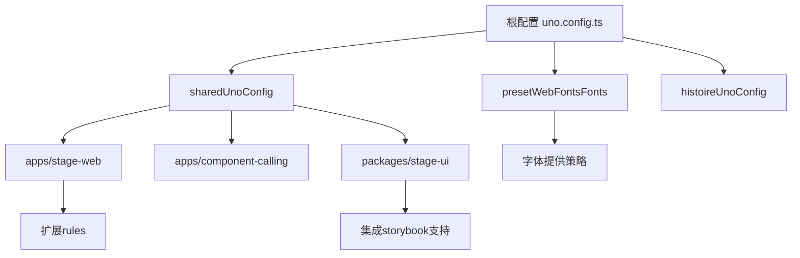
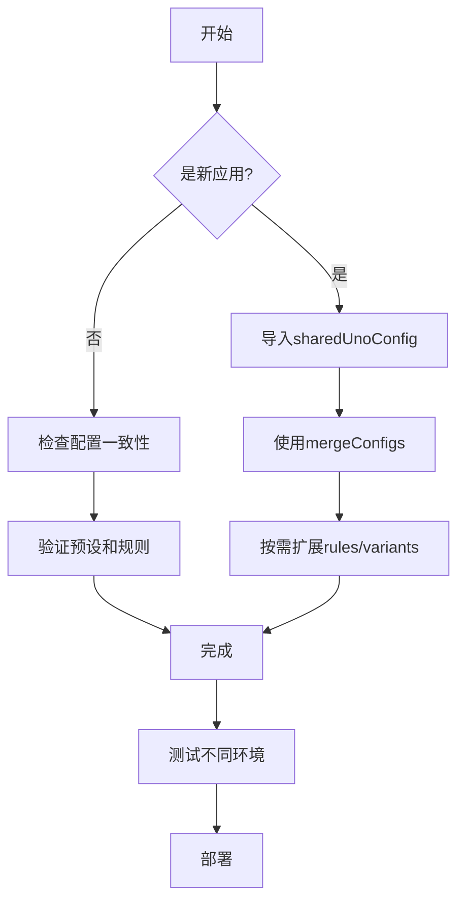

# 样式系统配置

<cite>
**本文档中引用的文件**  
- [uno.config.ts](file://uno.config.ts)
- [apps/stage-web/uno.config.ts](file://apps/stage-web/uno.config.ts)
- [packages/unocss-preset-fonts/src/index.ts](file://packages/unocss-preset-fonts/src/index.ts)
- [packages/font-cjkfonts-allseto/src/index.css](file://packages/font-cjkfonts-allseto/src/index.css)
- [packages/font-departure-mono/src/index.css](file://packages/font-departure-mono/src/index.css)
- [packages/font-xiaolai/src/index.css](file://packages/font-xiaolai/src/index.css)
- [apps/component-calling/uno.config.ts](file://apps/component-calling/uno.config.ts)
- [apps/stage-tamagotchi/uno.config.ts](file://apps/stage-tamagotchi/uno.config.ts)
- [packages/stage-ui/uno.config.ts](file://packages/stage-ui/uno.config.ts)
- [plugins/airi-plugin-web-extension/uno.config.ts](file://plugins/airi-plugin-web-extension/uno.config.ts)
</cite>

## 目录
1. [简介](#简介)
2. [项目结构与配置继承](#项目结构与配置继承)
3. [主题颜色配置](#主题颜色配置)
4. [字体系统与unocss-preset-fonts集成](#字体系统与unocss-preset-fonts集成)
5. [自定义规则（rules）实现](#自定义规则（rules）实现)
6. [变体（variants）与快捷方式（shortcuts）](#变体（variants）与快捷方式（shortcuts）)
7. [配置扩展最佳实践](#配置扩展最佳实践)
8. [常见问题与解决方案](#常见问题与解决方案)
9. [总结](#总结)

## 简介
本项目采用UnoCSS作为原子化CSS引擎，通过`uno.config.ts`文件实现高度可定制的样式系统。该系统支持主题化、字体管理、自定义规则和动态变体，适用于多应用共享配置的微前端架构。核心配置位于项目根目录，并通过`mergeConfigs`机制在各个子应用中继承和扩展。

## 项目结构与配置继承
项目采用模块化架构，多个子应用（如`component-calling`、`stage-web`、`stage-tamagotchi`）共享统一的样式配置。根目录的`uno.config.ts`定义了`sharedUnoConfig`函数，作为所有应用的基础配置。各子应用通过导入并合并此配置，实现一致性与灵活性的平衡。



**图示来源**
- [uno.config.ts](file://uno.config.ts#L129-L249)
- [apps/stage-web/uno.config.ts](file://apps/stage-web/uno.config.ts#L0-L26)
- [packages/stage-ui/uno.config.ts](file://packages/stage-ui/uno.config.ts#L0-L11)

**本节来源**
- [uno.config.ts](file://uno.config.ts#L0-L263)
- [apps/stage-web/uno.config.ts](file://apps/stage-web/uno.config.ts#L0-L26)
- [packages/stage-ui/uno.config.ts](file://packages/stage-ui/uno.config.ts#L0-L11)

## 主题颜色配置
主题颜色通过`@proj-airi/unocss-preset-chromatic`预设实现，基于色相（hue）系统动态生成调色板。在`sharedUnoConfig`中，`presetChromatic`被配置为以220.44°为基准色相，定义主色（primary）和互补色（complementary）的相对位置。

```typescript
presetChromatic({
  baseHue: 220.44,
  colors: {
    primary: 0,
    complementary: 180,
  },
})
```

该配置确保了UI组件在不同上下文中保持视觉一致性，同时允许通过HSL模型轻松调整整体色调。颜色变量通过UnoCSS的原子类暴露，如`bg-primary`、`text-primary-500`等。

**本节来源**
- [uno.config.ts](file://uno.config.ts#L150-L158)
- [apps/component-calling/uno.config.ts](file://apps/component-calling/uno.config.ts#L25-L31)

## 字体系统与unocss-preset-fonts集成
### 字体配置策略
项目通过`presetWebFonts`实现灵活的字体加载策略。`presetWebFontsFonts`函数接受`provider`参数（'fontsource'或'none'），动态决定字体来源。在生产环境中使用本地字体文件（`none`），开发时可切换至Fontsource CDN。

```typescript
export function presetWebFontsFonts(provider: 'fontsource' | 'none')
```

支持的字体包括：
- 无衬线：DM Sans、Urbanist、Comfortaa
- 衬线：DM Serif Display
- 等宽：DM Mono
- 特殊字体：Kiwi Maru（日文）、Sniglet（英文）、cjkfonts AllSeto、Xiaolai SC、Departure Mono

### unocss-preset-fonts预设
`packages/unocss-preset-fonts`是一个独立预设包，封装了项目专用字体的加载逻辑。它通过`definePreset`创建，包含：
1. **presetWebFonts配置**：声明`quanlai`、`departure`、`xiaolai`三个字体，`provider`设为`none`
2. **preflights注入**：通过CSS `@import`语句引入字体文件

```typescript
preflights: [{
  layer: LAYER_PREFLIGHTS,
  getCSS() {
    return `
@import '@proj-airi/font-cjkfonts-allseto/index.css';
@import '@proj-airi/font-departure-mono/index.css';
@import '@proj-airi/font-xiaolai/index.css';
    `
  }
}]
```

### 字体文件实现
各字体包通过`@font-face`规则定义：
- `font-cjkfonts-allseto`: 引入`cjkFonts_allseto_v1.11.ttf`
- `font-departure-mono`: 引入`DepartureMono-Regular.otf`
- `font-xiaolai`: 引入`XiaolaiSC-Regular.ttf`

这些CSS文件被预设统一导入，确保字体在全局可用。

```mermaid
classDiagram
class presetWebFonts {
+fonts : Record<string, WebFontMeta>
+timeouts : {warning, failure}
}
class unocssPresetFonts {
+name : "preset-fonts"
+presets : [presetWebFonts]
+preflights : [@import ...]
}
class FontPackage {
<<Abstract>>
+index.css
+@font-face
}
class cjkfontsAllSeto {
+font-family : "cjkfonts AllSeto"
+src : url(./files/...)
}
class departureMono {
+font-family : "Departure Mono"
+src : url(./files/...)
}
class xiaolaiSC {
+font-family : "Xiaolai SC"
+src : url(./files/...)
}
unocssPresetFonts --> presetWebFonts : 使用
unocssPresetFonts --> cjkfontsAllSeto : 导入
unocssPresetFonts --> departureMono : 导入
unocssPresetFonts --> xiaolaiSC : 导入
cjkfontsAllSeto --|> FontPackage
departureMono --|> FontPackage
xiaolaiSC --|> FontPackage
```

**图示来源**
- [packages/unocss-preset-fonts/src/index.ts](file://packages/unocss-preset-fonts/src/index.ts#L0-L38)
- [packages/font-cjkfonts-allseto/src/index.css](file://packages/font-cjkfonts-allseto/src/index.css#L0-L7)
- [packages/font-departure-mono/src/index.css](file://packages/font-departure-mono/src/index.css#L0-L7)
- [packages/font-xiaolai/src/index.css](file://packages/font-xiaolai/src/index.css#L0-L7)

**本节来源**
- [uno.config.ts](file://uno.config.ts#L70-L127)
- [packages/unocss-preset-fonts/src/index.ts](file://packages/unocss-preset-fonts/src/index.ts#L0-L38)
- [packages/font-cjkfonts-allseto/src/index.css](file://packages/font-cjkfonts-allseto/src/index.css#L0-L7)

## 自定义规则（rules）实现
UnoCSS允许通过正则表达式定义动态规则。在`sharedUnoConfig`中，实现了多个高级规则：

### 动态遮罩（mask）
```typescript
[/^mask-\[(.*)\]$/, ([, suffix]) => ({ '-webkit-mask-image': suffix.replace(/_/g, ' ') })]
```
支持`mask-[url(...)]`语法，将方括号内的值直接赋给`-webkit-mask-image`，下划线自动转为空格。

### 点状背景（bg-dotted）
```typescript
[/^bg-dotted-\[(.*)\]$/, ([, color], { theme }) => {
  const parsedColor = parseColor(color, theme)
  return {
    'background-image': `radial-gradient(circle at 1px 1px, ${colorToString(...)} 1px, transparent 0)`,
    '--un-background-opacity': parsedColor?.cssColor?.alpha ?? 1,
  }
}]
```
生成点状背景图案，支持任意颜色值（包括UnoCSS颜色变量），并正确处理透明度。

### 拖拽区域（drag-region）
```typescript
[/drag-region/, () => ({ 'app-region': 'drag' })]
```
为Electron等桌面应用提供窗口拖拽区域标记。

在`stage-web`应用中，还扩展了`transition-colors-none`规则，禁用颜色过渡效果：
```typescript
['transition-colors-none', {
  'transition-property': 'color, background-color, border-color, text-color',
  'transition-duration': '0s',
}]
```

**本节来源**
- [uno.config.ts](file://uno.config.ts#L220-L232)
- [apps/stage-web/uno.config.ts](file://apps/stage-web/uno.config.ts#L20-L25)

## 变体（variants）与快捷方式（shortcuts）
### 变体（Variants）
项目通过`transformerVariantGroup`和`transformerDirectives`支持变体语法。`histoireUnoConfig`中定义了`story-mock-hover`预设，用于在Storybook中模拟`:hover`状态：

```typescript
variants: [
  (matcher) => {
    if (!matcher.includes('hover')) return matcher
    return {
      matcher,
      selector: (s) => `${s}, ${s.replace(/:hover$/, '')}._hover`
    }
  }
]
```
此变体允许在非悬停状态下通过添加`._hover`类来预览悬停效果。

### 快捷方式（Shortcuts）
虽然配置中未显式定义`shortcuts`，但通过`presetAttributify`实现了属性化语法（如`m="4"`），这本质上是一种内置的快捷方式系统。`safelist`中预定义了常用类名，确保关键样式不会被Tree Shaking移除。

**本节来源**
- [uno.config.ts](file://uno.config.ts#L50-L68)
- [uno.config.ts](file://uno.config.ts#L170-L175)

## 配置扩展最佳实践
1. **继承而非复制**：所有子应用应使用`mergeConfigs(sharedUnoConfig(), ...)`继承基础配置
2. **环境感知字体**：利用`presetWebFontsFonts('fontsource'|'none')`在开发与生产间切换字体来源
3. **预设封装**：将通用功能（如字体、故事书支持）封装为独立预设包（如`unocss-preset-fonts`）
4. **安全列表优化**：通过`safelistAllPrimaryBackgrounds()`函数动态生成常用类名，避免遗漏
5. **内容提取配置**：明确指定需要样式提取的文件路径，特别是JS/TS文件中的动态类名



**本节来源**
- [uno.config.ts](file://uno.config.ts#L129-L249)
- [apps/stage-tamagotchi/uno.config.ts](file://apps/stage-tamagotchi/uno.config.ts#L0-L22)
- [plugins/airi-plugin-web-extension/uno.config.ts](file://plugins/airi-plugin-web-extension/uno.config.ts#L0-L6)

## 常见问题与解决方案
### 构建超时问题
**问题**：在Netlify等CI环境中，`@unocss/preset-web-fonts`可能因网络问题导致构建超时。
**解决方案**：在根配置中增加Node.js的DNS查找超时时间：
```typescript
import { setDefaultAutoSelectFamilyAttemptTimeout } from 'node:net'
setDefaultAutoSelectFamilyAttemptTimeout(1000)
```
将默认250ms超时延长至1000ms，兼容Happy Eyeballs算法。

### 本地字体加载
**问题**：使用`provider: 'none'`时，字体文件路径错误。
**解决方案**：确保字体包通过`@import`正确引入，且文件路径相对于CSS文件正确。`unocss-preset-fonts`已通过preflights解决此问题。

### 动态类名丢失
**问题**：JS/TS文件中的动态类名未被提取。
**解决方案**：在`content.pipeline.include`中添加相关路径：
```typescript
include: [
  '(components|src)/**/*.{js,ts,vue}',
  '**/stage-ui/**/*.{vue,js,ts}',
]
```

**本节来源**
- [uno.config.ts](file://uno.config.ts#L30-L55)
- [uno.config.ts](file://uno.config.ts#L190-L200)

## 总结
本项目的样式系统通过UnoCSS实现了高度模块化和可扩展的配置。核心优势包括：
- **统一主题管理**：基于色相的动态调色板确保视觉一致性
- **灵活字体系统**：支持多来源字体加载，封装为可复用预设
- **强大自定义能力**：通过rules、variants实现复杂样式逻辑
- **优化的构建流程**：解决CI环境超时问题，确保构建稳定性
- **良好的架构设计**：配置继承机制支持多应用共享，降低维护成本

通过遵循本文档的最佳实践，开发者可以高效地扩展和维护样式系统，同时保持项目整体的一致性和性能。