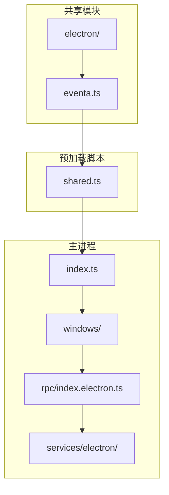
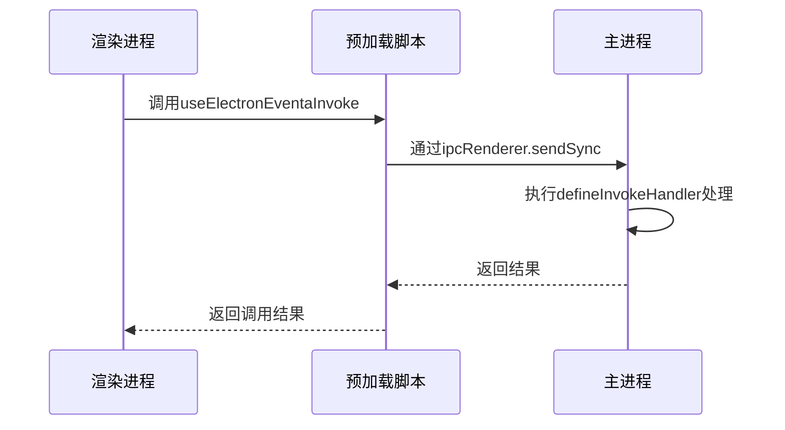
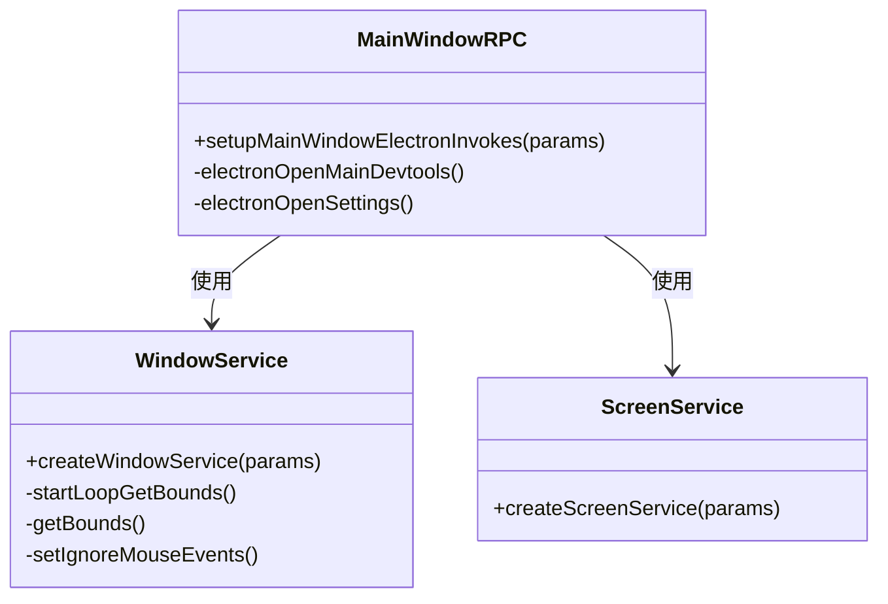
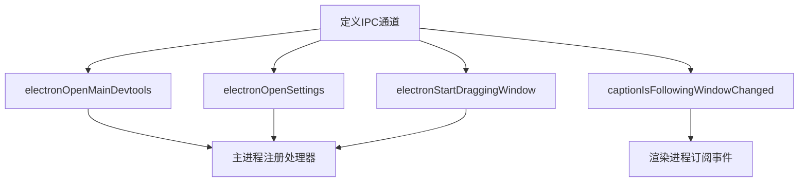

# IPC通信机制

<cite>
**本文档引用的文件**  
- [index.electron.ts](file://apps/stage-tamagotchi/src/main/windows/main/rpc/index.electron.ts)
- [shared.ts](file://apps/stage-tamagotchi/src/preload/shared.ts)
- [eventa.ts](file://apps/stage-tamagotchi/src/shared/eventa.ts)
- [window.ts](file://apps/stage-tamagotchi/src/main/services/electron/window.ts)
- [index.ts](file://apps/stage-tamagotchi/src/main/index.ts)
- [electron](file://apps/stage-tamagotchi/src/shared/electron)
</cite>

## 目录
1. [引言](#引言)
2. [项目结构](#项目结构)
3. [核心组件](#核心组件)
4. [架构概述](#架构概述)
5. [详细组件分析](#详细组件分析)
6. [依赖分析](#依赖分析)
7. [性能考虑](#性能考虑)
8. [故障排除指南](#故障排除指南)
9. [结论](#结论)

## 引言
本文档全面文档化主进程与渲染进程之间的IPC通信机制，重点分析Electron中`ipcMain`和`ipcRenderer`模块的使用模式，包括同步/异步消息传递的适用场景。同时详细描述RPC（远程过程调用）接口的设计，说明共享模块中定义的IPC通道常量和消息格式，以及如何实现类型安全的跨进程通信。

## 项目结构
项目采用分层架构，将主进程、预加载脚本和共享模块分离，确保职责清晰。主进程负责窗口管理、系统集成和原生功能调用；渲染进程负责UI展示；预加载脚本桥接两者，暴露受控的Electron API。



**图示来源**  
- [index.ts](file://apps/stage-tamagotchi/src/main/index.ts#L0-L180)
- [shared.ts](file://apps/stage-tamagotchi/src/preload/shared.ts#L0-L27)
- [eventa.ts](file://apps/stage-tamagotchi/src/shared/eventa.ts#L0-L11)

## 核心组件
核心组件包括主进程中的RPC处理器、预加载脚本中的上下文桥接逻辑，以及共享模块中定义的IPC通道和类型。这些组件共同实现了类型安全、结构清晰的跨进程通信机制。

**节来源**  
- [index.electron.ts](file://apps/stage-tamagotchi/src/main/windows/main/rpc/index.electron.ts#L0-L24)
- [shared.ts](file://apps/stage-tamagotchi/src/preload/shared.ts#L0-L27)
- [eventa.ts](file://apps/stage-tamagotchi/src/shared/eventa.ts#L0-L11)

## 架构概述
系统通过`@unbird/eventa`库封装Electron的IPC机制，实现类型安全的远程过程调用。主进程创建上下文并注册处理器，渲染进程通过`useElectronEventaInvoke`调用远程方法，所有通信均基于预定义的事件通道。



**图示来源**  
- [index.electron.ts](file://apps/stage-tamagotchi/src/main/windows/main/rpc/index.electron.ts#L0-L24)
- [shared.ts](file://apps/stage-tamagotchi/src/preload/shared.ts#L0-L27)

## 详细组件分析

### RPC处理器分析
主窗口的RPC处理器在`setupMainWindowElectronInvokes`函数中注册，通过`defineInvokeHandler`绑定具体实现。例如，`electronOpenMainDevtools`通道用于打开开发者工具。



**图示来源**  
- [index.electron.ts](file://apps/stage-tamagotchi/src/main/windows/main/rpc/index.electron.ts#L0-L24)
- [window.ts](file://apps/stage-tamagotchi/src/main/services/electron/window.ts#L0-L43)

### 共享模块分析
共享模块`eventa.ts`定义了所有IPC通道常量，使用`defineInvokeEventa`创建类型安全的调用接口。这些常量在主进程和渲染进程间共享，确保通信的一致性和类型安全。



**图示来源**  
- [eventa.ts](file://apps/stage-tamagotchi/src/shared/eventa.ts#L0-L11)
- [index.electron.ts](file://apps/stage-tamagotchi/src/main/windows/main/rpc/index.electron.ts#L0-L24)

## 依赖分析
系统依赖`@unbird/eventa`库进行IPC封装，`@electron-toolkit/preload`用于上下文桥接。主进程通过`injecta`依赖注入框架管理窗口和服务的生命周期，确保组件间的松耦合。

```mermaid
graph LR
A[@unbird/eventa] --> B[IPC通信]
C[@electron-toolkit/preload] --> D[上下文桥接]
E[injecta] --> F[依赖注入]
B --> G[主进程]
D --> H[预加载脚本]
F --> G
```

**图示来源**  
- [index.ts](file://apps/stage-tamagotchi/src/main/index.ts#L0-L180)
- [shared.ts](file://apps/stage-tamagotchi/src/preload/shared.ts#L0-L27)

## 性能考虑
为避免IPC通信成为性能瓶颈，系统采用异步调用为主，仅在必要时使用同步调用。对于频繁更新的数据（如窗口位置），使用循环发射机制减少调用频率，平衡实时性与性能。

## 故障排除指南
常见问题包括上下文隔离导致的API无法访问、IPC通道名称不匹配、以及主进程未正确注册处理器。调试时应首先检查`contextBridge.exposeInMainWorld`调用和`defineInvokeHandler`注册。

**节来源**  
- [shared.ts](file://apps/stage-tamagotchi/src/preload/shared.ts#L0-L27)
- [index.electron.ts](file://apps/stage-tamagotchi/src/main/windows/main/rpc/index.electron.ts#L0-L24)

## 结论
该IPC通信机制通过类型安全的RPC接口和清晰的分层架构，实现了主进程与渲染进程间的高效、安全通信。共享模块定义通道常量，预加载脚本桥接上下文，主进程注册处理器，形成完整闭环，为复杂Electron应用提供了可靠的通信基础。