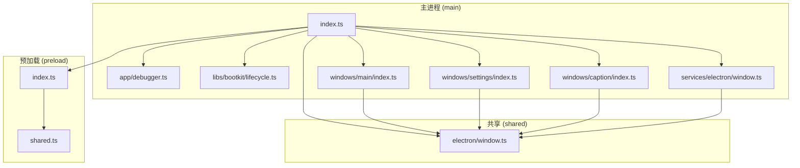
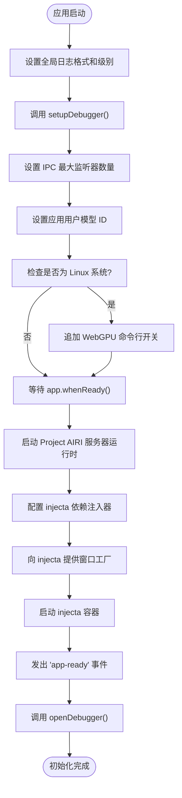
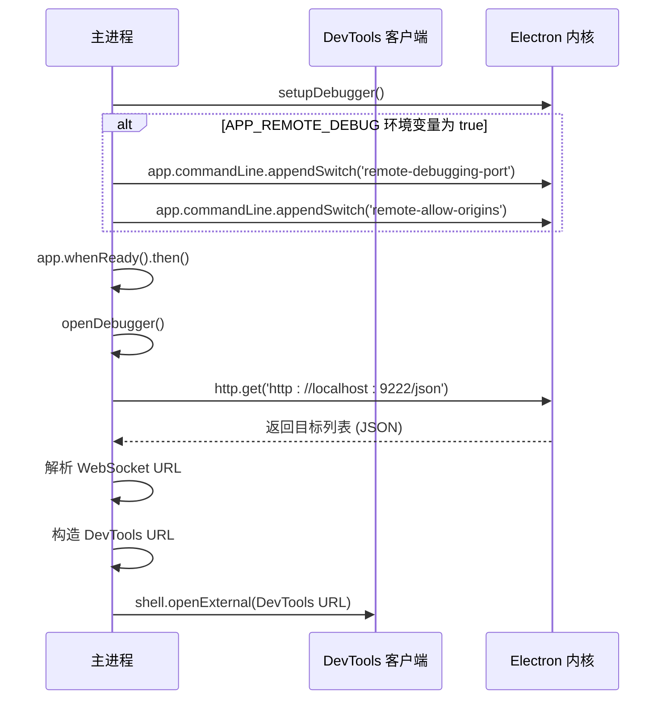
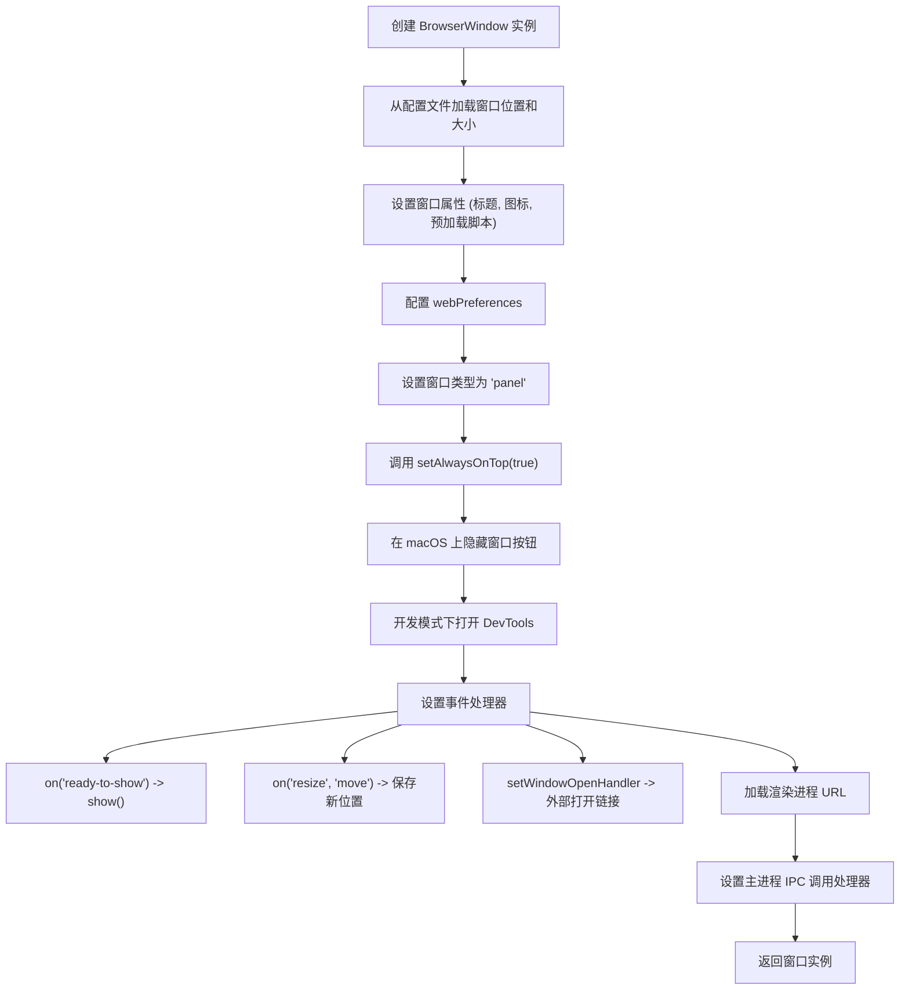
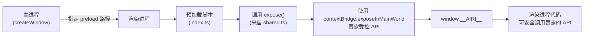
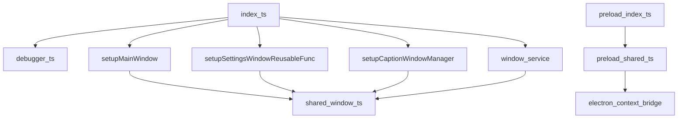

# 主进程初始化流程

<cite>
**本文档中引用的文件**
- [index.ts](file://apps/stage-tamagotchi/src/main/index.ts)
- [debugger.ts](file://apps/stage-tamagotchi/src/main/app/debugger.ts)
- [window.ts](file://apps/stage-tamagotchi/src/main/services/electron/window.ts)
- [index.ts](file://apps/stage-tamagotchi/src/main/windows/main/index.ts)
- [index.ts](file://apps/stage-tamagotchi/src/main/windows/settings/index.ts)
- [index.ts](file://apps/stage-tamagotchi/src/main/windows/caption/index.ts)
- [index.ts](file://apps/stage-tamagotchi/src/preload/index.ts)
- [shared.ts](file://apps/stage-tamagotchi/src/preload/shared.ts)
- [window.ts](file://apps/stage-tamagotchi/src/shared/electron/window.ts)
</cite>

## 目录
1. [简介](#简介)
2. [项目结构](#项目结构)
3. [核心组件](#核心组件)
4. [架构概览](#架构概览)
5. [详细组件分析](#详细组件分析)
6. [依赖分析](#依赖分析)
7. [性能考虑](#性能考虑)
8. [故障排除指南](#故障排除指南)
9. [结论](#结论)

## 简介
本文档详细描述了 stage-tamagotchi 应用主进程的初始化流程。从 `main/index.ts` 入口开始，解释 Electron 应用的启动过程，包括 `app.whenReady()` 的调用时机、主窗口创建、预加载脚本注入机制。说明调试器模块的初始化逻辑及其在开发环境中的作用。阐述环境变量加载、全局异常捕获设置、单实例锁定等初始化关键步骤的实现细节和设计考量。

## 项目结构
stage-tamagotchi 应用的主进程代码位于 `apps/stage-tamagotchi/src/main` 目录下，其结构清晰地划分为多个功能模块，包括应用核心逻辑、服务层、窗口管理以及共享工具等。预加载脚本位于 `preload` 目录，而主进程与渲染进程共享的类型和事件定义则位于 `shared/electron` 目录。



**Diagram sources**
- [index.ts](file://apps/stage-tamagotchi/src/main/index.ts)
- [debugger.ts](file://apps/stage-tamagotchi/src/main/app/debugger.ts)
- [window.ts](file://apps/stage-tamagotchi/src/main/services/electron/window.ts)
- [index.ts](file://apps/stage-tamagotchi/src/main/windows/main/index.ts)
- [index.ts](file://apps/stage-tamagotchi/src/main/windows/settings/index.ts)
- [index.ts](file://apps/stage-tamagotchi/src/main/windows/caption/index.ts)
- [index.ts](file://apps/stage-tamagotchi/src/preload/index.ts)
- [shared.ts](file://apps/stage-tamagotchi/src/preload/shared.ts)
- [window.ts](file://apps/stage-tamagotchi/src/shared/electron/window.ts)

**Section sources**
- [index.ts](file://apps/stage-tamagotchi/src/main/index.ts)

## 核心组件
主进程的核心组件围绕 `index.ts` 文件展开，该文件是应用的入口点。它负责协调应用的生命周期、初始化关键服务、创建主窗口和辅助窗口，并设置全局事件监听器。`debugger.ts` 模块提供了远程调试功能，`window.ts` 服务封装了与 Electron 窗口交互的逻辑，而各个 `windows` 子模块则负责具体窗口的创建和行为管理。

**Section sources**
- [index.ts](file://apps/stage-tamagotchi/src/main/index.ts)
- [debugger.ts](file://apps/stage-tamagotchi/src/main/app/debugger.ts)
- [window.ts](file://apps/stage-tamagotchi/src/main/services/electron/window.ts)

## 架构概览
stage-tamagotchi 应用采用分层架构，主进程作为控制中心，管理多个独立的窗口实例（主窗口、设置窗口、字幕窗口）。主进程通过 `injecta` 依赖注入容器来管理服务和窗口的生命周期，确保组件间的松耦合。`eventa` 库被用于在主进程和渲染进程之间建立类型安全的通信通道。预加载脚本作为桥梁，向渲染进程暴露受控的 Node.js 和 Electron API。

```mermaid
graph TD
A[Electron App] --> B[Main Process]
B --> C[Window Manager]
B --> D[Dependency Injector (injecta)]
B --> E[Event Bus (eventa)]
B --> F[Logger]
C --> G[Main Window]
C --> H[Settings Window]
C --> I[Caption Window]
G --> J[Renderer Process]
H --> K[Renderer Process]
I --> L[Renderer Process]
J --> M[Preload Script]
K --> M
L --> M
M --> N[Exposed APIs]
N --> O[Renderer Code]
```

**Diagram sources**
- [index.ts](file://apps/stage-tamagotchi/src/main/index.ts)
- [debugger.ts](file://apps/stage-tamagotchi/src/main/app/debugger.ts)
- [window.ts](file://apps/stage-tamagotchi/src/main/services/electron/window.ts)

## 详细组件分析

### 主进程入口分析
主进程的初始化始于 `apps/stage-tamagotchi/src/main/index.ts` 文件。该文件首先导入必要的 Electron 模块、工具函数和应用内部模块。初始化流程的核心是 `app.whenReady()` Promise，它确保在 Electron 完成初始化后才执行后续的启动代码。

#### 初始化流程


**Diagram sources**
- [index.ts](file://apps/stage-tamagotchi/src/main/index.ts)

**Section sources**
- [index.ts](file://apps/stage-tamagotchi/src/main/index.ts)

### 调试器模块分析
调试器模块 (`app/debugger.ts`) 负责在开发环境中启用和连接远程调试功能。其初始化分为两个阶段：`setupDebugger` 和 `openDebugger`。

#### 远程调试流程


**Diagram sources**
- [debugger.ts](file://apps/stage-tamagotchi/src/main/app/debugger.ts)

**Section sources**
- [debugger.ts](file://apps/stage-tamagotchi/src/main/app/debugger.ts)

### 主窗口创建分析
主窗口的创建由 `windows/main/index.ts` 中的 `setupMainWindow` 函数负责。该函数利用 `injecta` 提供的依赖（如 `settingsWindow` 工厂函数）来构建窗口实例。

#### 主窗口创建与配置


**Diagram sources**
- [index.ts](file://apps/stage-tamagotchi/src/main/windows/main/index.ts)

**Section sources**
- [index.ts](file://apps/stage-tamagotchi/src/main/windows/main/index.ts)

### 预加载脚本注入机制
预加载脚本 (`preload/index.ts`) 是连接主进程强大能力与渲染进程安全沙箱的关键。主进程在创建每个窗口时，通过 `webPreferences.preload` 选项指定预加载脚本的路径，该脚本会在渲染进程的上下文中首先执行。

#### 预加载脚本执行流程


**Diagram sources**
- [index.ts](file://apps/stage-tamagotchi/src/preload/index.ts)
- [shared.ts](file://apps/stage-tamagotchi/src/preload/shared.ts)

**Section sources**
- [index.ts](file://apps/stage-tamagotchi/src/preload/index.ts)
- [shared.ts](file://apps/stage-tamagotchi/src/preload/shared.ts)

## 依赖分析
应用的依赖关系清晰，主进程 (`index.ts`) 依赖于所有窗口模块和调试模块。每个窗口模块又依赖于共享的 Electron 事件定义 (`shared/electron/window.ts`)。预加载脚本依赖于 `shared.ts` 来定义和暴露 API。`injecta` 容器通过依赖注入解耦了窗口的创建和使用。



**Diagram sources**
- [index.ts](file://apps/stage-tamagotchi/src/main/index.ts)
- [debugger.ts](file://apps/stage-tamagotchi/src/main/app/debugger.ts)
- [window.ts](file://apps/stage-tamagotchi/src/main/services/electron/window.ts)
- [index.ts](file://apps/stage-tamagotchi/src/main/windows/main/index.ts)
- [index.ts](file://apps/stage-tamagotchi/src/main/windows/settings/index.ts)
- [index.ts](file://apps/stage-tamagotchi/src/main/windows/caption/index.ts)
- [index.ts](file://apps/stage-tamagotchi/src/preload/index.ts)
- [shared.ts](file://apps/stage-tamagotchi/src/preload/shared.ts)
- [window.ts](file://apps/stage-tamagotchi/src/shared/electron/window.ts)

**Section sources**
- [index.ts](file://apps/stage-tamagotchi/src/main/index.ts)

## 性能考虑
初始化流程中，`setupProjectAIRIServerRuntime` 函数异步启动一个 WebSocket 服务器，这不会阻塞主窗口的创建，保证了应用的快速启动。`injecta` 容器的延迟初始化（在 `app.whenReady()` 之后）也避免了不必要的提前计算。对于字幕窗口，使用了 `throttle` 和 `debounce` 技术来优化跟随主窗口移动时的性能，防止事件处理器被过于频繁地调用。

## 故障排除指南
*   **应用无法启动**：检查 `index.ts` 中的 `setupDebugger` 是否因 `APP_REMOTE_DEBUG_PORT` 环境变量无效而抛出异常。
*   **窗口无法显示**：确认 `ready-to-show` 事件处理器是否正确设置了 `show: false` 并在事件触发后调用 `show()`。
*   **预加载脚本 API 未定义**：检查 `preload/index.ts` 是否正确导入并调用了 `expose()`，以及渲染进程代码是否通过 `window.__AIRI__` 访问。
*   **远程调试未打开**：确保 `APP_REMOTE_DEBUG` 环境变量设置为 `true`，并且 `APP_REMOTE_DEBUG_PORT` 端口未被占用。
*   **Linux 下 WebGPU 不可用**：确认 `index.ts` 中针对 Linux 的命令行开关是否已正确添加。

**Section sources**
- [index.ts](file://apps/stage-tamagotchi/src/main/index.ts)
- [debugger.ts](file://apps/stage-tamagotchi/src/main/app/debugger.ts)

## 结论
stage-tamagotchi 应用的主进程初始化流程设计精良，职责分明。通过 `app.whenReady()` 确保了启动时机的正确性，利用 `injecta` 实现了依赖的解耦和管理，通过 `eventa` 建立了类型安全的跨进程通信。调试、窗口创建和预加载脚本注入等关键环节都经过了周密的考虑，为应用的稳定运行和可维护性奠定了坚实的基础。