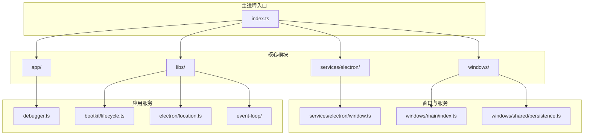
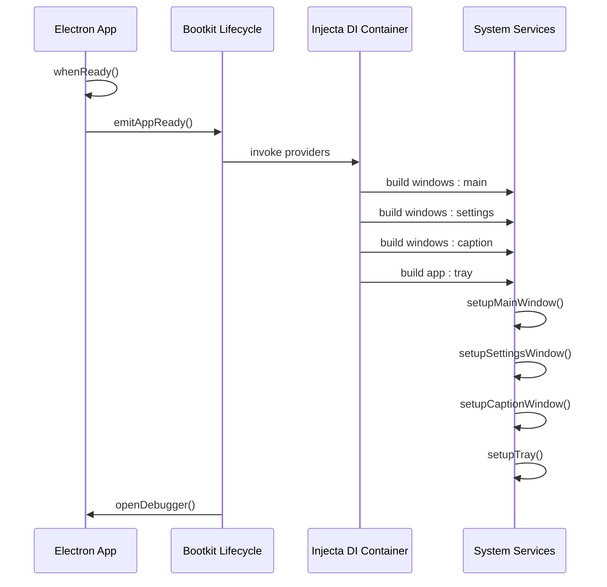
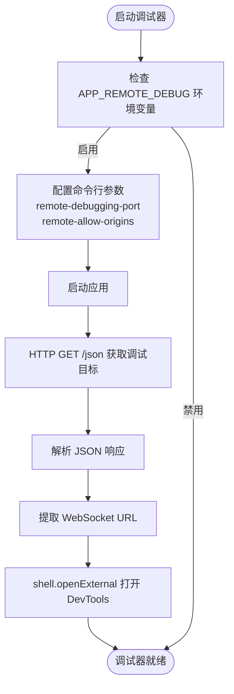
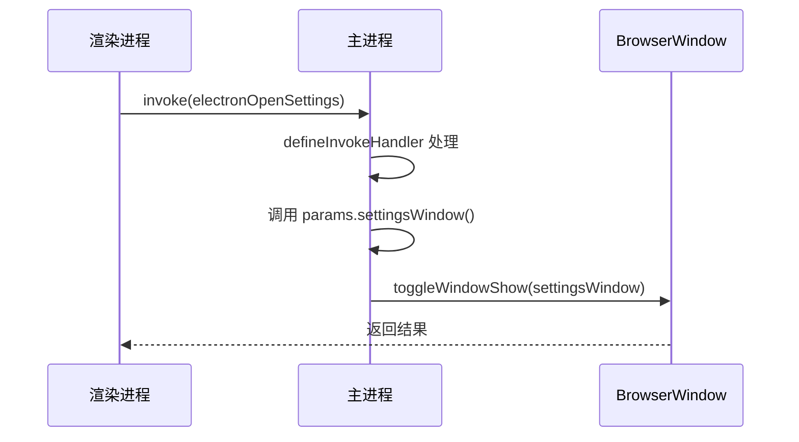
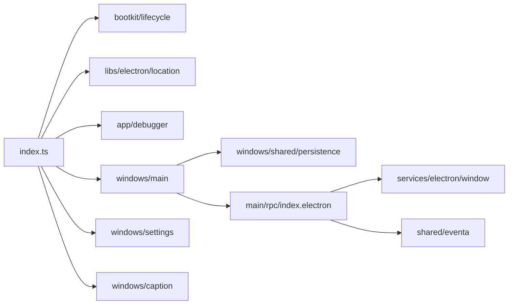

# 主进程架构

<cite>
**本文档中引用的文件**  
- [index.ts](file://apps/stage-tamagotchi/src/main/index.ts)
- [debugger.ts](file://apps/stage-tamagotchi/src/main/app/debugger.ts)
- [lifecycle.ts](file://apps/stage-tamagotchi/src/main/libs/bootkit/lifecycle.ts)
- [location.ts](file://apps/stage-tamagotchi/src/main/libs/electron/location.ts)
- [loop.ts](file://apps/stage-tamagotchi/src/main/libs/event-loop/loop.ts)
- [window.ts](file://apps/stage-tamagotchi/src/main/services/electron/window.ts)
- [main/index.ts](file://apps/stage-tamagotchi/src/main/windows/main/index.ts)
- [shared/persistence.ts](file://apps/stage-tamagotchi/src/main/windows/shared/persistence.ts)
- [rpc/index.electron.ts](file://apps/stage-tamagotchi/src/main/windows/main/rpc/index.electron.ts)
</cite>

## 目录
1. [引言](#引言)
2. [项目结构](#项目结构)
3. [核心组件](#核心组件)
4. [架构概述](#架构概述)
5. [详细组件分析](#详细组件分析)
6. [依赖分析](#依赖分析)
7. [性能考虑](#性能考虑)
8. [故障排除指南](#故障排除指南)
9. [结论](#结论)

## 引言
本文档详细描述了 stage-tamagotchi 应用的 Electron 主进程架构。重点介绍主进程的初始化流程、应用生命周期管理、系统级服务的启动机制，以及通过 bootkit 生命周期管理器协调的启动过程。同时涵盖主进程与渲染进程之间的 IPC 通信机制、原生模块加载管理、错误处理、崩溃恢复和性能监控的最佳实践。

## 项目结构
stage-tamagotchi 的主进程代码位于 `apps/stage-tamagotchi/src/main` 目录下，采用模块化设计，清晰地分离了不同功能职责。

**图示来源**
- [index.ts](file://apps/stage-tamagotchi/src/main/index.ts)
- [lifecycle.ts](file://apps/stage-tamagotchi/src/main/libs/bootkit/lifecycle.ts)
- [main/index.ts](file://apps/stage-tamagotchi/src/main/windows/main/index.ts)

**本节来源**
- [index.ts](file://apps/stage-tamagotchi/src/main/index.ts)

## 核心组件
主进程的核心组件包括应用生命周期管理器（bootkit）、调试器（debugger）、事件循环（event-loop）以及窗口和系统服务。这些组件协同工作，确保应用的稳定启动和运行。

**本节来源**
- [index.ts](file://apps/stage-tamagotchi/src/main/index.ts)
- [lifecycle.ts](file://apps/stage-tamagotchi/src/main/libs/bootkit/lifecycle.ts)

## 架构概述
stage-tamagotchi 的主进程遵循典型的 Electron 架构模式，但通过自定义的 bootkit 和 injecta 依赖注入系统进行了增强。应用启动时，首先初始化 Electron 环境，然后通过事件驱动的生命周期钩子逐步启动各项服务。

**图示来源**
- [index.ts](file://apps/stage-tamagotchi/src/main/index.ts)
- [lifecycle.ts](file://apps/stage-tamagotchi/src/main/libs/bootkit/lifecycle.ts)
- [main/index.ts](file://apps/stage-tamagotchi/src/main/windows/main/index.ts)

## 详细组件分析

### 初始化流程与生命周期管理
主进程的初始化始于 `index.ts` 文件。`app.whenReady()` 事件触发后，系统首先启动项目服务器运行时，然后初始化 injecta 依赖注入容器。通过 `injecta.provide()` 方法注册了主窗口、设置窗口、标题栏窗口和系统托盘等核心服务。`injecta.start()` 调用后，所有服务按依赖关系顺序构建。`bootkit/lifecycle.ts` 文件定义了 `onAppReady`、`onAppBeforeQuit` 和 `onAppWindowAllClosed` 三个生命周期钩子，允许其他模块在关键时间点注入自定义逻辑。

**本节来源**
- [index.ts](file://apps/stage-tamagotchi/src/main/index.ts#L70-L100)
- [lifecycle.ts](file://apps/stage-tamagotchi/src/main/libs/bootkit/lifecycle.ts#L1-L33)

### 调试器与事件循环
`app/debugger.ts` 模块负责远程调试功能的配置和启动。当环境变量 `APP_REMOTE_DEBUG` 启用时，它会通过 `app.commandLine.appendSwitch` 设置 Electron 的远程调试端口和允许的源。`openDebugger` 函数通过 HTTP 请求 `localhost:9222/json` 获取调试目标信息，并自动在默认浏览器中打开 DevTools 界面。`libs/event-loop` 模块提供了一个 `useLoop` 工具，用于创建可管理的循环任务，例如持续获取窗口位置和大小，该任务会在应用退出或窗口关闭时自动停止。

**图示来源**
- [debugger.ts](file://apps/stage-tamagotchi/src/main/app/debugger.ts#L1-L52)
- [index.ts](file://apps/stage-tamagotchi/src/main/index.ts#L25-L30)

### 系统级服务与 IPC 通信
主进程通过 IPC 与渲染进程进行双向通信。`services/electron/window.ts` 模块使用 `@unbird/eventa` 库的 `defineInvokeHandler` 定义了多个 IPC 处理程序，例如 `startLoopGetBounds` 用于启动一个持续向渲染进程发送窗口边界信息的循环。`main/rpc/index.electron.ts` 文件为 `electronOpenMainDevtools` 和 `electronOpenSettings` 等事件定义了处理程序，实现了从渲染进程调用主进程功能的机制。这种设计将 IPC 通信逻辑与窗口业务逻辑解耦。

#### IPC 通信序列图

**图示来源**
- [window.ts](file://apps/stage-tamagotchi/src/main/services/electron/window.ts#L1-L43)
- [index.electron.ts](file://apps/stage-tamagotchi/src/main/windows/main/rpc/index.electron.ts#L1-L24)

### 原生模块加载与错误处理
主进程通过预加载脚本（preload）安全地向渲染进程暴露 Electron API。`preload/shared.ts` 中的 `expose` 函数利用 `contextBridge.exposeInMainWorld` 将 `electron`、`platform` 和自定义 `api` 对象注入到渲染进程的全局 `window` 对象中。主进程自身的错误处理主要通过 `useLogg` 日志库实现。在 `index.ts` 的 `app.whenReady()` 链中，使用了 `.catch()` 来捕获初始化阶段的异常，并通过 `log.withError(err).error()` 记录详细的错误信息。对于异步操作，如 WebSocket 服务器的关闭，也使用了 `try-catch` 块进行错误捕获和日志记录。

**本节来源**
- [index.ts](file://apps/stage-tamagotchi/src/main/index.ts#L102-L105)
- [shared.ts](file://apps/stage-tamagotchi/src/preload/shared.ts#L7-L26)

## 依赖分析
主进程的依赖关系清晰，核心依赖包括 Electron 自身、`@electron-toolkit/utils` 用于窗口快捷方式、`@guiiai/logg` 用于日志记录、`@proj-airi/injecta` 用于依赖注入、`@unbird/eventa` 用于事件通信，以及 `es-toolkit`、`std-env` 等实用工具库。`injecta` 容器是管理服务间依赖的关键，它确保了服务按正确的顺序构建和销毁。

**图示来源**
- [index.ts](file://apps/stage-tamagotchi/src/main/index.ts)
- [main/index.ts](file://apps/stage-tamagotchi/src/main/windows/main/index.ts)

**本节来源**
- [index.ts](file://apps/stage-tamagotchi/src/main/index.ts)
- [package.json](file://apps/stage-tamagotchi/package.json)

## 性能考虑
主进程的性能优化体现在多个方面。`window.ts` 中的 `useLoop` 被用于创建可启动和停止的循环，避免了不必要的持续运行。`persistence.ts` 中的 `update` 函数使用 `throttle` 将配置文件的写入操作限制在250毫秒内最多执行一次，防止了因频繁更新导致的 I/O 性能问题。此外，主进程避免了在主线程执行耗时的同步操作，所有文件 I/O 都使用了异步方法。

## 故障排除指南
- **应用无法启动**：检查 `index.ts` 中的 `app.whenReady()` 是否被正确触发，确认 `bootkit` 的生命周期钩子没有抛出未捕获的异常。
- **IPC 通信失败**：确保 `defineInvokeHandler` 的事件名称在主进程和渲染进程之间完全匹配。检查 `contextBridge.exposeInMainWorld` 是否已正确暴露 API。
- **窗口状态未持久化**：检查 `userData` 目录下的配置文件（如 `app-config.json`）是否存在且可写。确认 `persistence.ts` 中的 `createConfig` 和 `update` 方法被正确调用。
- **调试器无法打开**：验证 `APP_REMOTE_DEBUG` 环境变量是否设置为 `true`，并检查指定的调试端口是否被其他进程占用。

**本节来源**
- [index.ts](file://apps/stage-tamagotchi/src/main/index.ts#L102-L105)
- [debugger.ts](file://apps/stage-tamagotchi/src/main/app/debugger.ts)
- [persistence.ts](file://apps/stage-tamagotchi/src/main/windows/shared/persistence.ts)

## 结论
stage-tamagotchi 的主进程架构设计精良，通过模块化、依赖注入和事件驱动的生命周期管理，实现了高内聚、低耦合的系统结构。对 IPC 通信、状态持久化和错误处理的细致考量，确保了应用的稳定性和可维护性。该架构为未来的功能扩展提供了坚实的基础。