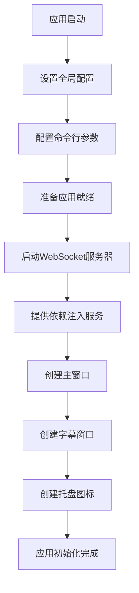
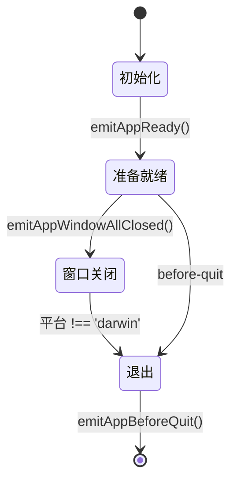
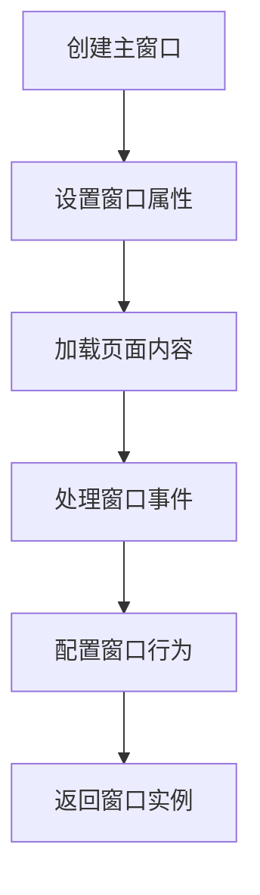
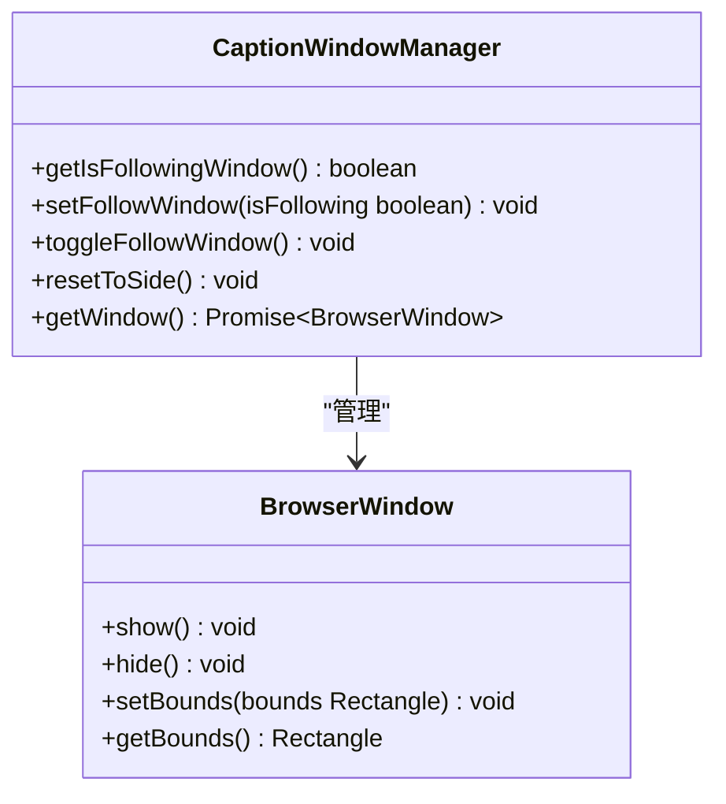
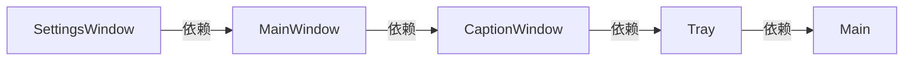
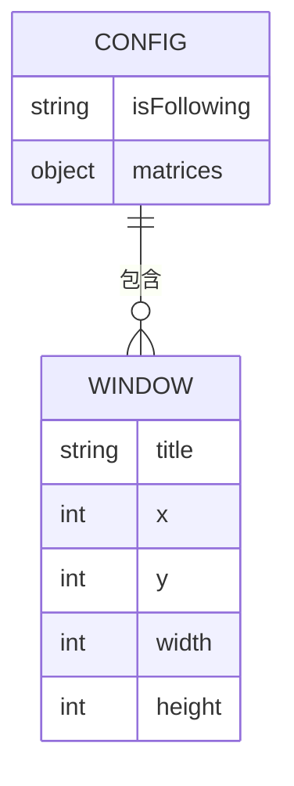
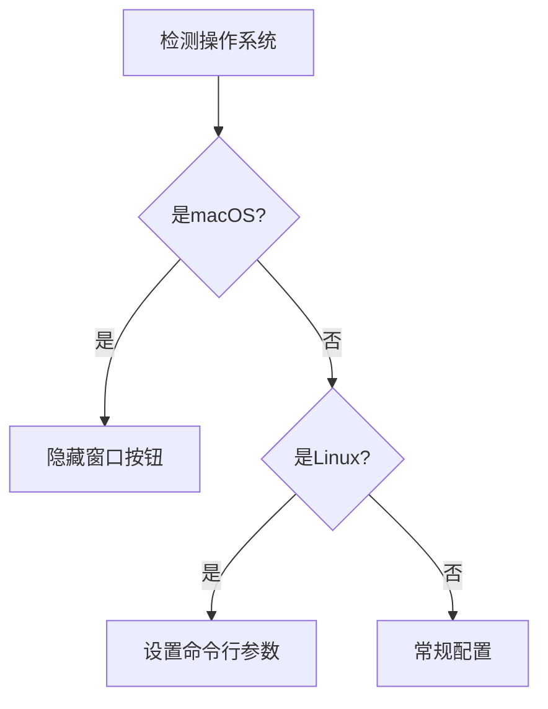
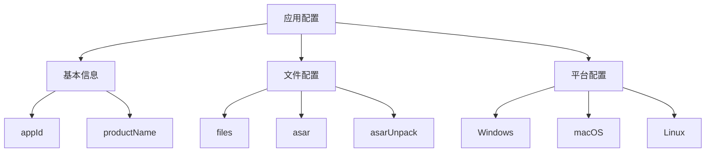

# 原生模块管理

<cite>
**Referenced Files in This Document**   
- [electron-builder.yml](file://apps/stage-tamagotchi/electron-builder.yml)
- [index.ts](file://apps/stage-tamagotchi/src/main/index.ts)
- [lifecycle.ts](file://apps/stage-tamagotchi/src/main/libs/bootkit/lifecycle.ts)
- [main/index.ts](file://apps/stage-tamagotchi/src/main/windows/main/index.ts)
- [caption/index.ts](file://apps/stage-tamagotchi/src/main/windows/caption/index.ts)
- [settings/index.ts](file://apps/stage-tamagotchi/src/main/windows/settings/index.ts)
- [reusable.ts](file://apps/stage-tamagotchi/src/main/libs/electron/window-manager/reusable.ts)
- [location.ts](file://apps/stage-tamagotchi/src/main/libs/electron/location.ts)
</cite>

## 目录
1. [简介](#简介)
2. [主进程初始化与原生模块加载](#主进程初始化与原生模块加载)
3. [应用生命周期管理](#应用生命周期管理)
4. [窗口管理与原生API集成](#窗口管理与原生api集成)
5. [依赖注入与模块化设计](#依赖注入与模块化设计)
6. [配置持久化与跨平台适配](#配置持久化与跨平台适配)
7. [Electron打包配置](#electron打包配置)

## 简介
本文档详细说明了在Electron应用中主进程如何加载和管理原生模块。通过分析项目代码，阐述了主进程的初始化流程、应用生命周期管理、窗口创建与管理、依赖注入机制以及Electron的打包配置。重点介绍了主进程如何安全地调用原生API，并通过配置文件实现开发与生产环境的切换策略。

## 主进程初始化与原生模块加载

主进程的入口文件`index.ts`负责应用的初始化和原生模块的加载。通过动态导入的方式，主进程在应用准备就绪时启动WebSocket服务器，实现了原生模块的按需加载。

**Diagram sources**
- [index.ts](file://apps/stage-tamagotchi/src/main/index.ts#L1-L180)

**Section sources**
- [index.ts](file://apps/stage-tamagotchi/src/main/index.ts#L1-L180)

## 应用生命周期管理

应用的生命周期通过事件钩子进行管理，确保在不同阶段执行相应的操作。生命周期管理模块提供了`onAppReady`、`onAppBeforeQuit`和`onAppWindowAllClosed`等钩子函数，允许在特定事件发生时执行自定义逻辑。

**Diagram sources**
- [lifecycle.ts](file://apps/stage-tamagotchi/src/main/libs/bootkit/lifecycle.ts#L1-L33)

**Section sources**
- [lifecycle.ts](file://apps/stage-tamagotchi/src/main/libs/bootkit/lifecycle.ts#L1-L33)

## 窗口管理与原生API集成

窗口管理模块负责创建和管理应用的各种窗口，包括主窗口、设置窗口和字幕窗口。通过Electron的原生API，实现了窗口的创建、显示、隐藏和位置管理。

### 主窗口管理
主窗口的创建过程包括设置窗口属性、加载页面内容、处理窗口事件和配置窗口行为。

**Section sources**
- [main/index.ts](file://apps/stage-tamagotchi/src/main/windows/main/index.ts#L1-L154)

### 字幕窗口管理
字幕窗口具有跟随主窗口移动的特性，通过计算相对位置和使用动画效果实现平滑移动。

**Diagram sources**
- [caption/index.ts](file://apps/stage-tamagotchi/src/main/windows/caption/index.ts#L1-L384)

**Section sources**
- [caption/index.ts](file://apps/stage-tamagotchi/src/main/windows/caption/index.ts#L1-L384)

## 依赖注入与模块化设计

应用采用依赖注入模式实现模块化设计，通过`injecta`库管理服务的提供和调用。这种设计模式提高了代码的可测试性和可维护性。

**Section sources**
- [index.ts](file://apps/stage-tamagotchi/src/main/index.ts#L1-L180)

## 配置持久化与跨平台适配

应用通过配置文件实现用户设置的持久化存储，并针对不同操作系统进行适配。

### 配置持久化
配置信息存储在JSON文件中，包括窗口位置、大小和用户偏好设置。

**Section sources**
- [caption/index.ts](file://apps/stage-tamagotchi/src/main/windows/caption/index.ts#L1-L384)
- [settings/index.ts](file://apps/stage-tamagotchi/src/main/windows/settings/index.ts#L1-L36)

### 跨平台适配
应用针对不同操作系统进行了特定的配置和优化。

**Section sources**
- [index.ts](file://apps/stage-tamagotchi/src/main/index.ts#L1-L180)
- [main/index.ts](file://apps/stage-tamagotchi/src/main/windows/main/index.ts#L1-L154)

## Electron打包配置

`electron-builder.yml`文件定义了应用的打包配置，包括应用基本信息、文件包含规则、ASAR打包设置和各平台的特定配置。

**Diagram sources**
- [electron-builder.yml](file://apps/stage-tamagotchi/electron-builder.yml#L1-L69)

**Section sources**
- [electron-builder.yml](file://apps/stage-tamagotchi/electron-builder.yml#L1-L69)