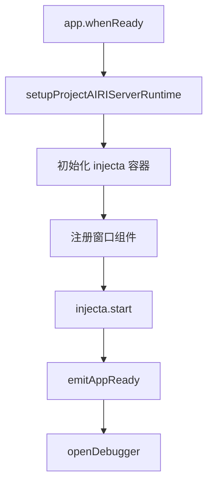
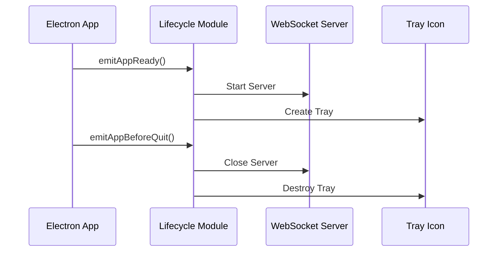

# 应用生命周期管理

<cite>
**本文档中引用的文件**  
- [lifecycle.ts](file://apps/stage-tamagotchi/src/main/libs/bootkit/lifecycle.ts)
- [builtin.ts](file://packages/injecta/src/builtin.ts)
- [index.ts](file://apps/stage-tamagotchi/src/main/index.ts)
- [screen.ts](file://apps/stage-tamagotchi/src/main/services/electron/screen.ts)
- [window.ts](file://apps/stage-tamagotchi/src/main/services/electron/window.ts)
</cite>

## 目录
1. [简介](#简介)
2. [生命周期钩子定义与执行机制](#生命周期钩子定义与执行机制)
3. [启动阶段生命周期流程](#启动阶段生命周期流程)
4. [关闭阶段资源清理与状态持久化](#关闭阶段资源清理与状态持久化)
5. [事件驱动的组件协调机制](#事件驱动的组件协调机制)
6. [生命周期管理架构图](#生命周期管理架构图)
7. [总结](#总结)

## 简介
本文档深入解析基于 `bootkit` 模块的应用生命周期管理机制，重点分析 `lifecycle.ts` 中定义的启动与关闭阶段钩子函数及其执行顺序。通过事件驱动模式实现系统组件的初始化协调与资源释放，确保应用在启动和退出时各模块按正确顺序执行初始化和清理操作。

## 生命周期钩子定义与执行机制

`lifecycle.ts` 文件定义了三类核心生命周期钩子：`onAppReady`、`onAppBeforeQuit` 和 `onAppWindowAllClosed`，分别对应应用准备就绪、即将退出以及所有窗口关闭事件。这些钩子通过数组存储回调函数，并在特定时机由对应的 `emit` 函数依次异步执行。

此外，`injecta` 框架提供的 `Lifecycle` 接口支持更细粒度的服务级生命周期管理，允许组件注册 `onStart` 和 `onStop` 钩子，从而实现依赖拓扑排序后的有序启动与停止。

**Section sources**
- [lifecycle.ts](file://apps/stage-tamagotchi/src/main/libs/bootkit/lifecycle.ts#L0-L33)
- [builtin.ts](file://packages/injecta/src/builtin.ts#L0-L45)

## 启动阶段生命周期流程

应用启动流程始于 Electron 的 `app.whenReady()` 事件。在此阶段，系统依次完成以下操作：

1. 启动项目 AIRI 服务运行时（WebSocket 服务器）
2. 初始化依赖注入容器 `injecta`
3. 注册主窗口、设置窗口、字幕窗口等核心组件
4. 调用 `emitAppReady()` 触发所有已注册的就绪钩子
5. 打开调试器（开发环境）

该流程确保所有关键服务在应用完全启动前完成初始化，并通过 `injecta.start()` 启动依赖容器，触发各服务的 `onStart` 钩子。



**Diagram sources**
- [index.ts](file://apps/stage-tamagotchi/src/main/index.ts#L34-L100)

**Section sources**
- [index.ts](file://apps/stage-tamagotchi/src/main/index.ts#L34-L100)

## 关闭阶段资源清理与状态持久化

应用关闭流程通过 Electron 的 `before-quit` 和 `window-all-closed` 事件进行管理：

- `app.on('window-all-closed')`：当所有窗口关闭时触发 `emitAppWindowAllClosed()`，用于执行非 macOS 平台上的自动退出逻辑。
- `app.on('before-quit')`：在应用即将退出前调用 `emitAppBeforeQuit()`，触发所有注册的清理钩子，如关闭 WebSocket 服务器、释放资源等。

此外，`onAppBeforeQuit` 还被用于销毁系统托盘图标，确保退出时无残留进程或界面元素。

**Section sources**
- [lifecycle.ts](file://apps/stage-tamagotchi/src/main/libs/bootkit/lifecycle.ts#L14-L22)
- [index.ts](file://apps/stage-tamagotchi/src/main/index.ts#L168-L180)

## 事件驱动的组件协调机制

系统采用事件驱动模式协调不同组件的初始化与销毁。例如：

- **托盘图标管理**：在 `setupTray` 中注册 `onAppBeforeQuit` 钩子，确保退出时自动销毁托盘实例。
- **WebSocket 服务清理**：在 `setupProjectAIRIServerRuntime` 中注册 `onAppBeforeQuit` 异步钩子，安全关闭服务器并处理异常。
- **Electron 窗口服务**：`screen.ts` 和 `window.ts` 均导入 `onAppBeforeQuit` 和 `onAppWindowAllClosed`，用于监听全局窗口状态变化并执行相应逻辑。

这种机制实现了低耦合的组件通信，各模块可独立注册生命周期行为，无需显式依赖其他模块。



**Diagram sources**
- [index.ts](file://apps/stage-tamagotchi/src/main/index.ts#L70-L90)
- [lifecycle.ts](file://apps/stage-tamagotchi/src/main/libs/bootkit/lifecycle.ts#L14-L22)

**Section sources**
- [index.ts](file://apps/stage-tamagotchi/src/main/index.ts#L70-L90)
- [screen.ts](file://apps/stage-tamagotchi/src/main/services/electron/screen.ts#L8)
- [window.ts](file://apps/stage-tamagotchi/src/main/services/electron/window.ts#L7)

## 生命周期管理架构图

```mermaid
graph TD
subgraph "Electron 主进程"
A[app.whenReady] --> B[emitAppReady]
C[app.on('window-all-closed')] --> D[emitAppWindowAllClosed]
E[app.on('before-quit')] --> F[emitAppBeforeQuit]
end
subgraph "生命周期模块"
B --> G[执行 onAppReadyHooks]
D --> H[执行 onAppWindowAllClosedHooks]
F --> I[执行 onAppBeforeQuitHooks]
end
subgraph "服务组件"
G --> J[启动 WebSocket 服务]
G --> K[创建系统托盘]
F --> L[关闭 WebSocket 服务]
F --> M[销毁系统托盘]
end
```

**Diagram sources**
- [lifecycle.ts](file://apps/stage-tamagotchi/src/main/libs/bootkit/lifecycle.ts#L0-L33)
- [index.ts](file://apps/stage-tamagotchi/src/main/index.ts#L34-L180)

## 总结
本系统通过 `bootkit/lifecycle` 模块实现了清晰的启动与关闭生命周期管理。结合 `injecta` 的依赖注入与生命周期接口，形成了多层次的初始化与清理机制。事件驱动的设计使得各组件能够灵活注册钩子，确保资源的正确分配与释放，提升了应用的稳定性与可维护性。