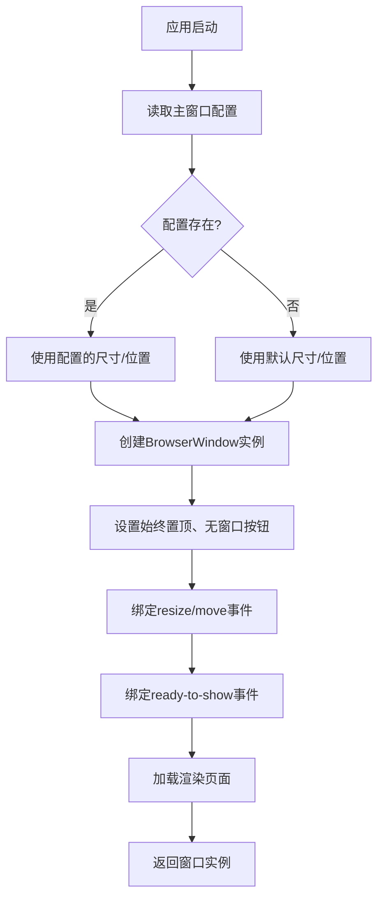
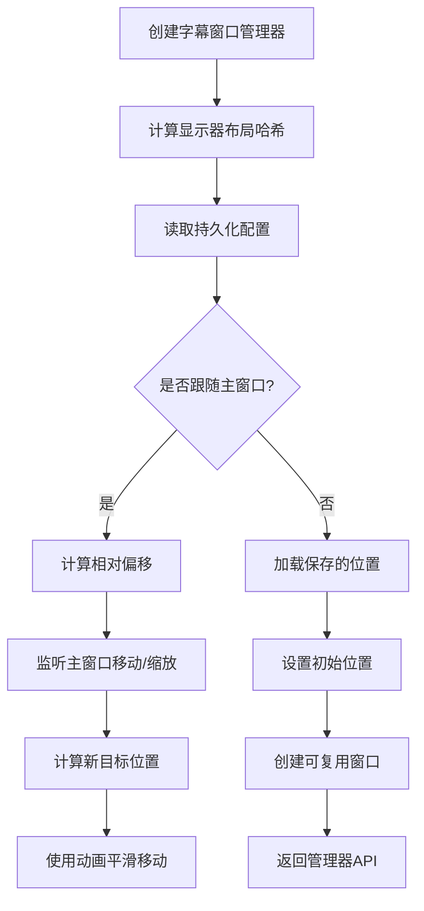
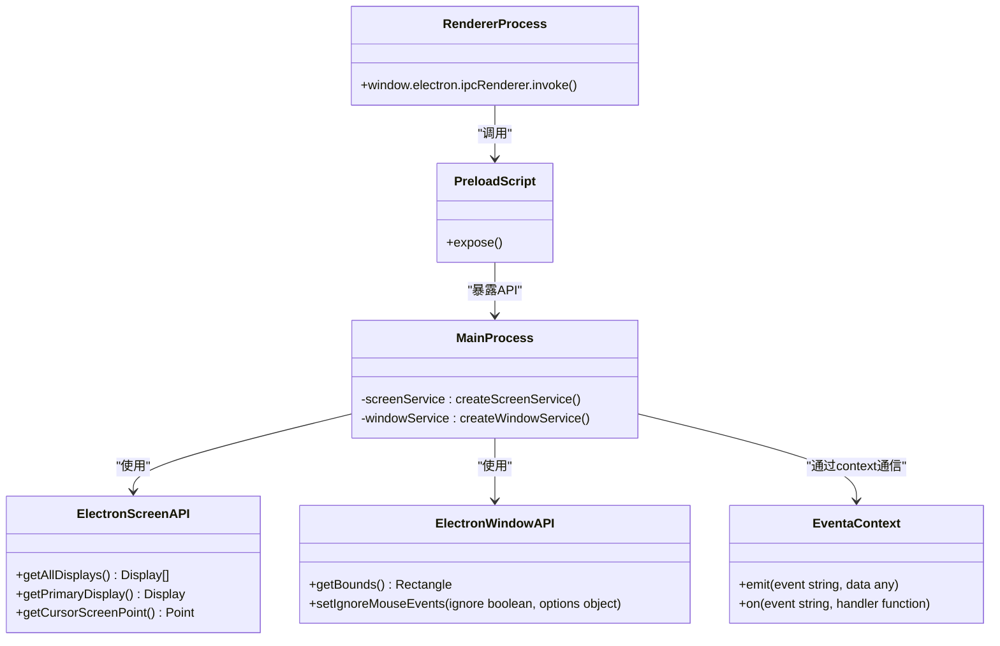

# 系统服务协调

<cite>
**本文档引用的文件**  
- [main.ts](file://apps/stage-tamagotchi/src/main/index.ts)
- [window.ts](file://apps/stage-tamagotchi/src/main/services/electron/window.ts)
- [screen.ts](file://apps/stage-tamagotchi/src/main/services/electron/screen.ts)
- [index.ts](file://apps/stage-tamagotchi/src/main/libs/event-loop/index.ts)
- [loop.ts](file://apps/stage-tamagotchi/src/main/libs/event-loop/loop.ts)
- [window-manager/index.ts](file://apps/stage-tamagotchi/src/main/libs/electron/window-manager/index.ts)
- [reusable.ts](file://apps/stage-tamagotchi/src/main/libs/electron/window-manager/reusable.ts)
- [eventa.ts](file://apps/stage-tamagotchi/src/shared/eventa.ts)
- [electron/window.ts](file://apps/stage-tamagotchi/src/shared/electron/window.ts)
- [electron/screen.ts](file://apps/stage-tamagotchi/src/shared/electron/screen.ts)
- [main/index.ts](file://apps/stage-tamagotchi/src/main/windows/main/index.ts)
- [caption/index.ts](file://apps/stage-tamagotchi/src/main/windows/caption/index.ts)
- [settings/index.ts](file://apps/stage-tamagotchi/src/main/windows/settings/index.ts)
</cite>

## 目录
1. [引言](#引言)
2. [主进程中系统服务的协调机制](#主进程中系统服务的协调机制)
3. [窗口管理器工作机制](#窗口管理器工作机制)
4. [Electron系统服务的封装与暴露](#electron系统服务的封装与暴露)
5. [事件循环模块与主线程响应性](#事件循环模块与主线程响应性)
6. [服务的依赖注入与使用模式](#服务的依赖注入与使用模式)
7. [结论](#结论)

## 引言
本项目基于 Electron 构建桌面应用，主进程负责协调多个核心系统服务，包括窗口管理、屏幕信息获取、事件循环调度等。这些服务通过统一的事件通信机制（Eventa）进行封装，并通过依赖注入框架（injecta）实现组件间的解耦与协调。本文档详细阐述这些服务的协作机制，重点分析窗口管理器如何创建和管理主窗口、Electron 服务的封装方式、事件循环如何保障响应性，以及服务如何被其他组件使用。

## 主进程中系统服务的协调机制
主进程通过 `injecta` 依赖注入容器统一管理核心服务的生命周期与依赖关系。在应用初始化阶段，主进程通过 `injecta.provide` 方法注册多个关键服务，包括主窗口、设置窗口、字幕窗口和系统托盘。这些服务按依赖顺序依次构建，例如字幕窗口依赖主窗口，托盘依赖所有窗口实例。这种机制确保了服务初始化的有序性与一致性，避免了竞态条件。

服务间的通信通过 `@unbird/eventa` 框架实现，该框架基于 Electron 的 IPC（进程间通信）机制，提供了一套类型安全的事件定义与调用接口。主进程服务通过 `defineInvokeHandler` 注册可被渲染进程调用的方法，并通过 `context.emit` 主动向渲染进程发送事件，实现了双向、松耦合的通信。

**本节来源**
- [main.ts](file://apps/stage-tamagotchi/src/main/index.ts#L100-L150)

## 窗口管理器工作机制

### 主窗口的创建与管理
主窗口由 `setupMainWindow` 函数创建。该函数首先从持久化配置中读取窗口的尺寸和位置，若无配置则使用默认值。窗口创建时设置了关键属性：`type: 'panel'` 和 `setAlwaysOnTop(true, 'screen-saver')`，确保窗口始终显示在最顶层，即使在全屏应用之上。窗口的 `webPreferences` 指定了预加载脚本，用于安全地暴露 Electron API 给渲染进程。

窗口的事件处理机制完善：`resize` 和 `move` 事件会触发 `handleNewBounds` 回调，将新的窗口尺寸和位置持久化到配置文件中，实现窗口状态的跨会话保存。`ready-to-show` 事件触发后，窗口才真正显示，避免了白屏。此外，通过 `clickDragPlugin` 实现了无边框窗口的拖拽功能。



**本节来源**
- [main/index.ts](file://apps/stage-tamagotchi/src/main/windows/main/index.ts#L40-L150)

### 字幕窗口的创建与管理
字幕窗口 (`caption window`) 通过 `setupCaptionWindowManager` 创建，其管理机制更为复杂，支持“跟随主窗口”模式。该模式通过 `followMainWindow` 函数实现：当启用时，字幕窗口会监听主窗口的 `move` 和 `resize` 事件，并根据一个计算出的相对偏移量，使用 `animejs` 动画库平滑地调整自身位置。

窗口的位置和“跟随”状态通过 `createConfig` 持久化。配置的键（`matrices`）基于当前显示器布局的哈希值生成，确保在多显示器配置变化时能正确恢复窗口位置。`createReusableWindow` 工具确保了字幕窗口的单例性，即多次调用 `getWindow` 会复用已创建的窗口实例，若窗口被销毁则会重新创建。



**本节来源**
- [caption/index.ts](file://apps/stage-tamagotchi/src/main/windows/caption/index.ts#L120-L380)

### 设置窗口的创建与管理
设置窗口通过 `setupSettingsWindowReusableFunc` 创建，同样使用了 `createReusableWindow` 模式。该窗口是典型的模态对话框，宽度和高度固定。其创建过程与主窗口类似，但加载的是 `/settings` 路由的页面。`setupSettingsWindowInvokes` 函数为其注册了特定的 IPC 调用处理器，用于处理来自渲染进程的设置请求。

**本节来源**
- [settings/index.ts](file://apps/stage-tamagotchi/src/main/windows/settings/index.ts#L1-L35)

## Electron系统服务的封装与暴露

### 服务封装机制
Electron 的原生 API（如 `screen` 和 `window`）在主进程中被封装为独立的服务模块。以 `screen` 服务为例，`createScreenService` 函数接收一个 `context` 和 `window` 实例，然后通过 `defineInvokeHandler` 将 Electron 的 `screen` 模块方法（如 `getAllDisplays`, `getCursorScreenPoint`）注册为可通过 IPC 调用的事件处理器。

这些事件处理器的定义位于 `shared/electron/screen.ts` 文件中，使用 `defineInvokeEventa` 创建类型安全的事件标识符。这种方式将底层的 Electron API 与业务逻辑解耦，使得 API 的调用变得可追踪、可测试。

### 服务暴露方式
封装后的服务通过 `expose` 函数在预加载脚本中暴露给渲染进程。`preload/shared.ts` 中的 `expose` 函数利用 `contextBridge` 将 `electronAPI` 挂载到 `window.electron` 对象上。渲染进程通过 `window.electron.ipcRenderer.invoke` 调用主进程中注册的事件处理器，实现安全的跨进程通信。



**本节来源**
- [screen.ts](file://apps/stage-tamagotchi/src/main/services/electron/screen.ts#L1-L30)
- [window.ts](file://apps/stage-tamagotchi/src/main/services/electron/window.ts#L1-L40)
- [shared.ts](file://apps/stage-tamagotchi/src/preload/shared.ts#L1-L25)
- [electron/screen.ts](file://apps/stage-tamagotchi/src/shared/electron/screen.ts#L1-L25)
- [electron/window.ts](file://apps/stage-tamagotchi/src/shared/electron/window.ts#L1-L15)

## 事件循环模块与主线程响应性

### 事件循环实现
事件循环模块的核心是 `useLoop` 函数，位于 `libs/event-loop/loop.ts`。它接受一个回调函数 `fn` 和配置项（如执行间隔）。该函数内部使用 `setTimeout` 实现一个递归的循环，确保 `fn` 以指定的频率（默认 ~60 FPS）执行。

`useLoop` 返回一个包含 `start`, `stop`, `pause`, `resume` 方法的对象，允许对循环进行精细控制。例如，`createScreenService` 中的循环在应用退出时通过 `onAppBeforeQuit` 被 `stop`，避免了资源泄漏。

### 保障主线程响应性
该事件循环通过 `async/await` 和 `Promise.race` 确保了主线程的响应性：
1.  **异步执行**：回调函数 `fn` 被声明为 `async`，允许其内部执行异步操作（如获取鼠标位置）而不会阻塞循环。
2.  **超时保护**：在 `Promise.allSettled(callbackPromises)` 外层包裹了 `Promise.race`，并设置了一个基于 `interval` 的超时。这意味着即使某个回调执行时间过长，循环也会在超时后继续下一次迭代，防止主线程被长时间占用。
3.  **非阻塞调度**：使用 `setTimeout` 而非 `setInterval` 可以确保每次迭代的开始时间是基于上一次迭代完成的时间，避免了在高负载下定时器堆积的问题。

这种设计使得高频的事件（如鼠标位置更新）能够被持续、稳定地处理，同时不会因为单次操作的延迟而影响整个应用的流畅性。

```mermaid
sequenceDiagram
participant Loop as useLoop
participant Callback as 回调函数(fn)
participant Timeout as 超时定时器
Loop->>Loop : 启动循环
loop 每次迭代
Loop->>Callback : await fn()
alt fn执行成功
Callback-->>Loop : 返回
else fn执行中
Loop->>Timeout : 启动interval超时
Timeout--x Callback : 超时
end
Loop->>Loop : setTimeout(下一次迭代, interval)
end
```

**本节来源**
- [loop.ts](file://apps/stage-tamagotchi/src/main/libs/event-loop/loop.ts#L1-L47)
- [index.ts](file://apps/stage-tamagotchi/src/main/libs/event-loop/index.ts#L1-L2)

## 服务的依赖注入与使用模式

### 依赖注入 (DI) 模式
主进程广泛使用 `injecta` 依赖注入框架。`injecta.provide` 方法用于注册服务，其 `dependsOn` 属性明确声明了服务的依赖项。例如，`windows:caption` 服务的 `dependsOn` 包含 `mainWindow`。当 `injecta.start()` 被调用时，框架会自动解析依赖图，并按正确的顺序调用 `build` 函数来创建服务实例。

这种模式的优点在于：
- **解耦**：服务的创建者无需知道其依赖项的具体创建方式。
- **可测试性**：可以轻松地为依赖项提供模拟（mock）实现进行单元测试。
- **生命周期管理**：框架可以统一管理服务的启动和销毁。

### 单例模式
窗口管理服务普遍采用了单例模式。`createReusableWindow` 函数是实现此模式的关键。它返回一个 `getWindow` 函数，该函数内部维护一个 `window` 变量。首次调用时创建窗口，后续调用直接返回该实例。如果窗口被销毁（`isDestroyed()`），则会重新创建。这确保了在整个应用生命周期中，特定类型的窗口（如设置窗口）只有一个实例存在，避免了资源浪费和状态不一致。

**本节来源**
- [main.ts](file://apps/stage-tamagotchi/src/main/index.ts#L110-L140)
- [reusable.ts](file://apps/stage-tamagotchi/src/main/libs/electron/window-manager/reusable.ts#L1-L20)

## 结论
本项目通过精心设计的架构实现了主进程中各系统服务的高效协调。窗口管理器通过事件监听和动画实现了复杂的窗口行为，并利用持久化配置保证用户体验的一致性。Electron 原生服务通过 `Eventa` 框架被安全、类型化地封装和暴露。`useLoop` 事件循环模块通过异步和超时机制确保了主线程的高响应性。最后，`injecta` 依赖注入和 `createReusableWindow` 单例模式共同构建了一个松耦合、可维护的组件化系统。这些机制协同工作，为应用的稳定运行和良好用户体验提供了坚实的基础。