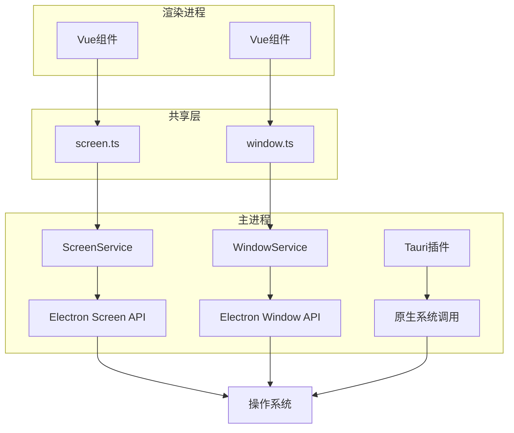
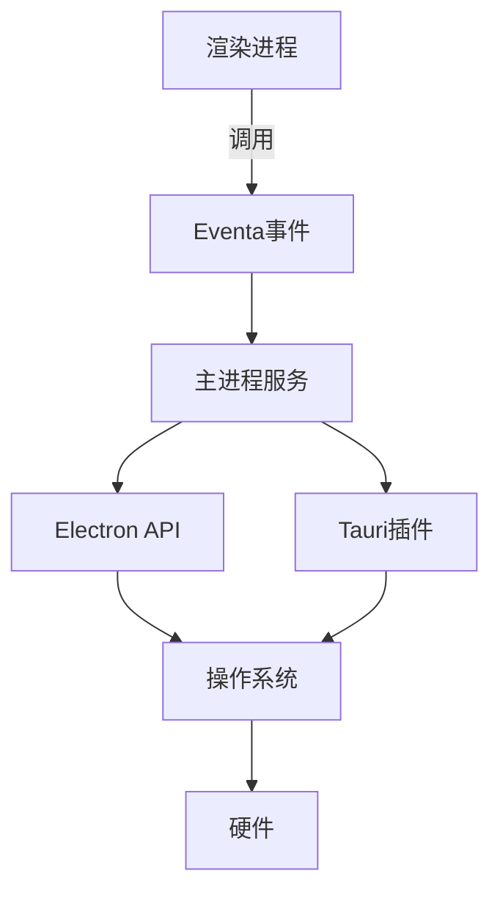
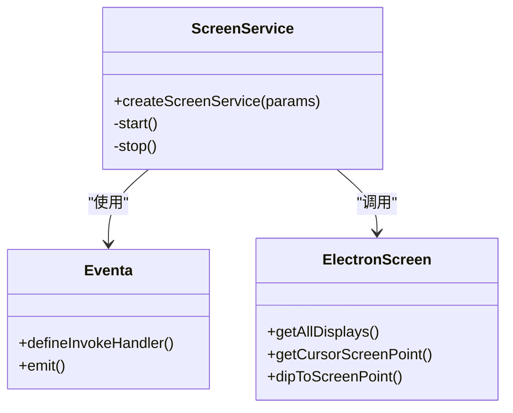
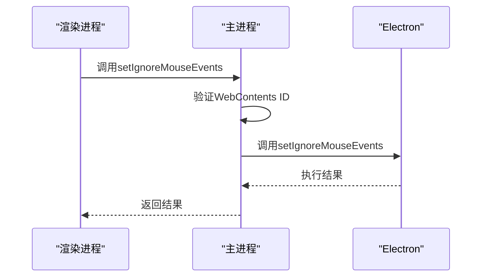
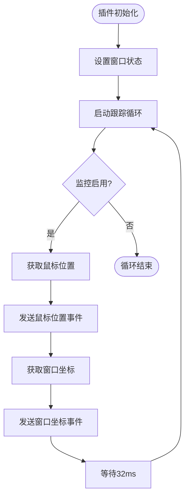
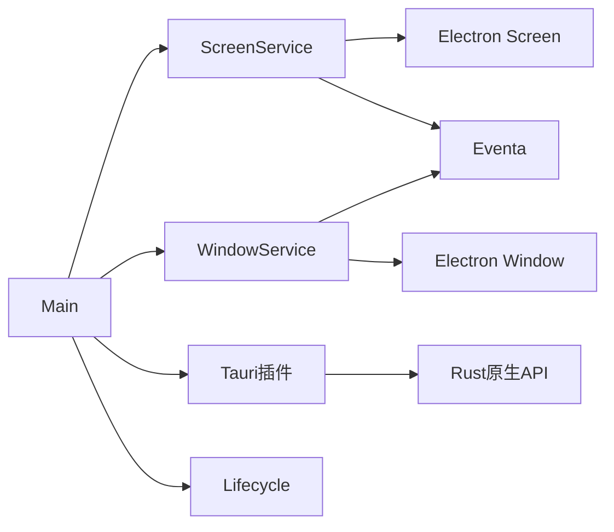

# 原生功能集成

<cite>
**本文档中引用的文件**  
- [screen.ts](file://apps/stage-tamagotchi/src/main/services/electron/screen.ts)
- [window.ts](file://apps/stage-tamagotchi/src/main/services/electron/window.ts)
- [screen.ts](file://apps/stage-tamagotchi/src/shared/electron/screen.ts)
- [window.ts](file://apps/stage-tamagotchi/src/shared/electron/window.ts)
- [location.ts](file://apps/stage-tamagotchi/src/main/libs/electron/location.ts)
- [lifecycle.ts](file://apps/stage-tamagotchi/src/main/libs/bootkit/lifecycle.ts)
- [loop.ts](file://apps/stage-tamagotchi/src/main/libs/event-loop/loop.ts)
- [lib.rs](file://crates/tauri-plugin-window-pass-through-on-hover/src/lib.rs)
- [native_windows.rs](file://crates/tauri-plugin-window-pass-through-on-hover/src/native_windows.rs)
- [native_macos.rs](file://crates/tauri-plugin-window-pass-through-on-hover/src/native_macos.rs)
- [index.ts](file://apps/stage-tamagotchi/src/main/index.ts)
</cite>

## 目录
1. [简介](#简介)
2. [项目结构](#项目结构)
3. [核心组件](#核心组件)
4. [架构概述](#架构概述)
5. [详细组件分析](#详细组件分析)
6. [依赖分析](#依赖分析)
7. [性能考虑](#性能考虑)
8. [故障排除指南](#故障排除指南)
9. [结论](#结论)

## 简介
本项目通过Electron和Tauri插件实现了丰富的原生系统功能集成。文档详细说明了如何访问屏幕信息、实现窗口穿透、鼠标跟踪和多显示器支持等高级功能。系统采用模块化设计，通过Eventa事件系统在主进程和渲染进程之间安全地通信，同时利用Tauri插件实现跨平台的原生窗口操作。

## 项目结构
项目采用分层架构，将主进程服务、共享接口和原生插件分离。Electron主进程服务位于`apps/stage-tamagotchi/src/main/services/electron`目录，共享的Electron API接口定义在`apps/stage-tamagotchi/src/shared/electron`目录。原生窗口穿透功能通过独立的Tauri插件`crates/tauri-plugin-window-pass-through-on-hover`实现，确保了功能的可维护性和跨平台兼容性。

**图示来源**  
- [screen.ts](file://apps/stage-tamagotchi/src/main/services/electron/screen.ts)
- [window.ts](file://apps/stage-tamagotchi/src/main/services/electron/window.ts)
- [lib.rs](file://crates/tauri-plugin-window-pass-through-on-hover/src/lib.rs)

**本节来源**  
- [screen.ts](file://apps/stage-tamagotchi/src/main/services/electron/screen.ts)
- [window.ts](file://apps/stage-tamagotchi/src/main/services/electron/window.ts)
- [lib.rs](file://crates/tauri-plugin-window-pass-through-on-hover/src/lib.rs)

## 核心组件
核心功能由两个主要服务组成：ScreenService和WindowService。ScreenService提供屏幕信息获取功能，包括显示器信息、光标位置和坐标转换。WindowService管理窗口属性，特别是窗口穿透功能。这些服务通过Eventa事件系统与渲染进程通信，确保了进程间通信的安全性和类型安全性。

**本节来源**  
- [screen.ts](file://apps/stage-tamagotchi/src/main/services/electron/screen.ts)
- [window.ts](file://apps/stage-tamagotchi/src/main/services/electron/window.ts)

## 架构概述
系统采用分层架构设计，将业务逻辑、服务层和原生接口分离。主进程中的服务通过Eventa框架暴露API，渲染进程通过定义的事件接口调用这些API。对于需要直接操作系统功能的场景，如窗口穿透，系统使用Tauri插件通过Rust代码直接调用原生API，确保了高性能和跨平台兼容性。

**图示来源**  
- [screen.ts](file://apps/stage-tamagotchi/src/main/services/electron/screen.ts)
- [window.ts](file://apps/stage-tamagotchi/src/main/services/electron/window.ts)
- [lib.rs](file://crates/tauri-plugin-window-pass-through-on-hover/src/lib.rs)

## 详细组件分析

### 屏幕服务分析
屏幕服务封装了Electron的screen模块功能，提供安全的进程间通信接口。服务通过事件循环定期获取光标位置，并将数据推送到渲染进程。所有屏幕相关的API都被包装为可调用事件，确保只有经过验证的请求才能访问系统信息。

**图示来源**  
- [screen.ts](file://apps/stage-tamagotchi/src/main/services/electron/screen.ts)
- [screen.ts](file://apps/stage-tamagotchi/src/shared/electron/screen.ts)

**本节来源**  
- [screen.ts](file://apps/stage-tamagotchi/src/main/services/electron/screen.ts)
- [screen.ts](file://apps/stage-tamagotchi/src/shared/electron/screen.ts)

### 窗口服务分析
窗口服务管理窗口的边界和鼠标事件处理。通过setIgnoreMouseEvents方法实现窗口穿透功能，允许鼠标事件穿透窗口传递到下方的应用程序。服务实现了安全检查，确保只有来自正确WebContents的请求才能修改窗口属性。

**图示来源**  
- [window.ts](file://apps/stage-tamagotchi/src/main/services/electron/window.ts)
- [window.ts](file://apps/stage-tamagotchi/src/shared/electron/window.ts)

**本节来源**  
- [window.ts](file://apps/stage-tamagotchi/src/main/services/electron/window.ts)
- [window.ts](file://apps/stage-tamagotchi/src/shared/electron/window.ts)

### 窗口穿透插件分析
窗口穿透插件使用Rust编写，通过Tauri框架提供跨平台的原生功能。插件在Windows和macOS上分别使用不同的原生API实现窗口穿透和鼠标跟踪功能。通过事件循环定期检查鼠标位置和窗口坐标，确保穿透状态的实时更新。

**图示来源**  
- [lib.rs](file://crates/tauri-plugin-window-pass-through-on-hover/src/lib.rs)
- [native_windows.rs](file://crates/tauri-plugin-window-pass-through-on-hover/src/native_windows.rs)
- [native_macos.rs](file://crates/tauri-plugin-window-pass-through-on-hover/src/native_macos.rs)

**本节来源**  
- [lib.rs](file://crates/tauri-plugin-window-pass-through-on-hover/src/lib.rs)
- [native_windows.rs](file://crates/tauri-plugin-window-pass-through-on-hover/src/native_windows.rs)
- [native_macos.rs](file://crates/tauri-plugin-window-pass-through-on-hover/src/native_macos.rs)

## 依赖分析
系统依赖关系清晰，各组件耦合度低。主进程服务依赖Electron核心模块和Eventa通信框架。窗口穿透功能通过独立的Tauri插件实现，与主应用逻辑解耦。生命周期管理通过专门的lifecycle模块处理，确保资源在应用退出时正确释放。

**图示来源**  
- [screen.ts](file://apps/stage-tamagotchi/src/main/services/electron/screen.ts)
- [window.ts](file://apps/stage-tamagotchi/src/main/services/electron/window.ts)
- [lib.rs](file://crates/tauri-plugin-window-pass-through-on-hover/src/lib.rs)
- [lifecycle.ts](file://apps/stage-tamagotchi/src/main/libs/bootkit/lifecycle.ts)

**本节来源**  
- [screen.ts](file://apps/stage-tamagotchi/src/main/services/electron/screen.ts)
- [window.ts](file://apps/stage-tamagotchi/src/main/services/electron/window.ts)
- [lib.rs](file://crates/tauri-plugin-window-pass-through-on-hover/src/lib.rs)
- [lifecycle.ts](file://apps/stage-tamagotchi/src/main/libs/bootkit/lifecycle.ts)

## 性能考虑
系统在性能方面进行了多项优化。事件循环使用~30FPS的更新频率，在保证响应性的同时避免过度消耗CPU资源。坐标转换和窗口状态检查都在主进程完成，减少进程间通信开销。对于长时间运行的服务，如鼠标跟踪，系统在应用窗口全部关闭时自动停止，避免后台资源浪费。

## 故障排除指南
常见问题包括窗口穿透功能失效、鼠标位置获取不准确和多显示器支持问题。调试时应首先检查Eventa事件是否正确注册，确认WebContents ID验证通过。对于平台特定问题，应分别检查Windows的GetWindowRect和macOS的NSWindow frame实现。性能问题通常与事件循环频率有关，可适当调整sleep间隔。

**本节来源**  
- [screen.ts](file://apps/stage-tamagotchi/src/main/services/electron/screen.ts)
- [window.ts](file://apps/stage-tamagotchi/src/main/services/electron/window.ts)
- [lib.rs](file://crates/tauri-plugin-window-pass-through-on-hover/src/lib.rs)

## 结论
本系统成功实现了Electron应用与原生系统功能的深度集成。通过模块化设计和清晰的依赖管理，系统既提供了强大的原生功能，又保持了良好的可维护性。窗口穿透、鼠标跟踪和多显示器支持等功能为用户提供了丰富的交互体验，而安全的进程间通信机制确保了系统的稳定性和安全性。