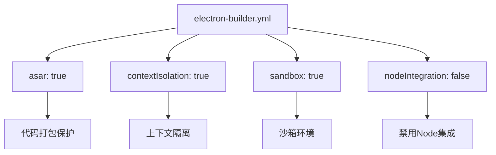
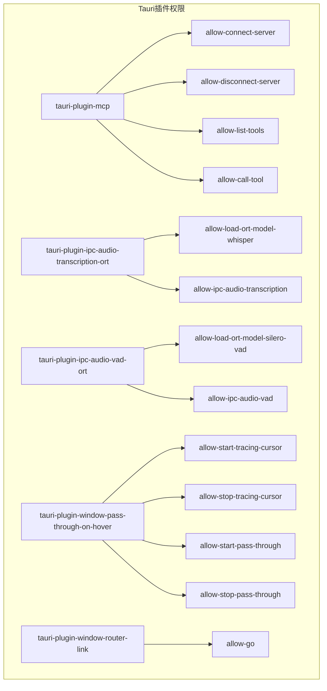
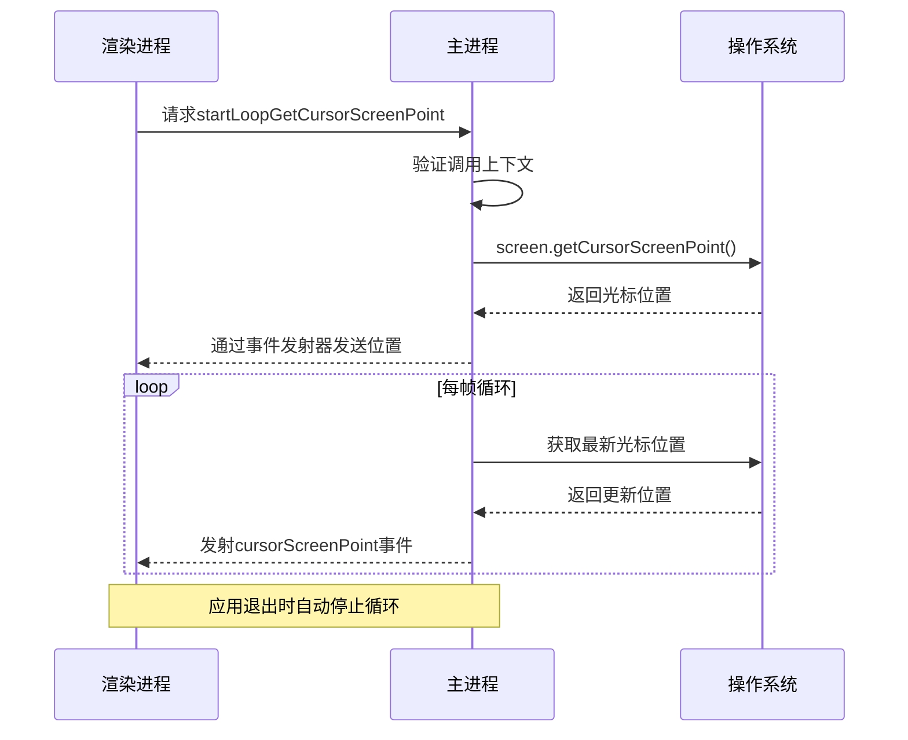
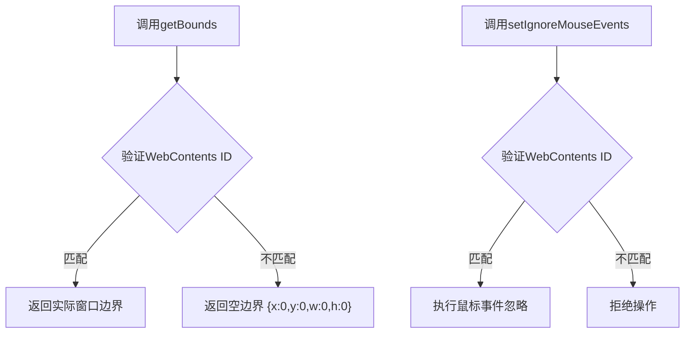

# 安全与权限管理

<cite>
**本文档中引用的文件**  
- [electron-builder.yml](file://apps/stage-tamagotchi/electron-builder.yml)
- [screen.ts](file://apps/stage-tamagotchi/src/main/services/electron/screen.ts)
- [window.ts](file://apps/stage-tamagotchi/src/main/services/electron/window.ts)
- [default.toml](file://crates/tauri-plugin-ipc-audio-transcription-ort/permissions/default.toml)
- [default.toml](file://crates/tauri-plugin-ipc-audio-vad-ort/permissions/default.toml)
- [default.toml](file://crates/tauri-plugin-mcp/permissions/default.toml)
- [default.toml](file://crates/tauri-plugin-window-pass-through-on-hover/permissions/default.toml)
- [default.toml](file://crates/tauri-plugin-window-router-link/permissions/default.toml)
</cite>

## 目录
1. [引言](#引言)
2. [Electron安全配置](#electron安全配置)
3. [Tauri插件权限模型](#tauri插件权限模型)
4. [敏感API权限控制机制](#敏感api权限控制机制)
5. [权限请求最佳实践](#权限请求最佳实践)
6. [安全审计与漏洞防范](#安全审计与漏洞防范)
7. [结论](#结论)

## 引言
本文件详细阐述了AIRI应用在Electron和Tauri框架下的原生功能安全与权限管理体系。通过分析项目中的安全配置文件和权限定义，展示了如何实现最小权限原则，保护用户隐私和系统安全。文档重点解析了地理位置、屏幕访问等敏感API的权限控制机制，并提供安全配置的最佳实践建议。

## Electron安全配置

### electron-builder.yml安全设置
在`electron-builder.yml`配置文件中，项目通过多项安全设置强化应用安全性。`asar: true`启用ASAR归档格式，保护源代码不被轻易查看。`asarUnpack`配置指定了需要解压的资源目录，确保关键资源可被正常访问的同时限制其他文件的暴露。



**Diagram sources**  
- [electron-builder.yml](file://apps/stage-tamagotchi/electron-builder.yml#L1-L70)

**Section sources**  
- [electron-builder.yml](file://apps/stage-tamagotchi/electron-builder.yml#L1-L70)

## Tauri插件权限模型

### 权限定义文件结构
Tauri插件系统通过`default.toml`文件定义命令访问策略，实现细粒度的权限控制。每个插件都有独立的权限配置，遵循最小权限原则。

```toml
"$schema" = "schemas/schema.json"

[default]
description = """
This permission set configures what kind of
operations are available from the mcp plugin.

#### Granted Permissions

All operations are enabled by default.
"""
permissions = [
  "allow-connect-server",
  "allow-disconnect-server",
  "allow-list-tools",
  "allow-call-tool"
]
```

### 插件权限映射
不同Tauri插件的权限配置实现了特定功能的安全访问控制：



**Diagram sources**  
- [default.toml](file://crates/tauri-plugin-mcp/permissions/default.toml#L1-L18)
- [default.toml](file://crates/tauri-plugin-ipc-audio-transcription-ort/permissions/default.toml#L1-L16)
- [default.toml](file://crates/tauri-plugin-ipc-audio-vad-ort/permissions/default.toml#L1-L16)
- [default.toml](file://crates/tauri-plugin-window-pass-through-on-hover/permissions/default.toml#L1-L18)
- [default.toml](file://crates/tauri-plugin-window-router-link/permissions/default.toml#L1-L15)

**Section sources**  
- [default.toml](file://crates/tauri-plugin-mcp/permissions/default.toml#L1-L18)
- [default.toml](file://crates/tauri-plugin-ipc-audio-transcription-ort/permissions/default.toml#L1-L16)
- [default.toml](file://crates/tauri-plugin-ipc-audio-vad-ort/permissions/default.toml#L1-L16)

## 敏感API权限控制机制

### 屏幕访问权限控制
应用通过Electron的`screen`模块实现屏幕信息访问，但实施了严格的访问控制。`screen.ts`文件中的服务仅在必要时启动循环获取光标位置，并在应用退出时自动停止。



**Diagram sources**  
- [screen.ts](file://apps/stage-tamagotchi/src/main/services/electron/screen.ts#L1-L32)

**Section sources**  
- [screen.ts](file://apps/stage-tamagotchi/src/main/services/electron/screen.ts#L1-L32)

### 窗口操作权限控制
窗口服务实现了安全的边界获取和鼠标事件控制，确保只有来自正确WebContents的请求才能获取窗口信息。



**Diagram sources**  
- [window.ts](file://apps/stage-tamagotchi/src/main/services/electron/window.ts#L1-L44)

**Section sources**  
- [window.ts](file://apps/stage-tamagotchi/src/main/services/electron/window.ts#L1-L44)

## 权限请求最佳实践

### 用户提示设计
应用在请求敏感权限时应遵循以下最佳实践：
- **明确说明**：清晰告知用户权限用途，如"应用需要访问您的屏幕信息以实现光标跟踪功能"
- **时机恰当**：在用户执行相关操作时请求权限，而非启动时批量请求
- **可选跳过**：提供跳过选项，允许用户在不授予权限的情况下继续使用基础功能
- **后续引导**：当权限被拒绝时，提供设置指引，告知用户如何在系统设置中手动授予权限

### 权限拒绝处理
当用户拒绝敏感权限请求时，应用应：
1. 优雅降级功能，提供替代方案
2. 记录用户选择，避免重复请求
3. 在设置界面提供权限管理入口
4. 保持核心功能可用性

## 安全审计与漏洞防范

### 常见漏洞防范
| 漏洞类型 | 防范措施 | 相关配置 |
|--------|--------|--------|
| 远程代码执行 | 禁用Node.js集成，启用上下文隔离 | `nodeIntegration: false`, `contextIsolation: true` |
| XSS攻击 | 启用沙箱，使用CSP策略 | `sandbox: true` |
| 信息泄露 | 限制敏感API访问，实施最小权限 | Tauri权限模型 |
| 供应链攻击 | 使用ASAR打包，代码签名 | `asar: true`, 数字签名 |

### 安全审计建议
1. **定期审查权限配置**：检查所有Tauri插件的`default.toml`文件，确保仅包含必要权限
2. **代码审计**：重点关注IPC通信处理，确保所有外部输入都经过验证
3. **依赖检查**：定期更新Electron和Tauri版本，修复已知安全漏洞
4. **渗透测试**：模拟攻击场景，测试权限控制机制的有效性
5. **日志监控**：记录权限请求和使用情况，便于安全事件追溯

## 结论
AIRI应用通过Electron和Tauri的双重安全机制，建立了完善的权限管理体系。Electron配置文件中的安全设置提供了基础防护，而Tauri插件系统的细粒度权限控制实现了功能层面的安全隔离。敏感API的访问通过严格的验证机制和生命周期管理，确保了用户隐私和系统安全。遵循最小权限原则和最佳实践，为应用的安全性提供了有力保障。