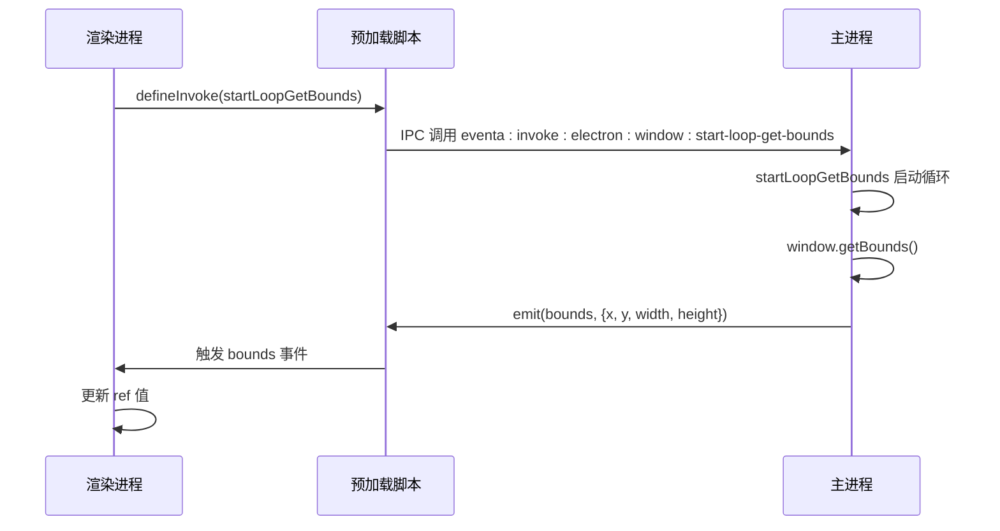
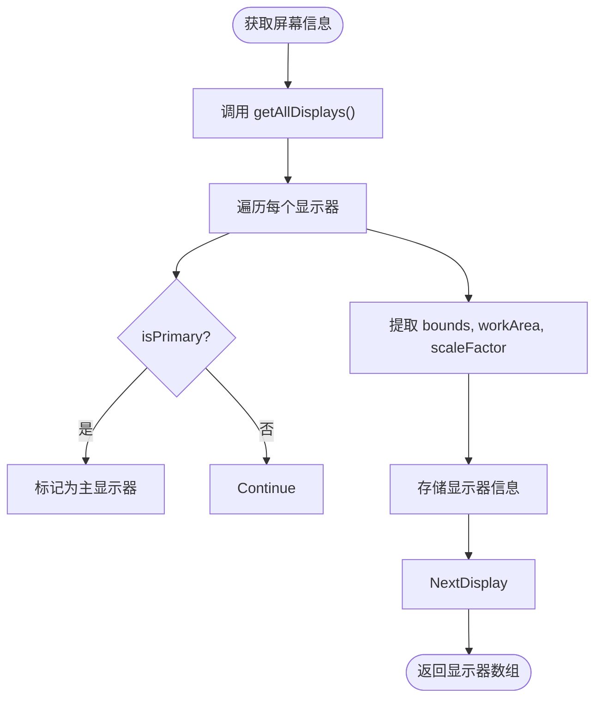

# 系统API访问

<cite>
**本文档中引用的文件**  
- [index.ts](file://apps/stage-tamagotchi/src/main/index.ts)
- [screen.ts](file://apps/stage-tamagotchi/src/main/services/electron/screen.ts)
- [window.ts](file://apps/stage-tamagotchi/src/main/services/electron/window.ts)
- [index.ts](file://apps/stage-tamagotchi/src/main/services/electron/index.ts)
- [shared.ts](file://apps/stage-tamagotchi/src/preload/shared.ts)
- [main.ts](file://apps/stage-tamagotchi/src/renderer/main.ts)
- [use-electron-window-bounds\index.ts](file://apps/stage-tamagotchi/src/renderer/composables/electron-vueuse/use-electron-window-bounds/index.ts)
- [window.ts](file://apps/stage-tamagotchi/src/shared/electron/window.ts)
- [screen.ts](file://apps/stage-tamagotchi/src/shared/electron/screen.ts)
- [eventa.ts](file://apps/stage-tamagotchi/src/shared/eventa.ts)
</cite>

## 目录
1. [简介](#简介)
2. [项目结构](#项目结构)
3. [核心组件](#核心组件)
4. [架构概览](#架构概览)
5. [详细组件分析](#详细组件分析)
6. [依赖分析](#依赖分析)
7. [性能考虑](#性能考虑)
8. [故障排除指南](#故障排除指南)
9. [结论](#结论)

## 简介
本文件详细说明了 stage-tamagotchi 应用中如何通过 Electron 安全地访问系统级 API，包括地理位置获取、屏幕信息查询和窗口边界检测。文档重点阐述了主进程（main）与渲染进程（renderer）之间的 IPC 通信机制，并展示了如何通过 Composable 函数（如 `use-electron-window-bounds`）在前端组件中安全暴露这些原生功能。同时涵盖多显示器环境下的坐标系统处理、分辨率适配策略，以及权限拒绝或 API 不可用时的降级处理方案。

## 项目结构
stage-tamagotchi 应用采用分层架构，将主进程逻辑、预加载脚本和渲染器逻辑清晰分离。系统 API 访问功能主要分布在 `main/services/electron` 目录下，通过 Eventa 框架进行 IPC 通信，并在 `renderer/composables` 中提供 Vue 组合式 API 供前端调用。

```mermaid
graph TB
subgraph "主进程 (Main Process)"
A[main/index.ts] --> B[services/electron/screen.ts]
A --> C[services/electron/window.ts]
B --> D[shared/electron/screen.ts]
C --> E[shared/electron/window.ts]
end
subgraph "预加载 (Preload)"
F[preload/shared.ts] --> G[contextBridge.exposeInMainWorld]
end
subgraph "渲染进程 (Renderer Process)"
H[renderer/composables/use-electron-window-bounds]
H --> I[shared/electron/window.ts]
H --> J[useElectronEventaContext]
end
A < --> F
F < --> H
```

**图示来源**  
- [index.ts](file://apps/stage-tamagotchi/src/main/index.ts#L1-L180)
- [screen.ts](file://apps/stage-tamagotchi/src/main/services/electron/screen.ts#L1-L31)
- [window.ts](file://apps/stage-tamagotchi/src/main/services/electron/window.ts#L1-L43)
- [shared.ts](file://apps/stage-tamagotchi/src/preload/shared.ts#L1-L27)
- [use-electron-window-bounds\index.ts](file://apps/stage-tamagotchi/src/renderer/composables/electron-vueuse/use-electron-window-bounds/index.ts#L1-L31)

**本节来源**  
- [index.ts](file://apps/stage-tamagotchi/src/main/index.ts#L1-L180)
- [shared.ts](file://apps/stage-tamagotchi/src/preload/shared.ts#L1-L27)

## 核心组件
系统 API 访问的核心在于 Electron 的 IPC 机制与 Eventa 事件框架的结合。主进程通过 `defineInvokeHandler` 注册可被调用的方法，渲染进程通过 `defineInvoke` 发起请求，并通过事件监听器接收持续更新的数据（如窗口位置、鼠标坐标）。

**本节来源**  
- [screen.ts](file://apps/stage-tamagotchi/src/main/services/electron/screen.ts#L1-L31)
- [window.ts](file://apps/stage-tamagotchi/src/main/services/electron/window.ts#L1-L43)
- [window.ts](file://apps/stage-tamagotchi/src/shared/electron/window.ts#L1-L14)

## 架构概览
系统采用“主进程服务化 + 渲染进程组合式调用”的架构。主进程中的 `createScreenService` 和 `createWindowService` 函数负责封装 Electron 的原生 API，并通过 Eventa 上下文暴露给渲染进程。预加载脚本使用 `contextBridge` 安全地将 `electron` 对象暴露到渲染器的全局作用域。



**图示来源**  
- [window.ts](file://apps/stage-tamagotchi/src/main/services/electron/window.ts#L1-L43)
- [use-electron-window-bounds\index.ts](file://apps/stage-tamagotchi/src/renderer/composables/electron-vueuse/use-electron-window-bounds/index.ts#L1-L31)
- [shared.ts](file://apps/stage-tamagotchi/src/preload/shared.ts#L1-L27)

## 详细组件分析

### 窗口边界检测分析
`use-electron-window-bounds` Composable 是前端访问窗口位置和尺寸的核心工具。它利用 `useElectronEventaContext` 获取与主进程的通信上下文，并监听 `bounds` 事件。当主进程通过 `useLoop` 循环检测到窗口变化时，会将最新的边界信息发送给渲染进程。

```mermaid
classDiagram
class useElectronWindowBounds {
+x : Ref<number>
+y : Ref<number>
+width : Ref<number>
+height : Ref<number>
+useElectronWindowBounds() : {x, y, width, height}
}
class useElectronEventaContext {
+() : Ref<EventaContext>
}
useElectronWindowBounds --> useElectronEventaContext : 依赖
useElectronWindowBounds --> bounds : 监听事件
useElectronWindowBounds --> startLoopGetBounds : 发起调用
```

**图示来源**  
- [use-electron-window-bounds\index.ts](file://apps/stage-tamagotchi/src/renderer/composables/electron-vueuse/use-electron-window-bounds/index.ts#L6-L30)
- [window.ts](file://apps/stage-tamagotchi/src/shared/electron/window.ts#L1-L14)

### 屏幕信息查询分析
屏幕服务提供了多显示器环境下的完整信息查询能力。`getAllDisplays` 返回所有显示器的详细信息（包括分辨率、缩放因子、位置），`getPrimaryDisplay` 返回主显示器信息。坐标转换函数（如 `dipToScreenPoint`）用于处理不同 DPI 缩放下的坐标映射。



**图示来源**  
- [screen.ts](file://apps/stage-tamagotchi/src/main/services/electron/screen.ts#L1-L31)
- [screen.ts](file://apps/stage-tamagotchi/src/shared/electron/screen.ts#L1-L24)

**本节来源**  
- [screen.ts](file://apps/stage-tamagotchi/src/main/services/electron/screen.ts#L1-L31)
- [screen.ts](file://apps/stage-tamagotchi/src/shared/electron/screen.ts#L1-L24)
- [use-electron-window-bounds\index.ts](file://apps/stage-tamagotchi/src/renderer/composables/electron-vueuse/use-electron-window-bounds/index.ts#L1-L31)

## 依赖分析
系统 API 访问功能依赖于多个关键模块和库。主进程依赖 `@unbird/eventa` 进行事件通信，`@electron-toolkit/utils` 用于应用初始化。渲染进程依赖 `vue` 和 `pinia`，并通过 `@unbird/eventa` 实现 IPC 调用。

```mermaid
graph LR
A[main/index.ts] --> B[@unbird/eventa]
A --> C[@electron-toolkit/utils]
D[preload/shared.ts] --> E[electron]
F[renderer/composables] --> G[vue]
F --> H[@unbird/eventa]
I[shared/electron] --> J[@unbird/eventa]
```

**图示来源**  
- [index.ts](file://apps/stage-tamagotchi/src/main/index.ts#L1-L180)
- [shared.ts](file://apps/stage-tamagotchi/src/preload/shared.ts#L1-L27)
- [use-electron-window-bounds\index.ts](file://apps/stage-tamagotchi/src/renderer/composables/electron-vueuse/use-electron-window-bounds/index.ts#L1-L31)

**本节来源**  
- [index.ts](file://apps/stage-tamagotchi/src/main/index.ts#L1-L180)
- [shared.ts](file://apps/stage-tamagotchi/src/preload/shared.ts#L1-L27)

## 性能考虑
为避免频繁的 IPC 通信造成性能瓶颈，系统采用了循环监听（`useLoop`）机制。当需要持续获取数据（如窗口位置、鼠标坐标）时，主进程启动一个循环，仅在数据变化时通过事件推送更新，而不是让渲染进程频繁发起同步请求。这显著降低了 IPC 调用的频率，提升了整体性能。

## 故障排除指南
当遇到系统 API 访问问题时，可参考以下方案：
- **权限拒绝**：确保应用已获得必要的系统权限（如 macOS 上的辅助功能权限）。
- **API 不可用**：在非 Electron 环境（如普通浏览器）中，`window.electron` 将不存在，调用前应进行存在性检查。
- **IPC 通信失败**：检查预加载脚本是否正确执行了 `expose()`，并确认主进程的 `defineInvokeHandler` 已正确注册。
- **坐标异常**：注意区分 DIP（设备无关像素）和屏幕像素，使用 `dipToScreenPoint` 和 `screenToDipPoint` 进行正确转换。

**本节来源**  
- [shared.ts](file://apps/stage-tamagotchi/src/preload/shared.ts#L1-L27)
- [window.ts](file://apps/stage-tamagotchi/src/main/services/electron/window.ts#L1-L43)
- [screen.ts](file://apps/stage-tamagotchi/src/main/services/electron/screen.ts#L1-L31)

## 结论
stage-tamagotchi 应用通过精心设计的 IPC 通信架构，实现了对系统 API 的安全、高效访问。利用 Eventa 框架和 Vue Composable 模式，将复杂的原生交互封装成简洁易用的前端 API，既保证了功能的完整性，又维护了应用的安全边界。该设计模式为 Electron 应用集成系统级功能提供了优秀的实践范例。