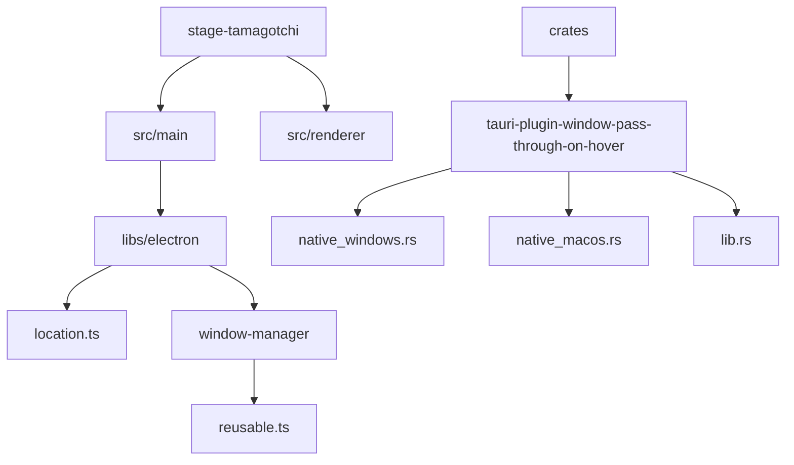
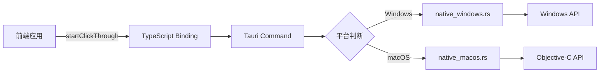
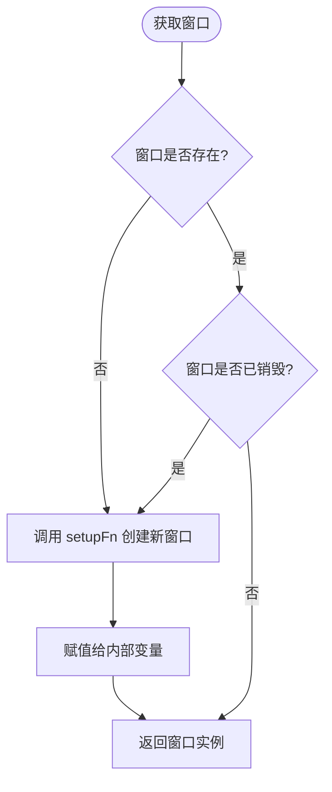
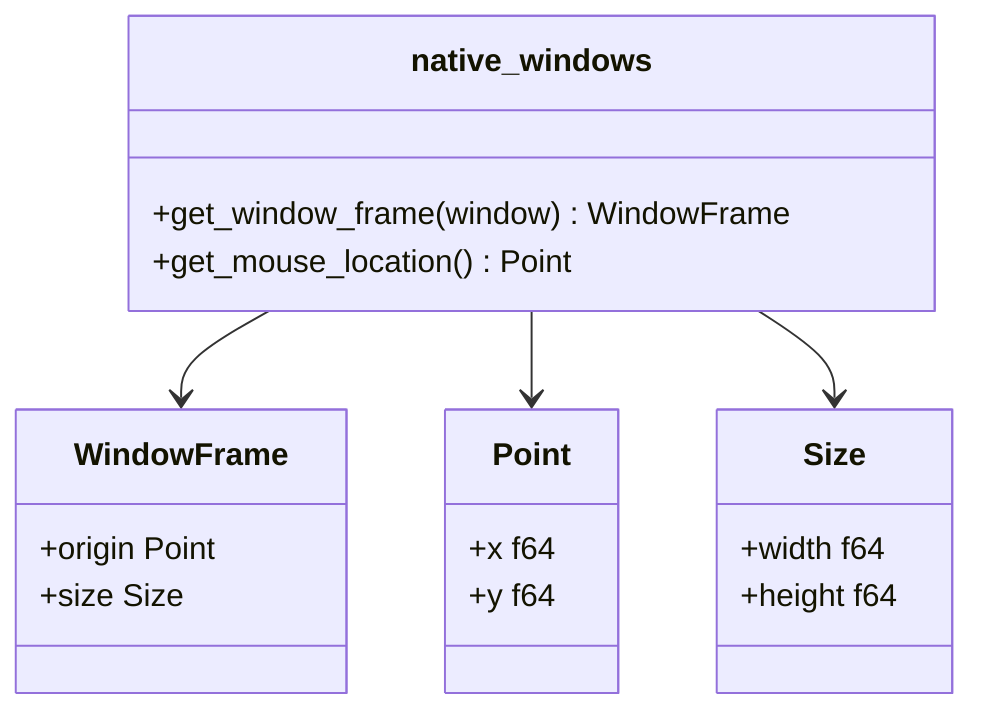
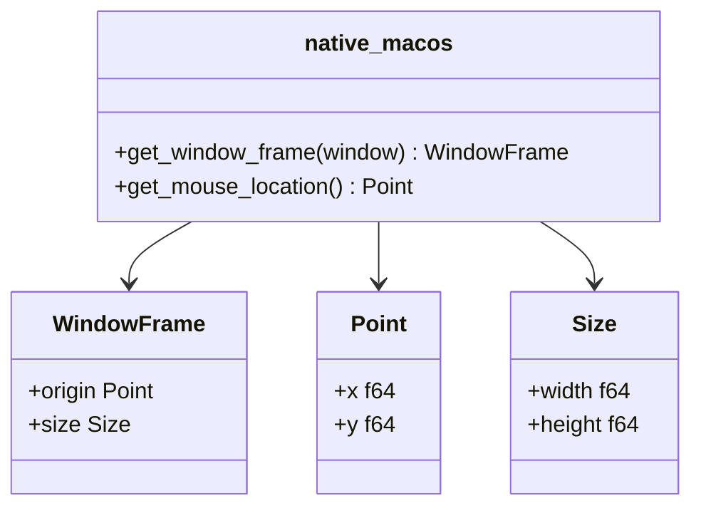
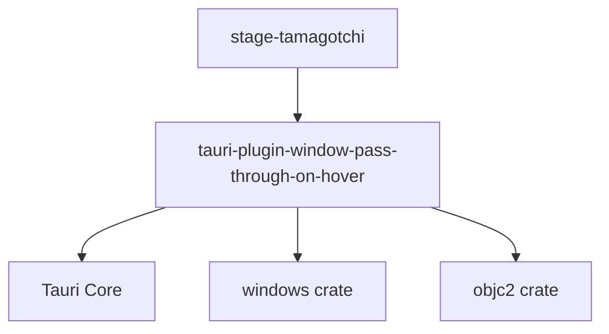

# 跨平台兼容性

<cite>
**本文档中引用的文件**  
- [location.ts](file://apps/stage-tamagotchi/src/main/libs/electron/location.ts)
- [window-manager/index.ts](file://apps/stage-tamagotchi/src/main/libs/electron/window-manager/index.ts)
- [window-manager/reusable.ts](file://apps/stage-tamagotchi/src/main/libs/electron/window-manager/reusable.ts)
- [native_windows.rs](file://crates/tauri-plugin-window-pass-through-on-hover/src/native_windows.rs)
- [native_macos.rs](file://crates/tauri-plugin-window-pass-through-on-hover/src/native_macos.rs)
- [lib.rs](file://crates/tauri-plugin-window-pass-through-on-hover/src/lib.rs)
- [windows.ts](file://apps/stage-tamagotchi/src/renderer/utils/windows.ts)
</cite>

## 目录
1. [简介](#简介)
2. [项目结构](#项目结构)
3. [核心组件](#核心组件)
4. [架构概览](#架构概览)
5. [详细组件分析](#详细组件分析)
6. [依赖分析](#依赖分析)
7. [性能考虑](#性能考虑)
8. [故障排除指南](#故障排除指南)
9. [结论](#结论)

## 简介
本文档详细说明了 `stage-tamagotchi` 如何在 Windows 和 macOS 等不同操作系统上保持一致的原生功能体验。重点分析了地理位置服务的平台差异处理、窗口行为的跨平台适配策略，以及 Tauri 插件中平台特定实现的统一接口暴露机制。同时提供针对平台特有问题的调试技巧和功能降级模式。

## 项目结构
`stage-tamagotchi` 应用位于 `apps/stage-tamagotchi` 目录下，其核心逻辑分布在 `src/main` 和 `src/renderer` 子目录中。与跨平台兼容性相关的代码主要集中在 `src/main/libs/electron` 中的 `location.ts` 和 `window-manager` 模块，以及 `crates/tauri-plugin-window-pass-through-on-hover` 中的平台特定实现。

**图示来源**  
- [location.ts](file://apps/stage-tamagotchi/src/main/libs/electron/location.ts)
- [window-manager/index.ts](file://apps/stage-tamagotchi/src/main/libs/electron/window-manager/index.ts)
- [native_windows.rs](file://crates/tauri-plugin-window-pass-through-on-hover/src/native_windows.rs)
- [native_macos.rs](file://crates/tauri-plugin-window-pass-through-on-hover/src/native_macos.rs)

**本节来源**  
- [location.ts](file://apps/stage-tamagotchi/src/main/libs/electron/location.ts)
- [window-manager/index.ts](file://apps/stage-tamagotchi/src/main/libs/electron/window-manager/index.ts)

## 核心组件
`location.ts` 负责处理开发与生产环境下的资源加载路径，确保应用在不同环境下能正确加载主页面。`window-manager` 提供了可复用窗口的创建机制，保证特定窗口（如设置窗口）在整个应用生命周期内仅存在一个实例。Tauri 插件 `window-pass-through-on-hover` 则通过 `native_windows.rs` 和 `native_macos.rs` 分别实现了 Windows 和 macOS 上的窗口点击穿透功能。

**本节来源**  
- [location.ts](file://apps/stage-tamagotchi/src/main/libs/electron/location.ts)
- [window-manager/reusable.ts](file://apps/stage-tamagotchi/src/main/libs/electron/window-manager/reusable.ts)
- [lib.rs](file://crates/tauri-plugin-window-pass-through-on-hover/src/lib.rs)

## 架构概览
系统采用分层架构，上层应用通过统一的 TypeScript 接口调用底层 Tauri 插件。插件内部根据编译目标自动选择对应的平台实现模块（`native_windows.rs` 或 `native_macos.rs`），并通过 `lib.rs` 中定义的命令桥接 JavaScript 与 Rust 代码。

**图示来源**  
- [lib.rs](file://crates/tauri-plugin-window-pass-through-on-hover/src/lib.rs)
- [native_windows.rs](file://crates/tauri-plugin-window-pass-through-on-hover/src/native_windows.rs)
- [native_macos.rs](file://crates/tauri-plugin-window-pass-through-on-hover/src/native_macos.rs)

## 详细组件分析

### 地理位置服务处理
`location.ts` 中的 `baseUrl` 函数根据运行环境（开发或生产）动态返回正确的资源加载地址。在开发模式下使用 `ELECTRON_RENDERER_URL`，而在生产模式下则拼接本地文件路径，确保跨平台资源加载的一致性。

**本节来源**  
- [location.ts](file://apps/stage-tamagotchi/src/main/libs/electron/location.ts#L20-L32)

### 窗口管理器分析
`createReusableWindow` 函数确保窗口的唯一性，避免重复创建。它接收一个窗口创建函数作为参数，并在内部维护对窗口实例的引用。当窗口被销毁后，下次请求时会自动重新创建。

**图示来源**  
- [reusable.ts](file://apps/stage-tamagotchi/src/main/libs/electron/window-manager/reusable.ts#L2-L19)

**本节来源**  
- [reusable.ts](file://apps/stage-tamagotchi/src/main/libs/electron/window-manager/reusable.ts)

### Tauri 插件平台特定实现
`native_windows.rs` 和 `native_macos.rs` 分别使用 Windows API 和 Objective-C API 获取窗口帧和鼠标位置。两者通过相同的函数签名暴露给上层，实现了接口的统一。

#### Windows 实现

**图示来源**  
- [native_windows.rs](file://crates/tauri-plugin-window-pass-through-on-hover/src/native_windows.rs)

#### macOS 实现

**图示来源**  
- [native_macos.rs](file://crates/tauri-plugin-window-pass-through-on-hover/src/native_macos.rs)

**本节来源**  
- [native_windows.rs](file://crates/tauri-plugin-window-pass-through-on-hover/src/native_windows.rs)
- [native_macos.rs](file://crates/tauri-plugin-window-pass-through-on-hover/src/native_macos.rs)

## 依赖分析
`tauri-plugin-window-pass-through-on-hover` 依赖于 Tauri 的核心库和平台特定的 Rust 绑定（如 `windows` crate 和 `objc2` crate）。上层应用通过 `commands` 模块调用插件功能，形成清晰的依赖边界。

**图示来源**  
- [lib.rs](file://crates/tauri-plugin-window-pass-through-on-hover/src/lib.rs)
- [Cargo.toml](file://crates/tauri-plugin-window-pass-through-on-hover/Cargo.toml)

**本节来源**  
- [lib.rs](file://crates/tauri-plugin-window-pass-through-on-hover/src/lib.rs)

## 性能考虑
`start_tracing_cursor` 命令以约 30FPS 的频率轮询鼠标和窗口位置，平衡了响应性与性能开销。使用 `Arc<AtomicBool>` 实现线程安全的状态共享，避免了频繁的锁竞争。

## 故障排除指南
- **macOS 透明窗口限制**：确保 `NSRequiresAquaSystemAppearance` 设置正确，并使用 `setIgnoresMouseEvents` 而非 `setAlpha` 实现点击穿透。
- **Windows DPI 缩放问题**：使用 `dipToScreenRect` 和 `screenToDipPoint` 等辅助函数进行坐标转换，确保高 DPI 下的精确计算。
- **平台能力检测**：通过 `window.state()` 检查插件是否已正确初始化，避免调用未就绪的功能。

**本节来源**  
- [screen.ts](file://apps/stage-tamagotchi/src/main/services/electron/screen.ts)
- [state.rs](file://crates/tauri-plugin-window-pass-through-on-hover/src/state.rs)

## 结论
`stage-tamagotchi` 通过精心设计的分层架构和平台抽象，实现了在 Windows 和 macOS 上一致的原生体验。Tauri 插件机制有效隔离了平台差异，使上层应用能够以统一的方式访问底层功能。未来可进一步完善 Linux 平台的支持，并优化高频率事件的性能表现。