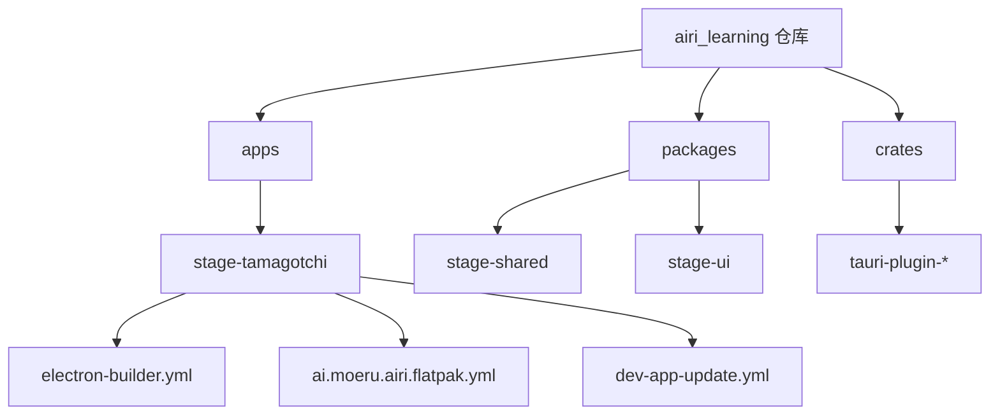
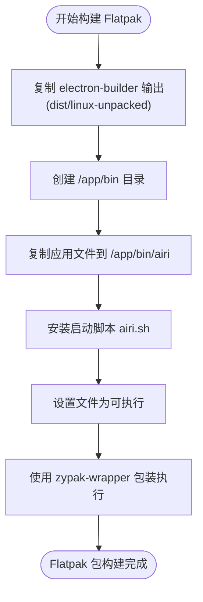
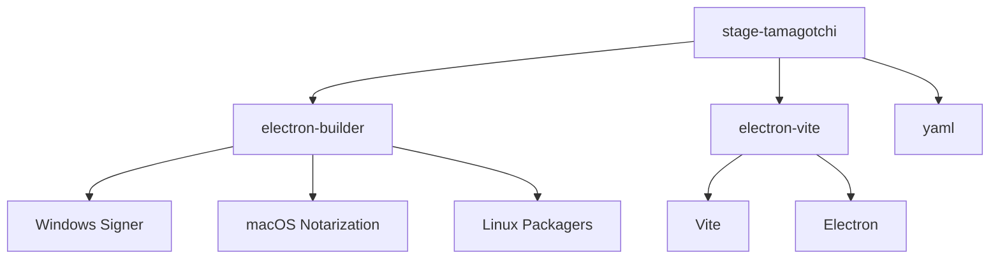

# 代码签名与分发

<cite>
**本文档引用的文件**  
- [electron-builder.yml](file://apps/stage-tamagotchi/electron-builder.yml)
- [ai.moeru.airi.flatpak.yml](file://apps/stage-tamagotchi/ai.moeru.airi.flatpak.yml)
- [dev-app-update.yml](file://apps/stage-tamagotchi/dev-app-update.yml)
- [package.json](file://apps/stage-tamagotchi/package.json)
</cite>

## 目录
1. [简介](#简介)
2. [项目结构](#项目结构)
3. [核心组件](#核心组件)
4. [架构概述](#架构概述)
5. [详细组件分析](#详细组件分析)
6. [依赖分析](#依赖分析)
7. [性能考虑](#性能考虑)
8. [故障排除指南](#故障排除指南)
9. [结论](#结论)

## 简介
本文档旨在全面阐述基于 Electron 的 AIRI 应用程序在多平台环境下的代码签名与分发策略。文档详细说明了 Windows Authenticode、macOS Gatekeeper 和 Linux 包管理器的签名要求，分析了 electron-builder 的自动化签名配置流程，并探讨了 Flatpak 等现代分发方式的实现机制。同时，文档还涵盖了应用商店提交规范和安全沙箱配置的最佳实践。

## 项目结构
AIRI 项目采用模块化 monorepo 架构，核心 Electron 应用位于 `apps/stage-tamagotchi` 目录下。该应用集成了 Vue 3 和 TypeScript，通过 electron-vite 构建。分发和签名的核心配置文件包括 `electron-builder.yml` 和 `ai.moeru.airi.flatpak.yml`，分别用于管理跨平台打包和 Flatpak 特定的分发流程。



**Diagram sources**
- [electron-builder.yml](file://apps/stage-tamagotchi/electron-builder.yml)
- [ai.moeru.airi.flatpak.yml](file://apps/stage-tamagotchi/ai.moeru.airi.flatpak.yml)

**Section sources**
- [electron-builder.yml](file://apps/stage-tamagotchi/electron-builder.yml)
- [ai.moeru.airi.flatpak.yml](file://apps/stage-tamagotchi/ai.moeru.airi.flatpak.yml)

## 核心组件
本项目的核心是 `stage-tamagotchi` Electron 应用，它使用 `electron-builder` 进行打包和分发。`electron-builder.yml` 文件定义了针对 Windows、macOS 和 Linux 三个主要平台的构建配置，包括应用标识、产品名称、输出目录和文件过滤规则。此外，`ai.moeru.airi.flatpak.yml` 文件专门用于配置 Flatpak 分发包，确保应用能在遵循沙箱安全模型的 Linux 环境中正确运行。

**Section sources**
- [electron-builder.yml](file://apps/stage-tamagotchi/electron-builder.yml)
- [ai.moeru.airi.flatpak.yml](file://apps/stage-tamagotchi/ai.moeru.airi.flatpak.yml)

## 架构概述
AIRI 应用的分发架构围绕 `electron-builder` 构建。该工具读取 `electron-builder.yml` 配置，为每个目标平台生成原生安装包（如 Windows 的 NSIS 安装程序、macOS 的 DMG 镜像、Linux 的 DEB/RPM 包）。对于 Linux，项目额外采用了 Flatpak 作为现代化的沙箱化分发方案，通过 `ai.moeru.airi.flatpak.yml` 文件定义其运行时环境、权限和依赖。

```mermaid
graph LR
subgraph "构建流程"
A[源代码] --> B[electron-builder]
B --> C[Windows .exe]
B --> D[macOS .dmg]
B --> E[Linux .deb/.rpm]
end
subgraph "Flatpak 分发"
F[Linux .deb/.rpm] --> G[Flatpak Builder]
G --> H[ai.moeru.airi.flatpak]
end
subgraph "运行时"
C --> I[Windows]
D --> J[macOS]
H --> K[Linux (Flatpak)]
end
```

**Diagram sources**
- [electron-builder.yml](file://apps/stage-tamagotchi/electron-builder.yml)
- [ai.moeru.airi.flatpak.yml](file://apps/stage-tamagotchi/ai.moeru.airi.flatpak.yml)

## 详细组件分析

### electron-builder 配置分析
`electron-builder.yml` 文件是跨平台分发的核心。它配置了：
- **应用元数据**：`appId` 和 `productName` 用于唯一标识应用。
- **平台特定配置**：为 Windows (NSIS)、macOS (DMG) 和 Linux (DEB/RPM/Snap) 定义了不同的构建选项，如安装程序名称、图标和描述。
- **代码签名**：虽然当前配置中 `notarize: false` 表示未启用 macOS 代码公证，但该文件是配置签名证书和密钥的位置。
- **文件打包**：使用 `asar` 打包应用源码，并通过 `asarUnpack` 解包特定资源文件以供直接访问。

**Section sources**
- [electron-builder.yml](file://apps/stage-tamagotchi/electron-builder.yml)

### Flatpak 分发配置分析
`ai.moeru.airi.flatpak.yml` 文件定义了 Flatpak 包的构建。其关键特性包括：
- **沙箱权限**：通过 `finish-args` 精确声明应用所需的权限，如网络、音频、X11/Wayland 显示服务器和家目录读写。
- **Zypak 沙箱包装器**：文件中的注释明确指出，必须使用 `zypak-wrapper` 来解决 Electron 应用在 Flatpak 沙箱中因缺少可用沙箱而崩溃的问题。这是确保应用在受限环境中稳定运行的关键。
- **模块化构建**：将已由 `electron-builder` 生成的 Linux 原生包（`linux-unpacked`）作为源，复制到 Flatpak 的安装目录中。



**Diagram sources**
- [ai.moeru.airi.flatpak.yml](file://apps/stage-tamagotchi/ai.moeru.airi.flatpak.yml)

### 自动更新配置
`dev-app-update.yml` 文件配置了应用的自动更新机制。它指定了更新服务器的通用提供者（`generic`）和 URL，以及更新缓存的目录名称。此配置是开发和测试环境的基础，生产环境将使用不同的、安全的更新服务器。

**Section sources**
- [dev-app-update.yml](file://apps/stage-tamagotchi/dev-app-update.yml)

## 依赖分析
项目通过 `package.json` 管理其依赖。关键的分发和构建依赖包括：
- `electron-builder`: 核心的跨平台打包工具。
- `electron-vite`: 用于快速开发和构建 Electron 应用。
- `yaml`: 用于在构建脚本中解析 `electron-builder.yml` 配置文件。



**Diagram sources**
- [package.json](file://apps/stage-tamagotchi/package.json)

**Section sources**
- [package.json](file://apps/stage-tamagotchi/package.json)

## 性能考虑
无具体文件分析的通用性能讨论。

## 故障排除指南
一个常见的问题是应用在 Flatpak 环境中无法启动，并出现 "No usable sandbox!" 错误。根据 `ai.moeru.airi.flatpak.yml` 文件中的注释，根本原因是 Electron 的沙箱机制与 Flatpak 的安全模型冲突。解决方案是使用 `zypak-wrapper` 脚本，它能正确地在 Flatpak 沙箱内启动 Electron 应用，而不是简单地禁用沙箱（`--no-sandbox`），后者会带来严重的安全风险。

**Section sources**
- [ai.moeru.airi.flatpak.yml](file://apps/stage-tamagotchi/ai.moeru.airi.flatpak.yml)

## 结论
AIRI 项目建立了一个健壮的多平台分发框架。通过 `electron-builder`，它能够为 Windows、macOS 和 Linux 生成标准的安装包。通过引入 Flatpak，项目进一步提升了在 Linux 系统上的安全性和可移植性。未来的工作应集中在实现生产环境的代码签名和公证，以确保所有分发渠道的应用都具备最高的安全性和可信度。