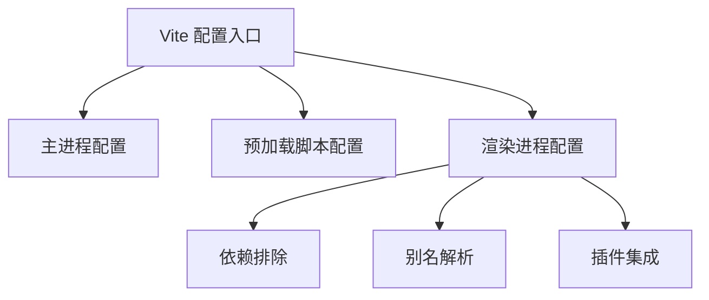
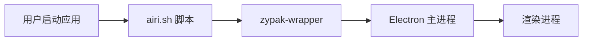
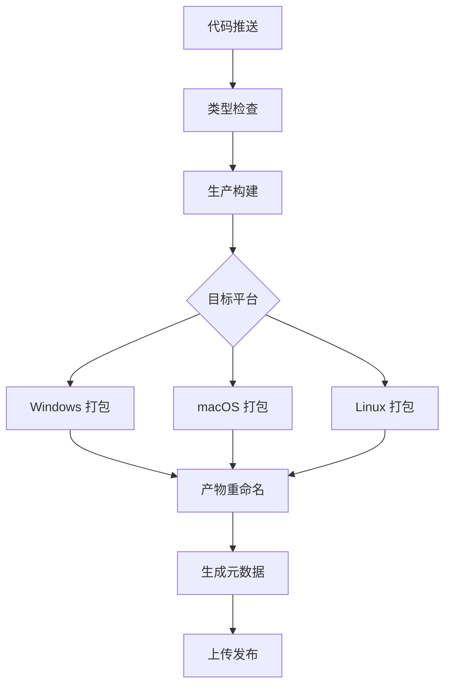

# 打包与分发

<cite>
**本文档引用文件**  
- [electron-builder.yml](file://apps/stage-tamagotchi/electron-builder.yml)
- [electron.vite.config.ts](file://apps/stage-tamagotchi/electron.vite.config.ts)
- [package.json](file://apps/stage-tamagotchi/package.json)
- [dev-app-update.yml](file://apps/stage-tamagotchi/dev-app-update.yml)
- [ai.moeru.airi.flatpak.yml](file://apps/stage-tamagotchi/ai.moeru.airi.flatpak.yml)
- [rename-artifacts.ts](file://apps/stage-tamagotchi/scripts/rename-artifacts.ts)
- [artifacts-metadata.ts](file://apps/stage-tamagotchi/scripts/artifacts-metadata.ts)
- [utils.ts](file://apps/stage-tamagotchi/scripts/utils.ts)
</cite>

## 目录
1. [简介](#简介)
2. [构建流程概述](#构建流程概述)
3. [Vite 配置与资源优化](#vite-配置与资源优化)
4. [electron-builder 配置详解](#electron-builder-配置详解)
5. [多平台安装包生成](#多平台安装包生成)
6. [自动更新机制](#自动更新机制)
7. [代码签名与安全策略](#代码签名与安全策略)
8. [Flatpak 打包配置](#flatpak-打包配置)
9. [持续集成与发布流程](#持续集成与发布流程)
10. [最佳实践总结](#最佳实践总结)

## 简介
`stage-tamagotchi` 是一个基于 Electron 构建的桌面应用程序，集成了 Vue 3、TypeScript 和多种 AI 功能，支持 Live2D/VRM 虚拟形象交互。本文档详细说明其打包与分发机制，涵盖从构建配置到跨平台发布、自动更新和 CI/CD 流程的完整技术实现。

## 构建流程概述

`stage-tamagotchi` 的构建流程基于 `electron-vite` 构建工具，结合 Vite 的高效开发体验与 Electron 的桌面应用能力。构建过程分为三个主要部分：主进程（main）、预加载脚本（preload）和渲染进程（renderer），每个部分都有独立的构建配置。

项目通过 `package.json` 中的脚本命令驱动构建流程：
- `pnpm run dev`：启动开发服务器
- `pnpm run build`：执行生产构建
- `pnpm run build:win/mac/linux`：针对特定平台生成安装包

构建输出目录为 `dist`，包含打包后的应用文件和资源。

**Section sources**
- [package.json](file://apps/stage-tamagotchi/package.json#L20-L35)
- [electron.vite.config.ts](file://apps/stage-tamagotchi/electron.vite.config.ts#L1-L140)

## Vite 配置与资源优化

### 构建配置结构
`electron.vite.config.ts` 文件定义了主进程、预加载脚本和渲染进程的独立构建配置。使用 `defineConfig` 函数为每个进程设置插件和优化选项。



**Diagram sources**
- [electron.vite.config.ts](file://apps/stage-tamagotchi/electron.vite.config.ts#L1-L140)

### 代码分割与依赖优化
为提升构建性能和运行效率，项目采用以下优化策略：

#### 依赖外部化
使用 `externalizeDepsPlugin()` 将 `node_modules` 中的依赖排除在打包之外，减少构建体积并加快构建速度。

#### 静态资源排除
在 `optimizeDeps.exclude` 中明确排除大型静态资源（如模型文件、图像等），避免 Vite 在预构建阶段处理这些文件，显著提升开发服务器启动速度。

#### 别名配置
通过 `resolve.alias` 设置模块别名，将内部包（如 `@proj-airi/stage-ui`）直接指向源码目录，支持热重载和调试。

#### 开发预热
配置 `server.warmup` 提前编译常用 Vue 组件，减少首次加载延迟。

**Section sources**
- [electron.vite.config.ts](file://apps/stage-tamagotchi/electron.vite.config.ts#L40-L138)

## electron-builder 配置详解

`electron-builder.yml` 是应用打包的核心配置文件，定义了应用元数据、目标平台、文件结构和安装程序行为。

### 应用元数据
```yaml
appId: ai.moeru.airi
productName: AIRI
```
- `appId`：应用唯一标识符，用于系统识别和更新
- `productName`：用户可见的应用名称

### 输出目录配置
```yaml
directories:
  output: dist
  buildResources: build
```
指定构建输出和资源文件的存放路径。

### 文件包含规则
通过 `files` 字段精确控制打包内容，排除源码、配置文件和开发相关文件，确保生产包的纯净性。

### ASAR 打包
```yaml
asar: true
```
启用 ASAR 归档格式打包应用源码，提高文件读取效率并提供基本保护。

### 资源解包
```yaml
asarUnpack:
  - resources/**
  - out/renderer/**
```
指定需要解压访问的资源目录，确保运行时可直接读取。

### 入口文件配置
```yaml
extraMetadata:
  main: 'out/main/index.js'
```
明确指定主进程入口文件路径。

**Section sources**
- [electron-builder.yml](file://apps/stage-tamagotchi/electron-builder.yml#L1-L25)

## 多平台安装包生成

### Windows 平台
```yaml
win:
  executableName: airi
nsis:
  artifactName: ${productName}-${version}-windows-${arch}-setup.${ext}
  createDesktopShortcut: always
  deleteAppDataOnUninstall: true
```
- 生成 NSIS 安装程序
- 始终创建桌面快捷方式
- 卸载时删除用户数据

### macOS 平台
```yaml
mac:
  entitlementsInherit: build/entitlements.mac.plist
  extendInfo:
    - NSDocumentsFolderUsageDescription
    - NSDownloadsFolderUsageDescription
  notarize: false
dmg:
  artifactName: ${productName}-${version}-darwin-${arch}.${ext}
```
- 继承权限配置文件
- 添加文件夹访问权限说明
- 生成 DMG 磁盘映像

### Linux 平台
```yaml
linux:
  target:
    - deb
    - rpm
  category: Utility
appImage:
  artifactName: ${productName}-${version}-linux-${arch}.${ext}
snap:
  confinement: strict
  grade: stable
```
- 同时生成 DEB 和 RPM 包
- 支持 AppImage 和 Snap 格式
- 严格沙箱隔离

**Section sources**
- [electron-builder.yml](file://apps/stage-tamagotchi/electron-builder.yml#L27-L70)

## 自动更新机制

项目通过 `dev-app-update.yml` 配置开发环境下的自动更新服务：

```yaml
provider: generic
url: https://example.com/auto-updates
updaterCacheDirName: stage-tamagotchi-electron-updater
```

- 使用通用更新提供程序
- 指定更新服务器 URL
- 设置更新缓存目录

生产环境的更新机制需在构建时通过环境变量或构建参数动态注入实际的更新服务器地址。

**Section sources**
- [dev-app-update.yml](file://apps/stage-tamagotchi/dev-app-update.yml#L1-L4)

## 代码签名与安全策略

### macOS 代码签名
通过 `entitlementsInherit` 继承权限配置文件 `build/entitlements.mac.plist`，声明应用所需的系统权限，如：
- 访问文档文件夹
- 访问下载文件夹

### Linux 安全策略
Flatpak 配置中通过 `finish-args` 定义了详细的安全权限：
- 网络共享
- X11 和 Wayland 显示服务器访问
- PulseAudio 音频服务
- DBus 通信权限
- 家目录读写访问

### Web 安全
渲染进程通过预加载脚本（preload）实现安全的上下文隔离，使用 `contextBridge.exposeInMainWorld` 有选择地暴露必要的 API。

**Section sources**
- [electron-builder.yml](file://apps/stage-tamagotchi/electron-builder.yml#L47-L55)
- [ai.moeru.airi.flatpak.yml](file://apps/stage-tamagotchi/ai.moeru.airi.flatpak.yml#L10-L40)

## Flatpak 打包配置

`ai.moeru.airi.flatpak.yml` 文件定义了 Flatpak 打包的完整配置：

### 基础配置
- 使用 Electron BaseApp 作为基础镜像
- 指定运行时版本为 24.08
- 设置启动命令为 `airi.sh`

### 模块构建
通过自定义构建命令将打包后的应用复制到 Flatpak 文件系统，并设置正确的执行权限。

### Zypak 包装器
关键配置是使用 `zypak-wrapper` 启动应用，解决 Electron 在 Flatpak 沙箱中的 Zygote 进程创建问题，避免因沙箱限制导致的应用崩溃。



**Diagram sources**
- [ai.moeru.airi.flatpak.yml](file://apps/stage-tamagotchi/ai.moeru.airi.flatpak.yml#L1-L79)

**Section sources**
- [ai.moeru.airi.flatpak.yml](file://apps/stage-tamagotchi/ai.moeru.airi.flatpak.yml#L1-L79)

## 持续集成与发布流程

### 构建脚本自动化
项目提供两个关键脚本用于发布流程：

#### 重命名构建产物
`scripts/rename-artifacts.ts` 脚本根据平台和架构信息重命名构建产物，生成标准化的文件名格式：
```
AIRI-0.7.2-beta.3-windows-x64-setup.exe
```

#### 生成元数据
`scripts/artifacts-metadata.ts` 脚本可查询构建产物的名称、版本、产品名等元数据，便于 CI/CD 系统集成。

### CI/CD 集成
通过 `package.json` 中的脚本组合，可实现完整的自动化流程：
1. 类型检查 → 2. 生产构建 → 3. 平台打包 → 4. 产物重命名 → 5. 元数据生成 → 6. 发布



**Diagram sources**
- [package.json](file://apps/stage-tamagotchi/package.json#L20-L35)
- [rename-artifacts.ts](file://apps/stage-tamagotchi/scripts/rename-artifacts.ts#L1-L88)
- [artifacts-metadata.ts](file://apps/stage-tamagotchi/scripts/artifacts-metadata.ts#L1-L87)

**Section sources**
- [package.json](file://apps/stage-tamagotchi/package.json#L20-L35)
- [rename-artifacts.ts](file://apps/stage-tamagotchi/scripts/rename-artifacts.ts#L1-L88)
- [artifacts-metadata.ts](file://apps/stage-tamagotchi/scripts/artifacts-metadata.ts#L1-L87)
- [utils.ts](file://apps/stage-tamagotchi/scripts/utils.ts#L1-L130)

## 最佳实践总结

1. **配置分离**：将开发与生产配置分离，使用不同文件管理更新服务器等环境相关设置。
2. **资源优化**：合理使用 `optimizeDeps.exclude` 避免大型资源文件影响构建性能。
3. **跨平台兼容**：为不同平台定制安装程序行为，如 Windows 始终创建快捷方式。
4. **安全优先**：在 Flatpak 等沙箱环境中使用正确的包装器（如 zypak-wrapper）确保应用正常运行。
5. **自动化发布**：通过脚本标准化构建产物命名和元数据提取，便于 CI/CD 集成。
6. **依赖管理**：使用 `externalizeDepsPlugin` 外部化依赖，保持构建轻量高效。
7. **权限声明**：在 macOS 和 Linux 上明确声明应用所需的系统权限，提升用户体验。