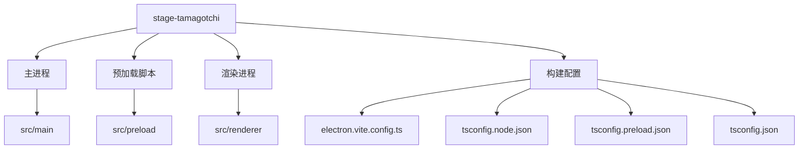
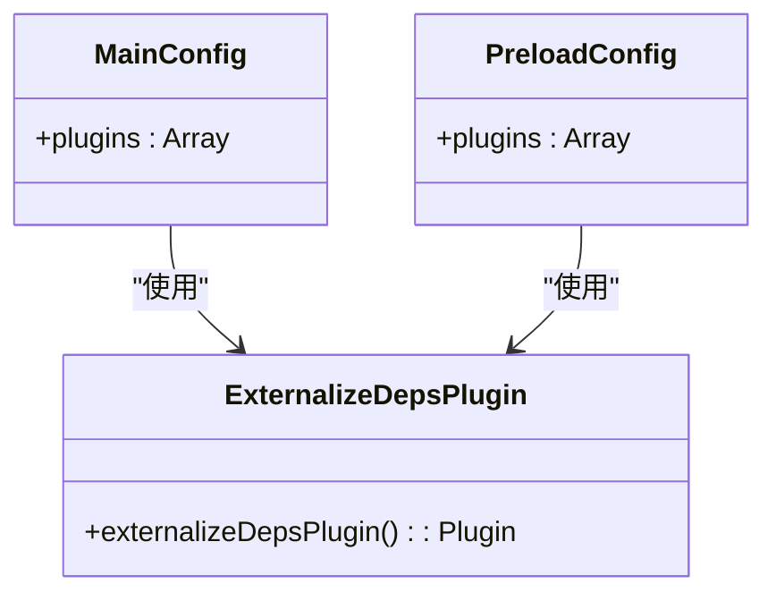
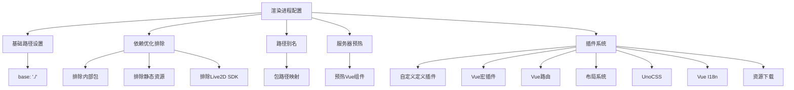
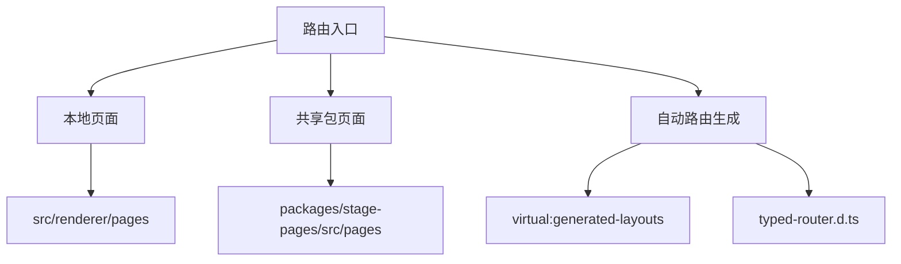
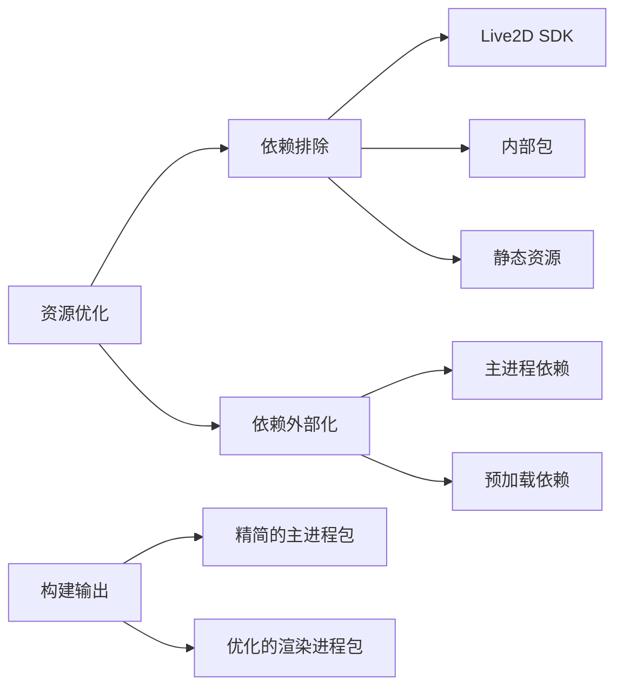
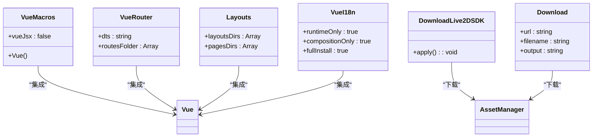
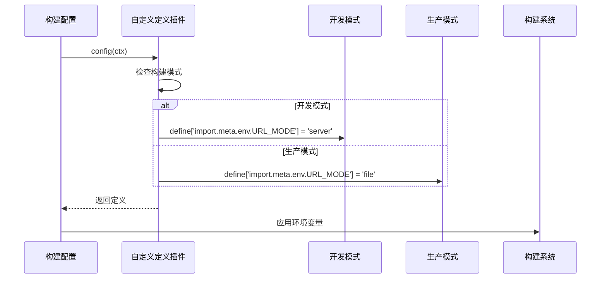
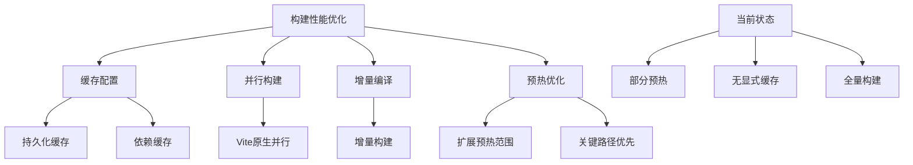

# 构建配置

<cite>
**本文档中引用的文件**  
- [electron.vite.config.ts](file://apps/stage-tamagotchi/electron.vite.config.ts)
- [tsconfig.node.json](file://apps/stage-tamagotchi/tsconfig.node.json)
- [tsconfig.preload.json](file://apps/stage-tamagotchi/tsconfig.preload.json)
- [tsconfig.json](file://apps/stage-tamagotchi/tsconfig.json)
- [main.ts](file://apps/stage-tamagotchi/src/main/index.ts)
- [shared.ts](file://apps/stage-tamagotchi/src/preload/shared.ts)
- [main.ts](file://apps/stage-tamagotchi/src/renderer/main.ts)
- [index.ts](file://apps/stage-tamagotchi/src/main/windows/main/index.ts)
</cite>

## 目录
1. [项目结构](#项目结构)
2. [主进程与预加载构建配置](#主进程与预加载构建配置)
3. [渲染进程构建配置](#渲染进程构建配置)
4. [多入口打包与代码分割](#多入口打包与代码分割)
5. [资源压缩与依赖优化](#资源压缩与依赖优化)
6. [Vite插件在Electron环境下的特殊配置](#vite插件在electron环境下的特殊配置)
7. [环境变量管理与条件编译](#环境变量管理与条件编译)
8. [目标平台适配策略](#目标平台适配策略)
9. [构建性能优化建议](#构建性能优化建议)

## 项目结构

stage-tamagotchi应用采用模块化架构，构建配置主要集中在`electron.vite.config.ts`文件中。项目包含主进程（main）、预加载脚本（preload）和渲染进程（renderer）三个独立的构建上下文，分别对应Electron应用的不同运行环境。



**图示来源**  
- [electron.vite.config.ts](file://apps/stage-tamagotchi/electron.vite.config.ts#L1-L140)
- [tsconfig.node.json](file://apps/stage-tamagotchi/tsconfig.node.json#L1-L38)
- [tsconfig.preload.json](file://apps/stage-tamagotchi/tsconfig.preload.json#L1-L33)

## 主进程与预加载构建配置

主进程和预加载脚本的构建配置相对简洁，主要使用`externalizeDepsPlugin`插件来外部化依赖项，避免将Node.js原生模块打包进最终产物。这种配置确保了主进程代码的轻量化和执行效率。



**图示来源**  
- [electron.vite.config.ts](file://apps/stage-tamagotchi/electron.vite.config.ts#L15-L20)

**本节来源**  
- [electron.vite.config.ts](file://apps/stage-tamagotchi/electron.vite.config.ts#L15-L20)
- [tsconfig.node.json](file://apps/stage-tamagotchi/tsconfig.node.json#L1-L38)
- [tsconfig.preload.json](file://apps/stage-tamagotchi/tsconfig.preload.json#L1-L33)

## 渲染进程构建配置

渲染进程的构建配置最为复杂，包含了多个关键配置项。`base: './'`设置确保了在Electron环境中正确解析资源路径。`optimizeDeps.exclude`配置排除了大量内部包和静态资源，防止不必要的依赖优化，这对于大型资源文件和内部模块尤为重要。



**图示来源**  
- [electron.vite.config.ts](file://apps/stage-tamagotchi/electron.vite.config.ts#L22-L139)

**本节来源**  
- [electron.vite.config.ts](file://apps/stage-tamagotchi/electron.vite.config.ts#L22-L139)
- [main.ts](file://apps/stage-tamagotchi/src/renderer/main.ts#L1-L50)

## 多入口打包与代码分割

该应用通过`unplugin-vue-router/vite`插件实现了基于文件系统的自动路由，支持多入口打包策略。路由配置通过`routesFolder`指定多个源目录，包括本地页面和共享包中的页面，实现了模块化的代码组织。



**图示来源**  
- [electron.vite.config.ts](file://apps/stage-tamagotchi/electron.vite.config.ts#L97-L103)

**本节来源**  
- [electron.vite.config.ts](file://apps/stage-tamagotchi/electron.vite.config.ts#L97-L103)
- [main.ts](file://apps/stage-tamagotchi/src/renderer/main.ts#L1-L50)

## 资源压缩与依赖优化

构建配置通过多种方式实现资源压缩和依赖优化。`optimizeDeps.exclude`明确排除了Live2D SDK等大型依赖，避免Vite对其进行不必要的依赖分析和预构建。同时，通过`externalizeDepsPlugin`确保主进程和预加载脚本的依赖被正确外部化。



**图示来源**  
- [electron.vite.config.ts](file://apps/stage-tamagotchi/electron.vite.config.ts#L28-L68)

**本节来源**  
- [electron.vite.config.ts](file://apps/stage-tamagotchi/electron.vite.config.ts#L28-L68)
- [tsconfig.node.json](file://apps/stage-tamagotchi/tsconfig.node.json#L1-L38)

## Vite插件在Electron环境下的特殊配置

项目使用了多个Vite插件来适配Electron环境的特殊需求。`@electron-toolkit/preload`提供的`contextBridge`机制在预加载脚本中安全地暴露Electron API。`unplugin-vue-macros`支持Vue的宏语法，而`vite-plugin-vue-devtools`则为开发提供了调试支持。



**图示来源**  
- [electron.vite.config.ts](file://apps/stage-tamagotchi/electron.vite.config.ts#L70-L139)
- [shared.ts](file://apps/stage-tamagotchi/src/preload/shared.ts#L1-L28)

**本节来源**  
- [electron.vite.config.ts](file://apps/stage-tamagotchi/electron.vite.config.ts#L70-L139)
- [shared.ts](file://apps/stage-tamagotchi/src/preload/shared.ts#L1-L28)

## 环境变量管理与条件编译

构建配置通过自定义插件实现了环境变量的条件编译。`proj-airi:defines`插件根据构建模式（development/production）动态定义`URL_MODE`环境变量，实现了开发环境使用服务器模式、生产环境使用文件模式的条件编译策略。



**图示来源**  
- [electron.vite.config.ts](file://apps/stage-tamagotchi/electron.vite.config.ts#L72-L83)

**本节来源**  
- [electron.vite.config.ts](file://apps/stage-tamagotchi/electron.vite.config.ts#L72-L83)
- [main.ts](file://apps/stage-tamagotchi/src/main/index.ts#L1-L181)

## 目标平台适配策略

项目通过多种机制实现跨平台适配。主进程代码中使用`isMacOS`、`isLinux`等条件判断来处理平台特定的行为，如macOS托盘图标和Linux WebGPU支持。构建配置本身也通过路径解析和条件逻辑确保在不同操作系统上的兼容性。

```mermaid
graph TD
A[平台适配] --> B[macOS]
A --> C[Linux]
A --> D[Windows]
B --> E[托盘图标]
B --> F[双击事件]
C --> G[WebGPU开关]
C --> H[命令行参数]
D --> I[窗口行为]
D --> J[快捷方式]
K[构建系统] --> L[跨平台路径]
L --> M[node:path]
L --> N[resolve()]
```

**图示来源**  
- [electron.vite.config.ts](file://apps/stage-tamagotchi/electron.vite.config.ts#L1-L140)
- [main.ts](file://apps/stage-tamagotchi/src/main/index.ts#L1-L181)

**本节来源**  
- [electron.vite.config.ts](file://apps/stage-tamagotchi/electron.vite.config.ts#L1-L140)
- [main.ts](file://apps/stage-tamagotchi/src/main/index.ts#L1-L181)

## 构建性能优化建议

基于当前配置，可进一步优化构建性能。建议启用持久化缓存、并行构建和增量编译。当前的`server.warmup`配置已预热关键组件，可进一步扩展预热范围。对于大型资源，可考虑使用更精细的依赖排除策略和分块加载。



**图示来源**  
- [electron.vite.config.ts](file://apps/stage-tamagotchi/electron.vite.config.ts#L105-L109)
- [tsconfig.json](file://apps/stage-tamagotchi/tsconfig.json)

**本节来源**  
- [electron.vite.config.ts](file://apps/stage-tamagotchi/electron.vite.config.ts#L105-L109)
- [tsconfig.json](file://apps/stage-tamagotchi/tsconfig.json)