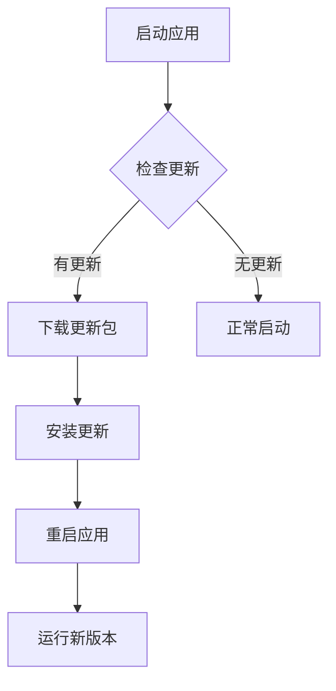
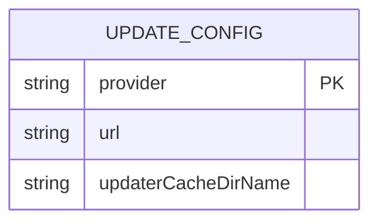
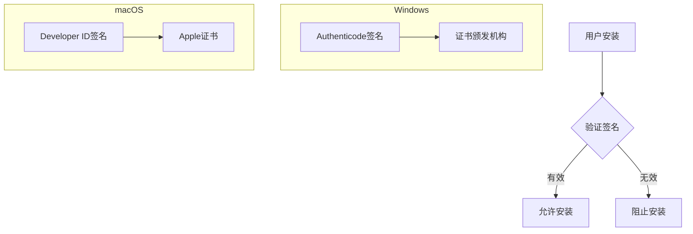
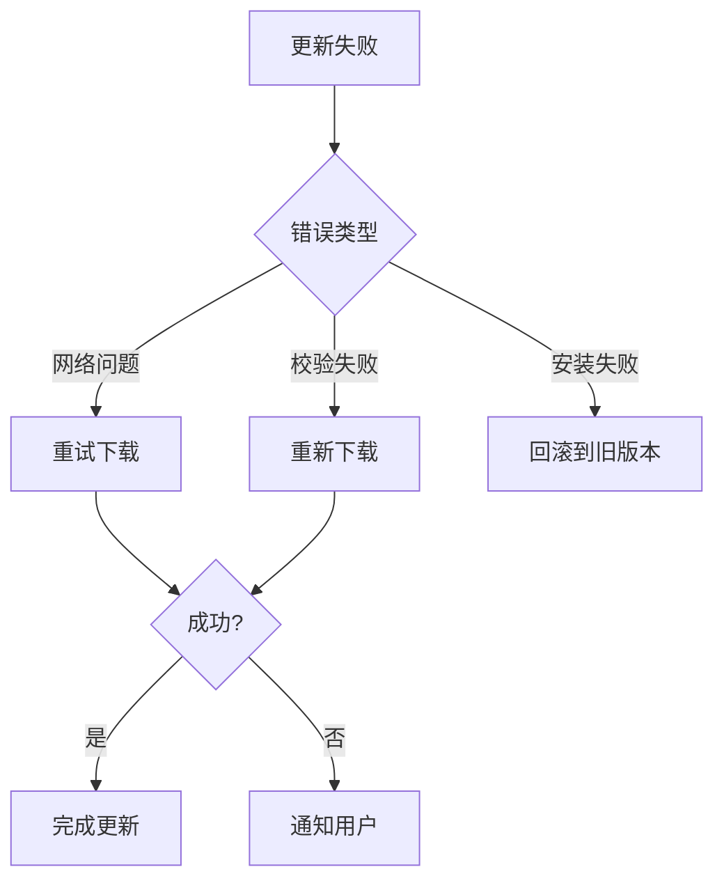
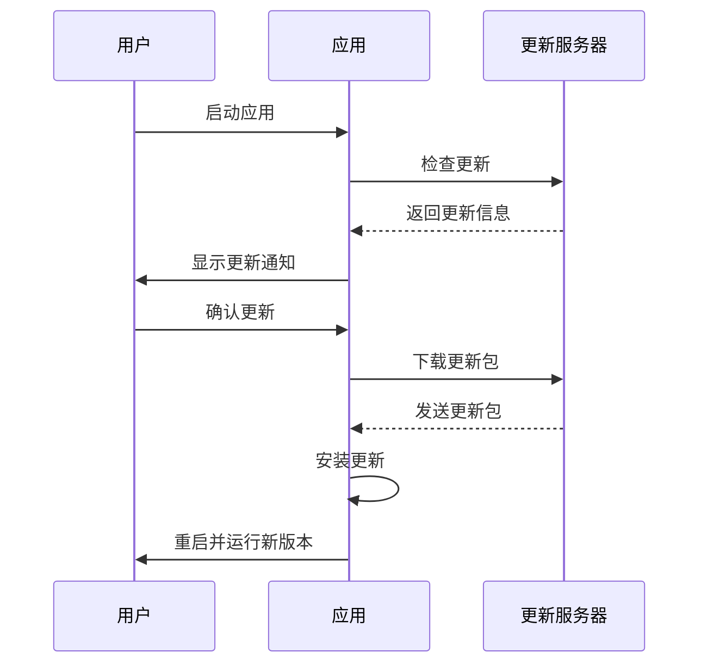

# 自动更新机制

<cite>
**本文档引用的文件**   
- [dev-app-update.yml](file://apps/stage-tamagotchi/dev-app-update.yml)
- [electron-builder.yml](file://apps/stage-tamagotchi/electron-builder.yml)
</cite>

## 目录
1. [简介](#简介)
2. [Squirrel框架更新机制](#squirrel框架更新机制)
3. [dev-app-update.yml配置文件](#dev-app-updateyml配置文件)
4. [代码签名与安全](#代码签名与安全)
5. [错误处理与回滚机制](#错误处理与回滚机制)
6. [用户通知最佳实践](#用户通知最佳实践)

## 简介
本API文档详细说明了Electron应用在Windows和macOS平台上的自动更新功能实现机制。文档涵盖了Squirrel框架的更新检查、下载、安装和重启流程，解释了dev-app-update.yml配置文件的结构和用途，阐述了代码签名的重要性及其在不同平台上的实现方式，并提供了更新失败的错误处理策略、回滚机制和用户通知最佳实践。

**Section sources**
- [dev-app-update.yml](file://apps/stage-tamagotchi/dev-app-update.yml)
- [electron-builder.yml](file://apps/stage-tamagotchi/electron-builder.yml)

## Squirrel框架更新机制
Squirrel框架为Electron应用提供了跨平台的自动更新功能。在Windows上，Squirrel使用NSIS（Nullsoft Scriptable Install System）进行安装包管理，而在macOS上则使用DMG（Disk Image）格式。更新流程包括四个主要阶段：更新检查、下载、安装和重启。

**Diagram sources**
- [dev-app-update.yml](file://apps/stage-tamagotchi/dev-app-update.yml)

**Section sources**
- [dev-app-update.yml](file://apps/stage-tamagotchi/dev-app-update.yml)

## dev-app-update.yml配置文件
dev-app-update.yml配置文件定义了自动更新的发布服务器配置、更新通道管理和版本策略。该文件采用YAML格式，包含以下关键字段：

- **provider**: 指定更新提供者，支持generic、github、s3等类型
- **url**: 更新服务器的URL地址
- **updaterCacheDirName**: 更新缓存目录名称

**Diagram sources**
- [dev-app-update.yml](file://apps/stage-tamagotchi/dev-app-update.yml)

**Section sources**
- [dev-app-update.yml](file://apps/stage-tamagotchi/dev-app-update.yml)

## 代码签名与安全
代码签名是确保应用完整性和来源可信的关键安全措施。在Windows平台上，应用需要使用Authenticode进行数字签名，而在macOS平台上则需要使用Apple Developer ID进行代码签名。

**Diagram sources**
- [electron-builder.yml](file://apps/stage-tamagotchi/electron-builder.yml)

**Section sources**
- [electron-builder.yml](file://apps/stage-tamagotchi/electron-builder.yml)

## 错误处理与回滚机制
当更新过程失败时，系统会触发相应的错误处理流程。Squirrel框架提供了内置的回滚机制，确保应用能够恢复到之前的稳定版本。错误处理策略包括：

- 网络连接失败时的重试机制
- 下载中断时的断点续传
- 安装失败时的自动回滚
- 版本兼容性检查

**Diagram sources**
- [dev-app-update.yml](file://apps/stage-tamagotchi/dev-app-update.yml)

**Section sources**
- [dev-app-update.yml](file://apps/stage-tamagotchi/dev-app-update.yml)

## 用户通知最佳实践
为了提供良好的用户体验，应用在更新过程中应向用户提供清晰的进度反馈和状态通知。最佳实践包括：

- 在应用启动时检查更新并显示进度条
- 提供手动检查更新的选项
- 显示详细的更新日志
- 允许用户选择更新时机
- 在后台静默下载更新包

**Diagram sources**
- [dev-app-update.yml](file://apps/stage-tamagotchi/dev-app-update.yml)

**Section sources**
- [dev-app-update.yml](file://apps/stage-tamagotchi/dev-app-update.yml)