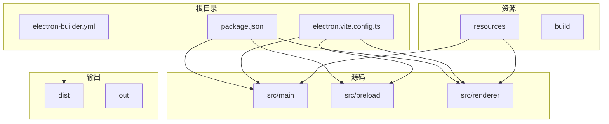
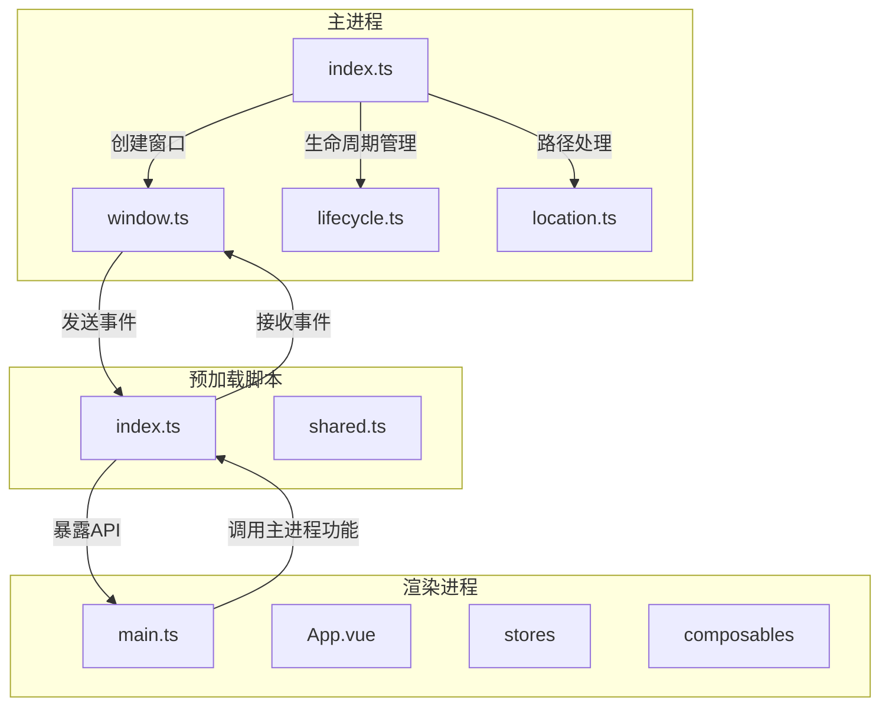
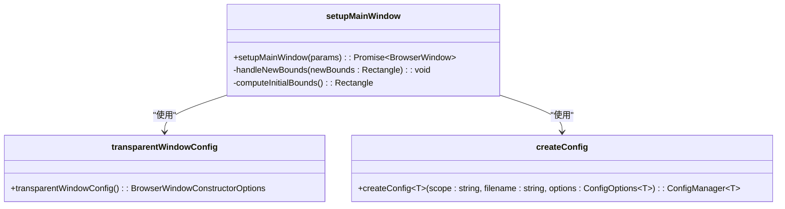
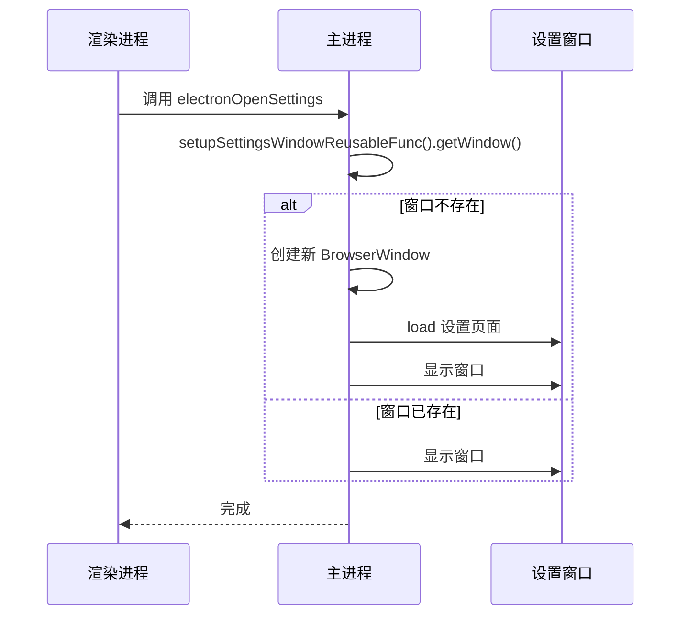
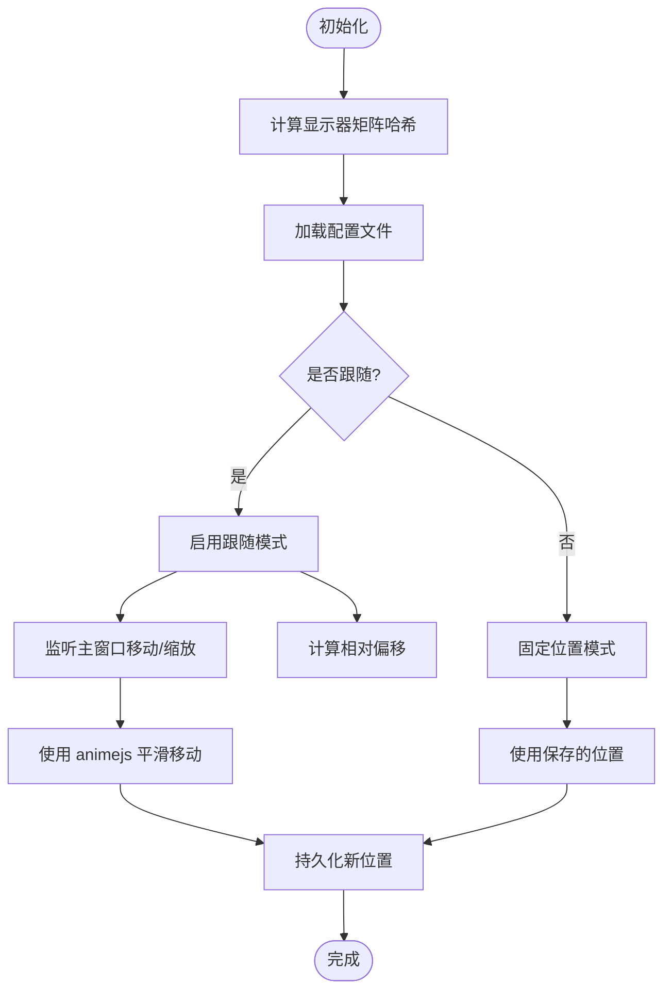

# 桌面应用

<cite>
**本文档中引用的文件**  
- [package.json](file://apps/stage-tamagotchi/package.json)
- [electron.vite.config.ts](file://apps/stage-tamagotchi/electron.vite.config.ts)
- [electron-builder.yml](file://apps/stage-tamagotchi/electron-builder.yml)
- [index.ts](file://apps/stage-tamagotchi/src/main/index.ts)
- [window.ts](file://apps/stage-tamagotchi/src/main/services/electron/window.ts)
- [main/index.ts](file://apps/stage-tamagotchi/src/main/windows/main/index.ts)
- [settings/index.ts](file://apps/stage-tamagotchi/src/main/windows/settings/index.ts)
- [caption/index.ts](file://apps/stage-tamagotchi/src/main/windows/caption/index.ts)
- [preload/index.ts](file://apps/stage-tamagotchi/src/preload/index.ts)
- [renderer/main.ts](file://apps/stage-tamagotchi/src/renderer/main.ts)
- [lifecycle.ts](file://apps/stage-tamagotchi/src/main/libs/bootkit/lifecycle.ts)
- [location.ts](file://apps/stage-tamagotchi/src/main/libs/electron/location.ts)
</cite>

## 目录
1. [简介](#简介)
2. [项目结构](#项目结构)
3. [核心组件](#核心组件)
4. [架构概述](#架构概述)
5. [详细组件分析](#详细组件分析)
6. [依赖分析](#依赖分析)
7. [性能考虑](#性能考虑)
8. [故障排除指南](#故障排除指南)
9. [结论](#结论)

## 简介
`stage-tamagotchi` 是一个基于 Electron 构建的桌面应用程序，结合了 Vue 3、TypeScript 和 Vite 技术栈。该应用旨在提供一个 AI 虚拟角色（VTuber/Waifu）聊天机器人体验，支持 Live2D/VRM 模型，并具备模块化舞台渲染能力。本项目采用多窗口架构设计，包含主窗口、设置窗口、字幕窗口和嵌入式窗口，通过 Electron 的主进程与渲染进程通信机制实现功能交互。应用使用 `electron-vite` 作为构建工具，`electron-builder` 进行打包分发，并集成国际化、状态管理、路由控制等现代前端特性。

## 项目结构
`stage-tamagotchi` 应用的项目结构遵循模块化设计原则，清晰地分离了主进程、预加载脚本和渲染进程代码。主要目录包括 `src/main`（主进程逻辑）、`src/preload`（预加载脚本）和 `src/renderer`（前端界面）。构建配置使用 `electron.vite.config.ts` 统一管理，打包配置通过 `electron-builder.yml` 定义。资源文件（如图标）存放在 `resources` 目录下，而构建输出则位于 `dist` 目录。这种结构有利于维护和扩展，同时支持热重载和高效开发。



**图示来源**
- [package.json](file://apps/stage-tamagotchi/package.json)
- [electron.vite.config.ts](file://apps/stage-tamagotchi/electron.vite.config.ts)
- [electron-builder.yml](file://apps/stage-tamagotchi/electron-builder.yml)

**本节来源**
- [package.json](file://apps/stage-tamagotchi/package.json)
- [electron.vite.config.ts](file://apps/stage-tamagotchi/electron.vite.config.ts)
- [electron-builder.yml](file://apps/stage-tamagotchi/electron-builder.yml)

## 核心组件
`stage-tamagotchi` 的核心组件包括主窗口、设置窗口、字幕窗口和嵌入式窗口的管理逻辑，以及主进程与渲染进程之间的通信机制。主进程通过 `src/main/index.ts` 初始化应用生命周期，并使用 `injecta` 依赖注入容器管理窗口实例。预加载脚本 `src/preload/index.ts` 提供了安全的 API 暴露机制，使渲染进程能够调用主进程功能。渲染进程基于 Vue 3 和 Pinia 构建用户界面，并通过 `@unbird/eventa` 实现跨进程事件通信。系统托盘功能在 macOS 和 Linux 上提供快捷操作入口。

**本节来源**
- [index.ts](file://apps/stage-tamagotchi/src/main/index.ts)
- [preload/index.ts](file://apps/stage-tamagotchi/src/preload/index.ts)
- [renderer/main.ts](file://apps/stage-tamagotchi/src/renderer/main.ts)

## 架构概述
`stage-tamagotchi` 采用典型的 Electron 分层架构，分为主进程、预加载脚本和渲染进程三层。主进程负责创建和管理浏览器窗口、处理系统事件、与操作系统交互。预加载脚本作为桥梁，安全地暴露 Node.js 和 Electron API 给渲染进程。渲染进程运行在沙箱环境中，专注于用户界面展示和交互。应用使用 `@unbird/eventa` 进行进程间通信，替代了原生的 `ipcMain` 和 `ipcRenderer`，提供了更高级的事件处理抽象。窗口管理通过 `createReusableWindow` 工厂函数实现，确保窗口的单例模式和可复用性。



**图示来源**
- [index.ts](file://apps/stage-tamagotchi/src/main/index.ts)
- [window.ts](file://apps/stage-tamagotchi/src/main/services/electron/window.ts)
- [preload/index.ts](file://apps/stage-tamagotchi/src/preload/index.ts)
- [renderer/main.ts](file://apps/stage-tamagotchi/src/renderer/main.ts)

## 详细组件分析

### 主窗口分析
主窗口是 `stage-tamagotchi` 的核心界面，负责展示 AI 角色的交互内容。其创建逻辑位于 `src/main/windows/main/index.ts`，通过 `setupMainWindow` 函数实现。窗口配置支持持久化存储，包括位置、大小等属性，使用 `createConfig` 工具函数管理 JSON 配置文件。为了实现无边框透明窗口效果，应用采用了 `transparentWindowConfig` 配置，并在 macOS 上隐藏窗口按钮。主窗口通过 `setupMainWindowElectronInvokes` 注册了打开开发者工具和设置窗口的 IPC 调用。窗口的拖拽功能通过 `electron-click-drag-plugin` 实现，避免了原生拖拽在某些系统上的兼容性问题。



**图示来源**
- [main/index.ts](file://apps/stage-tamagotchi/src/main/windows/main/index.ts)
- [shared/window.ts](file://apps/stage-tamagotchi/src/main/windows/shared/window.ts)
- [shared/persistence.ts](file://apps/stage-tamagotchi/src/main/windows/shared/persistence.ts)

**本节来源**
- [main/index.ts](file://apps/stage-tamagotchi/src/main/windows/main/index.ts)

### 设置窗口分析
设置窗口通过 `setupSettingsWindowReusableFunc` 函数创建，该函数返回一个可复用的窗口获取器。这种设计模式确保了设置窗口在整个应用生命周期内只有一个实例，避免了多个设置窗口同时打开的情况。窗口使用 `createReusableWindow` 工厂函数包装，实现了懒加载和自动销毁逻辑。设置窗口的 URL 通过 `withHashRoute` 函数构造，指向渲染进程的 `/settings` 路由。窗口的 Web 内容设置了 `setWindowOpenHandler`，确保外部链接在默认浏览器中打开，而不是在应用内部加载。



**图示来源**
- [settings/index.ts](file://apps/stage-tamagotchi/src/main/windows/settings/index.ts)
- [libs/electron/window-manager.ts](file://apps/stage-tamagotchi/src/main/libs/electron/window-manager.ts)
- [libs/electron/location.ts](file://apps/stage-tamagotchi/src/main/libs/electron/location.ts)

**本节来源**
- [settings/index.ts](file://apps/stage-tamagotchi/src/main/windows/settings/index.ts)

### 字幕窗口分析
字幕窗口是 `stage-tamagotchi` 的特色功能之一，提供了一个可跟随主窗口移动的浮动字幕显示区域。其管理逻辑由 `setupCaptionWindowManager` 函数实现，返回一个包含多种操作方法的对象。字幕窗口支持两种模式：固定位置和跟随主窗口。跟随模式通过监听主窗口的 `move` 和 `resize` 事件，使用 `animejs` 动画库实现平滑的重新定位。窗口的位置和模式状态被持久化存储，考虑了多显示器环境下的显示矩阵变化，通过 SHA-256 哈希值识别不同的显示器配置。这种设计确保了用户在不同显示器布局下都能获得一致的体验。



**图示来源**
- [caption/index.ts](file://apps/stage-tamagotchi/src/main/windows/caption/index.ts)
- [shared/display.ts](file://apps/stage-tamagotchi/src/main/windows/shared/display.ts)
- [shared/persistence.ts](file://apps/stage-tamagotchi/src/main/windows/shared/persistence.ts)

**本节来源**
- [caption/index.ts](file://apps/stage-tamagotchi/src/main/windows/caption/index.ts)

## 依赖分析
`stage-tamagotchi` 项目依赖关系复杂，涵盖了构建工具、Electron 扩展、前端框架和实用工具库。主进程依赖 `@electron-toolkit/utils` 提供工具函数，`@unbird/eventa` 实现事件通信，`injecta` 进行依赖注入。渲染进程依赖 Vue 3 生态系统，包括 `pinia` 状态管理、`vue-router` 路由控制和 `@vueuse` 组合式函数。构建系统依赖 `electron-vite` 和 `vite`，打包依赖 `electron-builder`。项目还使用了多个自定义工作空间包，如 `@proj-airi/stage-ui` 和 `@proj-airi/i18n`，体现了模块化设计思想。

```mermaid
graph TD
A[stage-tamagotchi] --> B[@electron-toolkit/utils]
A --> C[@unbird/eventa]
A --> D[injecta]
A --> E[vue]
A --> F[pinia]
A --> G[vue-router]
A --> H[@vueuse/core]
A --> I[electron-vite]
A --> J[electron-builder]
A --> K[@proj-airi/stage-ui]
A --> L[@proj-airi/i18n]
A --> M[animejs]
A --> N[defu]
A --> O[std-env]
```

**图示来源**
- [package.json](file://apps/stage-tamagotchi/package.json)

**本节来源**
- [package.json](file://apps/stage-tamagotchi/package.json)

## 性能考虑
`stage-tamagotchi` 在性能方面进行了多项优化。构建配置中使用 `optimizeDeps.exclude` 排除了大量不需要预构建的依赖，加快了开发服务器的启动速度。字幕窗口的跟随逻辑使用 `throttle` 和 `debounce` 函数限制事件处理频率，避免了频繁的窗口重绘。动画效果通过 `animejs` 库实现，提供了流畅的视觉体验。主进程与渲染进程的通信经过 `@unbird/eventa` 抽象层，减少了直接使用 IPC 的复杂性。对于 Linux 平台，应用通过 `app.commandLine.appendSwitch` 启用了 WebGPU 支持，确保了图形渲染的性能。

## 故障排除指南
在开发和使用 `stage-tamagotchi` 时可能遇到以下问题：  
1. **开发者工具无法打开**：检查 `is.dev` 环境变量和 `MAIN_APP_DEBUG` 环境变量是否正确设置。  
2. **窗口拖拽失效**：确认 `electron-click-drag-plugin` 是否正确加载，特别是在 Linux 平台上。  
3. **多显示器布局变化后窗口位置错误**：检查 `computeDisplayMatrixHash` 函数是否正确计算了显示器配置的哈希值。  
4. **WebGPU 不可用**：在 Linux 上确保已启用 `--enable-unsafe-webgpu` 命令行参数。  
5. **依赖安装失败**：由于使用了工作空间依赖，确保所有 `@proj-airi/*` 包都已正确链接。  
6. **构建失败**：检查 `electron-builder` 的配置文件路径和资源文件是否正确包含。

**本节来源**
- [index.ts](file://apps/stage-tamagotchi/src/main/index.ts)
- [main/index.ts](file://apps/stage-tamagotchi/src/main/windows/main/index.ts)
- [caption/index.ts](file://apps/stage-tamagotchi/src/main/windows/caption/index.ts)

## 结论
`stage-tamagotchi` 是一个功能丰富、架构清晰的 Electron 桌面应用。它成功地将现代前端技术与桌面应用开发相结合，提供了高质量的用户体验。通过合理的模块划分、依赖管理和通信机制，项目具备良好的可维护性和扩展性。多窗口管理和系统集成展示了 Electron 的强大能力。未来可以进一步优化性能，增加更多原生功能集成，并完善测试覆盖。