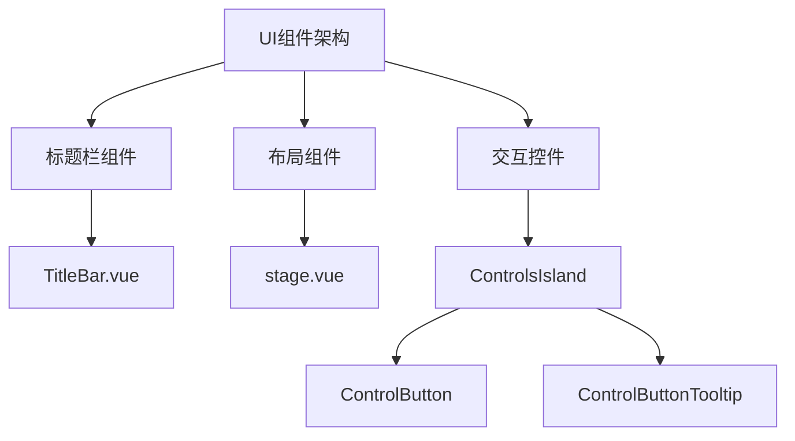
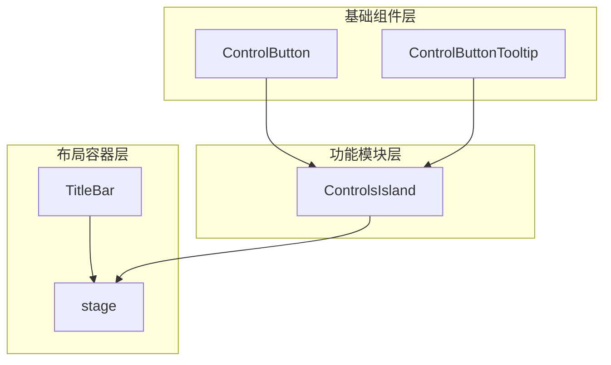
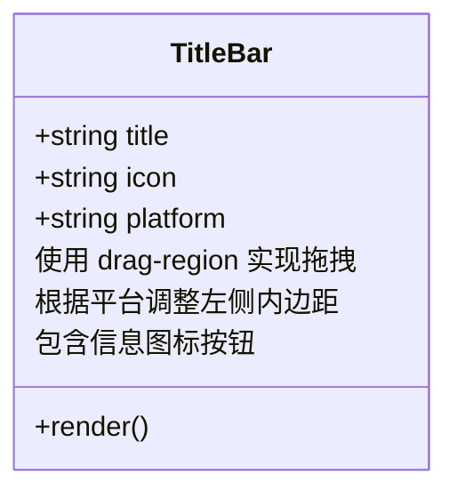
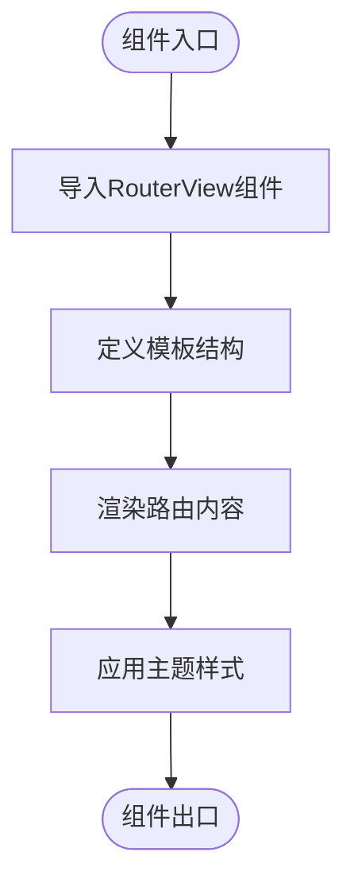
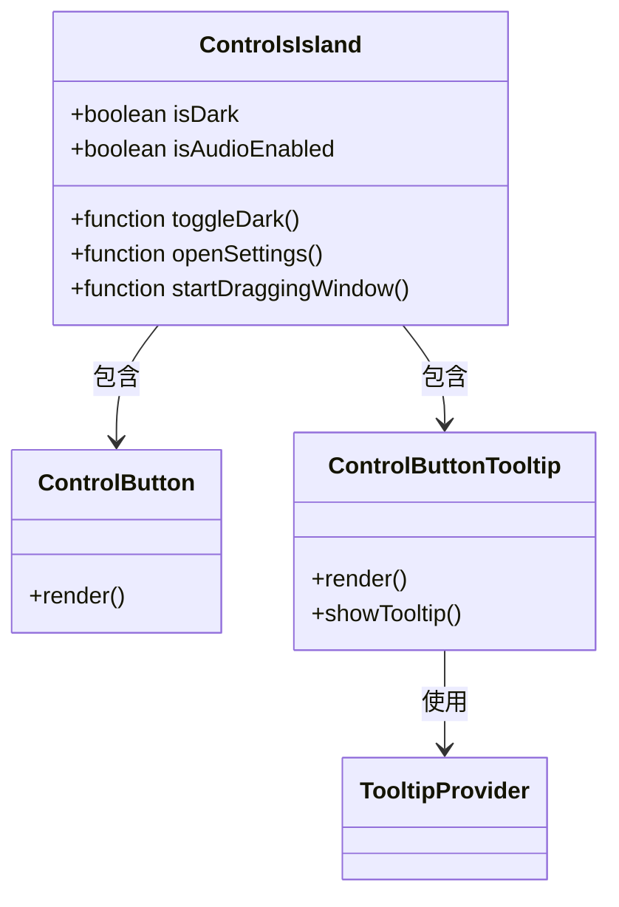
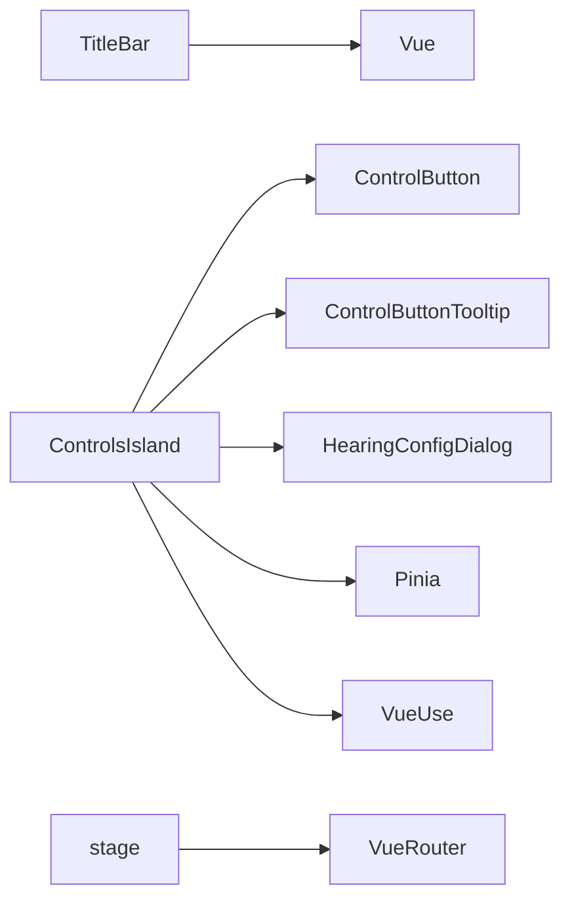

# UI组件架构

<cite>
**本文档中引用的文件**  
- [TitleBar.vue](file://apps/stage-tamagotchi/src/renderer/components/Window/TitleBar.vue)
- [stage.vue](file://apps/stage-web/src/layouts/stage.vue)
- [ControlsIsland/index.vue](file://apps/stage-tamagotchi/src/renderer/components/Widgets/ControlsIsland/index.vue)
- [ControlButton.vue](file://apps/stage-tamagotchi/src/renderer/components/Widgets/ControlsIsland/ControlButton.vue)
- [ControlButtonTooltip.vue](file://apps/stage-tamagotchi/src/renderer/components/Widgets/ControlsIsland/ControlButtonTooltip.vue)
</cite>

## 目录
1. [简介](#简介)
2. [项目结构](#项目结构)
3. [核心组件](#核心组件)
4. [架构概览](#架构概览)
5. [详细组件分析](#详细组件分析)
6. [依赖分析](#依赖分析)
7. [性能考虑](#性能考虑)
8. [故障排除指南](#故障排除指南)
9. [结论](#结论)

## 简介
本文档详细解析了Airi学习项目中UI组件的架构设计，重点分析了自定义标题栏、主界面布局和交互控件的设计模式。文档涵盖了组件间的通信机制、样式继承策略以及拖拽区域处理等关键技术实现。

## 项目结构
项目采用模块化架构，UI组件主要分布在`apps/stage-tamagotchi`和`apps/stage-web`两个应用中。核心UI组件位于`renderer/components`目录下，包括窗口控制、交互控件和布局组件。

**Diagram sources**
- [TitleBar.vue](file://apps/stage-tamagotchi/src/renderer/components/Window/TitleBar.vue)
- [stage.vue](file://apps/stage-web/src/layouts/stage.vue)
- [ControlsIsland/index.vue](file://apps/stage-tamagotchi/src/renderer/components/Widgets/ControlsIsland/index.vue)

**Section sources**
- [TitleBar.vue](file://apps/stage-tamagotchi/src/renderer/components/Window/TitleBar.vue)
- [stage.vue](file://apps/stage-web/src/layouts/stage.vue)

## 核心组件
系统的核心UI组件包括自定义标题栏、主界面布局和交互控件岛。这些组件共同构成了应用程序的用户界面基础，提供了窗口控制、内容展示和用户交互功能。

**Section sources**
- [TitleBar.vue](file://apps/stage-tamagotchi/src/renderer/components/Window/TitleBar.vue)
- [stage.vue](file://apps/stage-web/src/layouts/stage.vue)
- [ControlsIsland/index.vue](file://apps/stage-tamagotchi/src/renderer/components/Widgets/ControlsIsland/index.vue)

## 架构概览
系统的UI架构采用分层设计模式，将界面元素分为基础组件、布局容器和功能模块三个层次。这种设计提高了组件的复用性和维护性。

**Diagram sources**
- [TitleBar.vue](file://apps/stage-tamagotchi/src/renderer/components/Window/TitleBar.vue)
- [stage.vue](file://apps/stage-web/src/layouts/stage.vue)
- [ControlsIsland/index.vue](file://apps/stage-tamagotchi/src/renderer/components/Widgets/ControlsIsland/index.vue)

## 详细组件分析

### 自定义标题栏实现
TitleBar组件实现了跨平台的窗口标题栏功能，包含标题显示、图标展示和窗口控制。

#### 标题栏结构分析

**Diagram sources**
- [TitleBar.vue](file://apps/stage-tamagotchi/src/renderer/components/Window/TitleBar.vue)

**Section sources**
- [TitleBar.vue](file://apps/stage-tamagotchi/src/renderer/components/Window/TitleBar.vue)

### 主界面布局组件
stage.vue组件作为主界面的布局容器，负责组织和管理页面内容的显示。

#### 布局组件分析

**Diagram sources**
- [stage.vue](file://apps/stage-web/src/layouts/stage.vue)

**Section sources**
- [stage.vue](file://apps/stage-web/src/layouts/stage.vue)

### 交互控件设计模式
ControlsIsland组件集成了多个交互按钮，采用组合式设计模式构建用户控制面板。

#### 控件岛组件结构

**Diagram sources**
- [ControlsIsland/index.vue](file://apps/stage-tamagotchi/src/renderer/components/Widgets/ControlsIsland/index.vue)
- [ControlButton.vue](file://apps/stage-tamagotchi/src/renderer/components/Widgets/ControlsIsland/ControlButton.vue)
- [ControlButtonTooltip.vue](file://apps/stage-tamagotchi/src/renderer/components/Widgets/ControlsIsland/ControlButtonTooltip.vue)

**Section sources**
- [ControlsIsland/index.vue](file://apps/stage-tamagotchi/src/renderer/components/Widgets/ControlsIsland/index.vue)
- [ControlButton.vue](file://apps/stage-tamagotchi/src/renderer/components/Widgets/ControlsIsland/ControlButton.vue)
- [ControlButtonTooltip.vue](file://apps/stage-tamagotchi/src/renderer/components/Widgets/ControlsIsland/ControlButtonTooltip.vue)

## 依赖分析
UI组件之间存在明确的依赖关系，形成了清晰的组件层级结构。

**Diagram sources**
- [TitleBar.vue](file://apps/stage-tamagotchi/src/renderer/components/Window/TitleBar.vue)
- [ControlsIsland/index.vue](file://apps/stage-tamagotchi/src/renderer/components/Widgets/ControlsIsland/index.vue)
- [stage.vue](file://apps/stage-web/src/layouts/stage.vue)

**Section sources**
- [TitleBar.vue](file://apps/stage-tamagotchi/src/renderer/components/Window/TitleBar.vue)
- [ControlsIsland/index.vue](file://apps/stage-tamagotchi/src/renderer/components/Widgets/ControlsIsland/index.vue)
- [stage.vue](file://apps/stage-web/src/layouts/stage.vue)

## 性能考虑
组件设计考虑了渲染性能和交互响应性，采用以下优化策略：
- 使用`debouncedRef`减少频繁的状态更新
- 通过`watchPausable`控制观察者的激活状态
- 利用CSS过渡动画提升用户体验
- 采用按需加载策略优化初始渲染性能

## 故障排除指南
### 常见问题及解决方案
- **拖拽功能失效**：检查`drag-region`类是否正确应用，确保平台兼容性处理
- **按钮状态不同步**：验证Pinia store的状态绑定是否正确
- **工具提示不显示**：确认TooltipProvider的配置参数
- **跨平台样式差异**：检查平台检测逻辑和相应的样式调整

**Section sources**
- [ControlsIsland/index.vue](file://apps/stage-tamagotchi/src/renderer/components/Widgets/ControlsIsland/index.vue)
- [TitleBar.vue](file://apps/stage-tamagotchi/src/renderer/components/Window/TitleBar.vue)

## 结论
本文档详细解析了Airi项目中的UI组件架构，展示了如何通过组合式API和现代化前端技术构建高效、可维护的用户界面。组件设计充分考虑了跨平台兼容性、用户体验和性能优化，为后续功能扩展提供了坚实的基础。