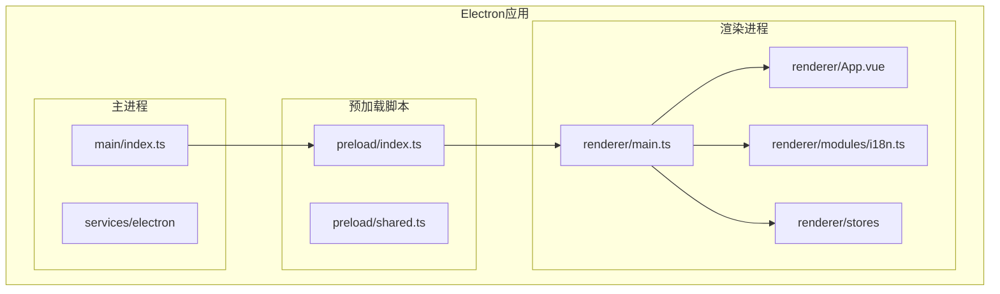
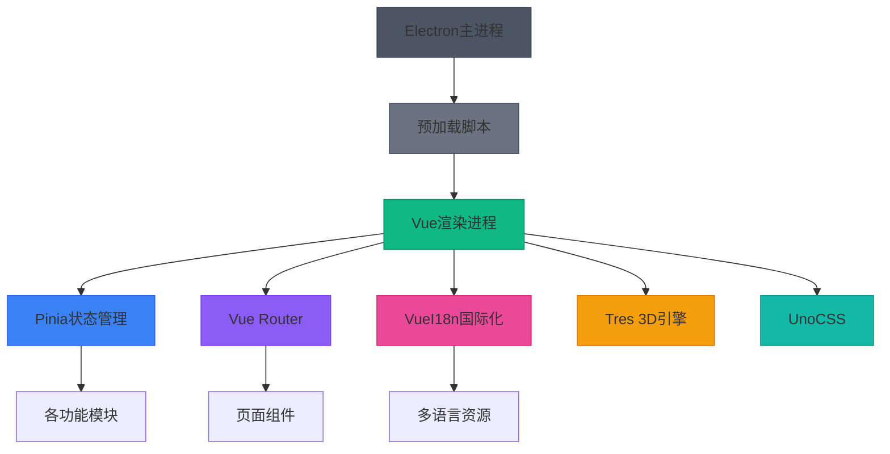

# Vue应用集成

<cite>
**本文档中引用的文件**  
- [main.ts](file://apps/stage-tamagotchi/src/renderer/main.ts)
- [App.vue](file://apps/stage-tamagotchi/src/renderer/App.vue)
- [index.html](file://apps/stage-tamagotchi/src/renderer/index.html)
- [preload/index.ts](file://apps/stage-tamagotchi/src/preload/index.ts)
- [shared.ts](file://apps/stage-tamagotchi/src/preload/shared.ts)
- [electron.vite.config.ts](file://apps/stage-tamagotchi/electron.vite.config.ts)
</cite>

## 目录
1. [简介](#简介)
2. [项目结构](#项目结构)
3. [Vue应用初始化](#vue应用初始化)
4. [根组件结构设计](#根组件结构设计)
5. [Electron脚本加载机制](#electron脚本加载机制)
6. [开发服务器协同配置](#开发服务器协同配置)
7. [依赖分析](#依赖分析)
8. [结论](#结论)

## 简介
本文档详细说明了在Electron渲染进程中集成Vue 3的实现方案。重点阐述了Vue应用的初始化流程、根组件设计、Electron特定脚本加载机制以及开发环境的协同配置。通过分析`main.ts`中的插件注册与路由配置，`App.vue`的组件结构，`index.html`的脚本引入方式，以及`electron.vite.config.ts`中的开发服务器设置，全面展示了Vue与Electron的深度集成方案。

## 项目结构
项目采用模块化架构，将Electron主进程、渲染进程和预加载脚本分离。渲染进程位于`apps/stage-tamagotchi/src/renderer`目录，包含Vue应用的核心文件。主进程逻辑位于`apps/stage-tamagotchi/src/main`，预加载脚本位于`apps/stage-tamagotchi/src/preload`。这种分离设计确保了安全性和职责清晰。

**Diagram sources**  
- [main.ts](file://apps/stage-tamagotchi/src/renderer/main.ts#L1-L50)
- [index.ts](file://apps/stage-tamagotchi/src/main/index.ts#L1-L20)
- [index.ts](file://apps/stage-tamagotchi/src/preload/index.ts#L1-L4)

**Section sources**  
- [main.ts](file://apps/stage-tamagotchi/src/renderer/main.ts#L1-L50)
- [index.ts](file://apps/stage-tamagotchi/src/main/index.ts#L1-L20)

## Vue应用初始化
`main.ts`文件负责Vue应用的完整初始化过程，包括核心插件注册、路由配置和全局设置。

### 插件注册
在`main.ts`中，通过`.use()`方法依次注册了多个核心插件：
- **Pinia**：状态管理插件，通过`createPinia()`创建实例
- **VueI18n**：国际化插件，从`./modules/i18n`导入配置
- **Vue Router**：路由管理，使用`createWebHashHistory`模式
- **Tres**：3D渲染引擎集成
- **MotionPlugin**：动画支持
- **autoAnimatePlugin**：自动动画插件

这些插件按特定顺序注册，确保依赖关系正确处理。

### 路由配置
路由系统采用`vue-router/auto-routes`自动路由方案，结合`vite-plugin-vue-layouts`实现布局系统。`createRouter`函数配置了哈希历史模式，并通过`setupLayouts(routes)`整合自动路由与布局系统，实现了基于文件结构的自动路由生成功能。

### 全局组件与样式
在初始化过程中，应用导入了多种全局样式和字体资源，包括UnoCSS重置、自定义字体和项目特定的CSS文件。这些资源通过模块导入方式集成，确保了样式的全局可用性。

**Section sources**  
- [main.ts](file://apps/stage-tamagotchi/src/renderer/main.ts#L1-L50)

## 根组件结构设计
`App.vue`作为Vue应用的根组件，采用了组合式API（Composition API）进行开发，实现了复杂的状态管理和生命周期逻辑。

### 组件结构
根组件的核心结构非常简洁，仅包含一个`<RouterView />`元素，作为所有路由组件的出口。这种设计遵循了Vue Router的标准模式，实现了基于路由的页面切换机制。

### 状态管理集成
组件通过`usePinia`的`storeToRefs`工具，将多个全局状态存储（如`displayModelsStore`、`settingsStore`、`onboardingStore`）映射为响应式引用。这种模式避免了直接修改store状态，符合Vue的最佳实践。

### 国际化支持
通过`useI18n`组合式函数集成国际化功能，并设置`watch`监听器，当语言设置变化时自动更新`i18n.locale.value`，实现动态语言切换。

### Electron IPC集成
组件在`onMounted`生命周期钩子中，通过`@unbird/eventa`库建立与Electron主进程的通信。创建`context`并定义`invoke`处理器，监听来自主进程的`electronOpenSettings`消息，实现主进程控制渲染进程导航的功能。

### 主题动态更新
通过`watch`监听器监控主题色设置的变化，动态更新CSS自定义属性`--chromatic-hue`，并控制`dynamic-hue`类的添加与移除，实现主题颜色的实时更新。

**Section sources**  
- [App.vue](file://apps/stage-tamagotchi/src/renderer/App.vue#L1-L76)

## Electron脚本加载机制
Electron环境下的脚本加载机制通过`index.html`和预加载脚本协同实现，确保了安全性和功能完整性。

### HTML结构
`index.html`文件定义了应用的基本结构，包含必要的meta标签和字体设置。页面主体包含一个`id="app"`的div元素，作为Vue应用的挂载点。

### 预加载脚本集成
通过`preload/index.ts`文件加载`shared.ts`中的`expose`函数，利用Electron的`contextBridge`机制将主进程API安全地暴露给渲染进程。当上下文隔离启用时，使用`contextBridge.exposeInMainWorld`方法；否则直接挂载到`window`对象。

### 核心库加载
`index.html`中直接引入了Live2D Cubism Core库，为应用提供3D模型渲染支持。这种直接引入方式确保了核心库在Vue应用初始化前就已可用。

**Section sources**  
- [index.html](file://apps/stage-tamagotchi/src/renderer/index.html#L1-L27)
- [index.ts](file://apps/stage-tamagotchi/src/preload/index.ts#L1-L4)
- [shared.ts](file://apps/stage-tamagotchi/src/preload/shared.ts#L7-L26)

## 开发服务器协同配置
`electron.vite.config.ts`文件配置了Vite与Electron的协同工作环境，解决了开发模式下的特殊需求。

### 基础路径配置
设置`base: './'`确保资源路径在Electron环境中正确解析，避免因协议差异导致的资源加载问题。

### 依赖优化
在`optimizeDeps.exclude`中排除了项目内部包和静态资源，防止Vite错误地处理这些模块。特别排除了Live2D SDK相关模块，确保其按预期方式加载。

### 别名配置
通过`resolve.alias`为项目内部包设置路径别名，简化模块导入，提高代码可读性和维护性。

### 开发服务器设置
配置了`warmup.clientFiles`预热机制，提升开发服务器启动性能。通过自定义插件设置`RUNTIME_ENVIRONMENT`和`URL_MODE`环境变量，区分开发和生产环境的行为。

### 跨域与热重载
虽然未显式配置跨域，但Electron环境天然避免了浏览器的同源策略限制。热重载功能由Vite原生支持，在Electron中正常工作，提供了高效的开发体验。

**Section sources**  
- [electron.vite.config.ts](file://apps/stage-tamagotchi/electron.vite.config.ts#L1-L140)

## 依赖分析
系统依赖关系清晰，各组件职责分明。

**Diagram sources**  
- [main.ts](file://apps/stage-tamagotchi/src/renderer/main.ts#L1-L50)
- [electron.vite.config.ts](file://apps/stage-tamagotchi/electron.vite.config.ts#L1-L140)

**Section sources**  
- [main.ts](file://apps/stage-tamagotchi/src/renderer/main.ts#L1-L50)
- [electron.vite.config.ts](file://apps/stage-tamagotchi/electron.vite.config.ts#L1-L140)

## 结论
本文档详细阐述了Vue 3在Electron渲染进程中的集成方案。通过`main.ts`的完整初始化流程、`App.vue`的响应式设计、`index.html`的脚本加载机制以及`electron.vite.config.ts`的开发环境配置，构建了一个功能完整、结构清晰的桌面应用架构。该方案充分利用了Vue 3的现代化特性与Electron的强大能力，为复杂桌面应用开发提供了可靠的技术基础。