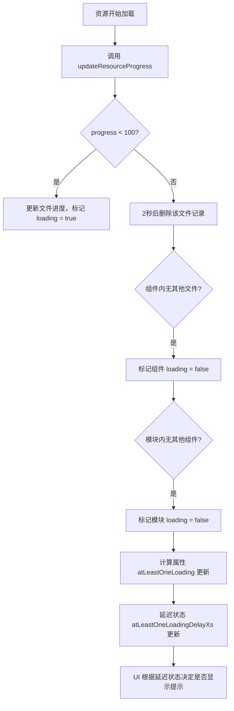

# 性能优化

<cite>
**本文档中引用的文件**  
- [main.ts](file://apps/stage-tamagotchi/src/renderer/main.ts)
- [electron.vite.config.ts](file://apps/stage-tamagotchi/electron.vite.config.ts)
- [resources.ts](file://apps/stage-tamagotchi/src/renderer/stores/resources.ts)
- [ResourceStatusIsland/index.vue](file://apps/stage-tamagotchi/src/renderer/components/Widgets/ResourceStatusIsland/index.vue)
- [LoadingModules.vue](file://apps/stage-tamagotchi/src/renderer/components/Widgets/ResourceStatusIsland/LoadingModules.vue)
</cite>

## 目录
1. [引言](#引言)
2. [组件懒加载与动态导入](#组件懒加载与动态导入)
3. [资源监控数据的高效更新策略](#资源监控数据的高效更新策略)
4. [构建优化配置](#构建优化配置)
5. [内存泄漏检测方法](#内存泄漏检测方法)
6. [GPU加速启用指南](#gpu加速启用指南)
7. [结论](#结论)

## 引言
本指南旨在为 `airi_learning` 项目中的渲染进程提供全面的性能优化方案。重点涵盖组件懒加载机制、资源状态监控、构建配置优化、内存泄漏检测以及GPU加速等关键方面，帮助开发者提升应用响应速度、降低内存占用并增强用户体验。

## 组件懒加载与动态导入

在 `main.ts` 中，应用通过标准的 Vue 生态工具链实现组件和资源的按需加载。虽然当前代码中未直接使用 `import()` 动态导入语法进行路由或组件的显式懒加载，但其依赖的 `unplugin-vue-router` 插件支持基于文件系统的自动路由生成，并可通过配置实现动态导入。

通过 `VueRouter` 插件配置了多路径的页面目录扫描，包括主项目和共享包中的页面，这为模块化和潜在的代码分割提供了基础结构。结合 Vite 的原生支持，所有异步组件均可自动转换为动态导入形式，从而实现组件级的懒加载。

此外，字体资源采用集中式引入方式，避免在运行时动态请求，减少主线程阻塞，提升首屏渲染性能。

**Section sources**
- [main.ts](file://apps/stage-tamagotchi/src/renderer/main.ts#L1-L50)

## 资源监控数据的高效更新策略

`ResourceStatusIsland` 组件用于展示当前系统中正在加载的资源状态，其实现依赖于 Pinia 状态管理器中的 `resources` store。该策略通过精细化的状态结构设计和延迟响应机制，确保 UI 更新既及时又不频繁，避免不必要的重渲染。

核心机制如下：

- **分层状态结构**：使用嵌套的 `Map` 结构组织模块（Module）、组件（Component）和文件（File）的加载进度，便于快速定位和更新。
- **计算属性优化**：`atLeastOneLoading` 计算属性自动聚合所有模块和组件的加载状态，避免手动维护全局加载标志。
- **延迟响应（Debounced State）**：通过 `refDelayed` 工具函数创建 `atLeastOneLoadingDelay5s` 和 `atLeastOneLoadingDelay10s` 两个延迟版本的状态，防止短暂的资源加载触发 UI 闪烁。例如，仅当加载持续超过5秒时才显示进度提示。
- **自动清理机制**：当某个文件加载完成（progress ≥ 100）后，系统会在2秒后自动从状态中移除该条目，保持状态树的精简。

`ResourceStatusIsland` 组件监听 `atLeastOneLoadingDelay5s` 和 `atLeastOneLoadingDelay10s`，结合 `TooltipProvider` 实现智能弹窗控制：仅在长时间加载时才允许用户点击查看详细进度。

**Diagram sources**
- [resources.ts](file://apps/stage-tamagotchi/src/renderer/stores/resources.ts#L1-L167)
- [ResourceStatusIsland/index.vue](file://apps/stage-tamagotchi/src/renderer/components/Widgets/ResourceStatusIsland/index.vue#L1-L88)

**Section sources**
- [resources.ts](file://apps/stage-tamagotchi/src/renderer/stores/resources.ts#L1-L167)
- [ResourceStatusIsland/index.vue](file://apps/stage-tamagotchi/src/renderer/components/Widgets/ResourceStatusIsland/index.vue#L1-L88)
- [LoadingModules.vue](file://apps/stage-tamagotchi/src/renderer/components/Widgets/ResourceStatusIsland/LoadingModules.vue)

## 构建优化配置

`electron.vite.config.ts` 文件中包含了大量针对 Electron 渲染进程的构建优化配置，显著提升了打包效率和运行时性能。

### 代码分割与依赖外联

- **externalizeDepsPlugin**：在主进程和预加载脚本中启用依赖外联，避免将 Node.js 原生模块打包进最终产物，减小体积并提升加载速度。

### Tree Shaking 与依赖排除

- **optimizeDeps.exclude**：明确排除大量非JS资源和内部SDK，如 Live2D 框架、静态模型资产等。这些资源通过专用插件（如 `DownloadLive2DSDK`）在构建时单独下载，避免 Vite 尝试解析和处理它们，极大缩短冷启动时间。

### 预加载脚本优化

- 预加载脚本同样使用 `externalizeDepsPlugin`，确保其轻量化，并通过 `tsconfig.preload.json` 独立配置类型检查。

### 开发服务器预热

- **server.warmup.clientFiles**：配置 Vite 在启动时预热 `stage-ui` 和 `stage-pages` 包中的 Vue 组件，显著提升首次访问速度。

### 别名配置与模块解析

- 通过 `resolve.alias` 将内部包（如 `@proj-airi/stage-ui`）直接映射到源码目录，避免经过 `node_modules`，提升开发时的热更新效率。

### 构建插件集成

- **VueRouter 自动路由**：基于文件系统自动生成路由，减少手动配置。
- **UnoCSS**：原子化 CSS 引擎，按需生成样式，减少 CSS 体积。
- **VueI18n**：国际化插件，支持运行时优化。
- **Download 插件**：在构建阶段自动下载远程资源（如 Live2D 模型、VRM 模型），确保资源可用性。

**Section sources**
- [electron.vite.config.ts](file://apps/stage-tamagotchi/electron.vite.config.ts#L1-L140)

## 内存泄漏检测方法

尽管项目中未内置专门的内存泄漏检测工具，但可通过以下方法进行排查：

1. **Chrome DevTools Memory 面板**：
   - 在 Electron 应用中打开开发者工具，使用“Memory”面板进行堆快照（Heap Snapshot）对比，查找未释放的对象。
   - 使用“Allocation instrumentation on timeline”监控对象分配情况。

2. **Pinia 状态监控**：
   - 检查 `resources` store 中的 `Map` 结构是否随时间不断增长。`ResourceStatusIsland` 的自动清理机制应防止此类问题，但仍需验证。

3. **事件监听器检查**：
   - 确保所有通过 `watch`、`addEventListener` 等注册的监听器在组件销毁时被正确移除。

4. **Vite 插件 inspect**：
   - 项目已集成 `vite-plugin-inspect`，可通过访问 `/__inspect/` 路径查看 Vite 内部状态，辅助分析模块加载和依赖关系。

## GPU加速启用指南

本项目基于 Electron 和 Vue，天然支持 GPU 加速。为确保 GPU 加速正常工作，请遵循以下指南：

1. **Electron 启动参数**：
   - 在主进程中确保未禁用 GPU 加速。默认情况下 Electron 已启用。
   - 可通过 `app.commandLine.appendSwitch('enable-gpu-rasterization')` 显式启用 GPU 光栅化。

2. **CSS 硬件加速**：
   - 使用 `transform`、`opacity` 等触发 GPU 加速的 CSS 属性。
   - 示例中 `backdrop-blur-md` 使用了 `backdrop-filter`，该属性依赖 GPU 加速，确保其流畅运行。

3. **Three.js 集成**：
   - 项目依赖 `@tresjs/core`，这是一个基于 Three.js 的 Vue 3 库，充分利用 WebGL 进行 3D 渲染，自动使用 GPU。

4. **Live2D 与 VRM 模型**：
   - 加载的 Live2D 和 VRM 模型均为 GPU 密集型渲染任务，其流畅运行即表明 GPU 加速已生效。

5. **性能监控**：
   - 在开发者工具的“Performance”面板中录制运行时表现，观察 FPS 和 GPU 使用率。

## 结论

通过对 `main.ts` 的组件加载机制、`ResourceStatusIsland` 的状态更新策略以及 `electron.vite.config.ts` 的构建配置进行分析，可以看出该项目在性能优化方面采用了现代化且高效的实践。建议持续监控内存使用情况，并充分利用 GPU 加速能力，以提供最佳的用户体验。