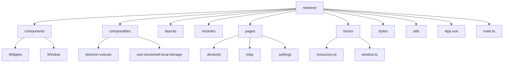
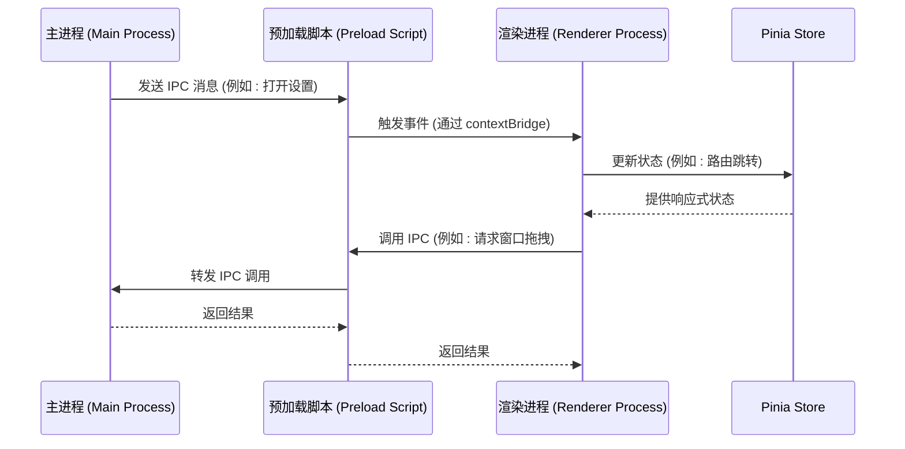

# 渲染进程实现

<cite>
**本文档中引用的文件**  
- [main.ts](file://apps/stage-tamagotchi/src/renderer/main.ts)
- [App.vue](file://apps/stage-tamagotchi/src/renderer/App.vue)
- [window.ts](file://apps/stage-tamagotchi/src/renderer/stores/window.ts)
- [resources.ts](file://apps/stage-tamagotchi/src/renderer/stores/resources.ts)
- [index.ts](file://apps/stage-tamagotchi/src/preload/index.ts)
- [shared.ts](file://apps/stage-tamagotchi/src/preload/shared.ts)
- [electron.vite.config.ts](file://apps/stage-tamagotchi/electron.vite.config.ts)
- [index.ts](file://apps/stage-tamagotchi/src/main/windows/main/index.ts)
- [window.ts](file://apps/stage-tamagotchi/src/main/services/electron/window.ts)
</cite>

## 目录
1. [介绍](#介绍)
2. [项目结构](#项目结构)
3. [核心组件](#核心组件)
4. [架构概览](#架构概览)
5. [详细组件分析](#详细组件分析)
6. [依赖分析](#依赖分析)
7. [性能考虑](#性能考虑)
8. [故障排除指南](#故障排除指南)
9. [结论](#结论)

## 介绍
本文件详细说明了 `stage-tamagotchi` 应用中渲染进程的实现。该应用是一个基于 Electron 的桌面应用程序，使用 Vue 3 作为前端框架，并通过 Pinia 进行状态管理，Vue Router 实现路由控制。渲染进程负责 UI 展示、用户交互以及与主进程的通信。文档将深入探讨其架构设计、状态同步机制、性能优化策略以及调试技巧。

## 项目结构
`stage-tamagotchi` 的渲染进程位于 `apps/stage-tamagotchi/src/renderer` 目录下，遵循典型的 Vue 3 + Vite 项目结构，并针对 Electron 环境进行了定制。



**图示来源**
- [main.ts](file://apps/stage-tamagotchi/src/renderer/main.ts#L1-L50)
- [App.vue](file://apps/stage-tamagotchi/src/renderer/App.vue#L1-L76)

**本节来源**
- [main.ts](file://apps/stage-tamagotchi/src/renderer/main.ts#L1-L50)
- [App.vue](file://apps/stage-tamagotchi/src/renderer/App.vue#L1-L76)

## 核心组件
渲染进程的核心由 Vue 3 应用构成，其入口点为 `main.ts`。该文件负责创建 Vue 应用实例，集成 Pinia 状态管理、Vue Router 路由系统、i18n 国际化以及 TresJS（Three.js for Vue）等关键插件。应用通过 `App.vue` 作为根组件，利用 `RouterView` 动态渲染不同路由下的页面。

**本节来源**
- [main.ts](file://apps/stage-tamagotchi/src/renderer/main.ts#L1-L50)
- [App.vue](file://apps/stage-tamagotchi/src/renderer/App.vue#L1-L76)

## 架构概览
`stage-tamagotchi` 的渲染进程与主进程通过 Electron 的 IPC 机制进行通信。这种通信由 `preload` 脚本作为桥梁，确保了安全性。渲染进程的 UI 状态（如窗口大小、鼠标位置）通过 Pinia store 进行管理，并与主进程的状态保持同步。



**图示来源**
- [index.ts](file://apps/stage-tamagotchi/src/preload/index.ts#L1-L4)
- [shared.ts](file://apps/stage-tamagotchi/src/preload/shared.ts)
- [App.vue](file://apps/stage-tamagotchi/src/renderer/App.vue#L1-L76)
- [window.ts](file://apps/stage-tamagotchi/src/main/services/electron/window.ts#L1-L44)

## 详细组件分析

### Vue 3 与 Electron 集成
Vue 3 应用在 `main.ts` 中被初始化，并通过 `createApp(App).mount('#app')` 挂载到 DOM。为了在 Electron 环境中工作，项目使用了 `electron-vite` 作为构建工具，其配置文件 `electron.vite.config.ts` 定义了 `renderer`、`main` 和 `preload` 三个构建目标。`renderer` 配置中通过 `resolve.alias` 将项目内部包（如 `@proj-airi/stage-ui`）映射到本地源码路径，实现了模块的热重载和高效开发。

**本节来源**
- [main.ts](file://apps/stage-tamagotchi/src/renderer/main.ts#L1-L50)
- [electron.vite.config.ts](file://apps/stage-tamagotchi/electron.vite.config.ts#L1-L140)

### Pinia 状态管理与路由配置
应用使用 Pinia 进行全局状态管理。`stores` 目录下的 `window.ts` 和 `resources.ts` 是两个核心 store。
- `window.ts` 使用 `useWindowSize` 和 `useElectronRelativeMouse` 等组合式函数，将窗口尺寸和鼠标相对于窗口的位置作为响应式状态暴露给 UI 组件，用于实现 Live2D 模型的视线跟随等交互效果。
- `resources.ts` 则管理着应用加载资源的进度，如模型、组件的加载状态，为 UI 提供加载指示器的数据支持。

路由由 `unplugin-vue-router` 自动生成，基于 `pages` 目录的文件结构。`App.vue` 中的 `RouterView` 组件负责根据当前 URL 渲染对应的页面组件。

#### 状态管理类图
```mermaid
classDiagram
class useWindowStore {
+width : Ref<number>
+height : Ref<number>
+centerPos : ComputedRef<{x, y}>
+live2dLookAtX : Ref<number>
+live2dLookAtY : Ref<number>
}
class useResourcesStore {
+resources : Ref<Map<string, Ref<Module>>>
+atLeastOneLoading : ComputedRef<boolean>
+pendingResources : ComputedRef<Resources>
+updateResourceProgress(module, component, progress)
+setModuleLoading(module, loading)
+setComponentLoading(module, component, loading)
}
class Module {
+components : Map<string, Component>
+loading : boolean
+reason? : string
}
class Component {
+files : Map<string, ProgressInfoItem>
+loading : boolean
}
class ProgressInfoItem {
+filename : string
+progress : number
+currentSize? : number
+totalSize? : number
}
useWindowStore --> useElectronRelativeMouse : "使用"
useResourcesStore --> Module : "包含"
Module --> Component : "包含"
Component --> ProgressInfoItem : "包含"
```

**图示来源**
- [window.ts](file://apps/stage-tamagotchi/src/renderer/stores/window.ts#L1-L23)
- [resources.ts](file://apps/stage-tamagotchi/src/renderer/stores/resources.ts#L1-L167)

**本节来源**
- [window.ts](file://apps/stage-tamagotchi/src/renderer/stores/window.ts#L1-L23)
- [resources.ts](file://apps/stage-tamagotchi/src/renderer/stores/resources.ts#L1-L167)
- [main.ts](file://apps/stage-tamagotchi/src/renderer/main.ts#L1-L50)

### 渲染进程与主进程通信
通信的核心是 `preload` 脚本。`preload/index.ts` 导入并执行 `expose()` 函数（定义在 `shared.ts` 中），该函数通过 `contextBridge.exposeInMainWorld` 将预定义的 IPC 调用（invokes）和事件（emits）暴露给渲染进程的全局 `window` 对象。

在 `App.vue` 的 `onMounted` 钩子中，通过 `createContext(window.electron.ipcRenderer)` 创建一个通信上下文，并使用 `defineInvoke` 调用主进程的方法（如 `electronStartTrackMousePosition`），使用 `defineInvokeHandler` 监听来自主进程的调用（如 `electronOpenSettings`），实现双向通信。

**本节来源**
- [index.ts](file://apps/stage-tamagotchi/src/preload/index.ts#L1-L4)
- [shared.ts](file://apps/stage-tamagotchi/src/preload/shared.ts)
- [App.vue](file://apps/stage-tamagotchi/src/renderer/App.vue#L1-L76)

### 窗口状态管理器
窗口状态的同步是通过主进程和渲染进程的协同工作实现的。主进程中的 `window.ts` 服务（`createWindowService`）会监听窗口的 `resize` 和 `move` 事件，并通过 `context.emit(bounds, ...)` 定期向渲染进程发送窗口的边界信息。渲染进程的 `useWindowStore` 可以订阅这些信息，从而保持状态同步。同时，主进程也会持久化窗口的配置（位置、大小），在下次启动时恢复。

**本节来源**
- [window.ts](file://apps/stage-tamagotchi/src/main/services/electron/window.ts#L1-L44)
- [index.ts](file://apps/stage-tamagotchi/src/main/windows/main/index.ts#L1-L155)

## 依赖分析
渲染进程依赖于多个内部和外部包。内部包如 `@proj-airi/stage-ui` 提供了 UI 组件库，`@proj-airi/i18n` 提供了多语言支持。外部依赖包括 Vue 3 生态的核心库（Vue, Pinia, Vue Router）、图形库（TresJS, Three.js）、以及用于构建和优化的 Vite 插件。`electron.vite.config.ts` 中的 `optimizeDeps.exclude` 配置确保了大型静态资源（如 Live2D SDK）不会被 Vite 预构建，从而加快开发服务器的启动速度。

**本节来源**
- [electron.vite.config.ts](file://apps/stage-tamagotchi/electron.vite.config.ts#L1-L140)
- [package.json](file://apps/stage-tamagotchi/package.json)

## 性能考虑
该项目在性能优化方面采取了多项策略：
1.  **依赖排除**：在 `electron.vite.config.ts` 中，通过 `optimizeDeps.exclude` 将 Live2D SDK 等大型库排除在 Vite 的预构建之外，显著减少了开发环境的冷启动时间。
2.  **懒加载**：虽然未在当前代码片段中直接体现，但基于 Vue Router 的路由设计天然支持组件的懒加载，可以按需加载页面模块，减少初始包体积。
3.  **内存管理**：`resources.ts` store 中对加载完成的资源文件使用 `setTimeout` 延迟清理，避免了频繁的 DOM 更新，同时在资源加载完成后及时从内存中移除不再需要的进度信息。
4.  **GPU 加速**：通过集成 TresJS 和 Three.js，应用可以利用 GPU 进行 3D 图形渲染，提供流畅的视觉效果。

## 故障排除指南
在 Electron 中调试 Vue 应用时，可以利用以下技巧：
1.  **启用开发者工具**：在 `main/index.ts` 中，`if (is.dev || env.MAIN_APP_DEBUG || env.APP_DEBUG)` 条件会自动为开发模式或设置了调试环境变量的实例打开 DevTools。
2.  **利用 Vite 插件**：`vite-plugin-inspect` 和 `vite-plugin-vue-devtools` 被集成到构建配置中，提供了强大的运行时检查和 Vue 专用的调试功能。
3.  **检查 Preload 错误**：由于 `preload` 脚本运行在 Node.js 环境，任何错误都可能导致 `contextBridge` 失败。应检查主进程的控制台输出。
4.  **IPC 通信调试**：使用 `console.log` 在 `preload` 脚本和主进程的 IPC 处理函数中打印日志，以验证消息的发送和接收是否正常。

**本节来源**
- [index.ts](file://apps/stage-tamagotchi/src/main/windows/main/index.ts#L1-L155)
- [electron.vite.config.ts](file://apps/stage-tamagotchi/electron.vite.config.ts#L1-L140)

## 结论
`stage-tamagotchi` 的渲染进程实现了一个功能丰富且性能良好的 Electron 桌面应用前端。它通过 Vue 3 和 Pinia 构建了响应式的用户界面，利用 `preload` 脚本安全地与主进程通信，并通过精心设计的状态管理器同步窗口和资源状态。项目的构建配置充分考虑了开发效率和运行时性能，为后续的功能扩展和维护奠定了坚实的基础。