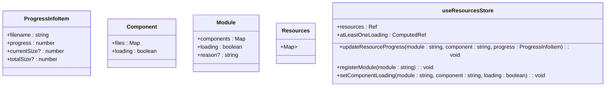
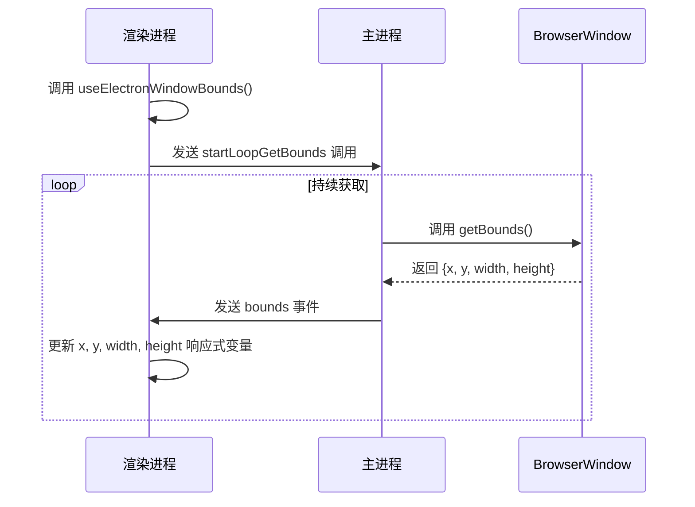

# 状态管理

<cite>
**本文档中引用的文件**  
- [window.ts](file://apps/stage-tamagotchi/src/renderer/stores/window.ts)
- [resources.ts](file://apps/stage-tamagotchi/src/renderer/stores/resources.ts)
- [use-electron-window-bounds/index.ts](file://apps/stage-tamagotchi/src/renderer/composables/electron-vueuse/use-electron-window-bounds/index.ts)
- [use-electron-eventa-context/index.ts](file://apps/stage-tamagotchi/src/renderer/composables/electron-vueuse/use-electron-eventa-context/index.ts)
- [window.ts](file://apps/stage-tamagotchi/src/main/services/electron/window.ts)
- [window.ts](file://apps/stage-tamagotchi/src/shared/electron/window.ts)
- [persistence.ts](file://apps/stage-tamagotchi/src/main/windows/shared/persistence.ts)
</cite>

## 目录
1. [简介](#简介)
2. [窗口状态管理](#窗口状态管理)
3. [系统资源监控状态](#系统资源监控状态)
4. [Electron API 交互与状态更新](#electron-api-交互与状态更新)
5. [状态持久化策略](#状态持久化策略)
6. [多窗口环境下的状态同步](#多窗口环境下的状态同步)

## 简介
本文档详细阐述了基于 Pinia 的状态管理机制，重点分析了窗口状态、系统资源监控数据的存储结构，以及如何通过组合式函数与 Electron API 交互并更新状态。同时，文档还说明了状态持久化机制和在 Electron 多窗口环境下的状态同步策略。

## 窗口状态管理

`window.ts` 文件定义了 `useWindowStore`，用于管理窗口相关的状态，包括窗口尺寸、中心位置以及鼠标相对坐标。该状态管理依赖于 `@vueuse/core` 提供的 `useWindowSize` 和自定义的 `useElectronRelativeMouse` 组合式函数。

窗口尺寸通过 `useWindowSize` 实时响应浏览器窗口变化，而 `live2dLookAtX` 和 `live2dLookAtY` 则用于 Live2D 模型的视线跟随功能，基于鼠标相对于窗口的位置进行计算。

```mermaid
classDiagram
class useWindowStore {
+width : Ref<number>
+height : Ref<number>
+centerPos : ComputedRef<{x : number, y : number}>
+live2dLookAtX : Ref<number>
+live2dLookAtY : Ref<number>
}
```

**图示来源**  
- [window.ts](file://apps/stage-tamagotchi/src/renderer/stores/window.ts#L7-L22)

**本节来源**  
- [window.ts](file://apps/stage-tamagotchi/src/renderer/stores/window.ts#L1-L23)

## 系统资源监控状态

`resources.ts` 文件定义了 `useResourcesStore`，用于跟踪系统资源加载进度，如模块、组件及其文件的下载状态。其核心数据结构为 `Resources` 类型，使用嵌套的 `Map` 存储模块、组件和文件的加载信息。

每个文件的进度信息由 `ProgressInfoItem` 接口描述，包含文件名、当前进度、已下载大小和总大小。状态管理器提供了 `updateResourceProgress` 方法用于更新进度，并通过 `atLeastOneLoading` 等计算属性反映整体加载状态。



**图示来源**  
- [resources.ts](file://apps/stage-tamagotchi/src/renderer/stores/resources.ts#L3-L166)

**本节来源**  
- [resources.ts](file://apps/stage-tamagotchi/src/renderer/stores/resources.ts#L1-L167)

## Electron API 交互与状态更新

应用通过 `composables/electron-vueuse` 目录下的 `use-electron-*` 系列组合式函数与 Electron API 进行交互。这些函数利用 `@unbird/eventa` 库在渲染进程和主进程之间建立通信。

以 `use-electron-window-bounds` 为例，它通过订阅 `bounds` 事件来接收主进程发送的窗口边界信息。该函数内部使用 `useElectronEventaContext` 获取 IPC 上下文，并通过 `defineInvoke` 触发 `startLoopGetBounds` 事件，启动主进程中持续获取窗口尺寸的循环。



**图示来源**  
- [use-electron-window-bounds/index.ts](file://apps/stage-tamagotchi/src/renderer/composables/electron-vueuse/use-electron-window-bounds/index.ts#L6-L30)
- [window.ts](file://apps/stage-tamagotchi/src/main/services/electron/window.ts#L20-L28)
- [window.ts](file://apps/stage-tamagotchi/src/shared/electron/window.ts#L3-L4)

**本节来源**  
- [use-electron-window-bounds/index.ts](file://apps/stage-tamagotchi/src/renderer/composables/electron-vueuse/use-electron-window-bounds/index.ts#L1-L32)
- [use-electron-eventa-context/index.ts](file://apps/stage-tamagotchi/src/renderer/composables/electron-vueuse/use-electron-eventa-context/index.ts#L6-L10)
- [window.ts](file://apps/stage-tamagotchi/src/main/services/electron/window.ts#L1-L44)
- [window.ts](file://apps/stage-tamagotchi/src/shared/electron/window.ts#L1-L15)

## 状态持久化策略

应用使用 `persistence.ts` 中的 `createConfig` 函数实现状态持久化。该函数创建一个基于文件的配置管理器，将数据存储在 Electron 的 `userData` 目录下。

`createConfig` 内部维护一个内存映射 `persistenceMap`，并在初始化时尝试从文件读取数据。对状态的更新会通过 `update` 方法写入内存映射，并使用 `throttle` 函数节流，避免频繁的磁盘 I/O 操作，确保数据在短时间内多次更新后能高效地持久化到文件。

```mermaid
flowchart TD
A[应用启动] --> B{检查配置文件是否存在}
B --> |是| C[读取文件内容]
C --> D[使用 safeDestr 解析 JSON]
D --> E[存入 persistenceMap]
B --> |否| F[使用默认值]
F --> E
G[调用 update(newData)] --> H[更新 persistenceMap]
H --> I[触发节流的 save 函数]
I --> J[异步写入文件]
```

**图示来源**  
- [persistence.ts](file://apps/stage-tamagotchi/src/main/windows/shared/persistence.ts#L14-L51)

**本节来源**  
- [persistence.ts](file://apps/stage-tamagotchi/src/main/windows/shared/persistence.ts#L1-L53)

## 多窗口环境下的状态同步

在 Electron 多窗口环境下，状态同步通过 `@unbird/eventa` 的事件系统实现。主进程中的 `createWindowService` 为每个 `BrowserWindow` 实例创建一个服务，该服务会监听窗口的生命周期事件（如 `onAppWindowAllClosed`），并在窗口销毁时停止相关循环。

当需要同步窗口状态（如尺寸和位置）时，主进程通过 `context.emit(bounds, ...)` 将 `BrowserWindow.getBounds()` 的结果广播给所有监听该事件的渲染进程。每个渲染进程的 `useElectronWindowBounds` 都会接收到此事件并更新其本地状态，从而实现跨窗口的状态同步。

此外，`createReusableWindow` 函数确保了特定窗口（如设置窗口）的唯一性，避免重复创建，这也是多窗口管理的一种策略。

**本节来源**  
- [window.ts](file://apps/stage-tamagotchi/src/main/services/electron/window.ts#L1-L44)
- [persistence.ts](file://apps/stage-tamagotchi/src/main/windows/shared/persistence.ts#L1-L53)
- [reusable.ts](file://apps/stage-tamagotchi/src/main/libs/electron/window-manager/reusable.ts#L1-L19)