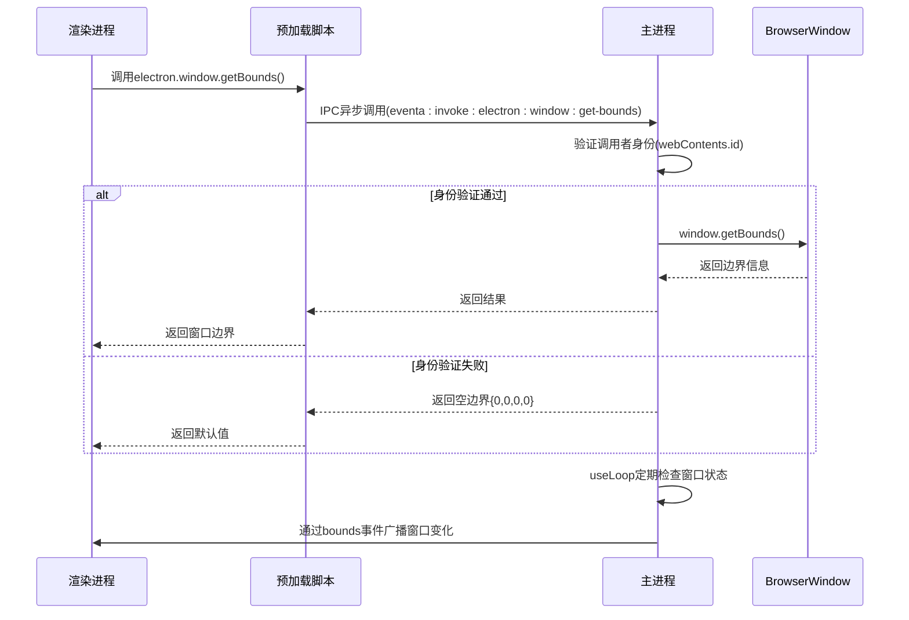

# 进程间通信

<cite>
**本文档引用文件**  
- [shared.ts](file://apps/stage-tamagotchi/src/preload/shared.ts)
- [windows.ts](file://apps/stage-tamagotchi/src/renderer/utils/windows.ts)
- [window.ts](file://apps/stage-tamagotchi/src/main/services/electron/window.ts)
- [window.ts](file://apps/stage-tamagotchi/src/shared/electron/window.ts)
- [lifecycle.ts](file://apps/stage-tamagotchi/src/main/libs/bootkit/lifecycle.ts)
- [loop.ts](file://apps/stage-tamagotchi/src/main/libs/event-loop/loop.ts)
</cite>

## 目录
1. [简介](#简介)
2. [预加载脚本中的API暴露](#预加载脚本中的api暴露)
3. [渲染进程通信辅助函数](#渲染进程通信辅助函数)
4. [主进程处理程序实现](#主进程处理程序实现)
5. [安全的IPC通信最佳实践](#安全的ipc通信最佳实践)
6. [通信机制架构图](#通信机制架构图)
7. [总结](#总结)

## 简介
本文档详细说明Electron应用中渲染进程与主进程之间的进程间通信（IPC）机制。重点分析通过`preload/shared.ts`暴露给渲染进程的IPC接口，涵盖窗口控制、系统信息获取等功能。同时解释`renderer/utils/windows.ts`中封装的通信辅助函数，以及主进程中`window.ts`对应的处理程序实现。最后提供安全IPC通信的最佳实践建议。

## 预加载脚本中的API暴露

`preload/shared.ts`文件通过`contextBridge`机制安全地将Electron API暴露给渲染进程。该模块的核心是`expose`函数，它根据上下文隔离设置决定如何暴露API。

当上下文隔离启用时，使用`contextBridge.exposeInMainWorld`将`electron`、`platform`和自定义API注入全局`window`对象；否则直接挂载到`window`对象上。这种设计确保了即使在不同安全配置下也能正常工作。

暴露的主要API包括：
- `electron`：来自`@electron-toolkit/preload`的Electron工具API
- `platform`：Node.js进程中的平台信息
- `api`：用户自定义的扩展API

此机制为渲染进程提供了安全访问原生功能的通道，同时防止恶意代码直接访问Node.js环境。

**Section sources**
- [shared.ts](file://apps/stage-tamagotchi/src/preload/shared.ts#L7-L26)

## 渲染进程通信辅助函数

`renderer/utils/windows.ts`文件提供了窗口点击穿透功能的辅助函数封装。虽然当前实现被注释，但其设计意图清晰：通过调用Tauri插件命令实现窗口的点击穿透控制。

该文件定义了两个异步函数：
- `startClickThrough`：启动窗口点击穿透模式
- `stopClickThrough`：停止窗口点击穿透模式

这些函数为上层应用逻辑提供了简洁的接口，隐藏了底层IPC通信的复杂性。尽管目前使用的是Tauri命令，但其设计模式适用于Electron的IPC调用。

**Section sources**
- [windows.ts](file://apps/stage-tamagotchi/src/renderer/utils/windows.ts#L1-L9)

## 主进程处理程序实现

主进程中的`window.ts`文件实现了窗口相关的IPC处理程序。`createWindowService`函数为特定窗口实例注册了一系列事件处理器。

关键功能包括：
1. **窗口边界监听**：通过`useLoop`定期检查窗口位置和大小，并通过`bounds`事件向渲染进程广播
2. **生命周期管理**：在应用退出和所有窗口关闭时自动停止监听循环
3. **异步方法处理**：
   - `startLoopGetBounds`：启动窗口边界监听循环
   - `getBounds`：安全获取窗口边界信息，验证调用者身份
   - `setIgnoreMouseEvents`：设置窗口鼠标事件忽略状态，同样进行调用者验证

所有处理程序都通过`defineInvokeHandler`注册，并严格验证调用者的`webContents.id`，确保只有拥有窗口权限的渲染进程才能执行操作。

**Section sources**
- [window.ts](file://apps/stage-tamagotchi/src/main/services/electron/window.ts#L10-L42)
- [window.ts](file://apps/stage-tamagotchi/src/shared/electron/window.ts#L1-L14)
- [lifecycle.ts](file://apps/stage-tamagotchi/src/main/libs/bootkit/lifecycle.ts#L1-L33)
- [loop.ts](file://apps/stage-tamagotchi/src/main/libs/event-loop/loop.ts#L1-L46)

## 安全的IPC通信最佳实践

基于代码分析，以下是安全IPC通信的关键实践：

### 参数验证
所有IPC处理程序都应验证输入参数的有效性。示例中通过比较`webContents.id`确保调用者身份合法，防止跨窗口调用。

### 错误处理
`expose`函数使用try-catch包裹`contextBridge`调用，确保在异常情况下不会中断应用运行，同时记录错误信息便于调试。

### 防止原型污染
通过严格定义API接口和使用类型系统（TypeScript）来防止原型链污染。避免使用`Object.assign`或扩展运算符处理不受信任的输入。

### 最小权限原则
每个IPC接口只暴露必要的功能，避免提供通用的执行能力。如`setIgnoreMouseEvents`直接处理参数，而不是暴露完整的`BrowserWindow`对象。

### 上下文隔离
始终启用上下文隔离，使用`contextBridge`而非直接注入API，防止渲染进程访问Node.js内置模块。

### 类型安全
使用TypeScript定义清晰的接口类型，确保通信双方对数据结构有统一理解，减少运行时错误。

## 通信机制架构图

**Diagram sources**
- [shared.ts](file://apps/stage-tamagotchi/src/preload/shared.ts#L7-L26)
- [window.ts](file://apps/stage-tamagotchi/src/main/services/electron/window.ts#L10-L42)
- [window.ts](file://apps/stage-tamagotchi/src/shared/electron/window.ts#L1-L14)

## 总结
本文档详细分析了Electron应用中渲染进程与主进程的IPC通信机制。通过预加载脚本安全暴露API，使用辅助函数封装通信逻辑，主进程实现健壮的处理程序，并遵循安全最佳实践，构建了一个可靠、安全的跨进程通信系统。这种分层架构既保证了功能完整性，又维护了应用的安全边界。