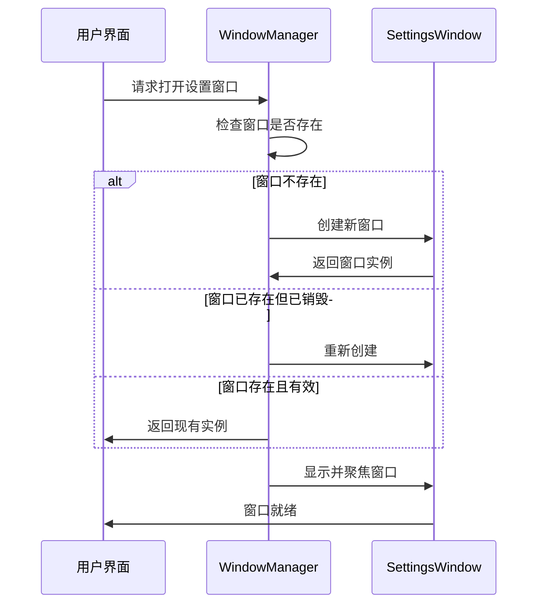
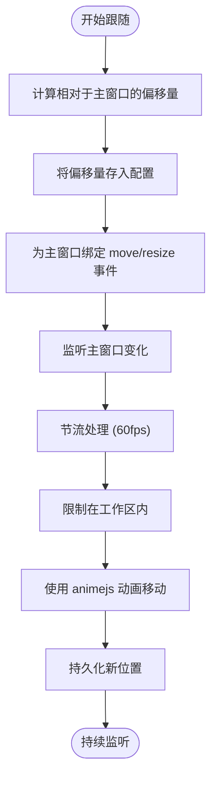
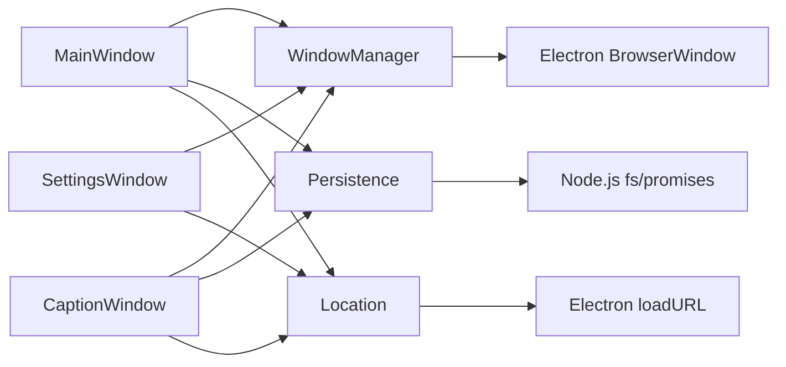

# 多窗口架构设计

<cite>
**本文档中引用的文件**  
- [main.ts](file://apps/stage-tamagotchi/src/main/windows/main/index.ts)
- [settings/index.ts](file://apps/stage-tamagotchi/src/main/windows/settings/index.ts)
- [caption/index.ts](file://apps/stage-tamagotchi/src/main/windows/caption/index.ts)
- [inlay/index.ts](file://apps/stage-tamagotchi/src/main/windows/inlay/index.ts)
- [shared/window.ts](file://apps/stage-tamagotchi/src/main/windows/shared/window.ts)
- [shared/persistence.ts](file://apps/stage-tamagotchi/src/main/windows/shared/persistence.ts)
- [window-manager/reusable.ts](file://apps/stage-tamagotchi/src/main/libs/electron/window-manager/reusable.ts)
- [location.ts](file://apps/stage-tamagotchi/src/main/libs/electron/location.ts)
</cite>

## 目录
1. [简介](#简介)
2. [项目结构](#项目结构)
3. [核心组件](#核心组件)
4. [架构概述](#架构概述)
5. [详细组件分析](#详细组件分析)
6. [依赖分析](#依赖分析)
7. [性能考虑](#性能考虑)
8. [故障排除指南](#故障排除指南)
9. [结论](#结论)

## 简介
本项目 `stage-tamagotchi` 实现了一个基于 Electron 的多窗口桌面应用架构，支持主窗口、设置窗口、字幕窗口和内嵌窗口等多种窗口类型。该架构设计旨在提供灵活的用户界面布局、持久化的窗口状态管理以及高效的跨窗口通信机制。通过模块化的窗口管理器和配置持久化系统，实现了窗口的可复用性与状态同步。

## 项目结构
`stage-tamagotchi` 应用的主窗口逻辑位于 `src/main/windows` 目录下，该目录按功能划分了多个子模块：
- `main`：主窗口的创建与管理
- `settings`：设置窗口的可复用实例
- `caption`：字幕窗口，可跟随主窗口移动
- `inlay`：内嵌信息窗口，通常用于显示辅助内容
- `shared`：共享的工具函数、配置持久化和窗口配置模板

每个窗口模块都封装了其自身的创建逻辑和生命周期管理，通过统一的 `createReusableWindow` 工具函数实现窗口实例的懒加载与复用。

**Diagram sources**
- [index.ts](file://apps/stage-tamagotchi/src/main/windows/main/index.ts#L1-L154)
- [index.ts](file://apps/stage-tamagotchi/src/main/windows/settings/index.ts#L1-L36)

**Section sources**
- [index.ts](file://apps/stage-tamagotchi/src/main/windows/main/index.ts#L1-L154)
- [index.ts](file://apps/stage-tamagotchi/src/main/windows/settings/index.ts#L1-L36)
- [index.ts](file://apps/stage-tamagotchi/src/main/windows/caption/index.ts#L1-L384)
- [index.ts](file://apps/stage-tamagotchi/src/main/windows/inlay/index.ts#L1-L66)

## 核心组件

### 窗口类型与设计目的
- **主窗口 (Main Window)**：应用的核心界面，承载主要交互功能，始终置顶且无边框透明。
- **设置窗口 (Settings Window)**：用于配置应用参数，采用可复用模式，避免重复创建。
- **字幕窗口 (Caption Window)**：浮动字幕显示，支持跟随主窗口移动或独立定位，具备动画过渡效果。
- **内嵌窗口 (Inlay Window)**：半透明模糊背景窗口，用于显示提示或状态信息，位置根据屏幕分辨率自适应。

### 窗口配置模板
在 `shared/window.ts` 中定义了多种窗口样式模板：
- `transparentWindowConfig`：透明无边框窗口
- `blurryWindowConfig`：模糊背景窗口（适用于 Windows 和 macOS）
- `spotlightLikeWindowConfig`：聚光灯式模糊窗口

这些模板通过扩展 Electron 的 `BrowserWindowConstructorOptions` 实现跨平台一致性。

**Section sources**
- [window.ts](file://apps/stage-tamagotchi/src/main/windows/shared/window.ts#L1-L43)

## 架构概述

```mermaid
graph TB
subgraph "主进程 (Main Process)"
A[MainWindow] --> |创建| B[SettingsWindow]
A --> |创建| C[CaptionWindow]
A --> |创建| D[InlayWindow]
E[WindowManager] --> A
E --> B
E --> C
E --> D
F[Persistence] --> A
F --> C
end
subgraph "渲染进程 (Renderer Process)"
G[Renderer] < --> |IPC| A
H[Settings UI] < --> |IPC| B
I[Caption UI] < --> |IPC| C
J[Inlay UI] < --> |IPC| D
end
A --> |状态同步| C
C --> |事件通知| G
```

**Diagram sources**
- [main/index.ts](file://apps/stage-tamagotchi/src/main/windows/main/index.ts#L1-L154)
- [caption/index.ts](file://apps/stage-tamagotchi/src/main/windows/caption/index.ts#L1-L384)
- [shared/window.ts](file://apps/stage-tamagotchi/src/main/windows/shared/window.ts#L1-L43)

## 详细组件分析

### 主窗口分析
主窗口是应用的入口，负责加载渲染器、初始化配置并管理其他窗口的引用。它通过 `setupMainWindow` 函数创建，支持开发模式下的 DevTools 自动开启，并通过 `transparentWindowConfig` 实现无边框透明效果。

窗口位置和大小在用户调整后会通过 `handleNewBounds` 回调持久化到配置文件中。

**Section sources**
- [main/index.ts](file://apps/stage-tamagotchi/src/main/windows/main/index.ts#L1-L154)

### 设置窗口分析
设置窗口通过 `createReusableWindow` 包装为可复用实例，确保全局唯一。每次调用 `getWindow` 时，若窗口未创建则初始化，若已关闭则重新创建，避免内存泄漏。



**Diagram sources**
- [reusable.ts](file://apps/stage-tamagotchi/src/main/libs/electron/window-manager/reusable.ts#L2-L19)
- [settings/index.ts](file://apps/stage-tamagotchi/src/main/windows/settings/index.ts#L1-L36)

### 字幕窗口分析
字幕窗口支持两种模式：**跟随模式** 和 **独立模式**。在跟随模式下，窗口会根据主窗口的位置动态调整自身位置，并通过 `animejs` 实现平滑动画过渡。

窗口的相对偏移量和绝对位置均通过 `persistenceMap` 持久化，确保多显示器环境下配置正确恢复。

#### 跟随逻辑流程图


**Diagram sources**
- [caption/index.ts](file://apps/stage-tamagotchi/src/main/windows/caption/index.ts#L1-L384)
- [persistence.ts](file://apps/stage-tamagotchi/src/main/windows/shared/persistence.ts#L1-L52)

## 依赖分析



**Diagram sources**
- [window-manager/reusable.ts](file://apps/stage-tamagotchi/src/main/libs/electron/window-manager/reusable.ts#L2-L19)
- [persistence.ts](file://apps/stage-tamagotchi/src/main/windows/shared/persistence.ts#L1-L52)
- [location.ts](file://apps/stage-tamagotchi/src/main/libs/electron/location.ts#L1-L47)

**Section sources**
- [reusable.ts](file://apps/stage-tamagotchi/src/main/libs/electron/window-manager/reusable.ts#L2-L19)
- [persistence.ts](file://apps/stage-tamagotchi/src/main/windows/shared/persistence.ts#L1-L52)
- [location.ts](file://apps/stage-tamagotchi/src/main/libs/electron/location.ts#L1-L47)

## 性能考虑
- **窗口复用**：通过 `createReusableWindow` 避免重复创建和销毁窗口，减少资源开销。
- **事件节流**：对窗口移动和调整大小事件进行节流处理（60fps），防止频繁触发重绘。
- **异步持久化**：配置保存使用 `throttle` 批量写入，避免频繁 I/O 操作。
- **动画优化**：使用 `animejs` 进行动画控制，确保流畅性同时不影响主线程。

## 故障排除指南
- **窗口无法显示**：检查 `show: false` 是否被正确设置，并确认 `ready-to-show` 事件是否触发。
- **配置未保存**：确认 `userData` 目录可写，检查 `throttle` 是否正常工作。
- **跨显示器定位错误**：确保 `screen.getDisplayMatching` 正确识别当前显示器的工作区。
- **IPC 通信失败**：验证 `context` 是否正确绑定，避免上下文丢失。

**Section sources**
- [main/index.ts](file://apps/stage-tamagotchi/src/main/windows/main/index.ts#L1-L154)
- [persistence.ts](file://apps/stage-tamagotchi/src/main/windows/shared/persistence.ts#L1-L52)

## 结论
`stage-tamagotchi` 的多窗口架构通过模块化设计、配置持久化和可复用窗口管理，实现了高度灵活和可维护的桌面应用界面系统。各窗口职责清晰，通信机制可靠，具备良好的扩展性和用户体验。未来可进一步优化动画性能和跨平台一致性。