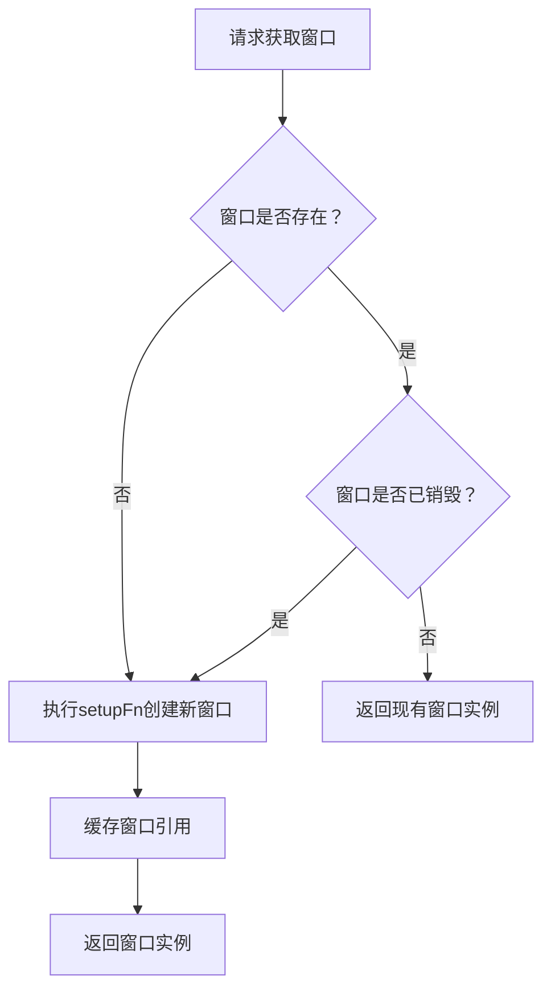
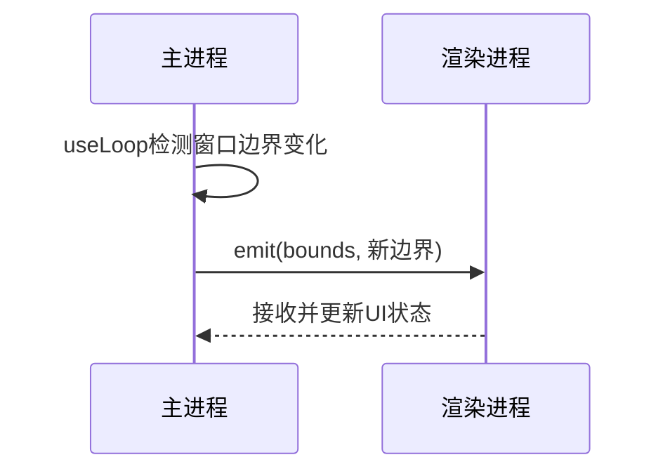
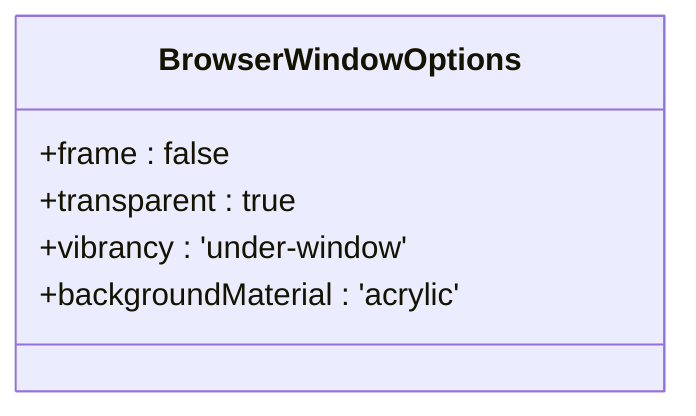
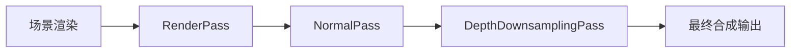
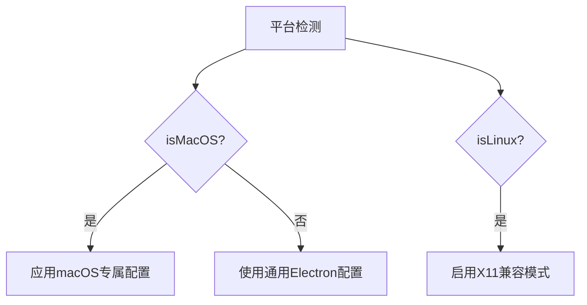
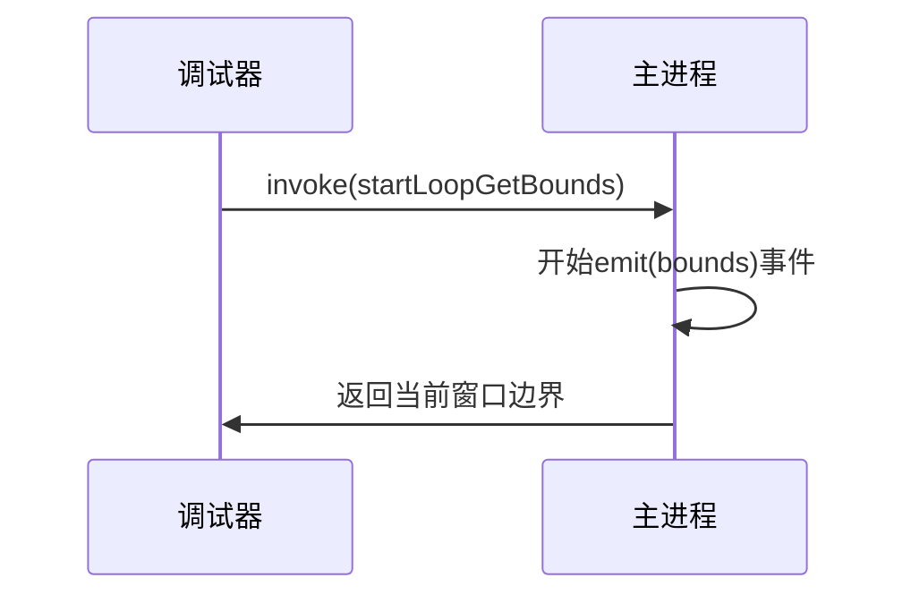

# 性能优化与最佳实践

<cite>
**本文档引用的文件**  
- [window.ts](file://apps/stage-tamagotchi/src/main/services/electron/window.ts)
- [reusable.ts](file://apps/stage-tamagotchi/src/main/libs/electron/window-manager/reusable.ts)
- [caption/index.ts](file://apps/stage-tamagotchi/src/main/windows/caption/index.ts)
- [shared/window.ts](file://apps/stage-tamagotchi/src/main/windows/shared/window.ts)
- [EffectComposerPmndrs.vue](file://packages/tresjs/src/post-processing/components/EffectComposerPmndrs.vue)
- [window.rs](file://crates/tauri-plugin-window-pass-through-on-hover/src/lib.rs)
- [types.rs](file://crates/tauri-plugin-window-pass-through-on-hover/src/types.rs)
</cite>

## 目录
1. [引言](#引言)
2. [窗口资源管理策略](#窗口资源管理策略)
3. [IPC通信开销优化](#ipc通信开销优化)
4. [多窗口环境下的渲染性能优化](#多窗口环境下的渲染性能优化)
5. [跨平台兼容性适配方案](#跨平台兼容性适配方案)
6. [调试工具与性能监控方法](#调试工具与性能监控方法)
7. [结论](#结论)

## 引言
本文档旨在为窗口管理系统提供全面的性能优化指南，涵盖从窗口实例管理、IPC通信效率到渲染性能和跨平台行为适配等多个维度。通过分析现有代码结构与实现机制，提出可落地的最佳实践建议，帮助开发者构建高效、稳定且用户体验优良的多窗口应用。

## 窗口资源管理策略

### 延迟加载与按需创建
系统采用`createReusableWindow`模式实现窗口的延迟加载与按需创建。该机制确保窗口仅在首次请求时初始化，并在后续调用中复用已创建实例，避免重复开销。



**图示来源**  
- [reusable.ts](file://apps/stage-tamagotchi/src/main/libs/electron/window-manager/reusable.ts#L0-L20)

### 及时销毁与内存泄漏防护
窗口生命周期由Electron事件驱动管理。通过监听`closed`事件及时清理资源引用，结合`isDestroyed()`检查防止对已销毁对象的操作，有效避免内存泄漏。

此外，配置持久化逻辑（如`persistBounds`）在窗口关闭时自动解绑事件监听器并释放上下文，确保无残留引用。

**本节来源**  
- [caption/index.ts](file://apps/stage-tamagotchi/src/main/windows/caption/index.ts#L270-L273)
- [reusable.ts](file://apps/stage-tamagotchi/src/main/libs/electron/window-manager/reusable.ts#L10-L12)

## IPC通信开销优化

### 批量消息发送机制
系统通过Eventa事件系统实现结构化IPC通信。关键数据变更（如窗口边界变化）通过`context.emit(bounds, ...)`主动推送，减少频繁轮询带来的通信压力。



**图示来源**  
- [window.ts](file://apps/stage-tamagotchi/src/main/services/electron/window.ts#L10-L20)

### 状态合并更新
窗口状态更新（如位置、大小）通过节流（throttle）与防抖（debounce）组合策略进行合并处理。例如，在主窗口移动或缩放时，仅以60FPS频率触发位置同步，避免高频事件风暴。

```typescript
const moveThrottled = throttle(() => { /* 同步逻辑 */ }, 1000 / 60)
const settleDebounced = debounce(() => { /* 最终定位 */ }, 200)
```

**本节来源**  
- [caption/index.ts](file://apps/stage-tamagotchi/src/main/windows/caption/index.ts#L196-L209)

## 多窗口环境下的渲染性能优化

### 硬件加速启用
所有子窗口均配置为透明无边框模式（`frame: false, transparent: true`），并启用`vibrancy`（毛玻璃效果）和`backgroundMaterial`（亚克力材质），充分利用操作系统级图形合成能力。



**图示来源**  
- [shared/window.ts](file://apps/stage-tamagotchi/src/main/windows/shared/window.ts#L25-L41)

### 透明度渲染优化
通过`setIgnoreMouseEvents`控制点击穿透行为，结合`setVisibleOnAllWorkspaces(true)`实现全局可见性，减少不必要的重绘区域。动画使用anime.js进行插值计算，避免直接操作DOM造成卡顿。

### 图层复合策略
使用EffectComposer进行后处理渲染，将多个视觉效果（如深度下采样、法线贴图）整合为单一渲染通道，显著降低GPU绘制调用次数。



**图示来源**  
- [EffectComposerPmndrs.vue](file://packages/tresjs/src/post-processing/components/EffectComposerPmndrs.vue#L1-L163)

## 跨平台兼容性适配方案

### Windows平台
- 使用`win.setAlwaysOnTop(true, 'screen-saver', 2)`确保窗口始终置顶
- 启用`acrylic`材质实现亚克力模糊效果

### macOS平台
- 设置`titleBarStyle: 'hidden'`隐藏标题栏
- 调用`setWindowButtonVisibility(false)`隐藏窗口按钮
- 利用`vibrancy: 'under-window'`实现原生毛玻璃效果

### Linux平台
- 依赖X11/Wayland原生合成器处理透明与置顶
- 通过`xkbcommon`库支持高级键盘事件处理



**本节来源**  
- [shared/window.ts](file://apps/stage-tamagotchi/src/main/windows/shared/window.ts#L25-L41)
- [types.rs](file://crates/tauri-plugin-window-pass-through-on-hover/src/types.rs#L0-L18)

## 调试工具与性能监控方法

### 内置调试服务
通过`createWindowService`注入事件循环监控，可动态启动/停止边界监听，便于性能分析。



**本节来源**  
- [window.ts](file://apps/stage-tamagotchi/src/main/services/electron/window.ts#L10-L43)

### 性能监控建议
1. 使用Chrome DevTools监控主线程阻塞情况
2. 通过`performance.mark()`标记关键路径耗时
3. 启用Electron的`--enable-logging`参数追踪原生层性能瓶颈
4. 利用`renderer.replaceRenderFunction`拦截渲染流程进行帧率统计

## 结论
本文档系统梳理了窗口管理系统的性能优化路径，从资源管理、通信效率、渲染策略到跨平台适配均提供了具体实施方案。建议开发者结合实际场景选择合适的技术组合，持续关注Electron与Tauri生态更新，以实现最佳用户体验。